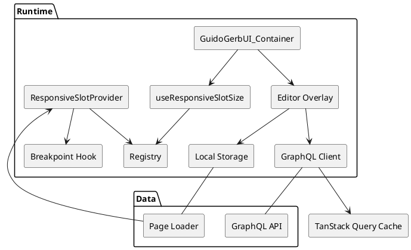
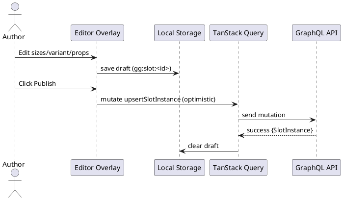

# SPEC-001-GuidoGerbUI_Container

## Background

Modern React apps frequently suffer from layout instability when UI regions (cards, panels, media modules, widgets) fetch data asynchronously, render suspense fallbacks, or switch between dense and sparse states. This causes CLS (Cumulative Layout Shift), disrupts user focus, and complicates collaborative editing in layout builders. The **GuidoGerbUI_Container** introduces a deterministic, breakpoint‑aware size contract for each functional component that’s wrapped by a lightweight shell. The shell reserves space using logical sizing (`inline-size`/`block-size`) and CSS containment, so children can suspend, stream, or animate without shifting surrounding content.

In addition, the slot wrapper becomes the integration point for **runtime editing**: a page designer can toggle an edit layer to adjust per‑instance slot sizes, content bindings, and selected component variants. Those edits are saved to **Local Storage** for rapid iteration and optimistic UI, and synced to a backend via **GraphQL** for persistence and collaboration. The same mechanism can update design tokens in `@guidogerb/css`, enabling live theme changes across the page.

This spec defines the API surface, sizing registry, SSR/SSG behavior, runtime editing model, storage/GraphQL synchronization, accessibility, and performance considerations, along with a deliverable work plan.

## Requirements (MoSCoW)

### Must Have

- Deterministic footprint per breakpoint for any wrapped child; no layout “bouncing” during loading/loaded/empty states.
- Public exports (from `@guidogerb/components/ui`): `ResponsiveSlotProvider`, `GuidoGerbUI_Container`, `useResponsiveSlotSize`.
- Shared breakpoint model (`xs`, `sm`, `md`, `lg`, `xl`) with provider‑exposed descriptors and SSR fallback to a default breakpoint.
- Tokenized size registry with base presets (e.g., `catalog.card`, `dashboard.panel`, `hero.banner`, `list.row`) and per‑instance override capability.
- Hook + CSS utilities to emit CSS custom properties for `inline-size`, `block-size`, `max-inline-size`, `max-block-size` based on the active breakpoint.
- Server‑safe rendering: provider resolves a deterministic size on the server; hydration aligns without visible jump (double‑buffered sizing variables).
- Runtime editing mode (opt‑in): edit per‑instance sizes, content bindings (props payload), and component variant selection.
- Persistence: Draft edits cached in Local Storage; explicit save pushes GraphQL mutations. On load, server state hydrates; local unsynced edits are reconciled.
- Accessibility by default: wrapper is `role="presentation"` unless overridden; child preserves semantics and focus order.
- Performance: apply `contain`‑based isolation; avoid forcing synchronous layout; optional `ResizeObserver` dev helper to warn when children exceed budgets.
- TypeScript typings for registries, slots, and overrides; exhaustive intellisense for breakpoint keys and size maps.
- Documented overflow strategy with a safe default (`overflow: hidden auto`) and prop to relax (`overflow="visible"`).

### Should Have

- Inheritance mode (`inherit`) so nested slots can adopt parent sizing budgets.
- Adaptive minimums (`minInline`/`minBlock`) for skeletons and never‑collapse content.
- Theme live‑update bridge to `@guidogerb/css`: runtime token updates propagate into slot calculations.
- Developer tooling: storybook stories, visual regression and snapshot tests for SSR/hydration and breakpoint changes.
- GraphQL type‑safe operations via codegen; optimistic updates for edits; offline‑first behavior for Local Storage drafts.
- Diagnostics surface (dev only): counters for overflow events, hydration mismatches, and slot‑child budget deltas.

### Could Have

- Per‑tenant registry layering for multi‑tenant theming.
- Container‑query driven presets where supported, falling back to breakpoints.
- A codemod to wrap existing components incrementally.
- Figma token export/import helpers for translating auto‑layout frames into slot presets.

### Won’t Have (initial MVP)

- Complex layout managers (masonry/packing engines) beyond reserving inline/block sizes.
- Persisted _measurements_ of content (the registry is declarative, not telemetry‑driven).
- Cross‑document collaborative editing (simultaneous cursors) beyond last‑write‑wins with timestamps.

## Method

### 1) High-Level Architecture

- **Provider & Registry**: `ResponsiveSlotProvider` merges a default slot registry with any consumer-provided registry and exposes:
  - Breakpoint descriptors: `{ key, minWidth, mediaQuery }[]` for `xs | sm | md | lg | xl`.
  - Default SSR/SSG breakpoint: `defaultBreakpoint` (default `md`).
  - Base slot presets: `catalog.card`, `dashboard.panel`, `hero.banner`, `list.row`.

- **Breakpoint Detection**: `useBreakpointKey()` reads `matchMedia` for descriptors and returns the active key. On the server/build (SSG) it returns `defaultBreakpoint`.
- **Size Resolution**: `useResponsiveSlotSize(slotKey, overrides?)` resolves `SlotSizeMap` for the active breakpoint from: `instance.sizes` → `registry[slotKey]` → fallbacks. Produces logical sizes and optional min/max tokens.
- **Wrapper**: `GuidoGerbUI_Container` renders an element (default `div`) with CSS custom properties for logical sizes and containment. Provides `overflow`, `inherit`, `minInline`, `minBlock` props.
- **Runtime Editing (MVP)**: An overlay lets authors tweak per‑instance sizes (by breakpoint), pick a component **variant**, and edit a JSON **props payload**. Drafts save to Local Storage immediately; **Publish** persists via GraphQL.
- **Persistence**: Local Storage is the write‑through cache for drafts; a TanStack Query mutation sends GraphQL `upsertSlotInstance` on Publish. On load, the page query hydrates server state; unsynced drafts are reconciled (drafts win by default, with UI affordance to discard).
- **Theming Bridge**: Updates to `@guidogerb/css` tokens (e.g., spacing scales) can reflow into slot sizing via provider’s token resolver. A change event recomputes sizes and updates CSS variables without re-mounts.

### 2) Key TypeScript Types & Public API

```ts
export type BreakpointKey = 'xs' | 'sm' | 'md' | 'lg' | 'xl'

export interface SlotSizeMap {
  inline: number | string
  block: number | string
  maxInline?: string
  maxBlock?: string
  minInline?: string
  minBlock?: string
}

export type Registry = Record<string, Partial<Record<BreakpointKey, SlotSizeMap>>>

export interface ResponsiveSlotProviderProps {
  registry?: Registry
  defaultBreakpoint?: BreakpointKey // SSR/SSG fallback, default 'md'
  breakpoints?: { key: BreakpointKey; minWidth: number; media: string }[]
  children: React.ReactNode
}

export interface GuidoGerbUI_ContainerProps
  extends Omit<React.HTMLAttributes<HTMLElement>, 'children'> {
  as?: keyof JSX.IntrinsicElements // default 'div'
  slot: string // registry key, e.g. 'catalog.card'
  sizes?: Partial<Record<BreakpointKey, SlotSizeMap>> // per-instance override
  inherit?: boolean // inherit parent slot sizing
  overflow?: CSSProperties['overflow'] // default 'hidden auto'
  editableId?: string // stable ID to bind editing state & persistence
  variant?: string // consumer-defined variant id
  propsJSON?: Record<string, unknown> // consumer-provided props payload (runtime editable)
  children: React.ReactNode
}

export function ResponsiveSlotProvider(props: ResponsiveSlotProviderProps): JSX.Element
export function GuidoGerbUI_Container(props: GuidoGerbUI_ContainerProps): JSX.Element
export function useResponsiveSlotSize(
  slot: string,
  overrides?: Partial<Record<BreakpointKey, SlotSizeMap>>,
): Required<SlotSizeMap> & { breakpoint: BreakpointKey }
```

### 3) Breakpoint Detection & SSG Hydration

**Algorithm (double‑buffered variables):**

1. **Build/Server render (SSG)**: compute sizes for `defaultBreakpoint` → emit CSS vars `--slot-inline-A`, `--slot-block-A` and map them to used vars (`--slot-inline`, `--slot-block`).
2. **Client hydrate**: `useBreakpointKey()` computes real breakpoint. If it differs, compute sizes into **B** variables (`--slot-inline-B`, …). Flip an atomic CSS class (`.slot-ready`) to switch `--slot-inline`/`--slot-block` from **A** to **B** in a single style recalculation.
3. **Subsequent changes**: update **B** in place; mapping keeps pointing at **B**.

**Pseudocode:**

```ts
const [phase, setPhase] = useState<'A' | 'B'>('A')
const key = useBreakpointKey() // build returns default
const sizes = resolveSizes(slotKey, key, overrides)
useLayoutEffect(() => {
  writeVars(ref, sizes, 'B')
  setPhase('B')
}, [key, slotKey, overrides])
```

### 4) CSS Variables Emitted

(Defaults for these variables are defined in `@guidogerb/css`.)

```css
--slot-inline: var(--slot-inline-<phase>);
--slot-block: var(--slot-block-<phase>);
--slot-max-inline: var(--slot-max-inline-<phase>, unset);
--slot-max-block: var(--slot-max-block-<phase>, unset);
--slot-min-inline: var(--slot-min-inline-<phase>, unset);
--slot-min-block: var(--slot-min-block-<phase>, unset);
```

Applied styles (default):

```css
inline-size: var(--slot-inline);
block-size: var(--slot-block);
max-inline-size: var(--slot-max-inline);
max-block-size: var(--slot-max-block);
min-inline-size: var(--slot-min-inline);
min-block-size: var(--slot-min-block);
contain: layout paint style;
display: grid;
place-items: stretch;
overflow: var(--slot-overflow, hidden auto);
```

### 5) Inheritance & Overrides

- If `inherit` is true, a child `GuidoGerbUI_Container` reads parent’s resolved sizes from context and applies them unless a breakpoint override is provided.
- Per‑instance `sizes` merge strategy: `deepMerge(instance.sizes[bp], registry[slot][bp])`, with `max*`/`min*` tokens falling back to `unset`.

### 6) Runtime Editing Model (MVP)

- **Edit toggle**: Global `EditModeContext` toggles overlays for any slot with `editableId`.
- **Overlay affordances**:
  - Breakpoint picker (simulate `xs…xl`).
  - Numeric/string inputs for `inline`, `block`, optional `min*`/`max*`.
  - **Variant** dropdown (values provided by consumer via props or registry metadata).
  - **Props JSON** editor with validation; passes parsed object to the child via render prop or context bridge.

- **Draft persistence**: immediately `localStorage.setItem(gg:slot:<editableId>, JSON.stringify({...}))`.
- **Publish**: call GraphQL mutation with the normalized payload; invalidate TanStack Query cache for the current page; clear local draft.
- **Reconciliation on load**: if `localStorage` has a newer `updatedAt` than server state, show a non‑blocking “Unsynced edits” banner with actions: **Publish**, **Discard**, **Diff**.

### 7) Data Shapes & Persistence

**Local Storage Keying**

- Page-scope: `gg:page:<pageId>:v1`
- Slot draft: `gg:slot:<editableId>:v1`

**Local Draft Schema (JSON)**

```ts
interface SlotDraftV1 {
  version: 1
  editableId: string
  slotKey: string
  sizes?: Partial<Record<BreakpointKey, SlotSizeMap>>
  variant?: string
  propsJSON?: Record<string, unknown>
  updatedAt: string // ISO 8601
}
```

**GraphQL Schema (ownership & placement)**

- **Canonical SDL & resolvers** live in `@guidogerb/components-api` (source of truth).
- The **UI package** maintains **GraphQL operation documents** (`.graphql` queries/mutations/fragments) and runs Codegen against the API schema artifact (pulled from the API package or endpoint) to generate typed hooks.

**SDL excerpt (lives in @guidogerb/components-api)**

```graphql
scalar JSON
scalar DateTime

type SlotInstance {
  id: ID!
  pageId: ID!
  editableId: String!
  slotKey: String!
  sizes: JSON # per-breakpoint map
  variant: String
  propsJSON: JSON
  updatedAt: DateTime!
}

type Page {
  id: ID!
  path: String!
  title: String
  slots: [SlotInstance!]!
  themeConfig: JSON
  updatedAt: DateTime!
}

type Query {
  pageByPath(path: String!): Page
}

type Mutation {
  upsertSlotInstance(input: UpsertSlotInstanceInput!): SlotInstance!
  publishPage(input: PublishPageInput!): Page!
}

input UpsertSlotInstanceInput {
  pageId: ID!
  editableId: String!
  slotKey: String!
  sizes: JSON
  variant: String
  propsJSON: JSON
}

input PublishPageInput {
  pageId: ID!
  message: String
}
```

**Suggested DB Schema (reference implementation for @guidogerb/components-api)**

```sql
CREATE TABLE pages (
  id UUID PRIMARY KEY,
  path TEXT UNIQUE NOT NULL,
  title TEXT,
  theme_config JSONB,
  updated_at TIMESTAMPTZ NOT NULL DEFAULT now()
);

CREATE TABLE slot_instances (
  id UUID PRIMARY KEY,
  page_id UUID NOT NULL REFERENCES pages(id) ON DELETE CASCADE,
  editable_id TEXT NOT NULL,
  slot_key TEXT NOT NULL,
  sizes JSONB,
  variant TEXT,
  props_json JSONB,
  updated_at TIMESTAMPTZ NOT NULL DEFAULT now(),
  UNIQUE (page_id, editable_id)
);
```

### 8) Client Data Layer (TanStack Query + graphql-request + Codegen)

- **Fetching**: `graphql-request` `GraphQLClient` with auth headers. Export a small `fetcher` used by generated hooks.
- **Codegen**: generate types and **React Query hooks** using Code Generator’s React Query plugin. Schema source is either:
  1. a local artifact from `@guidogerb/components-api` (e.g., `node_modules/@guidogerb/components-api/schema.graphql` or `schema.json`), or
  2. the deployed API endpoint for CI/preview builds.

- **Cache keys**: `['page', path]`, `['slot', editableId]`. Mutations invalidate `['page', pageId]`.
- **Optimistic UI**: on `upsertSlotInstance`, write through to cache and mark `updatedAt` now; roll back on error.

**Codegen config (UI package, excerpt)**

```yaml
schema: ../components-api/schema.graphql # or remote endpoint
documents: src/**/*.graphql
generates:
  src/gql/:
    preset: client
    plugins: []
  src/gql/react-query.ts:
    plugins:
      - typescript
      - typescript-operations
      - typescript-react-query
    config:
      fetcher: 'graphql-request'
      exposeDocument: true
      exposeQueryKeys: true
      addInfiniteQuery: false
      scalars:
        JSON: 'Record<string, unknown>'
        DateTime: 'string'
```

**Fetcher**

```ts
import { GraphQLClient } from 'graphql-request'
export const client = new GraphQLClient(process.env.NEXT_PUBLIC_GRAPHQL_ENDPOINT!, {
  headers: () => ({ Authorization: `Bearer ${getToken()}` }),
})
```

### 9) SSG Integration

- For static builds, each page renders with `defaultBreakpoint` sizes inlined as CSS vars. On hydrate, the client switches to the actual breakpoint via the double‑buffer algorithm without visible jump.
- The page payload is queried at runtime (on client) through TanStack Query, so **published edits** appear without requiring a rebuild.
- Optional revalidation: If using a framework with ISR, you can trigger background revalidation after `publishPage`, but the runtime still shows latest via client fetch.

### 10) Dev Diagnostics (opt‑in)

- Shared `ResizeObserver` measures child overflow. In dev, logs a warning when content exceeds `max*` or when scrollbars appear unexpectedly.
- Hydration guard: if build `defaultBreakpoint` differs from client active key, log a single info with both values for tuning.

### 11) PlantUML — Components



### 12) PlantUML — Publish Flow



````

### 12) PlantUML — Publish Flow


src/
  responsive-slot/
    ResponsiveSlotProvider.tsx
    GuidoGerbUI_Container.tsx
    useBreakpointKey.ts
    useResponsiveSlotSize.ts
    slot-presets.ts
    edit/
      EditModeProvider.tsx
      SlotOverlay.tsx
      JsonEditor.tsx
    dev/
      useResizeWarnings.ts
  graphql/
    PageByPath.graphql
    UpsertSlotInstance.graphql
  gql/
    (generated by codegen)
  index.ts
```

### C) Example Usage

```tsx
<ResponsiveSlotProvider registry={baseSlots} defaultBreakpoint="md">
  <GuidoGerbUI_Container slot="catalog.card" editableId="p1-card-01" variant="compact">
    <ProductCard />
  </GuidoGerbUI_Container>
</ResponsiveSlotProvider>
```

### D) Comprehensive Task List

#### 1) Foundations

- [x] Create `responsive-slot` module and exports from `@guidogerb/components/ui`.
- [x] Implement `SlotSizeMap`, `BreakpointKey`, `Registry` types with strict TS.
- [ ] Implement base presets (`catalog.card`, `dashboard.panel`, `hero.banner`, `list.row`).

#### 2) Breakpoints & Sizing

- [ ] Build `useBreakpointKey()` with `matchMedia` subscriptions and cleanup.
- [ ] Add SSR/SSG default fallback support via provider prop.
- [ ] Build `resolveSizes(slotKey, bp, overrides)` with deep merge + fallbacks.
- [ ] Implement double‑buffered CSS variable algorithm and atomic flip.
- [ ] Expose `useResponsiveSlotSize()` hook returning resolved sizes + active breakpoint.

#### 3) Wrapper Component

- [ ] Implement `GuidoGerbUI_Container` with `as`, `inherit`, `overflow`, `min*`/`max*` handling.
- [ ] Apply logical sizing (`inline-size`, `block-size`, etc.) and `contain: layout paint style`.
- [ ] Accessibility: default `role="presentation"`, passthrough ARIA props.
- [ ] Dev only: warn on unknown `slot` keys or invalid size tokens.

#### 4) Runtime Editor (MVP)

- [ ] `EditModeProvider` with global edit toggle (keyboard shortcut + toolbar button).
- [ ] `SlotOverlay` with breakpoint picker, inputs for size tokens, variant dropdown.
- [ ] `JsonEditor` for `propsJSON` (basic textarea + validation + error surface).
- [ ] Wire overlay to selected `GuidoGerbUI_Container` via `editableId`.
- [ ] Visual focus ring + drag affordances (optional) for slot bounds.

#### 5) Persistence Layer (Local Storage + GraphQL)

- [ ] Implement `storage.ts` utilities (`getDraft`, `setDraft`, `clearDraft`).
- [ ] Define `.graphql` documents: `PageByPath`, `UpsertSlotInstance`, optional `PublishPage`.
- [ ] Configure GraphQL Code Generator in UI to target React Query, using schema artifact from API package.
- [ ] Create `graphql-client.ts` using `graphql-request` and inject auth headers.
- [ ] Integrate TanStack Query provider in app shell; define cache keys.
- [ ] Implement optimistic mutation for `upsertSlotInstance` + rollback.
- [ ] Reconciliation banner for newer local drafts vs server.

#### 6) SSG Integration

- [ ] Ensure static builds inline `defaultBreakpoint` variables.
- [ ] On hydrate, verify no visual jump (write B vars then flip). Add tests.
- [ ] Client fetch of page payload (TanStack Query) after hydrate to reflect latest edits.
- [ ] Optional ISR hook on `publishPage` (framework dependent).

#### 7) Theming & Tokens

- **Ownership:** All CSS is maintained in `@guidogerb/css` (UI ships no compiled CSS). This includes global tokens and slot defaults (e.g., `--gg-slot-inline`, `--gg-slot-block`, min/max variants), and utility classes used by **GuidoGerbUI_Container**.
- **Runtime updates:** `@guidogerb/css` exposes `theme.update(tokens)` and/or emits a `theme:change` `CustomEvent`. The UI provider subscribes and recomputes/rewrites CSS variables on mounted containers; children are not remounted.
- **Token references:** Presets can use `var(--token)`; optional `resolveToken(name)` helps map semantic tokens to CSS variables when needed.
- **Versioning:** Changes to tokens should bump `@guidogerb/css` semver and (optionally) publish a token JSON artifact for static analysis.

### 8) Diagnostics & Perf

- [ ] Implement shared `ResizeObserver` hook; log overflows (dev only).
- [ ] Add perf marks around hydrate flip; expose counters in `window.__GG__` (dev only).

#### 9) Testing

- [ ] **Unit**: size resolution, breakpoint hook, inheritance and overrides.
- [ ] **SSR/SSG snapshot**: verify deterministic server markup and variable flip.
- [ ] **Integration**: runtime editor flows, Local Storage drafts, optimistic publish.
- [ ] **Visual regression**: Storybook/Chromatic for key slots at `xs…xl`.
- [ ] **E2E**: Playwright—edit slot, refresh, confirm persistence from server.

#### 10) Documentation & Examples

- [ ] Add Storybook stories (read-only and edit modes).
- [ ] Author README with recipes: grid layouts, nested slots, overflow strategies.
- [ ] Migration guide to wrap existing components incrementally.

#### 11) Release & Rollout

- [ ] Versioned release of `@guidogerb/components/ui`.
- [ ] API package publishes `schema.graphql` artifact and semver tag.
- [ ] Set up CI to fail on codegen drift.

### E) Acceptance Criteria (MVP)

- No measurable layout shift (CLS ≈ 0) when a wrapped component suspends or loads at any breakpoint on modern browsers.
- On a static page build, initial paint shows `defaultBreakpoint` sizing; post-hydration switch occurs without visible jump.
- Author can edit per-instance sizes, select a variant, and update JSON props; draft persists locally; Publish updates server; reload reflects published state.
- Overflow defaults to `hidden auto` and can be overridden per instance.
- Theming token changes propagate without remounting children.

### F) Risks & Mitigations

- **Hydration mismatch**: use CSS-var double buffer and avoid reading layout in render.
- **Overly small budgets**: provide dev warnings and easy editor access.
- **Schema drift**: consume schema artifact from API package; CI check to prevent stale types.
- **Editor weight**: keep JSON editor lightweight (textarea + validation) for MVP; consider Monaco later if needed.

## Milestones

> Time estimates assume one engineer unless specified. Parallelize where possible.

### M1 — Foundations (Types, Presets, Breakpoints) — \~1 week

**Scope**

- Types (`BreakpointKey`, `SlotSizeMap`, `Registry`).
- Base presets and merge strategy.
- `useBreakpointKey()` with `matchMedia` and SSR/SSG fallback.
- Package wiring & exports.
  **Deliverables**
- Compiles, unit tests passing for size resolution & fallbacks.
- Storybook: presets preview at xs…xl.
  **Exit Criteria**
- Deterministic sizes resolved for `defaultBreakpoint` server-side.

### M2 — GuidoGerbUI_Container & Hydration Algorithm — \~1 week

**Scope**

- `GuidoGerbUI_Container` wrapper with logical sizing, overflow default, containment, ARIA passthrough.
- Double‑buffered CSS variable flip (A→B) on client hydrate.
- Inheritance support and per-instance overrides.
  **Deliverables**
- Visual test confirming no perceptible jump on hydrate.
- E2E: load static page, hydrate, switch viewport.
  **Exit Criteria**
- CLS contribution from container interactions ≈ 0 in lab runs.

### M3 — Runtime Editor (MVP) & Local Drafts — \~1.5 weeks

**Scope**

- `EditModeProvider`, `SlotOverlay`, `JsonEditor`.
- Draft persistence (Local Storage), reconciliation banner.
- Variant selection and JSON props bridge to child.
  **Deliverables**
- Storybook: editable stories.
- E2E: edit → refresh → draft remains; discard/publish flows.
  **Exit Criteria**
- Edits survive reload locally; no runtime errors on invalid JSON (guarded).

### M4 — GraphQL Integration (TanStack Query + graphql-request + Codegen) — \~1 week

**Scope**

- Operation docs (`PageByPath`, `UpsertSlotInstance`, optional `PublishPage`).
- Codegen to typed React Query hooks (schema from `@guidogerb/components-api`).
- Optimistic `upsertSlotInstance`; invalidate & refetch page.
  **Deliverables**
- E2E: publish propagates to server; reload shows published state.
  **Exit Criteria**
- Cache keys stable; mutation rollback on error.

### M5 — @guidogerb/css Ownership & Runtime Theme Updates — \~0.5 week

**Scope**

- Move/author all CSS (tokens, defaults, utility classes) in `@guidogerb/css`.
- Subscribe to `theme.update()`/`theme:change` to rewrite vars at runtime.
  **Deliverables**
- Demo: live theme toggle updates active containers without remounts.
  **Exit Criteria**
- No CSS bundled in UI; token changes reflected immediately.

### M6 — Diagnostics, Testing, Docs, Release — \~1 week

**Scope**

- Dev `ResizeObserver` warnings; hydration guard logs.
- Unit, integration, visual, and E2E coverage; CI gate on codegen drift.
- README, migration guide, examples, versioned release.
  **Exit Criteria**
- Test suite green; packages published; example app upgraded.

## Gathering Results

### Functional Validation

- **Layout Stability**: Lighthouse CLS near 0 on pages using containers at xs…xl. Compare before/after.
- **Hydration Smoothness**: Screenshot diff across first paint vs post-hydrate < 1% pixel change for container areas.
- **Overflow Behavior**: No unexpected horizontal scroll; vertical scroll only when content intentionally exceeds budgets.

### Editing UX

- **Draft Persistence**: Local edits survive reload; timestamped reconciliation banner appears when server differs.
- **Publish Flow**: Optimistic update reflects immediately; actual server response reconciles cleanly; errors roll back with toast.
- **Variant/Props**: Variant switch and JSON props take effect immediately in child.

### Data Integrity

- **Schema Compatibility**: Generated types match API artifact; CI fails on drift.
- **Idempotency**: Repeated `upsertSlotInstance` with same payload is a no-op server-side; unique `(pageId, editableId)` respected.

### Performance

- **Hydration Cost**: A→B flip occurs in a single frame; no forced reflow loops. Dev counters expose timings for inspection.
- **Render Isolation**: `contain: layout paint style` prevents sibling reflow spikes when children suspend.

### Accessibility

- **Semantics**: Default `role="presentation"` unless overridden; focus order unaffected; overlay is keyboard accessible.
- **Contrast & Tokens**: Editor affordances meet WCAG AA using `@guidogerb/css` tokens.

### Telemetry & Diagnostics (dev)

- **Overflow Warnings**: Count and list slots exceeding budgets.
- **Hydration Mismatch**: Log default vs actual breakpoint on first paint.
- **Error Surface**: Collect publish failures and JSON parse errors.

### Rollout KPIs

- % of target components wrapped by **GuidoGerbUI_Container**.
- Reduction in user-visible layout shifts on key pages.
- Median time-to-publish for editors (draft → publish).
