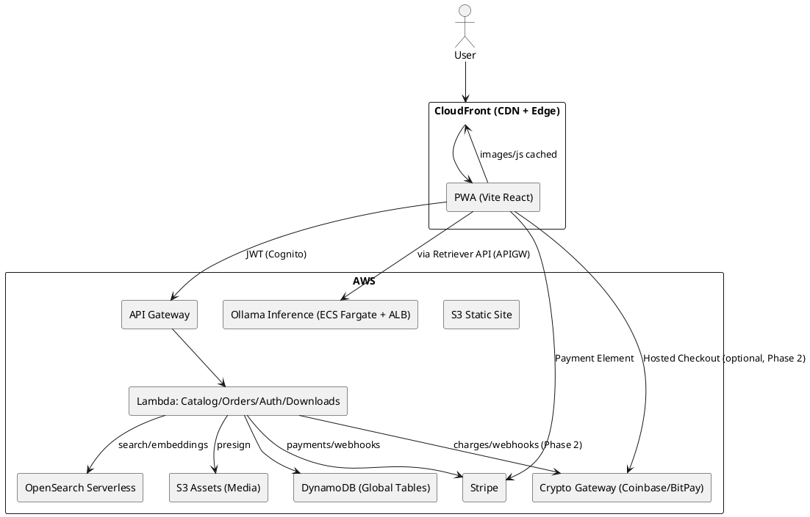
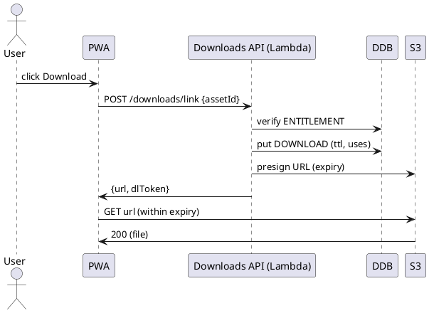
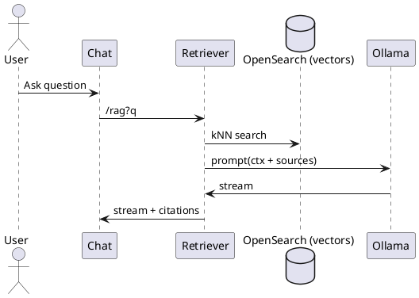

# SPEC-1-Creative Assets Marketplace (Vite React + AWS)

## Background

This project delivers a scalable, offline-capable web marketplace for creative digital and physical products (music, albums, books/e‑books, videos, podcasts, and subscription/tokens). The frontend is a Vite + React application deployed to AWS S3/CloudFront with a Service Worker providing asset caching and offline access for public routes.

Key drivers and context:

* **Reusable modular architecture**: Multiple UI/logic modules are developed locally in a monorepo and published as reusable packages to GitHub Packages for broader reuse across sites/apps.
* **Serverless, cost‑efficient backend**: Core APIs exposed via AWS API Gateway with Python AWS Lambda targets. Object storage and secure delivery via S3 + pre‑signed/permission‑hashed download links.
* **Authentication & Authorization**: Centralized user auth through Amazon Cognito (hosted UI + JWT for API), federated sign‑in (Google/Apple/Facebook/Microsoft), and fine‑grained authorization for downloadable assets and admin capabilities.
* **Catalog-first experience**: A comprehensive, searchable catalog of artists/authors, works, and products with dedicated profile pages and SEO‑friendly public routes that work offline (read‑only) when the network is unavailable.
* **Commerce for digital & physical fulfillment**: Shopping cart, checkout, invoicing/receipts, and post‑purchase access (My Products). Stripe (preferred) powers payments, subscriptions, and invoicing; alternative processors remain pluggable.
* **Creator economy features**: Users can create their own store, upload/manage products, define licensing (EULA), and sell assets or metered access (token packs) in addition to classic subscriptions with capacity.
* **Admin & business operations**: Admin console covers catalog curation, user/store management, pricing/inventory, financial reconciliation, reporting (annual/tax), infrastructure cost visibility, and historical auditability.
* **Data model preference**: DynamoDB as the primary datastore, leveraging streams for audit/history and event-driven workflows.

Confirmed scope updates from you:

* **Multi‑tenant + Custom Domains at launch**.
* **Global sales** with regional taxes, currency conversion tables, and region‑specific point‑of‑sale rules.

## Requirements

### MoSCoW Prioritization

#### Must Have

* **Multi‑tenant storefronts** under shared domain (e.g., `@handle.ggp-store.com`) **and** tenant BYO **custom domains** at launch; automated TLS issuance and renewals; per‑region price lists.
* **Global sales enablement**: multi‑currency pricing and display, FX conversion tables, region‑aware tax calculation (US sales tax, EU VAT, CA GST/HST, etc.), tax‑compliant invoices, and tax‑inclusive/exclusive price display per region.
* **Regional point‑of‑sale (POS) behavior**: local payment methods by region, address/phone/ID requirements by market, currency rounding rules, and regional checkout copy.
* **Frontend architecture**: Vite + React function components with Contexts; shared modules developed in a monorepo and published to GitHub Packages; local development consumes workspace modules; strict TypeScript; ESLint/Prettier.
* **Offline capability**: Service Worker that precaches the app shell and caches all images/JS; runtime caching of image/CDN assets; offline‑functional **public routes** with graceful fallbacks; cache versioning & invalidation strategy.
* **Hosting & delivery**: Static site on **S3** with **CloudFront** CDN; SPA routing support; security headers; gzip/brotli; image optimization pipeline; WAF.
* **AuthN/AuthZ**: Amazon Cognito (Hosted UI + JWT) with social sign‑in (Google, Apple, Facebook, Microsoft). JWT access to APIs (OAuth2/OIDC). Role/claim‑based authorization for content and admin actions.
* **APIs**: AWS API Gateway (HTTPS/REST) fronting Python **Lambda** micro‑functions; IAM‑scoped resources; request validation; throttling; structured error model.
* **Secure downloads**: Assets in S3; download links generated via API with permission hashes + expiry (pre‑signed URLs); device/IP rate limits; audit logging of access.
* **Catalog**: Full catalog of digital assets (artists, albums, books, videos, podcasts, subscriptions/tokens). Searchable with autocomplete; artist/author profile pages; SEO metadata and sitemaps.
* **Commerce**: Shopping cart for digital + physical products; discounts/coupons; tax/shipping estimates; checkout via **Stripe**; webhook processing for order lifecycle; refunds/partial refunds; disputes handling.
* **Post‑purchase**: **My Products** (entitlements/downloads), license (EULA) access/acceptance tracking, **Invoices** page with printable receipts.
* **Admin console**: Manage users, artist profiles, stores, catalogs, pricing/inventory, orders/refunds, payouts/royalties, financial reconciliation, annual reports, tax exports, infra cost visibility, and audit trails.
* **Creator stores**: Users can create a store, upload assets, configure pricing/licensing, publish/unpublish, and track sales.
* **Token & subscription model**: Token packs for metered services (e.g., API calls/podcasts) and subscriptions with capacity that can be topped up when consumed; usage metering and alerts.
* **Session management**: Secure persistence (localStorage/IndexedDB) for selected data; silent token refresh/rotation; device trust where possible; session revocation.
* **Data layer**: **DynamoDB** primary store with single‑table design per domain (or consolidated with GSIs); regional replication (Global Tables) for latency and DR; streams for change events and audit logs.
* **Observability**: Centralized logs/metrics/traces; structured logging; alerting and dashboards.
* **Security & compliance**: PCI DSS SAQ‑A boundary (Stripe‑hosted elements/links), GDPR/CCPA controls (consent, DSRs), encryption at rest/in transit, IAM least privilege, secrets in Secrets Manager/SSM.
* **Quality**: Accessibility **WCAG 2.1 AA**; i18n/l10n (locale, currency, date/number formats); performance budgets and Core Web Vitals.
* **Reliability**: SLOs for availability/latency; RPO/RTO targets; backup/restore and DR runbooks.
* **Abuse prevention**: API rate limiting, download link abuse detection, throttling, and captcha challenges where needed.

#### Should Have

* **PWA installability** (manifest, icons) and Background Sync; optional push notifications.
* **Edge logic** (CloudFront Functions/Lambda\@Edge) for geo‑based price lists, redirects, and A/B.
* **Search service**: Managed search (OpenSearch/Algolia) with synonyms and typo tolerance.
* **Import/export**: Bulk CSV/JSON importers; product and catalog APIs.
* **Physical fulfillment**: Pluggable 3PL integrations (e.g., Shippo/ShipStation) and real‑time shipping rates.
* **Analytics/BI**: Data lake (S3 + Glue + Athena) and dashboards (QuickSight); cost allocation reports by tenant.
* **Media processing**: Pipelines for image renditions, audio normalization, video transcode, captions/transcripts.
* **DRM/watermarking** for videos/e‑books (where licensing requires).
* **Marketplace payouts** using Stripe Connect (standard/express) for creators.
* **Custom domain automation** across Route 53 and external DNS providers; automated verification flows.
* **Webhooks** for tenant integrations; **feature flags** for safe rollout.
* **Crypto/DeFi payments (Phase 2)**: pluggable gateway (e.g., Coinbase Commerce/BitPay); hosted checkout, fiat price quote/lock at checkout, webhook confirmation → order finalization; per‑region enable/disable; accounting/tax mapping; volatility/refund policy.

#### Could Have

* Headless CMS for marketing (MDX/Contentful/Sanity).
* Community features (ratings/reviews, comments, follows).
* Gift cards and referrals/affiliates.
* Native wrappers (Capacitor) for app‑store presence.
* **WYSIWYG editor for artist/author profiles** (rich text + media embeds, controlled schema, server‑side sanitization).

#### Won’t Have (for MVP)

* On‑prem/self‑hosted deployment.
* Custom DRM beyond basic watermarking unless contractually required.

## Method

### Localhost Cognito setup (redirect_mismatch)
If you see a Cognito Hosted UI error like:

redirect_mismatch for client_id=...

it means the redirect_uri your app sends does not exactly match one of the Callback URLs configured for your Cognito App client.

To fix for localhost:
- Ensure your dev server runs on the port your env specifies (default 4173, strict port). Free the port or change it.
  - Change website/.env.development:
    - VITE_SITE_PORT=4173 (or your port)
    - VITE_LOGIN_CALLBACK_PATH=/auth/loginCallback
    - VITE_REDIRECT_URI=http://localhost:4173/auth/loginCallback (must include the exact port)
- In the Cognito console → User pools → App client → Hosted UI → Callback URLs, add the exact URL, e.g.:
  - http://localhost:4173/auth/loginCallback
- Also add a Sign out URL (for post logout redirect):
  - http://localhost:4173/auth/logout

Notes:
- The app will warn in console if redirect_uri doesn’t match the current origin. In development, if redirect_uri isn’t set, it will default to window.location.origin + VITE_LOGIN_CALLBACK_PATH.
- Any change to port or path must be reflected both in .env.development and in Cognito App client settings.

## Method

### 1) Monorepo & Package Architecture (Reusable Modules)

**Tooling**: pnpm workspaces, Changesets for versioning, TypeScript strict mode, tsup for library builds, Vitest + Testing Library.

**Repository layout**

```
root/
  website/                    # Vite + React app (S3/CloudFront)
  @guidogerb/
    ui/                       # Headless UI + design system components
    auth/                     # Cognito auth hooks (PKCE), token mgmt
    api-client/               # Typed SDK for API Gateway routes
    catalog/                  # Types, zod validators, search helpers, payments-crypto, coinbase-client (coinbase/BitPay client), checkout, flows
    storage/                  # S3 presign client, download guard
    analytics/                # Event schema + emitter (web + lambda)
    ai-support/               # RAG client (OpenSearch) + chat UI
    config/                   # ESLint/Prettier/TS config packages
  infra/
    cdk/                      # IaC for AWS resources
```

**Publishing**

* All packages are developed locally and versioned independently via Changesets.
* Public packages are published to GitHub Packages under an org scope (e.g., `@guidogerb/ui`), with the app consuming them via workspace references during development.

---

### 2) Frontend (Vite + React + PWA)

**Framework**: React function components with Contexts; React Router; Suspense + code-splitting.

**Key contexts**

* `AuthContext` (Cognito JWTs, silent refresh, device trust)
* `CartContext` (digital + physical items, quantities, token packs)
* `CatalogContext` (filters, search state, infinite scroll)
* `PricingContext` (currency, FX rates, tax-inclusive/exclusive display)
* `OfflineContext` (network state, offline fallbacks)

**Public routes (offline-first)**

* `/` home, `/catalog`, `/artists/:slug`, `/authors/:slug`, `/albums/:id`, `/books/:id`, `/videos/:id`, `/podcasts/:id`, `/eula/:id` — fully functional offline with cached data snapshots and graceful “data‑may‑be‑stale” banners.

**PWA & Service Worker**

* Use `vite-plugin-pwa` `injectManifest` mode to keep a hand-written Workbox service worker.
* Precache: app shell (index.html), route bundles, fonts, icons, and immutable JS/CSS assets (revisioned).
* Runtime caching strategies:

    * `CacheFirst` for images and font files from CloudFront.
    * `StaleWhileRevalidate` for JSON catalog snapshots and CDN JS chunks.
    * `NetworkOnly` with background sync queue for write ops (e.g., wishlist, feedback) when offline.
* `navigationFallback`: serve `/offline.html` with a cached minimal shell when a route is not in cache.
* Versioning & invalidation: cache bust via manifest revisions; SW `skipWaiting` + `clientsClaim` after user confirms.

**Installability & UX**

* Web manifest, iOS install banners, add-to-home-screen prompts, and basic push notification scaffolding (opt‑in) for back-in-stock alerts.

---

### 3) Authentication & Authorization

**Identity**: Amazon Cognito Hosted UI (Authorization Code + PKCE). Social IdPs enabled: Google, Apple, Facebook, Microsoft.

**Token handling**

* Access/ID tokens (short‑lived) stored in memory; refresh token stored in `IndexedDB` with WebCrypto wrapping.
* Silent renew: refresh before expiry; revoke on logout; device rehydration on app boot.

**Frontend guards**

* Route guards (e.g., `/my-products`, `/invoices`, `/admin`) check JWT scopes/claims.

**API auth**

* API Gateway JWT/Cognito User Pools authorizer; fine‑grained claims (tenantId, roles, permissions) included in access tokens.

---

### 4) Backend (Serverless on AWS)

**Edge & static delivery**

* S3 + CloudFront (SPA routing, gzip/brotli, WAF). CloudFront Functions/Lambda\@Edge add locale/country headers, choose price list, and forward `X-Tenant` based on host.

**APIs**

* API Gateway (HTTPS API) → Python Lambda functions per bounded context. Layers for shared libs (auth, logging, DynamoDB client, Stripe client, OpenSearch client). JSON Schema request/response validation.

**Core endpoints (sample)**

```
GET  /public/catalog/search?q= &type=artist|album|book|video|podcast
GET  /public/catalog/items/{id}
GET  /public/artist/{slug}
POST /auth/refresh (if using custom refresh proxy)
POST /downloads/link                      # permission-hashed, presigned download
GET  /me/entitlements
GET  /me/invoices
POST /cart
POST /checkout/create-session             # Stripe Payment Element/Checkout
POST /checkout/crypto/create-charge       # Phase 2: Coinbase/BitPay hosted charge
POST /webhooks/stripe
POST /webhooks/crypto                     # Phase 2
POST /admin/catalog/import
POST /admin/domains
POST /admin/users/{id}/roles
POST /store/create
POST /store/{id}/products
```

GET  /public/catalog/search?q= \&type=artist|album|book|video|podcast
GET  /public/catalog/items/{id}
GET  /public/artist/{slug}
POST /auth/refresh (if using custom refresh proxy)
POST /downloads/link  # creates permission-hashed, short-lived presigned download
GET  /me/entitlements
GET  /me/invoices
POST /cart
POST /checkout/create-session  # Stripe Payment Element/Checkout
POST /webhooks/stripe
POST /admin/catalog/import
POST /admin/domains
POST /admin/users/{id}/roles
POST /store/create
POST /store/{id}/products

````

**Download link generation (permission-hash)**
1. Client requests a download for `assetId` or a group of `assetIds`.
2. Lambda verifies entitlement (user owns product; within limits).
3. If entitled, create a zip archive with all assets and generate a presigned URL.
4. If not entitled, return a pretty error or 403.
5. Lambda generates `permissionHash = HMAC_SHA256(secretRotationKey, userId|assetId|entitlementId|ttl)` and stores a `DOWNLOAD` record in DynamoDB with TTL and one-time/limited-use counters.
6. Lambda returns presigned S3 URL (expires N minutes) plus opaque `dlToken` (permissionHash). S3 access is only via presign; all accesses audit‑logged.

**Payments & checkout**
- Stripe as primary: Payment Element for cards + local methods, Apple/Google Pay, multi‑currency presentment. Checkout session for simple flows; Payment Intents for custom flows.
- **Crypto/DeFi (Phase 2, per region/tenant toggle)**: Coinbase Commerce (BTC/ETH/USDC, etc.) or BitPay hosted checkout. Quote/lock price at checkout in buyer currency; order held in `PENDING_PAYMENT` until webhook confirms `CONFIRMED`. Entitlements provisioned only after required confirmations. Refunds per gateway policy (store credit or off‑chain refund). FX exposure minimized by quoting in fiat and treating crypto as tender.
- Subscriptions: Stripe Billing with products/prices supporting **licensed quantities** (capacity) and **usage‑based meters** for metered features (e.g., podcast API calls). Top‑ups implemented as invoice items or price quantity adjustments.
- Marketplace payouts: Stripe Connect (Express) for creator stores; platform fee + automated payouts; KYC via hosted onboarding.

**Admin & reporting**
- Back‑office UIs backed by dedicated admin APIs. Financial reconciliation views combine Stripe data + order records. Annual/tax exports, and infra cost dashboards (CUR + Athena + QuickSight) in a separate analytics account.

---

### 5) Data Model (DynamoDB + OpenSearch)

**DynamoDB (single‑table, Global Tables)**
- Table: `app_main` (PK=`pk`, SK=`sk`), streams: NEW_AND_OLD_IMAGES, GSIs:
  - `GSI1` (pk2, sk2): lookup by slug/email/externalId.
  - `GSI2` (tenant, sk): tenant‑scoped listings (catalog by type, orders by date).
  - `GSI3` (entityType, createdAt): admin reports, exports.
- Representative entities (item types):
  - `TENANT#<id>`: tenant metadata, plan, settings, default currency.
  - `DOMAIN#<host>`: custom domain mapping → tenantId, certArn, cfDistributionId, status.
  - `USER#<id>`: profile, roles; `USEREMAIL#<email>` → `USER#` via GSI.
  - `ARTIST#<id>` / `AUTHOR#<id>`: bios, links, slugs.
  - `WORK#<id>`: album/book/video/podcast series metadata.
  - `PRODUCT#<id>`: sellable SKU (digital/physical/token pack/subscription); variants/prices.
  - `PRICE#<id>`: currency, list price, tax class, region; FX cache.
  - `ORDER#<id>`: line items, totals, currency, taxes; links to Stripe PaymentIntent/Subscription/Invoice or crypto `CRYPTOCHARGE#`; fields: `paymentProvider`=`stripe|crypto`, `providerChargeId`, optional `txHash`.
  - `ENTITLEMENT#<userId>#<productId>`: download rights, device limits, usage caps.
  - `DOWNLOAD#<token>`: ephemeral token with TTL and usage counters.
  - `USAGE#<subId>#<yyyymm>`: metered usage aggregation.
  - `STORE#<id>`: creator storefront config; payout account id.
  - `CRYPTOCHARGE#<id>`: provider, currency/amount, status, confirmations, `orderId`, `walletAddress`.
  - `AUDIT#<entity>#<ts>`: change history (also streamed to S3).

**Search & vectors**
- OpenSearch Serverless (vector collections):
  - `catalog-search` (BM25 + facets for artists/authors/works)
  - `cs-kb-vector` (RAG embeddings; cosine similarity); fields: `docId`, `tenantId`, `title`, `chunks[]`, `embedding[1536]`, `metadata`.

**Analytics lake**
- S3 data lake with raw events (Stripe webhooks, audit, usage), Glue catalog + Athena for queries; QuickSight for dashboards.

---

### 6) Multi‑Tenant & Custom Domains

**Tenant resolution**
- Shared CloudFront distribution with Alternate Domain Names (CNAMEs) for custom domains. Lambda@Edge/Function maps `Host` → tenant via `DOMAIN#<host>` item and injects `X-Tenant` header to origin.
- Certificate automation: ACM public cert request with DNS validation; for Route 53‑hosted zones, DNS records auto‑created; for external DNS, show required CNAME targets to the user and poll until validated. Store certArn + status on `DOMAIN#` item.
- Quotas & scale: shared tenants across additional CloudFront distributions when approaching alias limits; batch certs where possible.

**Geo‑aware price list & payment methods**
- Use CloudFront viewer country headers to select display currency, defaults, and local payment options dynamically; override by user preference.

---

### 7) Catalog & Search Features

- Entities: Artists, Authors, Albums, Books, Videos, Podcasts, Subscriptions, Token Packs.
- Faceted filters (type, genre, tags, release year, price range), autocomplete by artist/author/work.
- Profile pages: hero, bio, discography/bibliography, social links, storefront items.

---

### 8) Commerce Design

**Cart**
- Mixed digital/physical items; per‑item license, quantity, region. Shipping estimator for physical goods. Cross‑sell recommendations.

**Checkout**
- Stripe Payment Element; tax calculation at checkout (Stripe Tax); SCA support; webhooks finalize orders and entitlements.

**Subscriptions & capacity**
- Licensed quantity: set `quantity` to represent capacity (e.g., 1,000 podcast requests/mo); allow **boosters** (top‑ups) as add‑ons.
- Usage‑based meters: send usage events for API calls or podcast downloads; bill in arrears with tiered pricing; alerts at 80/100%.

**My Products & Invoices**
- Entitlements list with download buttons (generate presigned URLs on demand). Invoices page links to Stripe-hosted invoice/receipt; PDF copies cached to S3 for convenience.

**Creator Stores**
- Onboarding flow: identity verification (Stripe Connect), tax forms, payout schedule. Product uploader with media pipeline (image renditions, audio normalization, video transcode with captions) and draft/publish lifecycle.

---

### 9) AI‑Driven Customer Support (Local Inference + RAG)

**Goal**: Self‑service support that answers product/licensing/billing questions, escalates to human agents, and cites internal knowledge.

**Components**
- **Ollama Inference Service** (ECS Fargate, GPU-optional) behind an internal ALB, fronted by API Gateway; serves `/api/generate` for OSS models (e.g., Llama 3). Model/runtime configurable per environment.
- **Embedder Worker** (Lambda or container): chunk docs (FAQs, EULAs, policies, how‑tos), create embeddings, upsert to `cs-kb-vector`.
- **Retriever API** (Lambda): semantic search (top‑k) + rerank, prompt assembly with guardrails, calls Ollama, returns streaming responses to web.
- **Frontend**: chat widget (package `ai-support`) with sources panel, feedback, and handoff to human.

**Data sources**: markdown/HTML docs in S3, admin notes, recent incident updates, release notes.

**Safety/guardrails**: prompt templates + allowed topics; PII filtering; rate limits; answer with citations; fallback to human when low confidence.

---

### 10) Offline Data Strategy

- Ship a small **catalog snapshot** JSON for top charts and last‑viewed entities to IndexedDB for offline browse.
- Background sync updates snapshots on reconnect.
- Queue writes (wishlists, contact forms) via Workbox Background Sync; retry with exponential backoff.

---

### 11) Observability, Security, Compliance

- **Observability**: Lambda Powertools (tracing/metrics/logger), CloudWatch dashboards/alarms, structured logs with correlation IDs, X-Ray tracing.
- **Security**: WAF (bot control rules), rate‑limit on download link creation/usage, malware scanning of uploads, KMS‑encrypted S3 buckets, Secrets Manager for keys.
- **Compliance**: PCI‑DSS SAQ‑A (Stripe‑hosted), GDPR/CCPA (consent, DSR workflows), audit trails via DynamoDB Streams → S3.

---

### 12) PlantUML (Key Diagrams)

#### 12.1 High‑Level Architecture


#### 12.3 Permission‑Hashed Download Flow



#### 12.4 RAG Support Flow



---

### 13) Example DynamoDB Keys

```
TENANT#t_123            | TENANT#t_123                | tenant config
DOMAIN#store.com        | TENANT#t_123                | certArn=..., status=ISSUED
USER#u_42               | PROFILE#                     | name, email
USEREMAIL#joe@x.com     | USER#u_42                    | (GSI1)
ARTIST#a_77             | META#                        | slug, name
WORK#w_555              | ALBUM#                       | artistId
PRODUCT#p_999           | SKU#digital                  | workId, license
PRICE#pr_1              | USD#list#2025-09            | amount, region=US
ORDER#o_2025_0001       | USER#u_42#2025-09-01        | totals
ENTITLEMENT#u_42#p_999  | ACTIVE#                      | caps, deviceLimit
DOWNLOAD#tok_abcd       | PENDING#ttl=1693580000       | usesLeft
USAGE#sub_123#202509    | STATS#                       | units=4321
STORE#s_100             | CONFIG#                      | connectAccountId
```

---

### 14) Module Interfaces (selected)

**`packages/auth`**

```ts
export function useAuth() {
  // loginWithHostedUI, logout, getAccessToken, onTokenRefresh
}
```

**`packages/commerce`**

```ts
export type CartItem = { skuId: string; qty: number; kind: 'digital'|'physical'|'token'|'subscription'; priceId: string };
export function useCart() { /* add, remove, totals, currency */ }
```

**`packages/sw`** (Workbox helpers): `cacheImages()`, `cacheDocuments()`, `setupBackgroundSync()`.

**`packages/ai-support`**: `useRagChat()` with stream + sources; `embedDocuments()` (admin-only).

---

### 15) Future: AI Services Marketplace (Placeholders)

* **SKU types**: `AI_IMAGE_GEN`, `AI_VIDEO_GEN`, `AI_TEXT_GEN` — modeled as metered or per‑job purchases; jobs run asynchronously with webhooks updating order line item status.
* **Quotas**: per‑tenant and per‑user limits; burst controls; credit expiration.
* **Rendering**: pluggable backends (local containers or external APIs) with the same metering pipeline used for podcast/API tokens.

## Implementation

### A. Monorepo & Workspace

1. **Initialize** pnpm workspaces + Changesets.

    * `pnpm init -y`; root `pnpm-workspace.yaml` includes `apps/*` and `packages/*`.
    * TypeScript strict mode in root `tsconfig.base.json`; shared lint configs in `packages/config`.
2. **Packages** scaffold: `ui`, `auth`, `api-client`, `catalog`, `commerce`, `payments-crypto` (Phase 2), `sw`, `storage`, `analytics`, `ai-support`.
3. **Publishing**: GitHub Packages with scoped packages (`@org/*`); configure `.npmrc` for auth; CI publishes on tagged release via Changesets.

### B. Frontend Auth (Vite + React + PWA)

1. **Auth scaffold**: `apps/web` with Vite React + TypeScript, React Router, Zustand or Context for state where noted.
2. **PWA**: add `vite-plugin-pwa` in `injectManifest` mode; create `packages/sw/src/sw.ts` using Workbox.

    * Precache app shell, route bundles, fonts, icons.
    * Runtime caching:

        * `CacheFirst` → images, fonts (CloudFront origins).
        * `StaleWhileRevalidate` → JSON catalog snapshots and chunked JS.
        * Background Sync queue for write ops.
    * Offline fallbacks: `/offline.html` + cached skeleton data from IndexedDB.
3. **State**: `AuthContext`, `CartContext`, `CatalogContext`, `PricingContext`, `OfflineContext` with localStorage/IndexedDB persistence (keys namespaced per tenant).
4. **UI**: `packages/ui` exports headless components; theme tokens; RTL/i18n ready.
5. **SEO**: react-helmet-async, sitemap generator in CI, structured data on entity pages.

### C. Authentication (Cognito + Social IdPs)

1. **Cognito**: CDK creates User Pool, Auth Client (PKCE), Hosted UI domain; User Pool Groups/Roles (admin, creator, customer).
2. **Social IdPs**: configure Google, Apple, Facebook, Microsoft; enable Attribute Mapping (email, name, picture); restrict sign-up by domain/allowlist (optional).
3. **Frontend**: `packages/auth` implements `loginWithHostedUI`, `handleRedirect`, `getAccessToken`, silent refresh with refresh tokens in IndexedDB (wrapped by WebCrypto).
4. **API Authorizer**: API Gateway JWT authorizer against User Pool; scopes/claims include `tenantId`, `roles`.

### D. API Gateway & Lambda (Python)

1. **Structure** (`infra/cdk` sets up): API Gateway HTTP API → Lambda integrations per bounded context.
2. **Runtime**: Python 3.12; shared Lambda Layer (`layer_common`) with auth, logging, DynamoDB client, Stripe client, OpenSearch client.
3. **Functions**: `catalog`, `orders`, `checkout`, `downloads`, `stores`, `admin`, `search`, `rag` (retriever), `webhooks_stripe`, `webhooks_crypto` (Phase 2).
4. **Validation**: API Gateway request/response JSON Schemas; 4xx on validation errors.
5. **Resilience**: DLQs (SQS) for webhooks/processors; idempotency keys for checkout and webhooks; retries on 5xx.

### E. Data Layer (DynamoDB)

1. **Tables**: single table `app_main` (On‑Demand) with GSIs: `GSI1(pk2,sk2)`, `GSI2(tenant,sk)`, `GSI3(entityType,createdAt)`; **Global Tables** enabled in 2–3 regions (user traffic locales).
2. **Streams**: enabled to Lambda for audit and search indexing fan‑out.
3. **TTL**: for ephemeral `DOWNLOAD#` and temp carts.
4. **Backups**: PITR on; weekly on-demand snapshots.

### F. Search & RAG

1. **OpenSearch Serverless**: two collections — `catalog-search` (text) and `cs-kb-vector` (embeddings). Access policy scoped per env/tenant.
2. **Indexer**: Lambda from DynamoDB Streams normalizes catalog docs → OpenSearch; batch/dead-letter to SQS on failure.
3. **Embeddings**: `ai-support` admin tool uploads FAQs/EULAs → S3; Embedder Lambda chunks + embeds → `cs-kb-vector`.
4. **Retriever API**: Lambda queries vectors (top‑k), assembles prompt, calls Ollama endpoint, streams back to client.

### G. Payments

1. **Stripe**

    * Products/Prices: **multi-currency**; enable local methods per country.
    * Checkout: server creates Payment Intent or Checkout Session.
    * Subscriptions: Stripe Billing; metered usage events from backend.
    * Webhooks: verify signatures; update `ORDER#` + `ENTITLEMENT#`; generate invoices (link + cached PDF to S3).
2. **Crypto/DeFi (Phase 2)**

    * Optional per region/tenant. Hosted charge via Coinbase Commerce/BitPay; webhook confirms → mark order paid; store `CRYPTOCHARGE#` with confirmations and optional `txHash`.

### H. Media & Secure Downloads

1. **Storage**: media assets in versioned S3 buckets with KMS.
2. **Presign Service**: Lambda verifies entitlement; writes `DOWNLOAD#` with TTL; returns presigned URL + `dlToken`.
3. **Rate limiting**: per user/device/IP; device binding via soft fingerprint (optional); audit trail in DynamoDB + S3.

### I. Multi‑Tenant, Custom Domains, CDN

1. **CloudFront**: SPA origin to S3; cache policies for static assets; WAF attached.
2. **Domain mapping**: `DOMAIN#<host>` items; admin flow triggers CDK custom resource/Lambda to request ACM cert (DNS validation) and attach as Alternate Domain Name to CloudFront; status tracked.
3. **Geo headers**: CloudFront Function injects `X-Country`, `X-Currency` defaults; origin reads to select price lists.

### J. Ollama Inference (Local, ECS Fargate + ALB)

1. **ECR**: build/push Ollama image with required models pulled at startup or mounted via EFS (optional).
2. **VPC**: private subnets, ECS Cluster, Fargate Service (min 1–2 tasks), internal ALB, target group health checks.
3. **API exposure**: API Gateway → VPC Link → ALB (internal) for `/rag/generate` calls.
4. **Scaling**: target tracking on CPU/memory; max concurrency and request limits.

### K. Analytics & BI

1. **Eventing**: application analytics events → Kinesis Firehose → S3 data lake (partitioned by date/tenant).
2. **Catalog/Orders snapshots**: nightly export to S3.
3. **Athena/Glue**: crawlers + views; **QuickSight** dashboards (sales, churn, token usage, infra cost).

### L. Admin Console

1. **Features**: user management, roles, tenants/domains, catalog CRUD/import, pricing, orders/refunds, payouts, tax exports, infra cost reports, RAG content management.
2. **Access**: only `admin`/`staff` groups; feature flags per tenant.

### M. CI/CD

1. **GitHub Actions** with OIDC to AWS.

    * **Frontend**: build (`pnpm -F web build`), upload to S3, `aws cloudfront create-invalidation`.
    * **Packages**: typecheck/test/build; Changesets publish to GitHub Packages.
    * **Infra**: `cdk synth` + `cdk deploy` per env (dev/stage/prod) behind manual approval.
2. **Testing**

    * Unit: Vitest (web), PyTest (Lambdas).
    * Integration: Playwright for critical flows (auth, cart, checkout, downloads).
    * Load: k6 for API hot paths.

### N. Security & Compliance

1. **Headers** via CloudFront: CSP (nonce‑based), HSTS, X-Frame-Options, Referrer-Policy.
2. **WAF**: managed rules + rate limiting; bot control rules.
3. **Secrets**: AWS Secrets Manager (Stripe keys, crypto webhook secrets, DB); rotate routinely.
4. **PII**: data minimization; encryption at rest/in transit; audit logs.
5. **PCI**: SAQ‑A boundary (Stripe/hosted crypto checkouts).

### O. Internationalization & Tax

1. **i18n**: locale detection (CF header + user setting); number/date/currency formats via Intl.
2. **Tax**: Stripe Tax for calculation; region display (tax inclusive/exclusive) per market; VAT ID collection where required.
3. **FX**: store price lists per region; fallback to conversion table for display only; billing in checkout currency.

### P. Example Snippets

**PWA manifest & SW registration**

```ts
// apps/web/src/main.tsx
import { registerSW } from 'virtual:pwa-register'
registerSW({ immediate: true, onNeedRefresh() {/* toast */}, onOfflineReady() {/* toast */} })
```

```ts
// packages/sw/src/sw.ts (Workbox)
self.skipWaiting(); self.clientsClaim();
workbox.routing.registerRoute(({request})=>request.destination==='image', new workbox.strategies.CacheFirst());
workbox.routing.registerRoute(({request})=>request.destination==='script'||request.destination==='style', new workbox.strategies.StaleWhileRevalidate());
```

**CDK outline (TypeScript)**

```ts
export class WebStack extends cdk.Stack {
  constructor(scope: cdk.Auth, id: string, props?: cdk.StackProps) {
    super(scope, id, props);
    const siteBucket = new s3.Bucket(this, 'SiteBucket', { websiteIndexDocument: 'index.html', blockPublicAccess: s3.BlockPublicAccess.BLOCK_ALL });
    const oai = new cloudfront.OriginAccessIdentity(this, 'OAI');
    siteBucket.grantRead(oai);
    const dist = new cloudfront.Distribution(this, 'Dist', {
      defaultBehavior: { origin: new origins.S3Origin(siteBucket, { originAccessIdentity: oai }), viewerProtocolPolicy: cloudfront.ViewerProtocolPolicy.REDIRECT_TO_HTTPS },
      defaultRootObject: 'index.html'
    });
    new cdk.CfnOutput(this, 'CloudFrontURL', { value: `https://${dist.distributionDomainName}` });
  }
}
```

**Permission-hash (Lambda)**

```py
h = hmac.new(SECRET_KEY, f"{user_id}|{asset_id}|{entitlement_id}|{exp}".encode(), hashlib.sha256).hexdigest()
```

### Q. Rollout Plan

1. **Dev → Stage → Prod** environments via CDK stacks; feature flags for risky features.
2. **Tenant pilot**: onboard 3–5 creators; validate custom domains and payouts.
3. **Observability SLOs**: 99.9% API uptime; p95 < 300ms for read APIs.

## Milestones

> Timeboxes assume a small core team (2–3 FE, 2 BE, 1 DevOps) in parallel sprints; adjust proportionally. Each milestone includes demo + docs + handoff.

### M0 — Foundations & CI/CD (2 weeks)

**Scope**: Monorepo (pnpm + Changesets), shared TS configs, linting; CDK bootstrapping; S3/CloudFront baseline; Cognito User Pool + Hosted UI; API Gateway + JWT authorizer; DynamoDB table + GSIs; OpenSearch Serverless collections; ECS Fargate service scaffold for Ollama (no model); PWA skeleton.
**Acceptance**

* GitHub Actions: typecheck, tests, build; OIDC deploy to AWS; preview envs on PR.
* Dev CloudFront URL serves the PWA shell; SW precaches shell; offline page loads.
* Cognito Hosted UI login works end-to-end; API `GET /health` protected by JWT.
* DynamoDB table + GSIs deployed; OpenSearch reachable; ECS service healthy.

### M1 — Catalog & Offline Public Routes (3 weeks)

**Scope**: Entities (Artist, Author, Work, Product, Price) + import tooling; search indexer from DynamoDB Streams; public pages (home, catalog, artist/author profiles, detail pages); PWA offline caching of static assets + catalog snapshots.
**Acceptance**

* Search + filters work; top results returned < 300ms p95 (cache warm).
* Public routes render offline with cached content; “stale data” banner shown.
* Core Web Vitals (lab): LCP < 2.5s on mid-tier mobile for catalog & detail pages.

### M2 — Commerce Core (Stripe) & Entitlements (3 weeks)

**Scope**: Cart (mixed items), Stripe Payment Element (multi-currency + local methods), Stripe Tax, orders + entitlements, secure downloads (permission-hash + presign), My Products & Invoices.
**Acceptance**

* Checkout succeeds in US, EU, CA test scenarios with correct tax.
* Orders persisted with `paymentProvider=stripe`; entitlements created.
* Presigned downloads valid within TTL; misuse throttled; audit entries recorded.
* My Products lists entitlements; Invoices page links to Stripe-hosted invoices.

### M3 — Multi‑Tenant & Custom Domains + Geo/Currency (3 weeks)

**Scope**: Tenant onboarding, per-tenant price lists, BYO custom domains with ACM DNS validation (Route53 + external), CloudFront geo/currency headers, admin basics (users, roles, artist/profile CRUD).
**Acceptance**

* Create tenant, map custom domain, cert auto-issued, domain serves site via CloudFront.
* Geo-based default currency shown; user override persists; price lists per tenant honored.
* Admin console: create/update users, assign roles; CRUD artist/author + works.

### M4 — Creator Stores & Media Pipeline (3 weeks)

**Scope**: Stripe Connect (Express), onboarding/KYC, store creation, product uploader, media processing (image renditions, audio normalization, video transcode + captions), draft → publish.
**Acceptance**

* Creator can onboard and receive payouts in test mode.
* Uploads processed; renditions referenced by products; licensing (EULA) attached.
* Storefront at `/@handle` (and custom domain) shows published items.

### M5 — AI Support (RAG) with Ollama (2 weeks)

**Scope**: RAG pipeline (S3 → embed → OpenSearch vectors), Retriever Lambda, ECS Fargate-hosted Ollama behind API GW (VPC Link), chat widget in UI with citations + human handoff.
**Acceptance**

* Admin uploads FAQs/EULAs; embeddings created; top‑k answers with citations.
* Response quality above threshold (automated eval on test set); p95 end-to-first-token < 6s.

### M6 — Admin Console & Reporting v1 (2 weeks)

**Scope**: Sales dashboard, refunds, dispute view, usage (tokens/subscriptions), basic tax exports (Stripe), infra cost snapshot (CUR/Athena), audit trails viewer.
**Acceptance**

* Reports render for date/tenant filters; CSV export works; permissions enforced.

### M7 — Internationalization + Physical Fulfillment (2 weeks)

**Scope**: i18n locales (en-US, en-GB, fr-FR, de-DE), currency formats, shipping estimator + one carrier via Shippo/ShipStation, returns/refunds workflow.
**Acceptance**

* Locale switch affects number/date/currency; checkout copy localized.
* Physical order quotes and labels produced in sandbox; return labels generated.

### M8 — Phase 2: Crypto/DeFi + WYSIWYG Profiles (3 weeks)

**Scope**: Coinbase Commerce/BitPay integration (feature-flagged by region/tenant), crypto webhooks + `CRYPTOCHARGE#` model; accounting mapping; TipTap-based WYSIWYG for artist/author profiles with sanitization + versioning.
**Acceptance**

* Crypto checkout creates hosted charge; webhook finalizes order; refunds policy validated.
* Orders show `paymentProvider=crypto` with provider charge id and optional tx hash.
* Profile editor supports headings/lists/links/images/video embeds; draft→publish flow with audit trail.

### M9 — Hardening & Launch Readiness (2 weeks)

**Scope**: A11y (WCAG 2.1 AA) audit, security review/pen-test fixes, load testing, chaos drills, backup/restore validation, runbooks, on-call.
**Acceptance**

* Accessibility issues triaged and resolved; Lighthouse a11y ≥ 95.
* Load: sustain 500 RPS read, 50 RPS checkout with p95 API < 300ms (read) / < 800ms (checkout).
* DR: RPO ≤ 15 min, RTO ≤ 2 hr validated in drill.

### Cross‑Milestone Quality Gates

* **Observability**: dashboards + alerts in place before exiting each milestone.
* **Docs**: ADRs, API schemas, and runbooks updated.
* **Security**: threat model updated; secrets rotated; least-privilege reviewed.
* **Perf**: Core Web Vitals budgets maintained.

## Gathering Results

### KPIs & Targets (MVP → Phase 2)

**Business**

* **GMV** (gross merchandise volume) & **Take Rate** (platform rev / GMV) — daily & monthly trends.
* **Conversion Rate** = purchases / unique visitors (target ≥ 2.0% MVP, ≥ 3.0% after 90 days).
* **AOV** (avg order value) & **Refund Rate** (≤ 2%).
* **MRR/ARR** for subscriptions; **Churn** (logo & revenue); **Token consumption** vs purchased capacity.
* **Creator payouts on-time %** (≥ 99%) and **dispute rate** (≤ 0.5%).
* **Regional mix**: revenue by country & payment method adoption.

**Product**

* **Search success**: zero-result rate (≤ 3%), result click‑through (≥ 35%), p95 search latency ≤ 300ms.
* **Catalog coverage**: # artists/authors onboarded, profile completeness ≥ 80%.
* **Download success** (200/total attempts) ≥ 99.9%, avg presign latency ≤ 100ms.
* **PWA**: install rate ≥ 3% of repeat visitors; offline session success ≥ 95% of attempts.

**Technical**

* **Availability SLO**: 99.9% APIs / 99.95% static.
* **Latency**: p95 read ≤ 300ms; p95 checkout APIs ≤ 800ms.
* **Core Web Vitals**: LCP ≤ 2.5s, INP ≤ 200ms, CLS ≤ 0.1.
* **CDN Cache Hit** ≥ 90% for static; **DynamoDB throttling** < 0.1% of requests.
* **OpenSearch health**: shard/cluster green, p95 query ≤ 150ms (catalog), ≤ 400ms (RAG top‑k).

**AI Support (RAG)**

* **Self-serve resolution** (no human handoff) ≥ 50% MVP → 70% Phase 2.
* **Answer acceptance** (thumbs‑up / total) ≥ 70%; **citation presence** ≥ 95% of answers.
* **Hallucination rate** (QA eval) ≤ 5% MVP → ≤ 2% Phase 2.
* **TTFT** (time to first token) ≤ 3s average, ≤ 6s p95.

**Security/Compliance**

* **P1 incidents** = 0; **WAF block ratio** trend monitored; **download abuse** (blocked/flagged events) downward trend.

---

### Instrumentation & Data Collection

* **Client events** (packages/analytics): `view_item`, `add_to_cart`, `begin_checkout`, `purchase`, `download_start|complete`, `login_success`, `signup_complete`, `search_query`, `search_result_click`, `pwa_install`, `offline_visit`, `rag_feedback` (up/down), `rag_handoff`.

    * Include: `tenantId`, `sessionId`, `anonId/userId`, currency, region, experiment bucket.
* **Server metrics**: API 2xx/4xx/5xx, latency percentiles, DynamoDB RCUs/WCUs, throttles, queue depths, DLQ size, webhook success %, presign latency, OpenSearch query timings, ECS service health.
* **Stripe/Crypto**: webhook delivery success, payment success rate by method/region, disputes, refunds.

---

### Dashboards & Alerts

* **Business (QuickSight)**: GMV, take rate, revenue by region/method, subscriptions (MRR/churn), creator payouts, token usage.
* **Product (QuickSight)**: search KPIs, catalog coverage, PWA installs/offline usage, download success.
* **Ops (CloudWatch + X-Ray)**: API error/latency, DynamoDB throttles, OpenSearch health, ECS task status, S3 4xx/5xx, WAF events, cache hit ratio.
* **Alarms** (PagerDuty/Slack):

    * API 5xx rate > 1% (5m), p95 latency breach, DynamoDB throttle > 0.5% (15m), DLQ > 10, Stripe/Crypto webhook failures > 5% (15m), presign latency > 300ms p95, OpenSearch cluster red/CPU > 80% (10m).

---

### Synthetic Monitoring & QA

* **Canaries** (CloudWatch Synthetics or scheduled Playwright): login, search, add‑to‑cart, checkout (test mode), download, RAG Q\&A.
* **Performance budgets** enforced in CI (Lighthouse, WebPageTest). Fail PR if budgets regress > 10%.
* **Data quality checks**: entitlement consistency (order → entitlement), orphaned downloads, duplicate products.

---

### Experimentation

* **Feature flags** per tenant/region; **A/B** for search ranking, price display (tax inclusive), checkout flows.
* **Stat sig**: sequential testing or Bayesian; minimum sample sizes defined per metric.

---

### Operational Playbooks

* **On‑call**: rotation, runbooks for webhooks DLQ drain, OpenSearch index backfill, DynamoDB hot partition mitigation, CloudFront invalidation.
* **Backups/Restore**: quarterly drills for DDB PITR and S3 version recovery.
* **Post‑mortems**: blameless template; action items tracked with owners & due dates.

---

### Launch Success Criteria (Go/No‑Go)

* 7‑day stability with API 5xx < 0.5%, checkout success ≥ 95% by region, download success ≥ 99.9%.
* ≥ 500 daily active users, conversion ≥ 2.0%, support ticket volume per purchase ≤ 5%.
* All P0/P1 bugs closed; security review passed; DR drill within RPO/RTO.

