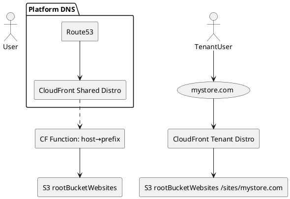

# guidogerb-website (Stream4Cloud Phase-1)

Monorepo for four sites (unique domains) plus shared packages and infra to power the Stream4Cloud Phase-1 deliverable.

## What’s included (Phase-1 scope)
- 4 separate websites (unique domains; no shared apex in v1)
- Shared `@guidogerb/*` packages (auth, ui, api-client, sw, components)
- Auth via **Cognito Hosted UI** and optional **Google OAuth (OIDC)**
- Minimal APIs (HTTP API + a health Lambda)
- Data: DynamoDB single-table starter
- Media: MediaConvert **audio (AAC/HLS)** and **video (H.264/HLS)** job templates + Step Functions
- CDN: CloudFront + S3 (OAC), optional Route 53 DNS
- Search: OpenSearch Serverless collection (placeholder)

> Monetization, payouts, community features, and discovery are **deferred** to later phases.

## Repo structure (high level)


# README — Multi‑tenant S3/CloudFront Monorepo

A production‑ready mono‑repo that hosts **many independent websites** from a **single private S3 bucket** behind CloudFront, with:

* One **shared distribution** for your apex + wildcard (e.g., `soundalike.example`, `*.soundalike.example`) using a **host→prefix** rewrite (`/sites/<host>/*`).
* Optional **per‑tenant distributions** for external custom domains (e.g., `mystore.com`) that point to `/sites/mystore.com` in the same bucket.
* **pnpm workspaces** with local, unpublished **scoped packages** (e.g., `@mypackage/ui`) consumed by each website.
* **Vite React** apps per website; **global + site env files** populate `VITE_*` into shared components at **compile time**.
* One‑liners via **Makefile**, and CI/CD via **GitHub Actions**.

---

## Quick start (TL;DR)

```bash
# 0) Prereqs: Node 20+, pnpm 9+, AWS CLI v2
corepack enable && corepack prepare pnpm@9 --activate

# 1) Install
pnpm install

# 2) Local dev (any site)
pnpm --filter websites/mystore.com dev

# 3) Build everything
pnpm packages:build && pnpm build:sites

# 4) Deploy all sites (requires env: ROOT_BUCKET, SHARED_DIST_ID)
make deploy-all

# 5) Onboard a custom domain (choose one):
#    a) Step Functions automation
make onboard-tenant DOMAIN=mystore.com ALIASES="mystore.com,www.mystore.com" STATE_MACHINE_ARN=arn:aws:states:...
#    b) Direct CloudFormation
make onboard-tenant DOMAIN=mystore.com ALIASES="mystore.com,www.mystore.com" ACM_ARN_TENANT=arn:aws:acm:us-east-1:... WAF_ARN=arn:aws:wafv2:...
```

---

## Architecture at a glance

**Key ideas**

* **Single private S3 bucket** (block public access ON), keys under `sites/<host>/...`.
* **Shared CloudFront** for your platform domains; **CloudFront Function** rewrites `/<path>` → `/sites/<host>/<path>`.
* **Tenant CloudFront** per external domain; origin path `/sites/<primary-alias>`.
* **OAC‑only** access from CloudFront to S3, **WAF** on all distributions, **security headers** and **cache policies**.



> **ACM certificates must be in `us-east-1`** for CloudFront. Use OAC; do **not** expose S3 publicly in production.

---

## Repository layout

```
repo-root/
├─ Makefile
├─ pnpm-workspace.yaml
├─ package.json
├─ tsconfig.base.json
├─ .eslintrc.cjs  .prettierrc  .npmrc
├─ .env*          # global env (hyphen & dotted forms)
├─ scripts/
│  ├─ deploy-all.mjs   ├─ deploy-site.mjs   ├─ deploy-tenant.mjs   └─ write-env.mjs
├─ infra/
│  ├─ templates/       # shared/tenant prod CFN
│  ├─ stacks/          # app stacks (edge, api, auth, data, ...)
│  ├─ params/          # per-env param JSONs
│  └─ onboarding/      # Step Functions + Lambda for tenants
├─ packages/
│  ├─ ui/  ├─ player/  └─ config/  # @mypackage/* workspaces
└─ websites/
   ├─ mainstreamingsite.com/
   ├─ mystore.com/
   ├─ myadminsite.com/
   └─ myusercreatorprofile.com/
```

Full structure + UML: see **Appendix P** in the spec canvas.

---

## Prerequisites

* **Node 20+**, **pnpm 9+**
* **AWS CLI v2** authenticated with permissions for S3, CloudFront, CloudFormation, (optionally) Step Functions & ACM & Route53
* **ACM certs in us-east-1**

---

## One‑time infrastructure (Ops)

1. **Shared CloudFront (apex + wildcard)**

    * Template: `infra/templates/shared-distro-prod.yml`
    * Inputs: `DomainName` (apex), `AcmCertificateArn` (apex + wildcard), `RootWebsitesBucketName`, `WebAclArn`, `LogBucketName`
    * Deploy (example):

      ```bash
      make deploy-shared-stack \
        APEX_DOMAIN=soundalike.example \
        ACM_ARN_SHARED=arn:aws:acm:us-east-1:... \
        WAF_ARN=arn:aws:wafv2:... \
        CF_LOG_BUCKET=cf-logs-bucket \
        ROOT_BUCKET=rootBucketWebsites \
        HOSTED_ZONE_ID=ZXXXXXXXXXXXX
      ```

2. **Root S3 bucket**

    * Private, Block Public Access ON, Versioning ON.
    * Bucket policy allows **read from CloudFront only** via OAC SourceArn(s). See spec Appendix I.1.

3. **Tenant onboarding** (custom domains)

    * Choose **Step Functions** automation (recommended) or direct **CloudFormation** deploy of `infra/templates/tenant-distro-prod.yml`.

---

## Local development

```bash
# install dependencies
pnpm install

# run one site
yarn --version # sanity check; using pnpm below
pnpm --filter websites/mystore.com dev

# develop a shared package in watch mode
pnpm --filter @mypackage/ui dev
```

**Notes**

* Websites are Vite React apps. Shared packages (`@mypackage/*`) are consumed via pnpm workspace links — no publish required for dev.
* The shared packages can reference `import.meta.env.VITE_*` and they will be **compiled** with the site’s env during the site build.

---

## Configuration & Environment

Two env file styles are supported **at root** and inside **each site**:

* **Hyphen:** `.env`, `.env-development`, `.env-production`
* **Dotted:** `.env`, `.env.development`, `.env.production` (Vite default)

**Precedence** (highest → lowest): `site.dotted` → `site.hyphen` → `global.dotted` → `global.hyphen` → CI `env`.

**Common `VITE_*` keys**

```
VITE_BRAND_NAME=Soundalike
VITE_API_BASE=/api
VITE_WS_BASE=/ws
VITE_SITE_HOST=mystore.com
VITE_CF_DISTRIBUTION_ID=E123ABC456
```

**Populate envs**

* Local: copy or create `.env(.development)` in repo root and in `websites/<host>/`.
* CI: store keys in **GitHub Actions Variables/Secrets**; `scripts/write-env.mjs` will materialize `.env` in each changed site before build.

---

## Build & deploy

### All sites

```bash
export ROOT_BUCKET=rootBucketWebsites
export SHARED_DIST_ID=E2ABCD12345
make deploy-all
```

### Single site

```bash
export ROOT_BUCKET=rootBucketWebsites
export DIST_ID=$SHARED_DIST_ID # or a tenant distro ID
make deploy-site SITE=mystore.com
```

**What happens**

* Build the site(s) with Vite (env merged)
* Sync `dist/` to `s3://$ROOT_BUCKET/sites/<host>/`
* Invalidate CloudFront (shared distro or tenant distro)

> Tip: prefer path‑scoped invalidations (e.g., `/sites/mystore.com/*`) instead of `/*` to control cost.

---

## Onboarding a custom domain

### Option A — Step Functions automation

```bash
make onboard-tenant \
  DOMAIN=mystore.com \
  ALIASES="mystore.com,www.mystore.com" \
  STATE_MACHINE_ARN=arn:aws:states:us-east-1:123:stateMachine:tenant-onboard
```

This:

1. Requests ACM cert (DNS validation) in `us-east-1`.
2. (If hosted in your Route53) writes validation CNAME.
3. Deploys a tenant CloudFront with origin path `/sites/mystore.com`.
4. Updates the root bucket policy to allow the new distro (OAC SourceArn).

### Option B — Direct CloudFormation

```bash
make onboard-tenant \
  DOMAIN=mystore.com \
  ALIASES="mystore.com,www.mystore.com" \
  ACM_ARN_TENANT=arn:aws:acm:us-east-1:... \
  WAF_ARN=arn:aws:wafv2:... \
  CF_LOG_BUCKET=cf-logs-bucket \
  ROOT_BUCKET=rootBucketWebsites
```

Then ask the customer to CNAME their domain to the distribution domain name (or create Route53 A/AAAA alias if you host DNS).

---

## CI/CD (GitHub Actions)

* `deploy-sites.yml` builds **only changed websites** and deploys them; it injects `VITE_*` via repo Variables/Secrets and `write-env.mjs`.
* `publish-packages.yml` (optional) tags `@mypackage/*` for release to **GitHub Packages** when you need them published beyond local workspace.

**Required secrets/vars**

* `AWS_ACCESS_KEY_ID`, `AWS_SECRET_ACCESS_KEY`, `AWS_REGION`
* `ROOT_BUCKET`, `SHARED_DIST_ID`
* Optional: `NPM_TOKEN` for publishing packages; `VITE_*` values as **Variables**.

---

## Security & compliance

* **S3 private only**; access via **CloudFront OAC**. Block Public Access = ON.
* **WAF** on all distributions; managed rule sets enabled.
* **Security headers** and **TLS 1.2\_2021** minimum on CloudFront.
* **Access logs** enabled to S3 (separate log bucket recommended).
* **ACM in us-east-1**; rotate certificates before expiry.

---

## Troubleshooting

* **403 from S3**: OAC not attached or bucket policy missing `AWS:SourceArn` for the distribution.
* **TLS/Cert errors**: ACM not in `us-east-1`, or SANs don’t cover the domain.
* **Env variables not in UI**: ensure keys are **prefixed with `VITE_`** and site rebuilt after changes.
* **Website 404 on deep links**: confirm CloudFront error mapping returns `/index.html` for 404.

---

## Maintenance & ops

* **Quotas**: CloudFront distribution limits; request increases if you have many tenants.
* **Invalidation costs**: batch paths when possible.
* **Logs**: review CloudFront/WAF metrics and S3 access logs.
* **Cleanup**: removing a tenant requires stack delete + bucket policy update + DNS cleanup.

---

## Development workflow

* **Lint**: `pnpm packages:lint` (root) or `pnpm -r eslint "**/*.{ts,tsx}"`
* **Typecheck**: `pnpm typecheck`
* **Publish packages** (optional): create a git tag `pkg-vX.Y.Z` → CI publishes `@mypackage/*` to GitHub Packages.

---

## Contact / Support

Need a hand? Reach out via the spec footer or open an issue in this repo.

> Built to be contractor‑friendly: everything is scripted, parameterized, and reproducible.
