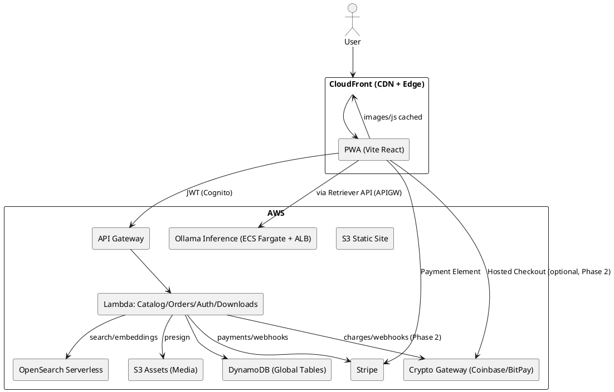
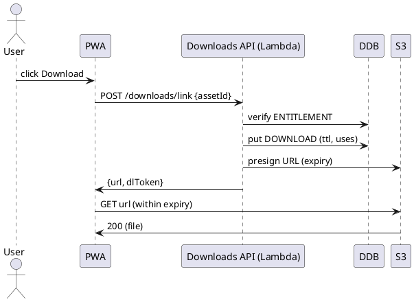
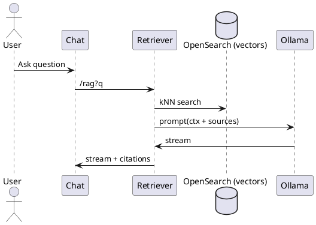
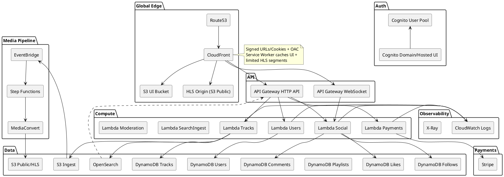
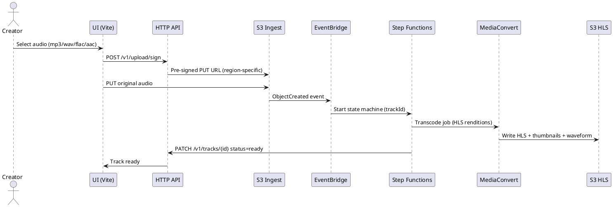
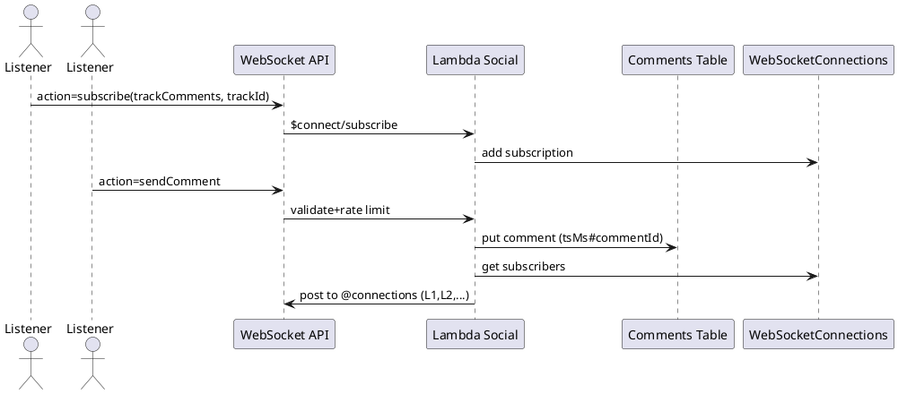
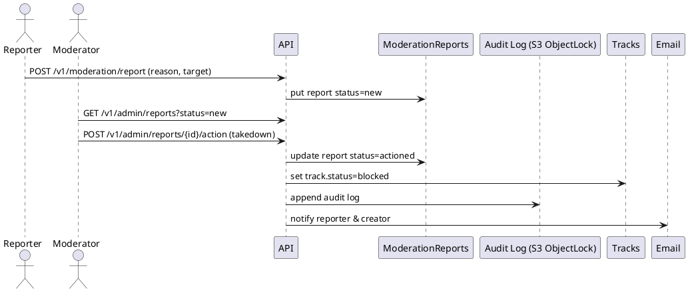
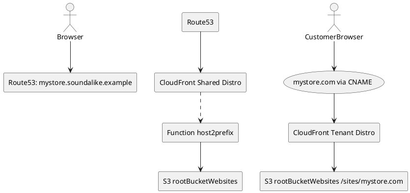

consultant: Vim Wickramasinghe [sammuti.com](https://sammuti.com)

# SPEC-1-Creative Assets Marketplace (Vite React + AWS)

## Background

This project delivers a scalable, offline-capable web marketplace for creative digital and physical products (music, albums, books/e‑books, videos, podcasts, and subscription/tokens). The frontend is a Vite + React application deployed to AWS S3/CloudFront with a Service Worker providing asset caching and offline access for public routes.

Key drivers and context:

* **Reusable modular architecture**: Multiple UI/logic modules are developed locally in a monorepo and published as reusable packages to GitHub Packages for broader reuse across sites/apps.
* **Serverless, cost‑efficient backend**: Core APIs exposed via AWS API Gateway with Python AWS Lambda targets. Object storage and secure delivery via S3 + pre‑signed/permission‑hashed download links.
* **Authentication & Authorization**: Centralized user auth through Amazon Cognito (hosted UI + JWT for API), federated sign‑in (Google/Apple/Facebook/Microsoft), and fine‑grained authorization for downloadable assets and admin capabilities.
* **Catalog-first experience**: A comprehensive, searchable catalog of artists/authors, works, and products with dedicated profile pages and SEO‑friendly public routes that work offline (read‑only) when the network is unavailable.
* **Commerce for digital & physical fulfillment**: Shopping cart, checkout, invoicing/receipts, and post‑purchase access (My Products). Stripe (preferred) powers payments, subscriptions, and invoicing; alternative processors remain pluggable.
* **Creator economy features**: Users can create their own store, upload/manage products, define licensing (EULA), and sell assets or metered access (token packs) in addition to classic subscriptions with capacity.
* **Admin & business operations**: Admin console covers catalog curation, user/store management, pricing/inventory, financial reconciliation, reporting (annual/tax), infrastructure cost visibility, and historical auditability.
* **Data model preference**: DynamoDB as the primary datastore, leveraging streams for audit/history and event-driven workflows.

Confirmed scope updates from you:

* **Multi‑tenant + Custom Domains at launch**.
* **Global sales** with regional taxes, currency conversion tables, and region‑specific point‑of‑sale rules.

## Requirements

### MoSCoW Prioritization

#### Must Have

* **Multi‑tenant storefronts** under shared domain (e.g., `@handle.ggp-store.com`) **and** tenant BYO **custom domains** at launch; automated TLS issuance and renewals; per‑region price lists.
* **Global sales enablement**: multi‑currency pricing and display, FX conversion tables, region‑aware tax calculation (US sales tax, EU VAT, CA GST/HST, etc.), tax‑compliant invoices, and tax‑inclusive/exclusive price display per region.
* **Regional point‑of‑sale (POS) behavior**: local payment methods by region, address/phone/ID requirements by market, currency rounding rules, and regional checkout copy.
* **Frontend architecture**: Vite + React function components with Contexts; shared modules developed in a monorepo and published to GitHub Packages; local development consumes workspace modules; strict TypeScript; ESLint/Prettier.
* **Offline capability**: Service Worker that precaches the app shell and caches all images/JS; runtime caching of image/CDN assets; offline‑functional **public routes** with graceful fallbacks; cache versioning & invalidation strategy.
* **Hosting & delivery**: Static site on **S3** with **CloudFront** CDN; SPA routing support; security headers; gzip/brotli; image optimization pipeline; WAF.
* **AuthN/AuthZ**: Amazon Cognito (Hosted UI + JWT) with social sign‑in (Google, Apple, Facebook, Microsoft). JWT access to APIs (OAuth2/OIDC). Role/claim‑based authorization for content and admin actions.
* **APIs**: AWS API Gateway (HTTPS/REST) fronting Python **Lambda** micro‑functions; IAM‑scoped resources; request validation; throttling; structured error model.
* **Secure downloads**: Assets in S3; download links generated via API with permission hashes + expiry (pre‑signed URLs); device/IP rate limits; audit logging of access.
* **Catalog**: Full catalog of digital assets (artists, albums, books, videos, podcasts, subscriptions/tokens). Searchable with autocomplete; artist/author profile pages; SEO metadata and sitemaps.
* **Commerce**: Shopping cart for digital + physical products; discounts/coupons; tax/shipping estimates; checkout via **Stripe**; webhook processing for order lifecycle; refunds/partial refunds; disputes handling.
* **Post‑purchase**: **My Products** (entitlements/downloads), license (EULA) access/acceptance tracking, **Invoices** page with printable receipts.
* **Admin console**: Manage users, artist profiles, stores, catalogs, pricing/inventory, orders/refunds, payouts/royalties, financial reconciliation, annual reports, tax exports, infra cost visibility, and audit trails.
* **Creator stores**: Users can create a store, upload assets, configure pricing/licensing, publish/unpublish, and track sales.
* **Token & subscription model**: Token packs for metered services (e.g., API calls/podcasts) and subscriptions with capacity that can be topped up when consumed; usage metering and alerts.
* **Session management**: Secure persistence (localStorage/IndexedDB) for selected data; silent token refresh/rotation; device trust where possible; session revocation.
* **Data layer**: **DynamoDB** primary store with single‑table design per domain (or consolidated with GSIs); regional replication (Global Tables) for latency and DR; streams for change events and audit logs.
* **Observability**: Centralized logs/metrics/traces; structured logging; alerting and dashboards.
* **Security & compliance**: PCI DSS SAQ‑A boundary (Stripe‑hosted elements/links), GDPR/CCPA controls (consent, DSRs), encryption at rest/in transit, IAM least privilege, secrets in Secrets Manager/SSM.
* **Quality**: Accessibility **WCAG 2.1 AA**; i18n/l10n (locale, currency, date/number formats); performance budgets and Core Web Vitals.
* **Reliability**: SLOs for availability/latency; RPO/RTO targets; backup/restore and DR runbooks.
* **Abuse prevention**: API rate limiting, download link abuse detection, throttling, and captcha challenges where needed.

#### Should Have

* **PWA installability** (manifest, icons) and Background Sync; optional push notifications.
* **Edge logic** (CloudFront Functions/Lambda\@Edge) for geo‑based price lists, redirects, and A/B.
* **Search service**: Managed search (OpenSearch/Algolia) with synonyms and typo tolerance.
* **Import/export**: Bulk CSV/JSON importers; product and catalog APIs.
* **Physical fulfillment**: Pluggable 3PL integrations (e.g., Shippo/ShipStation) and real‑time shipping rates.
* **Analytics/BI**: Data lake (S3 + Glue + Athena) and dashboards (QuickSight); cost allocation reports by tenant.
* **Media processing**: Pipelines for image renditions, audio normalization, video transcode, captions/transcripts.
* **DRM/watermarking** for videos/e‑books (where licensing requires).
* **Marketplace payouts** using Stripe Connect (standard/express) for creators.
* **Custom domain automation** across Route 53 and external DNS providers; automated verification flows.
* **Webhooks** for tenant integrations; **feature flags** for safe rollout.
* **Crypto/DeFi payments (Phase 2)**: pluggable gateway (e.g., Coinbase Commerce/BitPay); hosted checkout, fiat price quote/lock at checkout, webhook confirmation → order finalization; per‑region enable/disable; accounting/tax mapping; volatility/refund policy.

#### Could Have

* Headless CMS for marketing (MDX/Contentful/Sanity).
* Community features (ratings/reviews, comments, follows).
* Gift cards and referrals/affiliates.
* Native wrappers (Capacitor) for app‑store presence.
* **WYSIWYG editor for artist/author profiles** (rich text + media embeds, controlled schema, server‑side sanitization).

#### Won’t Have (for MVP)

* On‑prem/self‑hosted deployment.
* Custom DRM beyond basic watermarking unless contractually required.

## Method

### Localhost Cognito setup (redirect_mismatch)
If you see a Cognito Hosted UI error like:

redirect_mismatch for client_id=...

it means the redirect_uri your app sends does not exactly match one of the Callback URLs configured for your Cognito App client.

To fix for localhost:
- Ensure your dev server runs on the port your env specifies (default 4173, strict port). Free the port or change it.
  - Change website/.env.development:
    - VITE_SITE_PORT=4173 (or your port)
    - VITE_LOGIN_CALLBACK_PATH=/auth/loginCallback
    - VITE_REDIRECT_URI=http://localhost:4173/auth/loginCallback (must include the exact port)
- In the Cognito console → User pools → App client → Hosted UI → Callback URLs, add the exact URL, e.g.:
  - http://localhost:4173/auth/loginCallback
- Also add a Sign out URL (for post logout redirect):
  - http://localhost:4173/auth/logout

Notes:
- The app will warn in console if redirect_uri doesn’t match the current origin. In development, if redirect_uri isn’t set, it will default to window.location.origin + VITE_LOGIN_CALLBACK_PATH.
- Any change to port or path must be reflected both in .env.development and in Cognito App client settings.

## Method

### 1) Monorepo & Package Architecture (Reusable Modules)

**Tooling**: pnpm workspaces, Changesets for versioning, TypeScript strict mode, tsup for library builds, Vitest + Testing Library.

**Repository layout**

```
root/
  website/                    # Vite + React app (S3/CloudFront)
  @guidogerb/
    ui/                       # Headless UI + design system components
    auth/                     # Cognito auth hooks (PKCE), token mgmt
    api-client/               # Typed SDK for API Gateway routes
    catalog/                  # Types, zod validators, search helpers, payments-crypto, coinbase-client (coinbase/BitPay client), checkout, flows
    storage/                  # S3 presign client, download guard
    analytics/                # Event schema + emitter (web + lambda)
    ai-support/               # RAG client (OpenSearch) + chat UI
    config/                   # ESLint/Prettier/TS config packages
  infra/
    cdk/                      # IaC for AWS resources
```

**Publishing**

* All packages are developed locally and versioned independently via Changesets.
* Public packages are published to GitHub Packages under an org scope (e.g., `@guidogerb/ui`), with the app consuming them via workspace references during development.

---

### 2) Frontend (Vite + React + PWA)

**Framework**: React function components with Contexts; React Router; Suspense + code-splitting.

**Key contexts**

* `AuthContext` (Cognito JWTs, silent refresh, device trust)
* `CartContext` (digital + physical items, quantities, token packs)
* `CatalogContext` (filters, search state, infinite scroll)
* `PricingContext` (currency, FX rates, tax-inclusive/exclusive display)
* `OfflineContext` (network state, offline fallbacks)

**Public routes (offline-first)**

* `/` home, `/catalog`, `/artists/:slug`, `/authors/:slug`, `/albums/:id`, `/books/:id`, `/videos/:id`, `/podcasts/:id`, `/eula/:id` — fully functional offline with cached data snapshots and graceful “data‑may‑be‑stale” banners.

**PWA & Service Worker**

* Use `vite-plugin-pwa` `injectManifest` mode to keep a hand-written Workbox service worker.
* Precache: app shell (index.html), route bundles, fonts, icons, and immutable JS/CSS assets (revisioned).
* Runtime caching strategies:

    * `CacheFirst` for images and font files from CloudFront.
    * `StaleWhileRevalidate` for JSON catalog snapshots and CDN JS chunks.
    * `NetworkOnly` with background sync queue for write ops (e.g., wishlist, feedback) when offline.
* `navigationFallback`: serve `/offline.html` with a cached minimal shell when a route is not in cache.
* Versioning & invalidation: cache bust via manifest revisions; SW `skipWaiting` + `clientsClaim` after user confirms.

**Installability & UX**

* Web manifest, iOS install banners, add-to-home-screen prompts, and basic push notification scaffolding (opt‑in) for back-in-stock alerts.

---

### 3) Authentication & Authorization

**Identity**: Amazon Cognito Hosted UI (Authorization Code + PKCE). Social IdPs enabled: Google, Apple, Facebook, Microsoft.

**Token handling**

* Access/ID tokens (short‑lived) stored in memory; refresh token stored in `IndexedDB` with WebCrypto wrapping.
* Silent renew: refresh before expiry; revoke on logout; device rehydration on app boot.

**Frontend guards**

* Route guards (e.g., `/my-products`, `/invoices`, `/admin`) check JWT scopes/claims.

**API auth**

* API Gateway JWT/Cognito User Pools authorizer; fine‑grained claims (tenantId, roles, permissions) included in access tokens.

---

### 4) Backend (Serverless on AWS)

**Edge & static delivery**

* S3 + CloudFront (SPA routing, gzip/brotli, WAF). CloudFront Functions/Lambda\@Edge add locale/country headers, choose price list, and forward `X-Tenant` based on host.

**APIs**

* API Gateway (HTTPS API) → Python Lambda functions per bounded context. Layers for shared libs (auth, logging, DynamoDB client, Stripe client, OpenSearch client). JSON Schema request/response validation.

**Core endpoints (sample)**

```
GET  /public/catalog/search?q= &type=artist|album|book|video|podcast
GET  /public/catalog/items/{id}
GET  /public/artist/{slug}
POST /auth/refresh (if using custom refresh proxy)
POST /downloads/link                      # permission-hashed, presigned download
GET  /me/entitlements
GET  /me/invoices
POST /cart
POST /checkout/create-session             # Stripe Payment Element/Checkout
POST /checkout/crypto/create-charge       # Phase 2: Coinbase/BitPay hosted charge
POST /webhooks/stripe
POST /webhooks/crypto                     # Phase 2
POST /admin/catalog/import
POST /admin/domains
POST /admin/users/{id}/roles
POST /store/create
POST /store/{id}/products
```

GET  /public/catalog/search?q= \&type=artist|album|book|video|podcast
GET  /public/catalog/items/{id}
GET  /public/artist/{slug}
POST /auth/refresh (if using custom refresh proxy)
POST /downloads/link  # creates permission-hashed, short-lived presigned download
GET  /me/entitlements
GET  /me/invoices
POST /cart
POST /checkout/create-session  # Stripe Payment Element/Checkout
POST /webhooks/stripe
POST /admin/catalog/import
POST /admin/domains
POST /admin/users/{id}/roles
POST /store/create
POST /store/{id}/products

````

**Download link generation (permission-hash)**
1. Client requests a download for `assetId` or a group of `assetIds`.
2. Lambda verifies entitlement (user owns product; within limits).
3. If entitled, create a zip archive with all assets and generate a presigned URL.
4. If not entitled, return a pretty error or 403.
5. Lambda generates `permissionHash = HMAC_SHA256(secretRotationKey, userId|assetId|entitlementId|ttl)` and stores a `DOWNLOAD` record in DynamoDB with TTL and one-time/limited-use counters.
6. Lambda returns presigned S3 URL (expires N minutes) plus opaque `dlToken` (permissionHash). S3 access is only via presign; all accesses audit‑logged.

**Payments & checkout**
- Stripe as primary: Payment Element for cards + local methods, Apple/Google Pay, multi‑currency presentment. Checkout session for simple flows; Payment Intents for custom flows.
- **Crypto/DeFi (Phase 2, per region/tenant toggle)**: Coinbase Commerce (BTC/ETH/USDC, etc.) or BitPay hosted checkout. Quote/lock price at checkout in buyer currency; order held in `PENDING_PAYMENT` until webhook confirms `CONFIRMED`. Entitlements provisioned only after required confirmations. Refunds per gateway policy (store credit or off‑chain refund). FX exposure minimized by quoting in fiat and treating crypto as tender.
- Subscriptions: Stripe Billing with products/prices supporting **licensed quantities** (capacity) and **usage‑based meters** for metered features (e.g., podcast API calls). Top‑ups implemented as invoice items or price quantity adjustments.
- Marketplace payouts: Stripe Connect (Express) for creator stores; platform fee + automated payouts; KYC via hosted onboarding.

**Admin & reporting**
- Back‑office UIs backed by dedicated admin APIs. Financial reconciliation views combine Stripe data + order records. Annual/tax exports, and infra cost dashboards (CUR + Athena + QuickSight) in a separate analytics account.

---

### 5) Data Model (DynamoDB + OpenSearch)

**DynamoDB (single‑table, Global Tables)**
- Table: `app_main` (PK=`pk`, SK=`sk`), streams: NEW_AND_OLD_IMAGES, GSIs:
  - `GSI1` (pk2, sk2): lookup by slug/email/externalId.
  - `GSI2` (tenant, sk): tenant‑scoped listings (catalog by type, orders by date).
  - `GSI3` (entityType, createdAt): admin reports, exports.
- Representative entities (item types):
  - `TENANT#<id>`: tenant metadata, plan, settings, default currency.
  - `DOMAIN#<host>`: custom domain mapping → tenantId, certArn, cfDistributionId, status.
  - `USER#<id>`: profile, roles; `USEREMAIL#<email>` → `USER#` via GSI.
  - `ARTIST#<id>` / `AUTHOR#<id>`: bios, links, slugs.
  - `WORK#<id>`: album/book/video/podcast series metadata.
  - `PRODUCT#<id>`: sellable SKU (digital/physical/token pack/subscription); variants/prices.
  - `PRICE#<id>`: currency, list price, tax class, region; FX cache.
  - `ORDER#<id>`: line items, totals, currency, taxes; links to Stripe PaymentIntent/Subscription/Invoice or crypto `CRYPTOCHARGE#`; fields: `paymentProvider`=`stripe|crypto`, `providerChargeId`, optional `txHash`.
  - `ENTITLEMENT#<userId>#<productId>`: download rights, device limits, usage caps.
  - `DOWNLOAD#<token>`: ephemeral token with TTL and usage counters.
  - `USAGE#<subId>#<yyyymm>`: metered usage aggregation.
  - `STORE#<id>`: creator storefront config; payout account id.
  - `CRYPTOCHARGE#<id>`: provider, currency/amount, status, confirmations, `orderId`, `walletAddress`.
  - `AUDIT#<entity>#<ts>`: change history (also streamed to S3).

**Search & vectors**
- OpenSearch Serverless (vector collections):
  - `catalog-search` (BM25 + facets for artists/authors/works)
  - `cs-kb-vector` (RAG embeddings; cosine similarity); fields: `docId`, `tenantId`, `title`, `chunks[]`, `embedding[1536]`, `metadata`.

**Analytics lake**
- S3 data lake with raw events (Stripe webhooks, audit, usage), Glue catalog + Athena for queries; QuickSight for dashboards.

---

### 6) Multi‑Tenant & Custom Domains

**Tenant resolution**
- Shared CloudFront distribution with Alternate Domain Names (CNAMEs) for custom domains. Lambda@Edge/Function maps `Host` → tenant via `DOMAIN#<host>` item and injects `X-Tenant` header to origin.
- Certificate automation: ACM public cert request with DNS validation; for Route 53‑hosted zones, DNS records auto‑created; for external DNS, show required CNAME targets to the user and poll until validated. Store certArn + status on `DOMAIN#` item.
- Quotas & scale: shared tenants across additional CloudFront distributions when approaching alias limits; batch certs where possible.

**Geo‑aware price list & payment methods**
- Use CloudFront viewer country headers to select display currency, defaults, and local payment options dynamically; override by user preference.

---

### 7) Catalog & Search Features

- Entities: Artists, Authors, Albums, Books, Videos, Podcasts, Subscriptions, Token Packs.
- Faceted filters (type, genre, tags, release year, price range), autocomplete by artist/author/work.
- Profile pages: hero, bio, discography/bibliography, social links, storefront items.

---

### 8) Commerce Design

**Cart**
- Mixed digital/physical items; per‑item license, quantity, region. Shipping estimator for physical goods. Cross‑sell recommendations.

**Checkout**
- Stripe Payment Element; tax calculation at checkout (Stripe Tax); SCA support; webhooks finalize orders and entitlements.

**Subscriptions & capacity**
- Licensed quantity: set `quantity` to represent capacity (e.g., 1,000 podcast requests/mo); allow **boosters** (top‑ups) as add‑ons.
- Usage‑based meters: send usage events for API calls or podcast downloads; bill in arrears with tiered pricing; alerts at 80/100%.

**My Products & Invoices**
- Entitlements list with download buttons (generate presigned URLs on demand). Invoices page links to Stripe-hosted invoice/receipt; PDF copies cached to S3 for convenience.

**Creator Stores**
- Onboarding flow: identity verification (Stripe Connect), tax forms, payout schedule. Product uploader with media pipeline (image renditions, audio normalization, video transcode with captions) and draft/publish lifecycle.

---

### 9) AI‑Driven Customer Support (Local Inference + RAG)

**Goal**: Self‑service support that answers product/licensing/billing questions, escalates to human agents, and cites internal knowledge.

**Components**
- **Ollama Inference Service** (ECS Fargate, GPU-optional) behind an internal ALB, fronted by API Gateway; serves `/api/generate` for OSS models (e.g., Llama 3). Model/runtime configurable per environment.
- **Embedder Worker** (Lambda or container): chunk docs (FAQs, EULAs, policies, how‑tos), create embeddings, upsert to `cs-kb-vector`.
- **Retriever API** (Lambda): semantic search (top‑k) + rerank, prompt assembly with guardrails, calls Ollama, returns streaming responses to web.
- **Frontend**: chat widget (package `ai-support`) with sources panel, feedback, and handoff to human.

**Data sources**: markdown/HTML docs in S3, admin notes, recent incident updates, release notes.

**Safety/guardrails**: prompt templates + allowed topics; PII filtering; rate limits; answer with citations; fallback to human when low confidence.

---

### 10) Offline Data Strategy

- Ship a small **catalog snapshot** JSON for top charts and last‑viewed entities to IndexedDB for offline browse.
- Background sync updates snapshots on reconnect.
- Queue writes (wishlists, contact forms) via Workbox Background Sync; retry with exponential backoff.

---

### 11) Observability, Security, Compliance

- **Observability**: Lambda Powertools (tracing/metrics/logger), CloudWatch dashboards/alarms, structured logs with correlation IDs, X-Ray tracing.
- **Security**: WAF (bot control rules), rate‑limit on download link creation/usage, malware scanning of uploads, KMS‑encrypted S3 buckets, Secrets Manager for keys.
- **Compliance**: PCI‑DSS SAQ‑A (Stripe‑hosted), GDPR/CCPA (consent, DSR workflows), audit trails via DynamoDB Streams → S3.

---

### 12) PlantUML (Key Diagrams)

#### 12.1 High‑Level Architecture


#### 12.3 Permission‑Hashed Download Flow



#### 12.4 RAG Support Flow



---

### 13) Example DynamoDB Keys

```
TENANT#t_123            | TENANT#t_123                | tenant config
DOMAIN#store.com        | TENANT#t_123                | certArn=..., status=ISSUED
USER#u_42               | PROFILE#                     | name, email
USEREMAIL#joe@x.com     | USER#u_42                    | (GSI1)
ARTIST#a_77             | META#                        | slug, name
WORK#w_555              | ALBUM#                       | artistId
PRODUCT#p_999           | SKU#digital                  | workId, license
PRICE#pr_1              | USD#list#2025-09            | amount, region=US
ORDER#o_2025_0001       | USER#u_42#2025-09-01        | totals
ENTITLEMENT#u_42#p_999  | ACTIVE#                      | caps, deviceLimit
DOWNLOAD#tok_abcd       | PENDING#ttl=1693580000       | usesLeft
USAGE#sub_123#202509    | STATS#                       | units=4321
STORE#s_100             | CONFIG#                      | connectAccountId
```

---

### 14) Module Interfaces (selected)

**`packages/auth`**

```ts
export function useAuth() {
  // loginWithHostedUI, logout, getAccessToken, onTokenRefresh
}
```

**`packages/commerce`**

```ts
export type CartItem = { skuId: string; qty: number; kind: 'digital'|'physical'|'token'|'subscription'; priceId: string };
export function useCart() { /* add, remove, totals, currency */ }
```

**`packages/sw`** (Workbox helpers): `cacheImages()`, `cacheDocuments()`, `setupBackgroundSync()`.

**`packages/ai-support`**: `useRagChat()` with stream + sources; `embedDocuments()` (admin-only).

---

### 15) Future: AI Services Marketplace (Placeholders)

* **SKU types**: `AI_IMAGE_GEN`, `AI_VIDEO_GEN`, `AI_TEXT_GEN` — modeled as metered or per‑job purchases; jobs run asynchronously with webhooks updating order line item status.
* **Quotas**: per‑tenant and per‑user limits; burst controls; credit expiration.
* **Rendering**: pluggable backends (local containers or external APIs) with the same metering pipeline used for podcast/API tokens.

## Implementation

### A. Monorepo & Workspace

1. **Initialize** pnpm workspaces + Changesets.

    * `pnpm init -y`; root `pnpm-workspace.yaml` includes `apps/*` and `packages/*`.
    * TypeScript strict mode in root `tsconfig.base.json`; shared lint configs in `packages/config`.
2. **Packages** scaffold: `ui`, `auth`, `api-client`, `catalog`, `commerce`, `payments-crypto` (Phase 2), `sw`, `storage`, `analytics`, `ai-support`.
3. **Publishing**: GitHub Packages with scoped packages (`@org/*`); configure `.npmrc` for auth; CI publishes on tagged release via Changesets.

### B. Frontend Auth (Vite + React + PWA)

1. **Auth scaffold**: `apps/web` with Vite React + TypeScript, React Router, Zustand or Context for state where noted.
2. **PWA**: add `vite-plugin-pwa` in `injectManifest` mode; create `packages/sw/src/sw.ts` using Workbox.

    * Precache app shell, route bundles, fonts, icons.
    * Runtime caching:

        * `CacheFirst` → images, fonts (CloudFront origins).
        * `StaleWhileRevalidate` → JSON catalog snapshots and chunked JS.
        * Background Sync queue for write ops.
    * Offline fallbacks: `/offline.html` + cached skeleton data from IndexedDB.
3. **State**: `AuthContext`, `CartContext`, `CatalogContext`, `PricingContext`, `OfflineContext` with localStorage/IndexedDB persistence (keys namespaced per tenant).
4. **UI**: `packages/ui` exports headless components; theme tokens; RTL/i18n ready.
5. **SEO**: react-helmet-async, sitemap generator in CI, structured data on entity pages.

### C. Authentication (Cognito + Social IdPs)

1. **Cognito**: CDK creates User Pool, Auth Client (PKCE), Hosted UI domain; User Pool Groups/Roles (admin, creator, customer).
2. **Social IdPs**: configure Google, Apple, Facebook, Microsoft; enable Attribute Mapping (email, name, picture); restrict sign-up by domain/allowlist (optional).
3. **Frontend**: `packages/auth` implements `loginWithHostedUI`, `handleRedirect`, `getAccessToken`, silent refresh with refresh tokens in IndexedDB (wrapped by WebCrypto).
4. **API Authorizer**: API Gateway JWT authorizer against User Pool; scopes/claims include `tenantId`, `roles`.

### D. API Gateway & Lambda (Python)

1. **Structure** (`infra/cdk` sets up): API Gateway HTTP API → Lambda integrations per bounded context.
2. **Runtime**: Python 3.12; shared Lambda Layer (`layer_common`) with auth, logging, DynamoDB client, Stripe client, OpenSearch client.
3. **Functions**: `catalog`, `orders`, `checkout`, `downloads`, `stores`, `admin`, `search`, `rag` (retriever), `webhooks_stripe`, `webhooks_crypto` (Phase 2).
4. **Validation**: API Gateway request/response JSON Schemas; 4xx on validation errors.
5. **Resilience**: DLQs (SQS) for webhooks/processors; idempotency keys for checkout and webhooks; retries on 5xx.

### E. Data Layer (DynamoDB)

1. **Tables**: single table `app_main` (On‑Demand) with GSIs: `GSI1(pk2,sk2)`, `GSI2(tenant,sk)`, `GSI3(entityType,createdAt)`; **Global Tables** enabled in 2–3 regions (user traffic locales).
2. **Streams**: enabled to Lambda for audit and search indexing fan‑out.
3. **TTL**: for ephemeral `DOWNLOAD#` and temp carts.
4. **Backups**: PITR on; weekly on-demand snapshots.

### F. Search & RAG

1. **OpenSearch Serverless**: two collections — `catalog-search` (text) and `cs-kb-vector` (embeddings). Access policy scoped per env/tenant.
2. **Indexer**: Lambda from DynamoDB Streams normalizes catalog docs → OpenSearch; batch/dead-letter to SQS on failure.
3. **Embeddings**: `ai-support` admin tool uploads FAQs/EULAs → S3; Embedder Lambda chunks + embeds → `cs-kb-vector`.
4. **Retriever API**: Lambda queries vectors (top‑k), assembles prompt, calls Ollama endpoint, streams back to client.

### G. Payments

1. **Stripe**

    * Products/Prices: **multi-currency**; enable local methods per country.
    * Checkout: server creates Payment Intent or Checkout Session.
    * Subscriptions: Stripe Billing; metered usage events from backend.
    * Webhooks: verify signatures; update `ORDER#` + `ENTITLEMENT#`; generate invoices (link + cached PDF to S3).
2. **Crypto/DeFi (Phase 2)**

    * Optional per region/tenant. Hosted charge via Coinbase Commerce/BitPay; webhook confirms → mark order paid; store `CRYPTOCHARGE#` with confirmations and optional `txHash`.

### H. Media & Secure Downloads

1. **Storage**: media assets in versioned S3 buckets with KMS.
2. **Presign Service**: Lambda verifies entitlement; writes `DOWNLOAD#` with TTL; returns presigned URL + `dlToken`.
3. **Rate limiting**: per user/device/IP; device binding via soft fingerprint (optional); audit trail in DynamoDB + S3.

### I. Multi‑Tenant, Custom Domains, CDN

1. **CloudFront**: SPA origin to S3; cache policies for static assets; WAF attached.
2. **Domain mapping**: `DOMAIN#<host>` items; admin flow triggers CDK custom resource/Lambda to request ACM cert (DNS validation) and attach as Alternate Domain Name to CloudFront; status tracked.
3. **Geo headers**: CloudFront Function injects `X-Country`, `X-Currency` defaults; origin reads to select price lists.

### J. Ollama Inference (Local, ECS Fargate + ALB)

1. **ECR**: build/push Ollama image with required models pulled at startup or mounted via EFS (optional).
2. **VPC**: private subnets, ECS Cluster, Fargate Service (min 1–2 tasks), internal ALB, target group health checks.
3. **API exposure**: API Gateway → VPC Link → ALB (internal) for `/rag/generate` calls.
4. **Scaling**: target tracking on CPU/memory; max concurrency and request limits.

### K. Analytics & BI

1. **Eventing**: application analytics events → Kinesis Firehose → S3 data lake (partitioned by date/tenant).
2. **Catalog/Orders snapshots**: nightly export to S3.
3. **Athena/Glue**: crawlers + views; **QuickSight** dashboards (sales, churn, token usage, infra cost).

### L. Admin Console

1. **Features**: user management, roles, tenants/domains, catalog CRUD/import, pricing, orders/refunds, payouts, tax exports, infra cost reports, RAG content management.
2. **Access**: only `admin`/`staff` groups; feature flags per tenant.

### M. CI/CD

1. **GitHub Actions** with OIDC to AWS.

    * **Frontend**: build (`pnpm -F web build`), upload to S3, `aws cloudfront create-invalidation`.
    * **Packages**: typecheck/test/build; Changesets publish to GitHub Packages.
    * **Infra**: `cdk synth` + `cdk deploy` per env (dev/stage/prod) behind manual approval.
2. **Testing**

    * Unit: Vitest (web), PyTest (Lambdas).
    * Integration: Playwright for critical flows (auth, cart, checkout, downloads).
    * Load: k6 for API hot paths.

### N. Security & Compliance

1. **Headers** via CloudFront: CSP (nonce‑based), HSTS, X-Frame-Options, Referrer-Policy.
2. **WAF**: managed rules + rate limiting; bot control rules.
3. **Secrets**: AWS Secrets Manager (Stripe keys, crypto webhook secrets, DB); rotate routinely.
4. **PII**: data minimization; encryption at rest/in transit; audit logs.
5. **PCI**: SAQ‑A boundary (Stripe/hosted crypto checkouts).

### O. Internationalization & Tax

1. **i18n**: locale detection (CF header + user setting); number/date/currency formats via Intl.
2. **Tax**: Stripe Tax for calculation; region display (tax inclusive/exclusive) per market; VAT ID collection where required.
3. **FX**: store price lists per region; fallback to conversion table for display only; billing in checkout currency.

### P. Example Snippets

**PWA manifest & SW registration**

```ts
// apps/web/src/main.tsx
import { registerSW } from 'virtual:pwa-register'
registerSW({ immediate: true, onNeedRefresh() {/* toast */}, onOfflineReady() {/* toast */} })
```

```ts
// packages/sw/src/sw.ts (Workbox)
self.skipWaiting(); self.clientsClaim();
workbox.routing.registerRoute(({request})=>request.destination==='image', new workbox.strategies.CacheFirst());
workbox.routing.registerRoute(({request})=>request.destination==='script'||request.destination==='style', new workbox.strategies.StaleWhileRevalidate());
```

**CDK outline (TypeScript)**

```ts
export class WebStack extends cdk.Stack {
  constructor(scope: cdk.Auth, id: string, props?: cdk.StackProps) {
    super(scope, id, props);
    const siteBucket = new s3.Bucket(this, 'SiteBucket', { websiteIndexDocument: 'index.html', blockPublicAccess: s3.BlockPublicAccess.BLOCK_ALL });
    const oai = new cloudfront.OriginAccessIdentity(this, 'OAI');
    siteBucket.grantRead(oai);
    const dist = new cloudfront.Distribution(this, 'Dist', {
      defaultBehavior: { origin: new origins.S3Origin(siteBucket, { originAccessIdentity: oai }), viewerProtocolPolicy: cloudfront.ViewerProtocolPolicy.REDIRECT_TO_HTTPS },
      defaultRootObject: 'index.html'
    });
    new cdk.CfnOutput(this, 'CloudFrontURL', { value: `https://${dist.distributionDomainName}` });
  }
}
```

**Permission-hash (Lambda)**

```py
h = hmac.new(SECRET_KEY, f"{user_id}|{asset_id}|{entitlement_id}|{exp}".encode(), hashlib.sha256).hexdigest()
```

### Q. Rollout Plan

1. **Dev → Stage → Prod** environments via CDK stacks; feature flags for risky features.
2. **Tenant pilot**: onboard 3–5 creators; validate custom domains and payouts.
3. **Observability SLOs**: 99.9% API uptime; p95 < 300ms for read APIs.

## Milestones

> Timeboxes assume a small core team (2–3 FE, 2 BE, 1 DevOps) in parallel sprints; adjust proportionally. Each milestone includes demo + docs + handoff.

### M0 — Foundations & CI/CD (2 weeks)

**Scope**: Monorepo (pnpm + Changesets), shared TS configs, linting; CDK bootstrapping; S3/CloudFront baseline; Cognito User Pool + Hosted UI; API Gateway + JWT authorizer; DynamoDB table + GSIs; OpenSearch Serverless collections; ECS Fargate service scaffold for Ollama (no model); PWA skeleton.
**Acceptance**

* GitHub Actions: typecheck, tests, build; OIDC deploy to AWS; preview envs on PR.
* Dev CloudFront URL serves the PWA shell; SW precaches shell; offline page loads.
* Cognito Hosted UI login works end-to-end; API `GET /health` protected by JWT.
* DynamoDB table + GSIs deployed; OpenSearch reachable; ECS service healthy.

### M1 — Catalog & Offline Public Routes (3 weeks)

**Scope**: Entities (Artist, Author, Work, Product, Price) + import tooling; search indexer from DynamoDB Streams; public pages (home, catalog, artist/author profiles, detail pages); PWA offline caching of static assets + catalog snapshots.
**Acceptance**

* Search + filters work; top results returned < 300ms p95 (cache warm).
* Public routes render offline with cached content; “stale data” banner shown.
* Core Web Vitals (lab): LCP < 2.5s on mid-tier mobile for catalog & detail pages.

### M2 — Commerce Core (Stripe) & Entitlements (3 weeks)

**Scope**: Cart (mixed items), Stripe Payment Element (multi-currency + local methods), Stripe Tax, orders + entitlements, secure downloads (permission-hash + presign), My Products & Invoices.
**Acceptance**

* Checkout succeeds in US, EU, CA test scenarios with correct tax.
* Orders persisted with `paymentProvider=stripe`; entitlements created.
* Presigned downloads valid within TTL; misuse throttled; audit entries recorded.
* My Products lists entitlements; Invoices page links to Stripe-hosted invoices.

### M3 — Multi‑Tenant & Custom Domains + Geo/Currency (3 weeks)

**Scope**: Tenant onboarding, per-tenant price lists, BYO custom domains with ACM DNS validation (Route53 + external), CloudFront geo/currency headers, admin basics (users, roles, artist/profile CRUD).
**Acceptance**

* Create tenant, map custom domain, cert auto-issued, domain serves site via CloudFront.
* Geo-based default currency shown; user override persists; price lists per tenant honored.
* Admin console: create/update users, assign roles; CRUD artist/author + works.

### M4 — Creator Stores & Media Pipeline (3 weeks)

**Scope**: Stripe Connect (Express), onboarding/KYC, store creation, product uploader, media processing (image renditions, audio normalization, video transcode + captions), draft → publish.
**Acceptance**

* Creator can onboard and receive payouts in test mode.
* Uploads processed; renditions referenced by products; licensing (EULA) attached.
* Storefront at `/@handle` (and custom domain) shows published items.

### M5 — AI Support (RAG) with Ollama (2 weeks)

**Scope**: RAG pipeline (S3 → embed → OpenSearch vectors), Retriever Lambda, ECS Fargate-hosted Ollama behind API GW (VPC Link), chat widget in UI with citations + human handoff.
**Acceptance**

* Admin uploads FAQs/EULAs; embeddings created; top‑k answers with citations.
* Response quality above threshold (automated eval on test set); p95 end-to-first-token < 6s.

### M6 — Admin Console & Reporting v1 (2 weeks)

**Scope**: Sales dashboard, refunds, dispute view, usage (tokens/subscriptions), basic tax exports (Stripe), infra cost snapshot (CUR/Athena), audit trails viewer.
**Acceptance**

* Reports render for date/tenant filters; CSV export works; permissions enforced.

### M7 — Internationalization + Physical Fulfillment (2 weeks)

**Scope**: i18n locales (en-US, en-GB, fr-FR, de-DE), currency formats, shipping estimator + one carrier via Shippo/ShipStation, returns/refunds workflow.
**Acceptance**

* Locale switch affects number/date/currency; checkout copy localized.
* Physical order quotes and labels produced in sandbox; return labels generated.

### M8 — Phase 2: Crypto/DeFi + WYSIWYG Profiles (3 weeks)

**Scope**: Coinbase Commerce/BitPay integration (feature-flagged by region/tenant), crypto webhooks + `CRYPTOCHARGE#` model; accounting mapping; TipTap-based WYSIWYG for artist/author profiles with sanitization + versioning.
**Acceptance**

* Crypto checkout creates hosted charge; webhook finalizes order; refunds policy validated.
* Orders show `paymentProvider=crypto` with provider charge id and optional tx hash.
* Profile editor supports headings/lists/links/images/video embeds; draft→publish flow with audit trail.

### M9 — Hardening & Launch Readiness (2 weeks)

**Scope**: A11y (WCAG 2.1 AA) audit, security review/pen-test fixes, load testing, chaos drills, backup/restore validation, runbooks, on-call.
**Acceptance**

* Accessibility issues triaged and resolved; Lighthouse a11y ≥ 95.
* Load: sustain 500 RPS read, 50 RPS checkout with p95 API < 300ms (read) / < 800ms (checkout).
* DR: RPO ≤ 15 min, RTO ≤ 2 hr validated in drill.

### Cross‑Milestone Quality Gates

* **Observability**: dashboards + alerts in place before exiting each milestone.
* **Docs**: ADRs, API schemas, and runbooks updated.
* **Security**: threat model updated; secrets rotated; least-privilege reviewed.
* **Perf**: Core Web Vitals budgets maintained.

## Gathering Results

### KPIs & Targets (MVP → Phase 2)

**Business**

* **GMV** (gross merchandise volume) & **Take Rate** (platform rev / GMV) — daily & monthly trends.
* **Conversion Rate** = purchases / unique visitors (target ≥ 2.0% MVP, ≥ 3.0% after 90 days).
* **AOV** (avg order value) & **Refund Rate** (≤ 2%).
* **MRR/ARR** for subscriptions; **Churn** (logo & revenue); **Token consumption** vs purchased capacity.
* **Creator payouts on-time %** (≥ 99%) and **dispute rate** (≤ 0.5%).
* **Regional mix**: revenue by country & payment method adoption.

**Product**

* **Search success**: zero-result rate (≤ 3%), result click‑through (≥ 35%), p95 search latency ≤ 300ms.
* **Catalog coverage**: # artists/authors onboarded, profile completeness ≥ 80%.
* **Download success** (200/total attempts) ≥ 99.9%, avg presign latency ≤ 100ms.
* **PWA**: install rate ≥ 3% of repeat visitors; offline session success ≥ 95% of attempts.

**Technical**

* **Availability SLO**: 99.9% APIs / 99.95% static.
* **Latency**: p95 read ≤ 300ms; p95 checkout APIs ≤ 800ms.
* **Core Web Vitals**: LCP ≤ 2.5s, INP ≤ 200ms, CLS ≤ 0.1.
* **CDN Cache Hit** ≥ 90% for static; **DynamoDB throttling** < 0.1% of requests.
* **OpenSearch health**: shard/cluster green, p95 query ≤ 150ms (catalog), ≤ 400ms (RAG top‑k).

**AI Support (RAG)**

* **Self-serve resolution** (no human handoff) ≥ 50% MVP → 70% Phase 2.
* **Answer acceptance** (thumbs‑up / total) ≥ 70%; **citation presence** ≥ 95% of answers.
* **Hallucination rate** (QA eval) ≤ 5% MVP → ≤ 2% Phase 2.
* **TTFT** (time to first token) ≤ 3s average, ≤ 6s p95.

**Security/Compliance**

* **P1 incidents** = 0; **WAF block ratio** trend monitored; **download abuse** (blocked/flagged events) downward trend.

---

### Instrumentation & Data Collection

* **Client events** (packages/analytics): `view_item`, `add_to_cart`, `begin_checkout`, `purchase`, `download_start|complete`, `login_success`, `signup_complete`, `search_query`, `search_result_click`, `pwa_install`, `offline_visit`, `rag_feedback` (up/down), `rag_handoff`.

    * Include: `tenantId`, `sessionId`, `anonId/userId`, currency, region, experiment bucket.
* **Server metrics**: API 2xx/4xx/5xx, latency percentiles, DynamoDB RCUs/WCUs, throttles, queue depths, DLQ size, webhook success %, presign latency, OpenSearch query timings, ECS service health.
* **Stripe/Crypto**: webhook delivery success, payment success rate by method/region, disputes, refunds.

---

### Dashboards & Alerts

* **Business (QuickSight)**: GMV, take rate, revenue by region/method, subscriptions (MRR/churn), creator payouts, token usage.
* **Product (QuickSight)**: search KPIs, catalog coverage, PWA installs/offline usage, download success.
* **Ops (CloudWatch + X-Ray)**: API error/latency, DynamoDB throttles, OpenSearch health, ECS task status, S3 4xx/5xx, WAF events, cache hit ratio.
* **Alarms** (PagerDuty/Slack):

    * API 5xx rate > 1% (5m), p95 latency breach, DynamoDB throttle > 0.5% (15m), DLQ > 10, Stripe/Crypto webhook failures > 5% (15m), presign latency > 300ms p95, OpenSearch cluster red/CPU > 80% (10m).

---

### Synthetic Monitoring & QA

* **Canaries** (CloudWatch Synthetics or scheduled Playwright): login, search, add‑to‑cart, checkout (test mode), download, RAG Q\&A.
* **Performance budgets** enforced in CI (Lighthouse, WebPageTest). Fail PR if budgets regress > 10%.
* **Data quality checks**: entitlement consistency (order → entitlement), orphaned downloads, duplicate products.

---

### Experimentation

* **Feature flags** per tenant/region; **A/B** for search ranking, price display (tax inclusive), checkout flows.
* **Stat sig**: sequential testing or Bayesian; minimum sample sizes defined per metric.

---

### Operational Playbooks

* **On‑call**: rotation, runbooks for webhooks DLQ drain, OpenSearch index backfill, DynamoDB hot partition mitigation, CloudFront invalidation.
* **Backups/Restore**: quarterly drills for DDB PITR and S3 version recovery.
* **Post‑mortems**: blameless template; action items tracked with owners & due dates.

---

### Launch Success Criteria (Go/No‑Go)

* 7‑day stability with API 5xx < 0.5%, checkout success ≥ 95% by region, download success ≥ 99.9%.
* ≥ 500 daily active users, conversion ≥ 2.0%, support ticket volume per purchase ≤ 5%.
* All P0/P1 bugs closed; security review passed; DR drill within RPO/RTO.


## CI build environment: required VITE_ENV keys
For GitHub Actions to build a working bundle, the repository secret VITE_ENV must contain these keys (one per line) and non-empty values:

- VITE_COGNITO_CLIENT_ID=<your_cognito_app_client_id>
- VITE_COGNITO_AUTHORITY=<your_issuer_url> OR VITE_COGNITO_DOMAIN=<your_cognito_domain_url> OR VITE_COGNITO_METADATA_URL=<your_openid_config_url>
- VITE_REDIRECT_URI=https://your.domain/auth/loginCallback
- Optional but recommended:
  - VITE_COGNITO_SCOPE="openid profile email"
  - VITE_RESPONSE_TYPE=code
  - VITE_COGNITO_POST_LOGOUT_REDIRECT_URI=https://your.domain/auth/logout
  - VITE_BASE_PATH=/

Notes:
- The CI workflow writes this secret into website/.env and validates these keys before building. If any are missing, the job will fail fast with a clear message.
- In production, redirect_uri must exactly match a Callback URL configured in your Cognito Hosted UI App client.
- Never include secrets like client secrets in frontend env; only public values needed by the SPA.

##  !!!!!!!!!!!!!!!!!!!!!!!!!!!!!!!!!!!!!!!!!!!!!!!!!!!!!!!!!!!!!!!!!!!!!!!!!!!!!!!!!!!!!!!!!!!!!!!!!!!!!!!!!!!!!!!!!!!!!!!!!!!!!!!!!!!!!!!!!!!!!!!!!!!!!!!!!!!!!!!!

# SPEC-1-SoundCloud-like on AWS (CloudFormation)

## Background

**Mission.** Launch a creator-first audio streaming web platform with SoundCloud-like capabilities—upload, encode, stream, discover—implemented entirely with AWS CloudFormation (no CDK/Terraform) to ensure deterministic, reviewable IaC and repeatable multi-environment deploys.

**Audience & Use Cases.** Independent artists upload tracks; listeners stream on web, follow creators, like tracks/playlists; basic search and simple analytics. Creator onboarding should be self-serve.

**Why AWS + CloudFormation.** Native service coverage for object storage (S3), global edge delivery (CloudFront), serverless processing (Lambda/Step Functions/MediaConvert), managed auth (Cognito), search (OpenSearch), relational & NoSQL options (RDS/DynamoDB), observability (CloudWatch), and policy-as-code (CloudFormation Guard) with change sets and StackSets for multi-account rollout.

**Initial Constraints & Assumptions (editable).**

* **IaaC:** 100% CloudFormation (YAML), using nested stacks and parameters for dev/stage/prod; no click-ops beyond break-glass.
* **Scope (MVP):** Web app with creator sign-up, audio upload, automatic transcoding to HLS, public track pages, basic profiles, likes, follows, playlists, search, and simple moderation/reporting. Mobile apps out-of-scope for MVP.
* **Scale Target:** Assume up to \~100k MAU, peak concurrent streams \~3–5k, single AWS region primary with global CDN.
* **Region:** Assume `us-east-1` primary; CloudFront for global edge; S3 bucket with Transfer Acceleration optional.
* **Availability & DR:** 99.9% SLA target; multi-AZ for data planes; cross-region backups for critical data.
* **Compliance & Legal:** DMCA takedown workflow, basic GDPR/CCPA readiness (DPA, data export/delete), COPPA not targeted.
* **Team & Timeline:** 2–4 contractors; MVP delivery in \~8–12 weeks.

**Updates from stakeholder (Sep 4, 2025):**

* **Scope:** Aim for **full feature parity** with current public SoundCloud features for v1 (clarifications pending below).
* **Regions:** Deploy in **us-east-1** and an EU region (**assumed eu-west-1**) with point-of-sale multi-currency and regional tax compliance.

*We will refine these in the next sections.*

## Requirements

**MoSCoW (updated with your decisions; please confirm)**

**Must**

* **Web only** (v1) using **Vite + React** for UI; hosted on CloudFront + S3.
* **Offline support via Service Worker** (Vite PWA) to cache UI, APIs, and a limited set of HLS segments for recent plays with expiry; no permanent downloads.
* Web experience parity for SoundCloud public features: creator signup, profiles, upload, track pages, streaming, discovery/search, comments on waveform, likes, reposts, playlists/sets.
* Multi-region deployment: us-east-1 and EU (assumed eu-west-1) with data residency controls for UGC and personal data.
* Audio ingest → serverless pipeline → **HLS (AAC)** renditions with waveform data and cover art thumbnails; **loudness normalization**.
* Privacy: Public/Private/Unlisted; shareable **embeds (oEmbed)**.
* Social graph: **follow**, **like/favorite**, **repost**, **playlists/sets** (public/private).
* **Comments anchored to timestamps** on waveform.
* **Search & discovery** across tracks, artists, playlists; basic **trending/charts** by plays/engagement.
* Global CDN streaming with signed URLs and geo/IP abuse protection.
* **Monetization (Phase 1)**: **listener subscriptions** (e.g., ad‑free tiers) **and creator subscriptions/plans**; **payouts deferred to Phase 2**.
* **Point‑of‑sale** multi‑currency pricing with **EU/UK VAT & US sales tax** calculation; **PSD2/SCA** compliance.
* **Moderation & compliance**: DMCA reporting/takedown workflow; abuse reporting; basic UGC filters.
* **Analytics (MVP)**: creator dashboards (plays, likes, reposts, playlist adds); listener history & recently played.
* **Security/ops**: IAM least‑privilege, audit logs, rate limits, WAF, bot protection, DDoS (AWS Shield), backups.

**Should**

* Recommendations ("For You", similar tracks) using collaborative filtering + content tags.
* Notifications (in-app + email) for new uploads from followed artists and engagement events.
* OAuth sign‑in (Apple, Google); MFA for creators.
* API endpoints for third‑party integrations; oEmbed endpoint.
* Basic localization (i18n) for UI & currency display.

**Could**

* Creator subscription tiers & payouts; **fan-powered royalties** model.
* Podcast/RSS ingestion; scheduled releases; pre-save links.
* Advanced moderation (ML audio fingerprinting, spam detection), manual review tooling.

**Won’t (pending confirmation)**

* Native iOS/Android apps, **offline permanent downloads**, and distribution to external DSPs in v1 **unless** you require them.

**Notes:**

* Assume **Stripe Billing + Stripe Tax** for payments/tax; **Stripe Connect payouts** in Phase 2 (confirm provider).
* Recommendations ("For You", similar tracks) using collaborative filtering + content tags.
* Notifications (in-app + email) for new uploads from followed artists and engagement events.
* OAuth sign-in (Apple, Google); MFA for creators.
* API endpoints for third-party integrations; oEmbed endpoint.
* Basic localization (i18n) for UI & currency display.

**Could**

* Creator subscription tiers & payouts; **fan-powered royalties** model.
* Podcast/RSS ingestion; scheduled releases; pre-save links.
* Advanced moderation (ML audio fingerprinting, spam detection), manual review tooling.

**Won’t (pending confirmation)**

* Native iOS/Android apps, **offline downloads**, and distribution to external DSPs in v1 **unless** you require them.

---

## Method

### Part 1 — High‑Level Architecture (AWS + CloudFormation)

**Principles**

* 100% CloudFormation (YAML), **nested stacks** per domain: `edge`, `auth`, `api`, `compute`, `data`, `search`, `pipeline`, `payments`, `observability`.
* **Two regions**: `us-east-1` (US) and `eu-west-1` (EU). Per‑region stacks, environment params (`Env`, `Region`, `DomainName`, etc.).
* **Cognito (primary)** for auth (OIDC/JWT), **API Gateway** (HTTP + optional WebSocket), **Lambda** for business logic, **DynamoDB** for persistence, **S3+CloudFront** for UI/HLS, **MediaConvert + Step Functions** for transcoding pipeline, **OpenSearch** for search, **Stripe** for billing/tax.

**Component Diagram (conceptual)**



**CloudFormation Stack Layout (nested)**

* `root.yml` — Parameters (Env, Region, Domain, Stripe keys, VAT settings), exports, StackSets for multi‑region.
* `edge.yml` — CloudFront distro(s), OAC to S3, WAF ACL, Route53 records, oEmbed subdomain.
* `auth.yml` — Cognito **User Pool**, app clients, OIDC IdPs (Google/Apple/etc.), custom domain, resource server/scopes; Pre/Post sign‑up Lambdas.
* `api.yml` — API Gateway **HTTP API** routes + authorizer (Cognito JWT), **WebSocket API** (optional) for live notifications/comments.
* `compute.yml` — Lambda functions (Users, Tracks, Social, Payments, SearchIngest, Moderation) + IAM roles/policies; DLQs (SQS).
* `data.yml` — DynamoDB tables + GSIs; TTL configs; Streams enabled where needed; S3 buckets (UI, Ingest, Public/HLS) with bucket policies.
* `pipeline.yml` — Step Functions state machine, EventBridge rules, MediaConvert job templates, notification topics.
* `search.yml` — OpenSearch managed domain, index templates; ingestion Lambda subscriptions from DynamoDB Streams.
* `payments.yml` — Stripe webhook API route + secret management (Secrets Manager), price/catalog sync lambda, tax settings.
* `observability.yml` — CloudWatch alarms/dashboards, X‑Ray sampling, S3 Access Logs, CloudTrail integration.

**Key Decisions Embedded**

* **Auth:** Cognito as primary; JWT (OIDC) bearer to API Gateway; 3rd‑party OAuth via Cognito Hosted UI.
* **Persistence:** DynamoDB for OLTP; S3 for media; OpenSearch for search; (Phase 2) S3 + Athena/Glue for analytics lake.
* **Transcoding:** MediaConvert → HLS (AAC 64/128/256 kbps) + CMAF, thumbnails, waveform JSON.
* **Streaming Security:** CloudFront signed URLs/cookies, **Origin Access Control** to S3; short‑lived tokens.
* **Offline:** Service Worker (Workbox) caches UI & recent HLS segments (size‑/time‑bounded) — no permanent downloads.
* **Multi‑region:** Per‑region stacks; residency aware routing for auth/ingest; global discovery/search without exporting PII.

### Part 2 — Data Model & API Surface (DynamoDB + API Gateway)

**Locked decisions**

* **EU residency strictness:** EU users’ PII + original uploads remain only in EU; CloudFront streams globally from EU origin.
* **Real-time:** WebSocket API for comments/notifications in v1.
* **Upload constraints:** Max **500 MB** per track (UI-enforced, server-validated).
* **Accepted input formats:** mp3, wav, flac, aac (44.1/48 kHz; 16/24-bit). Transcode to **HLS/AAC 64/128/256 kbps**.

#### 2.1 Regional data partitioning

* **Per-region stacks** provision region-scoped data planes: DynamoDB tables, S3 buckets, OpenSearch domains.
* **EU residency:** EU PII (Users table) and original audio (`s3://<env>-eu-ingest` & `s3://<env>-eu-hls`) remain **only in EU**. CloudFront pulls from EU origin and caches globally. No cross-border replication of PII/originals.
* **Global discovery index:** Non-PII metadata replicated (EventBridge Pipes + regional Lambda) into a **global OpenSearch index** (title, tags, public status, duration, owner display handle, play counters) to enable unified search without exporting PII.

#### 2.2 DynamoDB tables (separate tables for clarity)

* **Users**

  * `PK: userId (S)`, attrs: `handle (S, unique)`, `email (S, unique per region)`, `region (S)`, `displayName (S)`, `bio (S)`, `avatarKey (S)`, `createdAt (N)`, `roles (SS) [creator|listener|admin]`, `status (S)`
  * GSIs: `byHandle` (PK=`handle`), `byEmail` (PK=`email`)
* **Tracks**

  * `PK: trackId (S)`, attrs: `ownerId (S)`, `title (S)`, `description (S)`, `tags (SS)`, `privacy (S) [public|private|unlisted]`, `status (S) [draft|processing|ready|blocked]`, `originalKey (S)`, `hlsBasePath (S)`, `durationSec (N)`, `loudnessLUFS (N)`, `waveformKey (S)`, `artKey (S)`, `createdAt (N)`
  * GSIs: `byOwner` (PK=`ownerId`, SK=`createdAt` desc); `publicRecent` (PK=`public#<region>`, SK=`createdAt`).
* **Playlists**

  * `PK: playlistId (S)`, attrs: `ownerId (S)`, `title (S)`, `privacy (S)`, `createdAt (N)`
  * GSI: `byOwner` (PK=`ownerId`, SK=`createdAt`).
* **PlaylistItems**

  * `PK: playlistId (S)`, `SK: pos (N)`; attrs: `trackId (S)`, `addedAt (N)`
* **Follows**

  * `PK: userId (S)`, `SK: followedUserId (S)`; attrs: `createdAt (N)`
  * GSI: `reverse` (PK=`followedUserId`, SK=`userId`) for followers.
* **Likes** (works for tracks/playlists)

  * `PK: userId (S)`, `SK: targetType#targetId (S)`; attrs: `createdAt (N)`
  * GSI: `byTarget` (PK=`targetType#targetId`, SK=`createdAt`) for counts/recent likes.
* **Reposts**

  * Same key pattern as Likes with targetType `track`.
* **Comments** (timestamp-anchored)

  * `PK: trackId (S)`, `SK: tsMs#commentId (S)`; attrs: `userId (S)`, `text (S)`, `createdAt (N)`
  * GSI: `byUser` (PK=`userId`, SK=`createdAt`).
* **PlaysAgg** (daily aggregates; raw plays go to Kinesis → S3)

  * `PK: trackId#yyyy-mm-dd (S)`, attrs: `plays (N)`, `likes (N)`, `reposts (N)`, `region (S)`
* **WebSocketConnections**

  * `PK: userId (S)`, `SK: connectionId (S)`; attrs: `expiresAt (N, TTL)`, `subscriptions (SS)`
* **ModerationReports**

  * `PK: targetType#targetId (S)`, `SK: reportId (S)`; attrs: `reason (S)`, `status (S)`, `createdAt (N)`, `reporterId (S)`
* **Plans** (listener/creator)

  * `PK: planId (S)`, attrs: `type (S) [listener|creator]`, `features (SS)`, `region (S)`, `currency (S)`, `price (N)`, `stripePriceId (S)`
* **Subscriptions**

  * `PK: subscriptionId (S)`, attrs: `userId (S)`, `planId (S)`, `status (S)`, `provider (S)=stripe`, `externalId (S)`, `currentPeriodEnd (N)`, `currency (S)`
  * GSI: `byUser` (PK=`userId`, SK=`createdAt`).

> **Throughput:** Start PAY\_PER\_REQUEST; move hot tables (Tracks, Likes, Comments) to provisioned with AutoScaling.

#### 2.3 API (HTTP) — versioned `/v1` (Cognito JWT auth)

* **AuthN/Z**

  * Cognito User Pool + Hosted UI + 3rd‑party OAuth (Google, Apple, etc.).
  * API Gateway JWT authorizer validates tokens; scopes via Cognito Resource Server: `audio.read`, `audio.write`, `social.write`, `payments.write`.

* **Endpoints (representative)**

  * `POST /v1/upload/sign` → pre‑signed S3 PUT URL (region-specific bucket)
  * `POST /v1/tracks` → create track (status=`processing`)
  * `GET /v1/tracks/{id}` / `PATCH /v1/tracks/{id}` / `DELETE ...`
  * `GET /v1/users/{handle}`; `GET /v1/users/{id}`; `PATCH /v1/me`
  * `POST /v1/tracks/{id}/like` / `DELETE .../like`
  * `POST /v1/tracks/{id}/repost` / `DELETE .../repost`
  * `GET /v1/tracks/{id}/comments` / `POST /v1/tracks/{id}/comments`
  * `GET /v1/playlists` / `POST /v1/playlists` / `PATCH /v1/playlists/{id}`
  * `POST /v1/follow/{userId}` / `DELETE /v1/follow/{userId}`
  * `GET /v1/feed` (from follows + recommendations)
  * `GET /v1/search?q=...` (OpenSearch proxy)
  * `GET /v1/plans` / `POST /v1/subscriptions` (start checkout) / `POST /v1/payments/webhook` (Stripe)
  * `GET /oembed?url=...` (public)

* **Access Patterns**

  * Track page: Tracks → Owner via `ownerId` → Comments (paginated by `tsMs`) → Like/Repost counts via `byTarget` GSI.
  * Home feed: fan-out-on-write to Notifications (optional), else fan-in via Follows + Tracks `byOwner`.

#### 2.4 API (WebSocket) — real-time comments & notifications

* Routes: `$connect`, `$disconnect`, `$default`, `subscribe`, `unsubscribe`, `sendComment`, `typing`, `notifAck`.
* On `subscribe` (e.g., `{ "type": "trackComments", "trackId": "..." }`), store subscription in **WebSocketConnections** item; push backlog page.
* On `sendComment`, validate JWT → write to **Comments** → broadcast to all `trackComments` subscribers using `@connections` API.
* TTL cleanup of stale connections; DLQ for failed posts; per-user rate limit (e.g., 10 msgs/10s).

#### 2.5 Sample CloudFormation snippets (YAML)

* **HTTP API + Cognito JWT authorizer + Lambda route**

```yaml
Resources:
  HttpApi:
    Type: AWS::ApiGatewayV2::Api
    Properties:
      ProtocolType: HTTP
      Name: !Sub ${Env}-api

  UserPoolAuthorizer:
    Type: AWS::ApiGatewayV2::Authorizer
    Properties:
      ApiId: !Ref HttpApi
      AuthorizerType: JWT
      IdentitySource:
        - "$request.header.Authorization"
      Name: CognitoAuthorizer
      JwtConfiguration:
        Audience: [ !Ref CognitoAppClientId ]
        Issuer: !Sub https://cognito-idp.${AWS::Region}.amazonaws.com/${CognitoUserPoolId}

  TracksFunction:
    Type: AWS::Lambda::Function
    Properties:
      FunctionName: !Sub ${Env}-tracks
      Handler: index.handler
      Runtime: nodejs20.x
      Role: !GetAtt TracksRole.Arn
      Code: { S3Bucket: !Ref CodeBucket, S3Key: lambda/tracks.zip }

  TracksIntegration:
    Type: AWS::ApiGatewayV2::Integration
    Properties:
      ApiId: !Ref HttpApi
      IntegrationType: AWS_PROXY
      IntegrationUri: !Sub arn:aws:apigateway:${AWS::Region}:lambda:path/2015-03-31/functions/${TracksFunction.Arn}/invocations

  RoutePostTracks:
    Type: AWS::ApiGatewayV2::Route
    Properties:
      ApiId: !Ref HttpApi
      RouteKey: "POST /v1/tracks"
      AuthorizationType: JWT
      AuthorizerId: !Ref UserPoolAuthorizer
      Target: !Sub integrations/${TracksIntegration}

  PermissionInvokeTracks:
    Type: AWS::Lambda::Permission
    Properties:
      Action: lambda:InvokeFunction
      FunctionName: !Ref TracksFunction
      Principal: apigateway.amazonaws.com
      SourceArn: !Sub arn:aws:execute-api:${AWS::Region}:${AWS::AccountId}:${HttpApi}/*/*/v1/tracks
```

* **DynamoDB Comments table with GSI**

```yaml
Resources:
  CommentsTable:
    Type: AWS::DynamoDB::Table
    Properties:
      TableName: !Sub ${Env}-comments
      BillingMode: PAY_PER_REQUEST
      AttributeDefinitions:
        - { AttributeName: trackId, AttributeType: S }
        - { AttributeName: sk, AttributeType: S }
        - { AttributeName: userId, AttributeType: S }
        - { AttributeName: createdAt, AttributeType: N }
      KeySchema:
        - { AttributeName: trackId, KeyType: HASH }
        - { AttributeName: sk, KeyType: RANGE }
      GlobalSecondaryIndexes:
        - IndexName: byUser
          KeySchema:
            - { AttributeName: userId, KeyType: HASH }
            - { AttributeName: createdAt, KeyType: RANGE }
          Projection: { ProjectionType: ALL }
```

* **WebSocket API core**

```yaml
Resources:
  WsApi:
    Type: AWS::ApiGatewayV2::Api
    Properties:
      Name: !Sub ${Env}-ws
      ProtocolType: WEBSOCKET
      RouteSelectionExpression: "$request.body.action"

  WsConnectFn:
    Type: AWS::Lambda::Function
    Properties:
      FunctionName: !Sub ${Env}-ws-connect
      Handler: index.handler
      Runtime: nodejs20.x
      Role: !GetAtt WsRole.Arn
      Code: { S3Bucket: !Ref CodeBucket, S3Key: lambda/ws-connect.zip }

  WsConnectIntegration:
    Type: AWS::ApiGatewayV2::Integration
    Properties:
      ApiId: !Ref WsApi
      IntegrationType: AWS_PROXY
      IntegrationUri: !Sub arn:aws:apigateway:${AWS::Region}:lambda:path/2015-03-31/functions/${WsConnectFn.Arn}/invocations

  WsConnectRoute:
    Type: AWS::ApiGatewayV2::Route
    Properties:
      ApiId: !Ref WsApi
      RouteKey: "$connect"
      AuthorizationType: NONE
      Target: !Sub integrations/${WsConnectIntegration}
```

#### 2.6 Sequences

* **Upload → Transcode → Publish**



* **Real-time comment broadcast**



---

*Next: Part 3 — Transcoding, CDN, and offline strategy; Part 4 — Payments & tax; Part 5 — CloudFormation parameters/outputs and deployment plan.*

### Part 3 — Transcoding, CDN, and Offline Strategy

#### 3.1 MediaConvert presets (audio-only HLS)

* **Input formats**: mp3, wav, flac, aac (validated on upload; max 500 MB).
* **Output group**: HLS (audio-only variant streams). Renditions: 64 kbps mono, 128 kbps stereo, 256 kbps stereo; sample rate 44.1 kHz.
* **Segments**: 6s segments, master + variant playlists, program date time off.
* **Loudness normalization**: ITU-R BS.1770-3, **TargetLkfs -14**.
* **Artifacts**: `art-512.jpg` & `art-128.jpg` via Lambda Sharp thumbnailer; `waveform.json` via Lambda (FFmpeg library in Lambda layer) on original.

**Job template (JSON excerpt)**

```json
{
  "Settings": {
    "OutputGroups": [{
      "Name": "HLS",
      "OutputGroupSettings": {
        "Type": "HLS_GROUP_SETTINGS",
        "HlsGroupSettings": {
          "ManifestDurationFormat": "INTEGER",
          "SegmentLength": 6,
          "MinFinalSegmentLength": 0,
          "DirectoryStructure": "SINGLE_DIRECTORY",
          "Destination": "s3://{hlsBucket}/{trackId}/",
          "ClientCache": "ENABLED",
          "ManifestCompression": "NONE",
          "CodecSpecification": "RFC_4281",
          "OutputSelection": "MANIFESTS_AND_SEGMENTS"
        }
      },
      "Outputs": [
        {"NameModifier": "_064k", "AudioDescriptions": [{
          "AudioTypeControl": "FOLLOW_INPUT",
          "CodecSettings": {"Codec": "AAC", "AacSettings": {"Bitrate": 64000, "CodingMode": "CODING_MODE_2_0", "SampleRate": 44100}}
        }], "ContainerSettings": {"Container": "M3U8"}},
        {"NameModifier": "_128k", "AudioDescriptions": [{
          "CodecSettings": {"Codec": "AAC", "AacSettings": {"Bitrate": 128000, "CodingMode": "CODING_MODE_2_0", "SampleRate": 44100}}
        }], "ContainerSettings": {"Container": "M3U8"}},
        {"NameModifier": "_256k", "AudioDescriptions": [{
          "CodecSettings": {"Codec": "AAC", "AacSettings": {"Bitrate": 256000, "CodingMode": "CODING_MODE_2_0", "SampleRate": 44100}}
        }], "ContainerSettings": {"Container": "M3U8"}}
      ]
    }],
    "TimecodeConfig": {"Source": "ZEROBASED"},
    "Inputs": [{
      "AudioSelectors": {"Audio Selector 1": {"DefaultSelection": "DEFAULT"}},
      "AudioNormalizationSettings": {"Algorithm": "ITU_BS_1770_3", "TargetLkfs": -14.0}
    }]
  }
}
```

**CFN (MediaConvert job template + role)** — referenced from `pipeline.yml` (pseudo):

```yaml
Resources:
  McRole:
    Type: AWS::IAM::Role
    Properties:
      AssumeRolePolicyDocument:
        Version: '2012-10-17'
        Statement:
          - Effect: Allow
            Principal: { Service: mediaconvert.amazonaws.com }
            Action: sts:AssumeRole
      Policies:
        - PolicyName: MediaAccess
          PolicyDocument:
            Version: '2012-10-17'
            Statement:
              - Effect: Allow
                Action: [ s3:GetObject, s3:PutObject, s3:ListBucket ]
                Resource: [ !Sub arn:aws:s3:::${HlsBucket}/*, !Sub arn:aws:s3:::${IngestBucket}/* ]

  McHlsTemplate:
    Type: AWS::MediaConvert::JobTemplate
    Properties:
      Name: !Sub ${Env}-audio-hls
      SettingsJson: {"Fn::Sub": "${MediaConvertSettingsJson}"}
```

#### 3.2 CDN & origin security

* **CloudFront + OAC** to S3 (UI & HLS buckets), buckets block public access.
* **Signed cookies** for HLS playback (30 min TTL) to avoid signing every segment.
* **WAF** with Bot Control managed rule group; rate limiting; geo match allowlist per region.

**CFN (CloudFront core excerpt)**

```yaml
Resources:
  CfOac:
    Type: AWS::CloudFront::OriginAccessControl
    Properties:
      OriginAccessControlConfig:
        Name: !Sub ${Env}-oac
        OriginAccessControlOriginType: s3
        SigningBehavior: always
        SigningProtocol: sigv4

  Cdn:
    Type: AWS::CloudFront::Distribution
    Properties:
      DistributionConfig:
        Enabled: true
        DefaultRootObject: index.html
        Origins:
          - Id: UiOrigin
            DomainName: !GetAtt UiBucket.RegionalDomainName
            S3OriginConfig: {}
            OriginAccessControlId: !GetAtt CfOac.Id
          - Id: HlsOrigin
            DomainName: !GetAtt HlsBucket.RegionalDomainName
            S3OriginConfig: {}
            OriginAccessControlId: !GetAtt CfOac.Id
        DefaultCacheBehavior:
          TargetOriginId: UiOrigin
          ViewerProtocolPolicy: redirect-to-https
          AllowedMethods: [GET, HEAD]
          CachePolicyId: !Ref CacheOptimizedPolicyId
        CacheBehaviors:
          - PathPattern: 'hls/*'
            TargetOriginId: HlsOrigin
            ViewerProtocolPolicy: https-only
            AllowedMethods: [GET, HEAD]
            CachePolicyId: !Ref CachingOptimized
            OriginRequestPolicyId: !Ref AllViewerExceptHostHeader
            FunctionAssociations:
              - EventType: viewer-request
                FunctionARN: !Ref SetSignedCookieFnArn
        WebACLId: !Ref WafAclArn
```

#### 3.3 Offline strategy (Service Worker)

* **Budget**: \~30–60 MB per user, expire **30 minutes** after last access.
* **What to cache**: app shell, API metadata (short TTL), the **current track’s** HLS manifest + a rolling window of segments for recent plays.
* **Policy**: no permanent downloads; eviction policy enforces size + age.

**Service worker (Workbox) sketch**

```ts
// sw.ts (generated via vite-plugin-pwa)
import {registerRoute} from 'workbox-routing'
import {CacheFirst, NetworkFirst, StaleWhileRevalidate} from 'workbox-strategies'
import {ExpirationPlugin} from 'workbox-expiration'

// App shell & static assets
registerRoute(({request}) => request.destination === 'document', new NetworkFirst())
registerRoute(({request}) => ['script','style','font'].includes(request.destination), new StaleWhileRevalidate())

// HLS manifests
registerRoute(({url}) => url.pathname.startsWith('/hls/') && url.pathname.endsWith('.m3u8'),
  new StaleWhileRevalidate({
    cacheName: 'hls-manifests',
    plugins: [new ExpirationPlugin({maxEntries: 100, maxAgeSeconds: 60 * 30})]
  }))

// HLS segments
registerRoute(({url}) => url.pathname.startsWith('/hls/') && (url.pathname.endsWith('.ts') || url.pathname.endsWith('.m4s')),
  new CacheFirst({
    cacheName: 'hls-segments',
    plugins: [new ExpirationPlugin({maxEntries: 600, maxAgeSeconds: 60 * 30, purgeOnQuotaError: true})]
  }))
```

**Vite config (PWA)**

```ts
// vite.config.ts
import { defineConfig } from 'vite'
import react from '@vitejs/plugin-react'
import { VitePWA } from 'vite-plugin-pwa'

export default defineConfig({
  plugins: [
    react(),
    VitePWA({
      registerType: 'autoUpdate',
      workbox: { navigateFallback: '/index.html' },
      manifest: { name: 'Soundalike', short_name: 'Soundalike', display: 'standalone', icons: [] }
    })
  ]
})
```

### Part 4 — Payments & Tax (Stripe in Phase 1; payouts in Phase 2)

#### 4.1 Phase 1 — Subscriptions & tax

* **Billing**: Stripe Billing with **Prices** per region/currency; **Stripe Tax** enabled for automatic US sales tax + EU/UK VAT.
* **Checkout**: Stripe Checkout or Payment Element; 3DS/SCA enforced when required.
* **Products/Plans**: Listener plans (Free, Plus), Creator plans (Starter, Pro). Prices stored in DynamoDB `Plans` with `stripePriceId`.
* **Webhooks**: `/v1/payments/webhook` handles `checkout.session.completed`, `invoice.paid`, `customer.subscription.updated`, `payment_intent.succeeded/failed`.
* **Customer portal**: enable plan changes, payment methods, invoices.

#### 4.2 Phase 2 — Creator payouts (Stripe Connect)

* **Account type**: Express accounts for creators; KYC via onboarding link; platform controls schedules.
* **Payouts**: standard or instant (where supported); manage negative balances.
* **Revenue model**: keep % platform fee; transfer remaining to creators.

**CFN (Payments basics)**

```yaml
Parameters:
  StripeWebhookSecret: { Type: String, NoEcho: true }

Resources:
  PaymentsFn:
    Type: AWS::Lambda::Function
    Properties:
      FunctionName: !Sub ${Env}-payments-webhook
      Handler: index.handler
      Runtime: nodejs20.x
      Role: !GetAtt PaymentsRole.Arn
      Environment:
        Variables:
          WEBHOOK_SECRET: !Ref StripeWebhookSecret
      Code: { S3Bucket: !Ref CodeBucket, S3Key: lambda/payments-webhook.zip }

  ApiPaymentsWebhook:
    Type: AWS::ApiGatewayV2::Route
    Properties:
      ApiId: !Ref HttpApi
      RouteKey: 'POST /v1/payments/webhook'
      AuthorizationType: NONE
      Target: !Sub integrations/${PaymentsIntegration}
```

**Stripe flow notes**

* Set regional currencies (USD, EUR/GBP) and enable **Tax** with location data.
* Use **SCA-ready** integration paths; send customer billing address to compute tax.
* Store only Stripe IDs; avoid storing PANs.

---

## Implementation

1. **Repo structure** (monorepo):

```
/infra
  /stacks
    root.yml edge.yml auth.yml api.yml compute.yml data.yml search.yml pipeline.yml payments.yml observability.yml
  /params
    dev.us-east-1.json dev.eu-west-1.json prod.us-east-1.json prod.eu-west-1.json
  /cfn-guard
/app
  /web (Vite + React)
  /lambdas
    users tracks social payments search-ingest moderation ws-connect ws-default ws-disconnect uploader state-machine-callback
```

2. **Provision order** (per region):

* `root.yml` → `data.yml` (DynamoDB/S3) → `search.yml` → `auth.yml` (Cognito) → `api.yml` (HTTP & WebSocket) → `compute.yml` (Lambdas/Roles) → `pipeline.yml` (MediaConvert/StepFunctions/EventBridge) → `edge.yml` (CloudFront/WAF/Route53) → `payments.yml` → `observability.yml`.

3. **CI/CD**

* GitHub Actions or AWS CodePipeline: lint CFN (cfn-lint, cfn-guard), create Change Sets, manual approval for prod.
* Frontend build: `pnpm build` → upload to S3 (UI bucket) → `aws cloudfront create-invalidation`.
* Lambda packaging via esbuild; publish artifacts to `CodeBucket` S3.

4. **Security**

* Private S3 (OAC only); SSE-S3/KMS; IAM least-privilege; WAF Bot Control; CloudTrail; KMS for secrets; Secrets Manager for Stripe keys.
* JWT scopes enforcement in API routes; per-user & per-IP rate limits.

5. **Observability**

* CloudWatch dashboards (API 4xx/5xx, Lambda duration/errors, MediaConvert failures, DynamoDB throttles, WAF blocks).
* Structured logs (JSON) + X-Ray traces on Lambdas; alarms to SNS/Slack.

6. **Data residency**

* Partition users at sign-up by `preferredRegion`; ensure EU-origin ingest for EU accounts; avoid cross-border replication of PII/originals.

7. **Migration/seed**

* Seed plans/prices; admin bootstrap user; feature flags.

## Milestones

1. **M0 — Foundation (Week 1–2)**: CFN root + data/auth/api stacks; Vite app skeleton; Cognito Hosted UI; basic JWT auth to a hello-world Lambda.
2. **M1 — Upload & Pipeline (Week 3–4)**: Presigned upload; MediaConvert job template; Step Functions/EventBridge wiring; track status lifecycle.
3. **M2 — Playback & Social (Week 5–6)**: CloudFront + OAC + WAF; HLS player; likes/reposts/follows; comments (HTTP) + **WebSocket** realtime.
4. **M3 — Search & Discovery (Week 7)**: OpenSearch indexing + search API; trending charts from PlaysAgg.
5. **M4 — Subscriptions & Tax (Week 8)**: Stripe Billing + Tax; plans CRUD; webhook handling; customer portal.
6. **M5 — Offline & Polish (Week 9)**: Service worker offline caching; oEmbed; accessibility/i18n; rate limits.
7. **M6 — Hardening & Launch (Week 10–11)**: Load tests; chaos drills; security review; cost dashboard; production deploys US & EU.

## Gathering Results

* **KPIs**: time-to-first-play (p50/p95), upload success rate, transcode latency (p50/p95), play failures, WebSocket uptime, conversion to subscription, moderation SLA, monthly active creators/listeners.
* **SLOs**: 99.9% API availability; p95 time-to-first-play < 2.0s (cached); p95 upload start < 1.5s; p95 transcode < 5 min for 5 min track.
* **Analytics**: event stream (Kinesis Firehose → S3) for plays, likes, reposts, comments; Athena/QuickSight for dashboards.
* **Compliance checks**: DMCA takedown audit trail; GDPR delete/export flows; tax reports via Stripe.

## Need Professional Help in Developing Your Architecture?

Please contact me at [sammuti.com](https://sammuti.com) :)

---

### Appendix A — CloudFormation Parameter Catalog

> Reusable parameter sets for all stacks, with labels/groups to make Change Sets reviewable. All secrets are passed via **AWS Secrets Manager** or **SSM Parameter Store** names.

#### A.1 root.yml (global)

```yaml
Metadata:
  AWS::CloudFormation::Interface:
    ParameterGroups:
      - Label: { default: "Environment" }
        Parameters: [ Env, DomainName ]
      - Label: { default: "Regions" }
        Parameters: [ PrimaryRegion, EuRegion ]
      - Label: { default: "Certificates & DNS" }
        Parameters: [ AcmCertificateArn, HostedZoneId ]
      - Label: { default: "Payments" }
        Parameters: [ StripeSecretName, StripeWebhookSecretName, SupportedCurrencies ]
      - Label: { default: "Auth" }
        Parameters: [ CognitoDomainPrefix, OAuthProviders ]
      - Label: { default: "Security" }
        Parameters: [ WafAclArn ]
Parameters:
  Env:
    Type: String
    AllowedValues: [ dev, stage, prod ]
    Default: dev
  DomainName:
    Type: String
    Description: Public domain (e.g., soundalike.example)
  PrimaryRegion:
    Type: String
    Default: us-east-1
  EuRegion:
    Type: String
    Default: eu-west-1
  AcmCertificateArn:
    Type: String
    Description: ACM cert ARN in us-east-1 for CloudFront
  HostedZoneId:
    Type: AWS::Route53::HostedZone::Id
  StripeSecretName:
    Type: String
    Description: Secrets Manager name holding Stripe API key
    NoEcho: true
  StripeWebhookSecretName:
    Type: String
    NoEcho: true
  SupportedCurrencies:
    Type: CommaDelimitedList
    Default: USD,EUR,GBP
  CognitoDomainPrefix:
    Type: String
    Description: Prefix for Cognito hosted UI
  OAuthProviders:
    Type: CommaDelimitedList
    Default: google,apple
  WafAclArn:
    Type: String
Mappings:
  EnvToSubdomain:
    dev:   { Sub: "dev" }
    stage: { Sub: "stg" }
    prod:  { Sub: "" }
Conditions:
  IsProd: !Equals [ !Ref Env, prod ]
  IsEu: !Equals [ !Ref AWS::Region, !Ref EuRegion ]
Outputs:
  GlobalExportsPrefix:
    Value: !Sub ${Env}-${AWS::Region}
    Export:
      Name: !Sub ${Env}-${AWS::Region}-prefix
```

#### A.2 edge.yml (CloudFront, WAF, Route53)

```yaml
Parameters:
  AcmCertificateArn: { Type: String }
  DomainName: { Type: String }
  HostedZoneId: { Type: AWS::Route53::HostedZone::Id }
  WafAclArn: { Type: String }
  UiBucketName: { Type: String }
  HlsBucketName: { Type: String }
Resources:
  CfOac: { Type: AWS::CloudFront::OriginAccessControl, Properties: { OriginAccessControlConfig: { Name: !Sub ${Env}-oac, OriginAccessControlOriginType: s3, SigningBehavior: always, SigningProtocol: sigv4 } } }
  Distribution:
    Type: AWS::CloudFront::Distribution
    Properties:
      DistributionConfig:
        Aliases: [ !Ref DomainName, !Sub www.${DomainName} ]
        ViewerCertificate: { AcmCertificateArn: !Ref AcmCertificateArn, SslSupportMethod: sni-only, MinimumProtocolVersion: TLSv1.2_2021 }
        WebACLId: !Ref WafAclArn
        # Origins/behaviors defined as in Method Part 3
```

#### A.3 auth.yml (Cognito)

```yaml
Parameters:
  CognitoDomainPrefix: { Type: String }
  OAuthProviders: { Type: CommaDelimitedList }
  AllowedCallbackUrls: { Type: CommaDelimitedList }
  AllowedLogoutUrls: { Type: CommaDelimitedList }
  JwtAudienceName: { Type: String, Default: api }
Outputs:
  UserPoolId: { Value: !Ref UserPool, Export: { Name: !Sub ${Env}-${AWS::Region}-UserPoolId } }
  UserPoolClientId: { Value: !Ref UserClient, Export: { Name: !Sub ${Env}-${AWS::Region}-UserClientId } }
```

#### A.4 api.yml (HTTP & WebSocket)

```yaml
Parameters:
  UserPoolId: { Type: String }
  UserPoolClientId: { Type: String }
  StageName: { Type: String, Default: v1 }
  CorsAllowedOrigins: { Type: CommaDelimitedList }
Outputs:
  HttpApiId: { Value: !Ref HttpApi, Export: { Name: !Sub ${Env}-${AWS::Region}-HttpApiId } }
  WsApiId: { Value: !Ref WsApi, Export: { Name: !Sub ${Env}-${AWS::Region}-WsApiId } }
  WsManagementArn:
    Value: !Sub arn:aws:execute-api:${AWS::Region}:${AWS::AccountId}:${WsApi}/*/POST/@connections/*
    Export: { Name: !Sub ${Env}-${AWS::Region}-WsManageArn }
```

#### A.5 data.yml (DynamoDB & S3)

```yaml
Parameters:
  TablePrefix: { Type: String, Default: !Sub ${Env} }
  IngestBucketName: { Type: String }
  HlsBucketName: { Type: String }
  UiBucketName: { Type: String }
  KmsKeyArn: { Type: String }
  RetentionDaysRawPlays: { Type: Number, Default: 30 }
```

#### A.6 pipeline.yml (MediaConvert/StepFunctions/EventBridge)

```yaml
Parameters:
  MediaConvertRoleArn: { Type: String }
  MediaConvertTemplateName: { Type: String, Default: !Sub ${Env}-audio-hls }
  IngestBucketName: { Type: String }
  HlsBucketName: { Type: String }
  CallbackFunctionArn: { Type: String }
```

#### A.7 payments.yml (Stripe)

```yaml
Parameters:
  StripeSecretName: { Type: String }
  StripeWebhookSecretName: { Type: String }
  SupportedCurrencies: { Type: CommaDelimitedList }
```

#### A.8 observability.yml

```yaml
Parameters:
  AlarmEmail: { Type: String }
  SlackWebhookUrl: { Type: String }
```

#### A.9 Example param files (/infra/params)

```json
// dev.us-east-1.json
{
  "Parameters": {
    "Env": "dev",
    "DomainName": "soundalike.example",
    "AcmCertificateArn": "arn:aws:acm:us-east-1:123:certificate/abc",
    "HostedZoneId": "Z123456",
    "StripeSecretName": "/soundalike/stripe/secret",
    "StripeWebhookSecretName": "/soundalike/stripe/webhook",
    "SupportedCurrencies": "USD,EUR,GBP",
    "CognitoDomainPrefix": "soundalike-dev"
  }
}
```

---

### Appendix B — Baseline IAM Policy Pack (least‑privilege templates)

> Drop-in managed policies referenced by Lambda roles. Parameterize ARNs to avoid wildcards.

```yaml
Parameters:
  TablePrefix: { Type: String }
  UsersTableArn: { Type: String }
  TracksTableArn: { Type: String }
  PlaylistsTableArn: { Type: String }
  SocialTablesArns: { Type: List<String> }
  CommentsTableArn: { Type: String }
  IngestBucketArn: { Type: String }
  HlsBucketArn: { Type: String }
  HttpApiId: { Type: String }
  WsManageArn: { Type: String }

Resources:
  PolicyCloudWatchLogs:
    Type: AWS::IAM::ManagedPolicy
    Properties:
      ManagedPolicyName: !Sub ${Env}-logs-basic
      PolicyDocument:
        Version: '2012-10-17'
        Statement:
          - Effect: Allow
            Action: [ logs:CreateLogGroup, logs:CreateLogStream, logs:PutLogEvents ]
            Resource: '*'

  PolicyXRay:
    Type: AWS::IAM::ManagedPolicy
    Properties:
      ManagedPolicyName: !Sub ${Env}-xray
      PolicyDocument:
        Version: '2012-10-17'
        Statement:
          - Effect: Allow
            Action: [ xray:PutTraceSegments, xray:PutTelemetryRecords ]
            Resource: '*'

  PolicyDynamoCrudTracks:
    Type: AWS::IAM::ManagedPolicy
    Properties:
      ManagedPolicyName: !Sub ${Env}-ddb-tracks
      PolicyDocument:
        Version: '2012-10-17'
        Statement:
          - Effect: Allow
            Action: [ dynamodb:PutItem, dynamodb:GetItem, dynamodb:UpdateItem, dynamodb:Query, dynamodb:Scan ]
            Resource: [ !Ref TracksTableArn, !Sub ${TracksTableArn}/index/* ]

  PolicyDynamoCrudSocial:
    Type: AWS::IAM::ManagedPolicy
    Properties:
      ManagedPolicyName: !Sub ${Env}-ddb-social
      PolicyDocument:
        Version: '2012-10-17'
        Statement:
          - Effect: Allow
            Action: [ dynamodb:PutItem, dynamodb:GetItem, dynamodb:UpdateItem, dynamodb:DeleteItem, dynamodb:Query ]
            Resource: [ !Ref CommentsTableArn, !Sub ${CommentsTableArn}/index/*, !Split [ ",", { "Fn::Join": [ ",", { "Ref": SocialTablesArns } ] } ] ]

  PolicyS3IngestWrite:
    Type: AWS::IAM::ManagedPolicy
    Properties:
      ManagedPolicyName: !Sub ${Env}-s3-ingest-write
      PolicyDocument:
        Version: '2012-10-17'
        Statement:
          - Effect: Allow
            Action: [ s3:PutObject, s3:AbortMultipartUpload, s3:ListBucket ]
            Resource: [ !Sub ${IngestBucketArn}/*, !Ref IngestBucketArn ]

  PolicyS3HlsRead:
    Type: AWS::IAM::ManagedPolicy
    Properties:
      ManagedPolicyName: !Sub ${Env}-s3-hls-read
      PolicyDocument:
        Version: '2012-10-17'
        Statement:
          - Effect: Allow
            Action: [ s3:GetObject, s3:ListBucket ]
            Resource: [ !Sub ${HlsBucketArn}/*, !Ref HlsBucketArn ]

  PolicyMediaConvertSubmit:
    Type: AWS::IAM::ManagedPolicy
    Properties:
      ManagedPolicyName: !Sub ${Env}-mediaconvert-submit
      PolicyDocument:
        Version: '2012-10-17'
        Statement:
          - Effect: Allow
            Action: [ mediaconvert:CreateJob, mediaconvert:DescribeEndpoints ]
            Resource: '*'

  PolicyEventBridgePut:
    Type: AWS::IAM::ManagedPolicy
    Properties:
      ManagedPolicyName: !Sub ${Env}-eventbridge-put
      PolicyDocument:
        Version: '2012-10-17'
        Statement:
          - Effect: Allow
            Action: [ events:PutEvents ]
            Resource: '*'

  PolicyWebSocketManage:
    Type: AWS::IAM::ManagedPolicy
    Properties:
      ManagedPolicyName: !Sub ${Env}-ws-manage
      PolicyDocument:
        Version: '2012-10-17'
        Statement:
          - Effect: Allow
            Action: [ execute-api:ManageConnections ]
            Resource: !Ref WsManageArn

# Example Role composition
  TracksRole:
    Type: AWS::IAM::Role
    Properties:
      AssumeRolePolicyDocument:
        Version: '2012-10-17'
        Statement: [{ Effect: Allow, Principal: { Service: lambda.amazonaws.com }, Action: sts:AssumeRole }]
      ManagedPolicyArns:
        - !Ref PolicyCloudWatchLogs
        - !Ref PolicyXRay
        - !Ref PolicyDynamoCrudTracks
        - !Ref PolicyS3IngestWrite
        - !Ref PolicyEventBridgePut
```

> For each Lambda, attach only the policies needed (e.g., `PolicyWebSocketManage` only to Social/WebSocket handlers; `PolicyMediaConvertSubmit` only to pipeline orchestrators; Payments functions get no S3/HLS access, etc.).

##  !!!!!!!!!!!!!!!!!!!!!!!!!!!!!!!!!!!!!!!!!!!!!!!!!!!!!!!!!!!!!!!!!!!!!!!!!!!!!!!!!!!!!!!!!!!!!!!!!!!!!!!!!!!!!!!!!!!!!!!!!!!!!!!!!!!!!!!!!!!!!!!!!!!!!!!!!!!!!!!!

# SPEC-1-SoundCloud-like on AWS (CloudFormation)

## Background

**Mission.** Launch a creator-first audio streaming web platform with SoundCloud-like capabilities—upload, encode, stream, discover—implemented entirely with AWS CloudFormation (no CDK/Terraform) to ensure deterministic, reviewable IaC and repeatable multi-environment deploys.

**Audience & Use Cases.** Independent artists upload tracks; listeners stream on web, follow creators, like tracks/playlists; basic search and simple analytics. Creator onboarding should be self-serve.

**Why AWS + CloudFormation.** Native service coverage for object storage (S3), global edge delivery (CloudFront), serverless processing (Lambda/Step Functions/MediaConvert), managed auth (Cognito), search (OpenSearch), relational & NoSQL options (RDS/DynamoDB), observability (CloudWatch), and policy-as-code (CloudFormation Guard) with change sets and StackSets for multi-account rollout.

**Initial Constraints & Assumptions (editable).**

* **IaaC:** 100% CloudFormation (YAML), using nested stacks and parameters for dev/stage/prod; no click-ops beyond break-glass.
* **Scope (MVP):** Web app with creator sign-up, audio upload, automatic transcoding to HLS, public track pages, basic profiles, likes, follows, playlists, search, and simple moderation/reporting. Mobile apps out-of-scope for MVP.
* **Scale Target:** Assume up to \~100k MAU, peak concurrent streams \~3–5k, single AWS region primary with global CDN.
* **Region:** Assume `us-east-1` primary; CloudFront for global edge; S3 bucket with Transfer Acceleration optional.
* **Availability & DR:** 99.9% SLA target; multi-AZ for data planes; cross-region backups for critical data.
* **Compliance & Legal:** DMCA takedown workflow, basic GDPR/CCPA readiness (DPA, data export/delete), COPPA not targeted.
* **Team & Timeline:** 2–4 contractors; MVP delivery in \~8–12 weeks.

**Updates from stakeholder (Sep 4, 2025):**

* **Scope:** Aim for **full feature parity** with current public SoundCloud features for v1 (clarifications pending below).
* **Regions:** Deploy in **us-east-1** and an EU region (**assumed eu-west-1**) with point-of-sale multi-currency and regional tax compliance.

*We will refine these in the next sections.*

## Requirements

**MoSCoW (updated with your decisions; please confirm)**

**Must**

* **Web only** (v1) using **Vite + React** for UI; hosted on CloudFront + S3.
* **Offline support via Service Worker** (Vite PWA) to cache UI, APIs, and a limited set of HLS segments for recent plays with expiry; no permanent downloads.
* Web experience parity for SoundCloud public features: creator signup, profiles, upload, track pages, streaming, discovery/search, comments on waveform, likes, reposts, playlists/sets.
* Multi-region deployment: us-east-1 and EU (assumed eu-west-1) with data residency controls for UGC and personal data.
* Audio ingest → serverless pipeline → **HLS (AAC)** renditions with waveform data and cover art thumbnails; **loudness normalization**.
* Privacy: Public/Private/Unlisted; shareable **embeds (oEmbed)**.
* Social graph: **follow**, **like/favorite**, **repost**, **playlists/sets** (public/private).
* **Comments anchored to timestamps** on waveform.
* **Search & discovery** across tracks, artists, playlists; basic **trending/charts** by plays/engagement.
* Global CDN streaming with signed URLs and geo/IP abuse protection.
* **Monetization (Phase 1)**: **listener subscriptions** (e.g., ad‑free tiers) **and creator subscriptions/plans**; **payouts deferred to Phase 2**.
* **Point‑of‑sale** multi‑currency pricing with **EU/UK VAT & US sales tax** calculation; **PSD2/SCA** compliance.
* **Moderation & compliance**: DMCA reporting/takedown workflow; abuse reporting; basic UGC filters.
* **Analytics (MVP)**: creator dashboards (plays, likes, reposts, playlist adds); listener history & recently played.
* **Security/ops**: IAM least‑privilege, audit logs, rate limits, WAF, bot protection, DDoS (AWS Shield), backups.

**Should**

* Recommendations ("For You", similar tracks) using collaborative filtering + content tags.
* Notifications (in-app + email) for new uploads from followed artists and engagement events.
* OAuth sign‑in (Apple, Google); MFA for creators.
* API endpoints for third‑party integrations; oEmbed endpoint.
* Basic localization (i18n) for UI & currency display.

**Could**

* Creator subscription tiers & payouts; **fan-powered royalties** model.
* Podcast/RSS ingestion; scheduled releases; pre-save links.
* Advanced moderation (ML audio fingerprinting, spam detection), manual review tooling.

**Won’t (pending confirmation)**

* Native iOS/Android apps, **offline permanent downloads**, and distribution to external DSPs in v1 **unless** you require them.

**Notes:**

* Assume **Stripe Billing + Stripe Tax** for payments/tax; **Stripe Connect payouts** in Phase 2 (confirm provider).
* Recommendations ("For You", similar tracks) using collaborative filtering + content tags.
* Notifications (in-app + email) for new uploads from followed artists and engagement events.
* OAuth sign-in (Apple, Google); MFA for creators.
* API endpoints for third-party integrations; oEmbed endpoint.
* Basic localization (i18n) for UI & currency display.

**Could**

* Creator subscription tiers & payouts; **fan-powered royalties** model.
* Podcast/RSS ingestion; scheduled releases; pre-save links.
* Advanced moderation (ML audio fingerprinting, spam detection), manual review tooling.

**Won’t (pending confirmation)**

* Native iOS/Android apps, **offline downloads**, and distribution to external DSPs in v1 **unless** you require them.

---

## Method

### Part 1 — High‑Level Architecture (AWS + CloudFormation)

**Principles**

* 100% CloudFormation (YAML), **nested stacks** per domain: `edge`, `auth`, `api`, `compute`, `data`, `search`, `pipeline`, `payments`, `observability`.
* **Two regions**: `us-east-1` (US) and `eu-west-1` (EU). Per‑region stacks, environment params (`Env`, `Region`, `DomainName`, etc.).
* **Cognito (primary)** for auth (OIDC/JWT), **API Gateway** (HTTP + optional WebSocket), **Lambda** for business logic, **DynamoDB** for persistence, **S3+CloudFront** for UI/HLS, **MediaConvert + Step Functions** for transcoding pipeline, **OpenSearch** for search, **Stripe** for billing/tax.

**Component Diagram (conceptual)**


**CloudFormation Stack Layout (nested)**

* `root.yml` — Parameters (Env, Region, Domain, Stripe keys, VAT settings), exports, StackSets for multi‑region.
* `edge.yml` — CloudFront distro(s), OAC to S3, WAF ACL, Route53 records, oEmbed subdomain.
* `auth.yml` — Cognito **User Pool**, app clients, OIDC IdPs (Google/Apple/etc.), custom domain, resource server/scopes; Pre/Post sign‑up Lambdas.
* `api.yml` — API Gateway **HTTP API** routes + authorizer (Cognito JWT), **WebSocket API** (optional) for live notifications/comments.
* `compute.yml` — Lambda functions (Users, Tracks, Social, Payments, SearchIngest, Moderation) + IAM roles/policies; DLQs (SQS).
* `data.yml` — DynamoDB tables + GSIs; TTL configs; Streams enabled where needed; S3 buckets (UI, Ingest, Public/HLS) with bucket policies.
* `pipeline.yml` — Step Functions state machine, EventBridge rules, MediaConvert job templates, notification topics.
* `search.yml` — OpenSearch managed domain, index templates; ingestion Lambda subscriptions from DynamoDB Streams.
* `payments.yml` — Stripe webhook API route + secret management (Secrets Manager), price/catalog sync lambda, tax settings.
* `observability.yml` — CloudWatch alarms/dashboards, X‑Ray sampling, S3 Access Logs, CloudTrail integration.

**Key Decisions Embedded**

* **Auth:** Cognito as primary; JWT (OIDC) bearer to API Gateway; 3rd‑party OAuth via Cognito Hosted UI.
* **Persistence:** DynamoDB for OLTP; S3 for media; OpenSearch for search; (Phase 2) S3 + Athena/Glue for analytics lake.
* **Transcoding:** MediaConvert → HLS (AAC 64/128/256 kbps) + CMAF, thumbnails, waveform JSON.
* **Streaming Security:** CloudFront signed URLs/cookies, **Origin Access Control** to S3; short‑lived tokens.
* **Offline:** Service Worker (Workbox) caches UI & recent HLS segments (size‑/time‑bounded) — no permanent downloads.
* **Multi‑region:** Per‑region stacks; residency aware routing for auth/ingest; global discovery/search without exporting PII.

### Part 2 — Data Model & API Surface (DynamoDB + API Gateway)

**Locked decisions**

* **EU residency strictness:** EU users’ PII + original uploads remain only in EU; CloudFront streams globally from EU origin.
* **Real-time:** WebSocket API for comments/notifications in v1.
* **Upload constraints:** Max **500 MB** per track (UI-enforced, server-validated).
* **Accepted input formats:** mp3, wav, flac, aac (44.1/48 kHz; 16/24-bit). Transcode to **HLS/AAC 64/128/256 kbps**.

#### 2.1 Regional data partitioning

* **Per-region stacks** provision region-scoped data planes: DynamoDB tables, S3 buckets, OpenSearch domains.
* **EU residency:** EU PII (Users table) and original audio (`s3://<env>-eu-ingest` & `s3://<env>-eu-hls`) remain **only in EU**. CloudFront pulls from EU origin and caches globally. No cross-border replication of PII/originals.
* **Global discovery index:** Non-PII metadata replicated (EventBridge Pipes + regional Lambda) into a **global OpenSearch index** (title, tags, public status, duration, owner display handle, play counters) to enable unified search without exporting PII.

#### 2.2 DynamoDB tables (separate tables for clarity)

* **Users**

  * `PK: userId (S)`, attrs: `handle (S, unique)`, `email (S, unique per region)`, `region (S)`, `displayName (S)`, `bio (S)`, `avatarKey (S)`, `createdAt (N)`, `roles (SS) [creator|listener|admin]`, `status (S)`
  * GSIs: `byHandle` (PK=`handle`), `byEmail` (PK=`email`)
* **Tracks**

  * `PK: trackId (S)`, attrs: `ownerId (S)`, `title (S)`, `description (S)`, `tags (SS)`, `privacy (S) [public|private|unlisted]`, `status (S) [draft|processing|ready|blocked]`, `originalKey (S)`, `hlsBasePath (S)`, `durationSec (N)`, `loudnessLUFS (N)`, `waveformKey (S)`, `artKey (S)`, `createdAt (N)`
  * GSIs: `byOwner` (PK=`ownerId`, SK=`createdAt` desc); `publicRecent` (PK=`public#<region>`, SK=`createdAt`).
* **Playlists**

  * `PK: playlistId (S)`, attrs: `ownerId (S)`, `title (S)`, `privacy (S)`, `createdAt (N)`
  * GSI: `byOwner` (PK=`ownerId`, SK=`createdAt`).
* **PlaylistItems**

  * `PK: playlistId (S)`, `SK: pos (N)`; attrs: `trackId (S)`, `addedAt (N)`
* **Follows**

  * `PK: userId (S)`, `SK: followedUserId (S)`; attrs: `createdAt (N)`
  * GSI: `reverse` (PK=`followedUserId`, SK=`userId`) for followers.
* **Likes** (works for tracks/playlists)

  * `PK: userId (S)`, `SK: targetType#targetId (S)`; attrs: `createdAt (N)`
  * GSI: `byTarget` (PK=`targetType#targetId`, SK=`createdAt`) for counts/recent likes.
* **Reposts**

  * Same key pattern as Likes with targetType `track`.
* **Comments** (timestamp-anchored)

  * `PK: trackId (S)`, `SK: tsMs#commentId (S)`; attrs: `userId (S)`, `text (S)`, `createdAt (N)`
  * GSI: `byUser` (PK=`userId`, SK=`createdAt`).
* **PlaysAgg** (daily aggregates; raw plays go to Kinesis → S3)

  * `PK: trackId#yyyy-mm-dd (S)`, attrs: `plays (N)`, `likes (N)`, `reposts (N)`, `region (S)`
* **WebSocketConnections**

  * `PK: userId (S)`, `SK: connectionId (S)`; attrs: `expiresAt (N, TTL)`, `subscriptions (SS)`
* **ModerationReports**

  * `PK: targetType#targetId (S)`, `SK: reportId (S)`; attrs: `reason (S)`, `status (S)`, `createdAt (N)`, `reporterId (S)`
* **Plans** (listener/creator)

  * `PK: planId (S)`, attrs: `type (S) [listener|creator]`, `features (SS)`, `region (S)`, `currency (S)`, `price (N)`, `stripePriceId (S)`
* **Subscriptions**

  * `PK: subscriptionId (S)`, attrs: `userId (S)`, `planId (S)`, `status (S)`, `provider (S)=stripe`, `externalId (S)`, `currentPeriodEnd (N)`, `currency (S)`
  * GSI: `byUser` (PK=`userId`, SK=`createdAt`).

> **Throughput:** Start PAY\_PER\_REQUEST; move hot tables (Tracks, Likes, Comments) to provisioned with AutoScaling.

#### 2.3 API (HTTP) — versioned `/v1` (Cognito JWT auth)

* **AuthN/Z**

  * Cognito User Pool + Hosted UI + 3rd‑party OAuth (Google, Apple, etc.).
  * API Gateway JWT authorizer validates tokens; scopes via Cognito Resource Server: `audio.read`, `audio.write`, `social.write`, `payments.write`.

* **Endpoints (representative)**

  * `POST /v1/upload/sign` → pre‑signed S3 PUT URL (region-specific bucket)
  * `POST /v1/tracks` → create track (status=`processing`)
  * `GET /v1/tracks/{id}` / `PATCH /v1/tracks/{id}` / `DELETE ...`
  * `GET /v1/users/{handle}`; `GET /v1/users/{id}`; `PATCH /v1/me`
  * `POST /v1/tracks/{id}/like` / `DELETE .../like`
  * `POST /v1/tracks/{id}/repost` / `DELETE .../repost`
  * `GET /v1/tracks/{id}/comments` / `POST /v1/tracks/{id}/comments`
  * `GET /v1/playlists` / `POST /v1/playlists` / `PATCH /v1/playlists/{id}`
  * `POST /v1/follow/{userId}` / `DELETE /v1/follow/{userId}`
  * `GET /v1/feed` (from follows + recommendations)
  * `GET /v1/search?q=...` (OpenSearch proxy)
  * `GET /v1/plans` / `POST /v1/subscriptions` (start checkout) / `POST /v1/payments/webhook` (Stripe)
  * `GET /oembed?url=...` (public)

* **Access Patterns**

  * Track page: Tracks → Owner via `ownerId` → Comments (paginated by `tsMs`) → Like/Repost counts via `byTarget` GSI.
  * Home feed: fan-out-on-write to Notifications (optional), else fan-in via Follows + Tracks `byOwner`.

#### 2.4 API (WebSocket) — real-time comments & notifications

* Routes: `$connect`, `$disconnect`, `$default`, `subscribe`, `unsubscribe`, `sendComment`, `typing`, `notifAck`.
* On `subscribe` (e.g., `{ "type": "trackComments", "trackId": "..." }`), store subscription in **WebSocketConnections** item; push backlog page.
* On `sendComment`, validate JWT → write to **Comments** → broadcast to all `trackComments` subscribers using `@connections` API.
* TTL cleanup of stale connections; DLQ for failed posts; per-user rate limit (e.g., 10 msgs/10s).

#### 2.5 Sample CloudFormation snippets (YAML)

* **HTTP API + Cognito JWT authorizer + Lambda route**

```yaml
Resources:
  HttpApi:
    Type: AWS::ApiGatewayV2::Api
    Properties:
      ProtocolType: HTTP
      Name: !Sub ${Env}-api

  UserPoolAuthorizer:
    Type: AWS::ApiGatewayV2::Authorizer
    Properties:
      ApiId: !Ref HttpApi
      AuthorizerType: JWT
      IdentitySource:
        - "$request.header.Authorization"
      Name: CognitoAuthorizer
      JwtConfiguration:
        Audience: [ !Ref CognitoAppClientId ]
        Issuer: !Sub https://cognito-idp.${AWS::Region}.amazonaws.com/${CognitoUserPoolId}

  TracksFunction:
    Type: AWS::Lambda::Function
    Properties:
      FunctionName: !Sub ${Env}-tracks
      Handler: index.handler
      Runtime: nodejs20.x
      Role: !GetAtt TracksRole.Arn
      Code: { S3Bucket: !Ref CodeBucket, S3Key: lambda/tracks.zip }

  TracksIntegration:
    Type: AWS::ApiGatewayV2::Integration
    Properties:
      ApiId: !Ref HttpApi
      IntegrationType: AWS_PROXY
      IntegrationUri: !Sub arn:aws:apigateway:${AWS::Region}:lambda:path/2015-03-31/functions/${TracksFunction.Arn}/invocations

  RoutePostTracks:
    Type: AWS::ApiGatewayV2::Route
    Properties:
      ApiId: !Ref HttpApi
      RouteKey: "POST /v1/tracks"
      AuthorizationType: JWT
      AuthorizerId: !Ref UserPoolAuthorizer
      Target: !Sub integrations/${TracksIntegration}

  PermissionInvokeTracks:
    Type: AWS::Lambda::Permission
    Properties:
      Action: lambda:InvokeFunction
      FunctionName: !Ref TracksFunction
      Principal: apigateway.amazonaws.com
      SourceArn: !Sub arn:aws:execute-api:${AWS::Region}:${AWS::AccountId}:${HttpApi}/*/*/v1/tracks
```

* **DynamoDB Comments table with GSI**

```yaml
Resources:
  CommentsTable:
    Type: AWS::DynamoDB::Table
    Properties:
      TableName: !Sub ${Env}-comments
      BillingMode: PAY_PER_REQUEST
      AttributeDefinitions:
        - { AttributeName: trackId, AttributeType: S }
        - { AttributeName: sk, AttributeType: S }
        - { AttributeName: userId, AttributeType: S }
        - { AttributeName: createdAt, AttributeType: N }
      KeySchema:
        - { AttributeName: trackId, KeyType: HASH }
        - { AttributeName: sk, KeyType: RANGE }
      GlobalSecondaryIndexes:
        - IndexName: byUser
          KeySchema:
            - { AttributeName: userId, KeyType: HASH }
            - { AttributeName: createdAt, KeyType: RANGE }
          Projection: { ProjectionType: ALL }
```

* **WebSocket API core**

```yaml
Resources:
  WsApi:
    Type: AWS::ApiGatewayV2::Api
    Properties:
      Name: !Sub ${Env}-ws
      ProtocolType: WEBSOCKET
      RouteSelectionExpression: "$request.body.action"

  WsConnectFn:
    Type: AWS::Lambda::Function
    Properties:
      FunctionName: !Sub ${Env}-ws-connect
      Handler: index.handler
      Runtime: nodejs20.x
      Role: !GetAtt WsRole.Arn
      Code: { S3Bucket: !Ref CodeBucket, S3Key: lambda/ws-connect.zip }

  WsConnectIntegration:
    Type: AWS::ApiGatewayV2::Integration
    Properties:
      ApiId: !Ref WsApi
      IntegrationType: AWS_PROXY
      IntegrationUri: !Sub arn:aws:apigateway:${AWS::Region}:lambda:path/2015-03-31/functions/${WsConnectFn.Arn}/invocations

  WsConnectRoute:
    Type: AWS::ApiGatewayV2::Route
    Properties:
      ApiId: !Ref WsApi
      RouteKey: "$connect"
      AuthorizationType: NONE
      Target: !Sub integrations/${WsConnectIntegration}
```

#### 2.6 Sequences

* **Upload → Transcode → Publish**


* **Real-time comment broadcast**


---

*Next: Part 3 — Transcoding, CDN, and offline strategy; Part 4 — Payments & tax; Part 5 — CloudFormation parameters/outputs and deployment plan.*

### Part 3 — Transcoding, CDN, and Offline Strategy

#### 3.1 MediaConvert presets (audio-only HLS)

* **Input formats**: mp3, wav, flac, aac (validated on upload; max 500 MB).
* **Output group**: HLS (audio-only variant streams). Renditions: 64 kbps mono, 128 kbps stereo, 256 kbps stereo; sample rate 44.1 kHz.
* **Segments**: 6s segments, master + variant playlists, program date time off.
* **Loudness normalization**: ITU-R BS.1770-3, **TargetLkfs -14**.
* **Artifacts**: `art-512.jpg` & `art-128.jpg` via Lambda Sharp thumbnailer; `waveform.json` via Lambda (FFmpeg library in Lambda layer) on original.

**Job template (JSON excerpt)**

```json
{
  "Settings": {
    "OutputGroups": [{
      "Name": "HLS",
      "OutputGroupSettings": {
        "Type": "HLS_GROUP_SETTINGS",
        "HlsGroupSettings": {
          "ManifestDurationFormat": "INTEGER",
          "SegmentLength": 6,
          "MinFinalSegmentLength": 0,
          "DirectoryStructure": "SINGLE_DIRECTORY",
          "Destination": "s3://{hlsBucket}/{trackId}/",
          "ClientCache": "ENABLED",
          "ManifestCompression": "NONE",
          "CodecSpecification": "RFC_4281",
          "OutputSelection": "MANIFESTS_AND_SEGMENTS"
        }
      },
      "Outputs": [
        {"NameModifier": "_064k", "AudioDescriptions": [{
          "AudioTypeControl": "FOLLOW_INPUT",
          "CodecSettings": {"Codec": "AAC", "AacSettings": {"Bitrate": 64000, "CodingMode": "CODING_MODE_2_0", "SampleRate": 44100}}
        }], "ContainerSettings": {"Container": "M3U8"}},
        {"NameModifier": "_128k", "AudioDescriptions": [{
          "CodecSettings": {"Codec": "AAC", "AacSettings": {"Bitrate": 128000, "CodingMode": "CODING_MODE_2_0", "SampleRate": 44100}}
        }], "ContainerSettings": {"Container": "M3U8"}},
        {"NameModifier": "_256k", "AudioDescriptions": [{
          "CodecSettings": {"Codec": "AAC", "AacSettings": {"Bitrate": 256000, "CodingMode": "CODING_MODE_2_0", "SampleRate": 44100}}
        }], "ContainerSettings": {"Container": "M3U8"}}
      ]
    }],
    "TimecodeConfig": {"Source": "ZEROBASED"},
    "Inputs": [{
      "AudioSelectors": {"Audio Selector 1": {"DefaultSelection": "DEFAULT"}},
      "AudioNormalizationSettings": {"Algorithm": "ITU_BS_1770_3", "TargetLkfs": -14.0}
    }]
  }
}
```

**CFN (MediaConvert job template + role)** — referenced from `pipeline.yml` (pseudo):

```yaml
Resources:
  McRole:
    Type: AWS::IAM::Role
    Properties:
      AssumeRolePolicyDocument:
        Version: '2012-10-17'
        Statement:
          - Effect: Allow
            Principal: { Service: mediaconvert.amazonaws.com }
            Action: sts:AssumeRole
      Policies:
        - PolicyName: MediaAccess
          PolicyDocument:
            Version: '2012-10-17'
            Statement:
              - Effect: Allow
                Action: [ s3:GetObject, s3:PutObject, s3:ListBucket ]
                Resource: [ !Sub arn:aws:s3:::${HlsBucket}/*, !Sub arn:aws:s3:::${IngestBucket}/* ]

  McHlsTemplate:
    Type: AWS::MediaConvert::JobTemplate
    Properties:
      Name: !Sub ${Env}-audio-hls
      SettingsJson: {"Fn::Sub": "${MediaConvertSettingsJson}"}
```

#### 3.2 CDN & origin security

* **CloudFront + OAC** to S3 (UI & HLS buckets), buckets block public access.
* **Signed cookies** for HLS playback (30 min TTL) to avoid signing every segment.
* **WAF** with Bot Control managed rule group; rate limiting; geo match allowlist per region.

**CFN (CloudFront core excerpt)**

```yaml
Resources:
  CfOac:
    Type: AWS::CloudFront::OriginAccessControl
    Properties:
      OriginAccessControlConfig:
        Name: !Sub ${Env}-oac
        OriginAccessControlOriginType: s3
        SigningBehavior: always
        SigningProtocol: sigv4

  Cdn:
    Type: AWS::CloudFront::Distribution
    Properties:
      DistributionConfig:
        Enabled: true
        DefaultRootObject: index.html
        Origins:
          - Id: UiOrigin
            DomainName: !GetAtt UiBucket.RegionalDomainName
            S3OriginConfig: {}
            OriginAccessControlId: !GetAtt CfOac.Id
          - Id: HlsOrigin
            DomainName: !GetAtt HlsBucket.RegionalDomainName
            S3OriginConfig: {}
            OriginAccessControlId: !GetAtt CfOac.Id
        DefaultCacheBehavior:
          TargetOriginId: UiOrigin
          ViewerProtocolPolicy: redirect-to-https
          AllowedMethods: [GET, HEAD]
          CachePolicyId: !Ref CacheOptimizedPolicyId
        CacheBehaviors:
          - PathPattern: 'hls/*'
            TargetOriginId: HlsOrigin
            ViewerProtocolPolicy: https-only
            AllowedMethods: [GET, HEAD]
            CachePolicyId: !Ref CachingOptimized
            OriginRequestPolicyId: !Ref AllViewerExceptHostHeader
            FunctionAssociations:
              - EventType: viewer-request
                FunctionARN: !Ref SetSignedCookieFnArn
        WebACLId: !Ref WafAclArn
```

#### 3.3 Offline strategy (Service Worker)

* **Budget**: \~30–60 MB per user, expire **30 minutes** after last access.
* **What to cache**: app shell, API metadata (short TTL), the **current track’s** HLS manifest + a rolling window of segments for recent plays.
* **Policy**: no permanent downloads; eviction policy enforces size + age.

**Service worker (Workbox) sketch**

```ts
// sw.ts (generated via vite-plugin-pwa)
import {registerRoute} from 'workbox-routing'
import {CacheFirst, NetworkFirst, StaleWhileRevalidate} from 'workbox-strategies'
import {ExpirationPlugin} from 'workbox-expiration'

// App shell & static assets
registerRoute(({request}) => request.destination === 'document', new NetworkFirst())
registerRoute(({request}) => ['script','style','font'].includes(request.destination), new StaleWhileRevalidate())

// HLS manifests
registerRoute(({url}) => url.pathname.startsWith('/hls/') && url.pathname.endsWith('.m3u8'),
  new StaleWhileRevalidate({
    cacheName: 'hls-manifests',
    plugins: [new ExpirationPlugin({maxEntries: 100, maxAgeSeconds: 60 * 30})]
  }))

// HLS segments
registerRoute(({url}) => url.pathname.startsWith('/hls/') && (url.pathname.endsWith('.ts') || url.pathname.endsWith('.m4s')),
  new CacheFirst({
    cacheName: 'hls-segments',
    plugins: [new ExpirationPlugin({maxEntries: 600, maxAgeSeconds: 60 * 30, purgeOnQuotaError: true})]
  }))
```

**Vite config (PWA)**

```ts
// vite.config.ts
import { defineConfig } from 'vite'
import react from '@vitejs/plugin-react'
import { VitePWA } from 'vite-plugin-pwa'

export default defineConfig({
  plugins: [
    react(),
    VitePWA({
      registerType: 'autoUpdate',
      workbox: { navigateFallback: '/index.html' },
      manifest: { name: 'Soundalike', short_name: 'Soundalike', display: 'standalone', icons: [] }
    })
  ]
})
```

### Part 4 — Payments & Tax (Stripe in Phase 1; payouts in Phase 2)

#### 4.1 Phase 1 — Subscriptions & tax

* **Billing**: Stripe Billing with **Prices** per region/currency; **Stripe Tax** enabled for automatic US sales tax + EU/UK VAT.
* **Checkout**: Stripe Checkout or Payment Element; 3DS/SCA enforced when required.
* **Products/Plans**: Listener plans (Free, Plus), Creator plans (Starter, Pro). Prices stored in DynamoDB `Plans` with `stripePriceId`.
* **Webhooks**: `/v1/payments/webhook` handles `checkout.session.completed`, `invoice.paid`, `customer.subscription.updated`, `payment_intent.succeeded/failed`.
* **Customer portal**: enable plan changes, payment methods, invoices.

#### 4.2 Phase 2 — Creator payouts (Stripe Connect)

* **Account type**: Express accounts for creators; KYC via onboarding link; platform controls schedules.
* **Payouts**: standard or instant (where supported); manage negative balances.
* **Revenue model**: keep % platform fee; transfer remaining to creators.

**CFN (Payments basics)**

```yaml
Parameters:
  StripeWebhookSecret: { Type: String, NoEcho: true }

Resources:
  PaymentsFn:
    Type: AWS::Lambda::Function
    Properties:
      FunctionName: !Sub ${Env}-payments-webhook
      Handler: index.handler
      Runtime: nodejs20.x
      Role: !GetAtt PaymentsRole.Arn
      Environment:
        Variables:
          WEBHOOK_SECRET: !Ref StripeWebhookSecret
      Code: { S3Bucket: !Ref CodeBucket, S3Key: lambda/payments-webhook.zip }

  ApiPaymentsWebhook:
    Type: AWS::ApiGatewayV2::Route
    Properties:
      ApiId: !Ref HttpApi
      RouteKey: 'POST /v1/payments/webhook'
      AuthorizationType: NONE
      Target: !Sub integrations/${PaymentsIntegration}
```

**Stripe flow notes**

* Set regional currencies (USD, EUR/GBP) and enable **Tax** with location data.
* Use **SCA-ready** integration paths; send customer billing address to compute tax.
* Store only Stripe IDs; avoid storing PANs.

---

## Implementation

1. **Repo structure** (monorepo):

```
/infra
  /stacks
    root.yml edge.yml auth.yml api.yml compute.yml data.yml search.yml pipeline.yml payments.yml observability.yml
  /params
    dev.us-east-1.json dev.eu-west-1.json prod.us-east-1.json prod.eu-west-1.json
  /cfn-guard
/app
  /web (Vite + React)
  /lambdas
    users tracks social payments search-ingest moderation ws-connect ws-default ws-disconnect uploader state-machine-callback
```

2. **Provision order** (per region):

* `root.yml` → `data.yml` (DynamoDB/S3) → `search.yml` → `auth.yml` (Cognito) → `api.yml` (HTTP & WebSocket) → `compute.yml` (Lambdas/Roles) → `pipeline.yml` (MediaConvert/StepFunctions/EventBridge) → `edge.yml` (CloudFront/WAF/Route53) → `payments.yml` → `observability.yml`.

3. **CI/CD**

* GitHub Actions or AWS CodePipeline: lint CFN (cfn-lint, cfn-guard), create Change Sets, manual approval for prod.
* Frontend build: `pnpm build` → upload to S3 (UI bucket) → `aws cloudfront create-invalidation`.
* Lambda packaging via esbuild; publish artifacts to `CodeBucket` S3.

4. **Security**

* Private S3 (OAC only); SSE-S3/KMS; IAM least-privilege; WAF Bot Control; CloudTrail; KMS for secrets; Secrets Manager for Stripe keys.
* JWT scopes enforcement in API routes; per-user & per-IP rate limits.

5. **Observability**

* CloudWatch dashboards (API 4xx/5xx, Lambda duration/errors, MediaConvert failures, DynamoDB throttles, WAF blocks).
* Structured logs (JSON) + X-Ray traces on Lambdas; alarms to SNS/Slack.

6. **Data residency**

* Partition users at sign-up by `preferredRegion`; ensure EU-origin ingest for EU accounts; avoid cross-border replication of PII/originals.

7. **Migration/seed**

* Seed plans/prices; admin bootstrap user; feature flags.

## Milestones

1. **M0 — Foundation (Week 1–2)**: CFN root + data/auth/api stacks; Vite app skeleton; Cognito Hosted UI; basic JWT auth to a hello-world Lambda.
2. **M1 — Upload & Pipeline (Week 3–4)**: Presigned upload; MediaConvert job template; Step Functions/EventBridge wiring; track status lifecycle.
3. **M2 — Playback & Social (Week 5–6)**: CloudFront + OAC + WAF; HLS player; likes/reposts/follows; comments (HTTP) + **WebSocket** realtime.
4. **M3 — Search & Discovery (Week 7)**: OpenSearch indexing + search API; trending charts from PlaysAgg.
5. **M4 — Subscriptions & Tax (Week 8)**: Stripe Billing + Tax; plans CRUD; webhook handling; customer portal.
6. **M5 — Offline & Polish (Week 9)**: Service worker offline caching; oEmbed; accessibility/i18n; rate limits.
7. **M6 — Hardening & Launch (Week 10–11)**: Load tests; chaos drills; security review; cost dashboard; production deploys US & EU.

## Gathering Results

* **KPIs**: time-to-first-play (p50/p95), upload success rate, transcode latency (p50/p95), play failures, WebSocket uptime, conversion to subscription, moderation SLA, monthly active creators/listeners.
* **SLOs**: 99.9% API availability; p95 time-to-first-play < 2.0s (cached); p95 upload start < 1.5s; p95 transcode < 5 min for 5 min track.
* **Analytics**: event stream (Kinesis Firehose → S3) for plays, likes, reposts, comments; Athena/QuickSight for dashboards.
* **Compliance checks**: DMCA takedown audit trail; GDPR delete/export flows; tax reports via Stripe.

## Need Professional Help in Developing Your Architecture?

Please contact me at [sammuti.com](https://sammuti.com) :)

---

### Appendix A — CloudFormation Parameter Catalog

> Reusable parameter sets for all stacks, with labels/groups to make Change Sets reviewable. All secrets are passed via **AWS Secrets Manager** or **SSM Parameter Store** names.

#### A.1 root.yml (global)

```yaml
Metadata:
  AWS::CloudFormation::Interface:
    ParameterGroups:
      - Label: { default: "Environment" }
        Parameters: [ Env, DomainName ]
      - Label: { default: "Regions" }
        Parameters: [ PrimaryRegion, EuRegion ]
      - Label: { default: "Certificates & DNS" }
        Parameters: [ AcmCertificateArn, HostedZoneId ]
      - Label: { default: "Payments" }
        Parameters: [ StripeSecretName, StripeWebhookSecretName, SupportedCurrencies ]
      - Label: { default: "Auth" }
        Parameters: [ CognitoDomainPrefix, OAuthProviders ]
      - Label: { default: "Security" }
        Parameters: [ WafAclArn ]
Parameters:
  Env:
    Type: String
    AllowedValues: [ dev, stage, prod ]
    Default: dev
  DomainName:
    Type: String
    Description: Public domain (e.g., soundalike.example)
  PrimaryRegion:
    Type: String
    Default: us-east-1
  EuRegion:
    Type: String
    Default: eu-west-1
  AcmCertificateArn:
    Type: String
    Description: ACM cert ARN in us-east-1 for CloudFront
  HostedZoneId:
    Type: AWS::Route53::HostedZone::Id
  StripeSecretName:
    Type: String
    Description: Secrets Manager name holding Stripe API key
    NoEcho: true
  StripeWebhookSecretName:
    Type: String
    NoEcho: true
  SupportedCurrencies:
    Type: CommaDelimitedList
    Default: USD,EUR,GBP
  CognitoDomainPrefix:
    Type: String
    Description: Prefix for Cognito hosted UI
  OAuthProviders:
    Type: CommaDelimitedList
    Default: google,apple
  WafAclArn:
    Type: String
Mappings:
  EnvToSubdomain:
    dev:   { Sub: "dev" }
    stage: { Sub: "stg" }
    prod:  { Sub: "" }
Conditions:
  IsProd: !Equals [ !Ref Env, prod ]
  IsEu: !Equals [ !Ref AWS::Region, !Ref EuRegion ]
Outputs:
  GlobalExportsPrefix:
    Value: !Sub ${Env}-${AWS::Region}
    Export:
      Name: !Sub ${Env}-${AWS::Region}-prefix
```

#### A.2 edge.yml (CloudFront, WAF, Route53)

```yaml
Parameters:
  AcmCertificateArn: { Type: String }
  DomainName: { Type: String }
  HostedZoneId: { Type: AWS::Route53::HostedZone::Id }
  WafAclArn: { Type: String }
  UiBucketName: { Type: String }
  HlsBucketName: { Type: String }
Resources:
  CfOac: { Type: AWS::CloudFront::OriginAccessControl, Properties: { OriginAccessControlConfig: { Name: !Sub ${Env}-oac, OriginAccessControlOriginType: s3, SigningBehavior: always, SigningProtocol: sigv4 } } }
  Distribution:
    Type: AWS::CloudFront::Distribution
    Properties:
      DistributionConfig:
        Aliases: [ !Ref DomainName, !Sub www.${DomainName} ]
        ViewerCertificate: { AcmCertificateArn: !Ref AcmCertificateArn, SslSupportMethod: sni-only, MinimumProtocolVersion: TLSv1.2_2021 }
        WebACLId: !Ref WafAclArn
        # Origins/behaviors defined as in Method Part 3
```

#### A.3 auth.yml (Cognito)

```yaml
Parameters:
  CognitoDomainPrefix: { Type: String }
  OAuthProviders: { Type: CommaDelimitedList }
  AllowedCallbackUrls: { Type: CommaDelimitedList }
  AllowedLogoutUrls: { Type: CommaDelimitedList }
  JwtAudienceName: { Type: String, Default: api }
Outputs:
  UserPoolId: { Value: !Ref UserPool, Export: { Name: !Sub ${Env}-${AWS::Region}-UserPoolId } }
  UserPoolClientId: { Value: !Ref UserClient, Export: { Name: !Sub ${Env}-${AWS::Region}-UserClientId } }
```

#### A.4 api.yml (HTTP & WebSocket)

```yaml
Parameters:
  UserPoolId: { Type: String }
  UserPoolClientId: { Type: String }
  StageName: { Type: String, Default: v1 }
  CorsAllowedOrigins: { Type: CommaDelimitedList }
Outputs:
  HttpApiId: { Value: !Ref HttpApi, Export: { Name: !Sub ${Env}-${AWS::Region}-HttpApiId } }
  WsApiId: { Value: !Ref WsApi, Export: { Name: !Sub ${Env}-${AWS::Region}-WsApiId } }
  WsManagementArn:
    Value: !Sub arn:aws:execute-api:${AWS::Region}:${AWS::AccountId}:${WsApi}/*/POST/@connections/*
    Export: { Name: !Sub ${Env}-${AWS::Region}-WsManageArn }
```

#### A.5 data.yml (DynamoDB & S3)

```yaml
Parameters:
  TablePrefix: { Type: String, Default: !Sub ${Env} }
  IngestBucketName: { Type: String }
  HlsBucketName: { Type: String }
  UiBucketName: { Type: String }
  KmsKeyArn: { Type: String }
  RetentionDaysRawPlays: { Type: Number, Default: 30 }
```

#### A.6 pipeline.yml (MediaConvert/StepFunctions/EventBridge)

```yaml
Parameters:
  MediaConvertRoleArn: { Type: String }
  MediaConvertTemplateName: { Type: String, Default: !Sub ${Env}-audio-hls }
  IngestBucketName: { Type: String }
  HlsBucketName: { Type: String }
  CallbackFunctionArn: { Type: String }
```

#### A.7 payments.yml (Stripe)

```yaml
Parameters:
  StripeSecretName: { Type: String }
  StripeWebhookSecretName: { Type: String }
  SupportedCurrencies: { Type: CommaDelimitedList }
```

#### A.8 observability.yml

```yaml
Parameters:
  AlarmEmail: { Type: String }
  SlackWebhookUrl: { Type: String }
```

#### A.9 Example param files (/infra/params)

```json
// dev.us-east-1.json
{
  "Parameters": {
    "Env": "dev",
    "DomainName": "soundalike.example",
    "AcmCertificateArn": "arn:aws:acm:us-east-1:123:certificate/abc",
    "HostedZoneId": "Z123456",
    "StripeSecretName": "/soundalike/stripe/secret",
    "StripeWebhookSecretName": "/soundalike/stripe/webhook",
    "SupportedCurrencies": "USD,EUR,GBP",
    "CognitoDomainPrefix": "soundalike-dev"
  }
}
```

---

### Appendix B — Baseline IAM Policy Pack (least‑privilege templates)

> Drop-in managed policies referenced by Lambda roles. Parameterize ARNs to avoid wildcards.

```yaml
Parameters:
  TablePrefix: { Type: String }
  UsersTableArn: { Type: String }
  TracksTableArn: { Type: String }
  PlaylistsTableArn: { Type: String }
  SocialTablesArns: { Type: List<String> }
  CommentsTableArn: { Type: String }
  IngestBucketArn: { Type: String }
  HlsBucketArn: { Type: String }
  HttpApiId: { Type: String }
  WsManageArn: { Type: String }

Resources:
  PolicyCloudWatchLogs:
    Type: AWS::IAM::ManagedPolicy
    Properties:
      ManagedPolicyName: !Sub ${Env}-logs-basic
      PolicyDocument:
        Version: '2012-10-17'
        Statement:
          - Effect: Allow
            Action: [ logs:CreateLogGroup, logs:CreateLogStream, logs:PutLogEvents ]
            Resource: '*'

  PolicyXRay:
    Type: AWS::IAM::ManagedPolicy
    Properties:
      ManagedPolicyName: !Sub ${Env}-xray
      PolicyDocument:
        Version: '2012-10-17'
        Statement:
          - Effect: Allow
            Action: [ xray:PutTraceSegments, xray:PutTelemetryRecords ]
            Resource: '*'

  PolicyDynamoCrudTracks:
    Type: AWS::IAM::ManagedPolicy
    Properties:
      ManagedPolicyName: !Sub ${Env}-ddb-tracks
      PolicyDocument:
        Version: '2012-10-17'
        Statement:
          - Effect: Allow
            Action: [ dynamodb:PutItem, dynamodb:GetItem, dynamodb:UpdateItem, dynamodb:Query, dynamodb:Scan ]
            Resource: [ !Ref TracksTableArn, !Sub ${TracksTableArn}/index/* ]

  PolicyDynamoCrudSocial:
    Type: AWS::IAM::ManagedPolicy
    Properties:
      ManagedPolicyName: !Sub ${Env}-ddb-social
      PolicyDocument:
        Version: '2012-10-17'
        Statement:
          - Effect: Allow
            Action: [ dynamodb:PutItem, dynamodb:GetItem, dynamodb:UpdateItem, dynamodb:DeleteItem, dynamodb:Query ]
            Resource: [ !Ref CommentsTableArn, !Sub ${CommentsTableArn}/index/*, !Split [ ",", { "Fn::Join": [ ",", { "Ref": SocialTablesArns } ] } ] ]

  PolicyS3IngestWrite:
    Type: AWS::IAM::ManagedPolicy
    Properties:
      ManagedPolicyName: !Sub ${Env}-s3-ingest-write
      PolicyDocument:
        Version: '2012-10-17'
        Statement:
          - Effect: Allow
            Action: [ s3:PutObject, s3:AbortMultipartUpload, s3:ListBucket ]
            Resource: [ !Sub ${IngestBucketArn}/*, !Ref IngestBucketArn ]

  PolicyS3HlsRead:
    Type: AWS::IAM::ManagedPolicy
    Properties:
      ManagedPolicyName: !Sub ${Env}-s3-hls-read
      PolicyDocument:
        Version: '2012-10-17'
        Statement:
          - Effect: Allow
            Action: [ s3:GetObject, s3:ListBucket ]
            Resource: [ !Sub ${HlsBucketArn}/*, !Ref HlsBucketArn ]

  PolicyMediaConvertSubmit:
    Type: AWS::IAM::ManagedPolicy
    Properties:
      ManagedPolicyName: !Sub ${Env}-mediaconvert-submit
      PolicyDocument:
        Version: '2012-10-17'
        Statement:
          - Effect: Allow
            Action: [ mediaconvert:CreateJob, mediaconvert:DescribeEndpoints ]
            Resource: '*'

  PolicyEventBridgePut:
    Type: AWS::IAM::ManagedPolicy
    Properties:
      ManagedPolicyName: !Sub ${Env}-eventbridge-put
      PolicyDocument:
        Version: '2012-10-17'
        Statement:
          - Effect: Allow
            Action: [ events:PutEvents ]
            Resource: '*'

  PolicyWebSocketManage:
    Type: AWS::IAM::ManagedPolicy
    Properties:
      ManagedPolicyName: !Sub ${Env}-ws-manage
      PolicyDocument:
        Version: '2012-10-17'
        Statement:
          - Effect: Allow
            Action: [ execute-api:ManageConnections ]
            Resource: !Ref WsManageArn

# Example Role composition
  TracksRole:
    Type: AWS::IAM::Role
    Properties:
      AssumeRolePolicyDocument:
        Version: '2012-10-17'
        Statement: [{ Effect: Allow, Principal: { Service: lambda.amazonaws.com }, Action: sts:AssumeRole }]
      ManagedPolicyArns:
        - !Ref PolicyCloudWatchLogs
        - !Ref PolicyXRay
        - !Ref PolicyDynamoCrudTracks
        - !Ref PolicyS3IngestWrite
        - !Ref PolicyEventBridgePut
```

> For each Lambda, attach only the policies needed (e.g., `PolicyWebSocketManage` only to Social/WebSocket handlers; `PolicyMediaConvertSubmit` only to pipeline orchestrators; Payments functions get no S3/HLS access, etc.).

### Requirements Addendum (Sep 4, 2025)

* **Ads (Free tier):** **No ads in v1**. Reserve architecture hooks for Phase 2 (player SSAI/CSAI via VAST tags, ad decision server, inventory & frequency capping). CloudFormation placeholder proposed: `ads.yml` (Phase 2 only).
* **Copyright protection:** **DMCA takedown + manual review console in v1** (admin UI + audit trail). **No automated audio fingerprinting in v1**; earmark Phase 2 for third‑party content ID + ML‑based spam/abuse filters.

*These defaults are consistent with the current Method, Implementation, and Milestones sections.*


# SPEC-1-SoundCloud-like on AWS (CloudFormation)

## Background

**Mission.** Launch a creator-first audio streaming web platform with SoundCloud-like capabilities—upload, encode, stream, discover—implemented entirely with AWS CloudFormation (no CDK/Terraform) to ensure deterministic, reviewable IaC and repeatable multi-environment deploys.

**Audience & Use Cases.** Independent artists upload tracks; listeners stream on web, follow creators, like tracks/playlists; basic search and simple analytics. Creator onboarding should be self-serve.

**Why AWS + CloudFormation.** Native service coverage for object storage (S3), global edge delivery (CloudFront), serverless processing (Lambda/Step Functions/MediaConvert), managed auth (Cognito), search (OpenSearch), relational & NoSQL options (RDS/DynamoDB), observability (CloudWatch), and policy-as-code (CloudFormation Guard) with change sets and StackSets for multi-account rollout.

**Initial Constraints & Assumptions (editable).**

* **IaaC:** 100% CloudFormation (YAML), using nested stacks and parameters for dev/stage/prod; no click-ops beyond break-glass.
* **Scope (MVP):** Web app with creator sign-up, audio upload, automatic transcoding to HLS, public track pages, basic profiles, likes, follows, playlists, search, and simple moderation/reporting. Mobile apps out-of-scope for MVP.
* **Scale Target:** Assume up to \~100k MAU, peak concurrent streams \~3–5k, single AWS region primary with global CDN.
* **Region:** Assume `us-east-1` primary; CloudFront for global edge; S3 bucket with Transfer Acceleration optional.
* **Availability & DR:** 99.9% SLA target; multi-AZ for data planes; cross-region backups for critical data.
* **Compliance & Legal:** DMCA takedown workflow, basic GDPR/CCPA readiness (DPA, data export/delete), COPPA not targeted.
* **Team & Timeline:** 2–4 contractors; MVP delivery in \~8–12 weeks.

**Updates from stakeholder (Sep 4, 2025):**

* **Scope:** Aim for **full feature parity** with current public SoundCloud features for v1 (clarifications pending below).
* **Regions:** Deploy in **us-east-1** and an EU region (**assumed eu-west-1**) with point-of-sale multi-currency and regional tax compliance.

*We will refine these in the next sections.*

## Requirements

**MoSCoW (updated with your decisions; please confirm)**

**Must**

* **Web only** (v1) using **Vite + React** for UI; hosted on CloudFront + S3.
* **Offline support via Service Worker** (Vite PWA) to cache UI, APIs, and a limited set of HLS segments for recent plays with expiry; no permanent downloads.
* Web experience parity for SoundCloud public features: creator signup, profiles, upload, track pages, streaming, discovery/search, comments on waveform, likes, reposts, playlists/sets.
* Multi-region deployment: us-east-1 and EU (assumed eu-west-1) with data residency controls for UGC and personal data.
* Audio ingest → serverless pipeline → **HLS (AAC)** renditions with waveform data and cover art thumbnails; **loudness normalization**.
* Privacy: Public/Private/Unlisted; shareable **embeds (oEmbed)**.
* Social graph: **follow**, **like/favorite**, **repost**, **playlists/sets** (public/private).
* **Comments anchored to timestamps** on waveform.
* **Search & discovery** across tracks, artists, playlists; basic **trending/charts** by plays/engagement.
* Global CDN streaming with signed URLs and geo/IP abuse protection.
* **Monetization (Phase 1)**: **listener subscriptions** (e.g., ad‑free tiers) **and creator subscriptions/plans**; **payouts deferred to Phase 2**.
* **Point‑of‑sale** multi‑currency pricing with **EU/UK VAT & US sales tax** calculation; **PSD2/SCA** compliance.
* **Moderation & compliance**: DMCA reporting/takedown workflow; abuse reporting; basic UGC filters.
* **Analytics (MVP)**: creator dashboards (plays, likes, reposts, playlist adds); listener history & recently played.
* **Security/ops**: IAM least‑privilege, audit logs, rate limits, WAF, bot protection, DDoS (AWS Shield), backups.

**Should**

* Recommendations ("For You", similar tracks) using collaborative filtering + content tags.
* Notifications (in-app + email) for new uploads from followed artists and engagement events.
* OAuth sign‑in (Apple, Google); MFA for creators.
* API endpoints for third‑party integrations; oEmbed endpoint.
* Basic localization (i18n) for UI & currency display.

**Could**

* Creator subscription tiers & payouts; **fan-powered royalties** model.
* Podcast/RSS ingestion; scheduled releases; pre-save links.
* Advanced moderation (ML audio fingerprinting, spam detection), manual review tooling.

**Won’t (pending confirmation)**

* Native iOS/Android apps, **offline permanent downloads**, and distribution to external DSPs in v1 **unless** you require them.

**Notes:**

* Assume **Stripe Billing + Stripe Tax** for payments/tax; **Stripe Connect payouts** in Phase 2 (confirm provider).
* Recommendations ("For You", similar tracks) using collaborative filtering + content tags.
* Notifications (in-app + email) for new uploads from followed artists and engagement events.
* OAuth sign-in (Apple, Google); MFA for creators.
* API endpoints for third-party integrations; oEmbed endpoint.
* Basic localization (i18n) for UI & currency display.

**Could**

* Creator subscription tiers & payouts; **fan-powered royalties** model.
* Podcast/RSS ingestion; scheduled releases; pre-save links.
* Advanced moderation (ML audio fingerprinting, spam detection), manual review tooling.

**Won’t (pending confirmation)**

* Native iOS/Android apps, **offline downloads**, and distribution to external DSPs in v1 **unless** you require them.

---

## Method

### Part 1 — High‑Level Architecture (AWS + CloudFormation)

**Principles**

* 100% CloudFormation (YAML), **nested stacks** per domain: `edge`, `auth`, `api`, `compute`, `data`, `search`, `pipeline`, `payments`, `observability`.
* **Two regions**: `us-east-1` (US) and `eu-west-1` (EU). Per‑region stacks, environment params (`Env`, `Region`, `DomainName`, etc.).
* **Cognito (primary)** for auth (OIDC/JWT), **API Gateway** (HTTP + optional WebSocket), **Lambda** for business logic, **DynamoDB** for persistence, **S3+CloudFront** for UI/HLS, **MediaConvert + Step Functions** for transcoding pipeline, **OpenSearch** for search, **Stripe** for billing/tax.

**Component Diagram (conceptual)**


**CloudFormation Stack Layout (nested)**

* `root.yml` — Parameters (Env, Region, Domain, Stripe keys, VAT settings), exports, StackSets for multi‑region.
* `edge.yml` — CloudFront distro(s), OAC to S3, WAF ACL, Route53 records, oEmbed subdomain.
* `auth.yml` — Cognito **User Pool**, app clients, OIDC IdPs (Google/Apple/etc.), custom domain, resource server/scopes; Pre/Post sign‑up Lambdas.
* `api.yml` — API Gateway **HTTP API** routes + authorizer (Cognito JWT), **WebSocket API** (optional) for live notifications/comments.
* `compute.yml` — Lambda functions (Users, Tracks, Social, Payments, SearchIngest, Moderation) + IAM roles/policies; DLQs (SQS).
* `data.yml` — DynamoDB tables + GSIs; TTL configs; Streams enabled where needed; S3 buckets (UI, Ingest, Public/HLS) with bucket policies.
* `pipeline.yml` — Step Functions state machine, EventBridge rules, MediaConvert job templates, notification topics.
* `search.yml` — OpenSearch managed domain, index templates; ingestion Lambda subscriptions from DynamoDB Streams.
* `payments.yml` — Stripe webhook API route + secret management (Secrets Manager), price/catalog sync lambda, tax settings.
* `observability.yml` — CloudWatch alarms/dashboards, X‑Ray sampling, S3 Access Logs, CloudTrail integration.

**Key Decisions Embedded**

* **Auth:** Cognito as primary; JWT (OIDC) bearer to API Gateway; 3rd‑party OAuth via Cognito Hosted UI.
* **Persistence:** DynamoDB for OLTP; S3 for media; OpenSearch for search; (Phase 2) S3 + Athena/Glue for analytics lake.
* **Transcoding:** MediaConvert → HLS (AAC 64/128/256 kbps) + CMAF, thumbnails, waveform JSON.
* **Streaming Security:** CloudFront signed URLs/cookies, **Origin Access Control** to S3; short‑lived tokens.
* **Offline:** Service Worker (Workbox) caches UI & recent HLS segments (size‑/time‑bounded) — no permanent downloads.
* **Multi‑region:** Per‑region stacks; residency aware routing for auth/ingest; global discovery/search without exporting PII.

### Part 2 — Data Model & API Surface (DynamoDB + API Gateway)

**Locked decisions**

* **EU residency strictness:** EU users’ PII + original uploads remain only in EU; CloudFront streams globally from EU origin.
* **Real-time:** WebSocket API for comments/notifications in v1.
* **Upload constraints:** Max **500 MB** per track (UI-enforced, server-validated).
* **Accepted input formats:** mp3, wav, flac, aac (44.1/48 kHz; 16/24-bit). Transcode to **HLS/AAC 64/128/256 kbps**.

#### 2.1 Regional data partitioning

* **Per-region stacks** provision region-scoped data planes: DynamoDB tables, S3 buckets, OpenSearch domains.
* **EU residency:** EU PII (Users table) and original audio (`s3://<env>-eu-ingest` & `s3://<env>-eu-hls`) remain **only in EU**. CloudFront pulls from EU origin and caches globally. No cross-border replication of PII/originals.
* **Global discovery index:** Non-PII metadata replicated (EventBridge Pipes + regional Lambda) into a **global OpenSearch index** (title, tags, public status, duration, owner display handle, play counters) to enable unified search without exporting PII.

#### 2.2 DynamoDB tables (separate tables for clarity)

* **Users**

  * `PK: userId (S)`, attrs: `handle (S, unique)`, `email (S, unique per region)`, `region (S)`, `displayName (S)`, `bio (S)`, `avatarKey (S)`, `createdAt (N)`, `roles (SS) [creator|listener|admin]`, `status (S)`
  * GSIs: `byHandle` (PK=`handle`), `byEmail` (PK=`email`)
* **Tracks**

  * `PK: trackId (S)`, attrs: `ownerId (S)`, `title (S)`, `description (S)`, `tags (SS)`, `privacy (S) [public|private|unlisted]`, `status (S) [draft|processing|ready|blocked]`, `originalKey (S)`, `hlsBasePath (S)`, `durationSec (N)`, `loudnessLUFS (N)`, `waveformKey (S)`, `artKey (S)`, `createdAt (N)`
  * GSIs: `byOwner` (PK=`ownerId`, SK=`createdAt` desc); `publicRecent` (PK=`public#<region>`, SK=`createdAt`).
* **Playlists**

  * `PK: playlistId (S)`, attrs: `ownerId (S)`, `title (S)`, `privacy (S)`, `createdAt (N)`
  * GSI: `byOwner` (PK=`ownerId`, SK=`createdAt`).
* **PlaylistItems**

  * `PK: playlistId (S)`, `SK: pos (N)`; attrs: `trackId (S)`, `addedAt (N)`
* **Follows**

  * `PK: userId (S)`, `SK: followedUserId (S)`; attrs: `createdAt (N)`
  * GSI: `reverse` (PK=`followedUserId`, SK=`userId`) for followers.
* **Likes** (works for tracks/playlists)

  * `PK: userId (S)`, `SK: targetType#targetId (S)`; attrs: `createdAt (N)`
  * GSI: `byTarget` (PK=`targetType#targetId`, SK=`createdAt`) for counts/recent likes.
* **Reposts**

  * Same key pattern as Likes with targetType `track`.
* **Comments** (timestamp-anchored)

  * `PK: trackId (S)`, `SK: tsMs#commentId (S)`; attrs: `userId (S)`, `text (S)`, `createdAt (N)`
  * GSI: `byUser` (PK=`userId`, SK=`createdAt`).
* **PlaysAgg** (daily aggregates; raw plays go to Kinesis → S3)

  * `PK: trackId#yyyy-mm-dd (S)`, attrs: `plays (N)`, `likes (N)`, `reposts (N)`, `region (S)`
* **WebSocketConnections**

  * `PK: userId (S)`, `SK: connectionId (S)`; attrs: `expiresAt (N, TTL)`, `subscriptions (SS)`
* **ModerationReports**

  * `PK: targetType#targetId (S)`, `SK: reportId (S)`; attrs: `reason (S)`, `status (S)`, `createdAt (N)`, `reporterId (S)`
* **Plans** (listener/creator)

  * `PK: planId (S)`, attrs: `type (S) [listener|creator]`, `features (SS)`, `region (S)`, `currency (S)`, `price (N)`, `stripePriceId (S)`
* **Subscriptions**

  * `PK: subscriptionId (S)`, attrs: `userId (S)`, `planId (S)`, `status (S)`, `provider (S)=stripe`, `externalId (S)`, `currentPeriodEnd (N)`, `currency (S)`
  * GSI: `byUser` (PK=`userId`, SK=`createdAt`).

> **Throughput:** Start PAY\_PER\_REQUEST; move hot tables (Tracks, Likes, Comments) to provisioned with AutoScaling.

#### 2.3 API (HTTP) — versioned `/v1` (Cognito JWT auth)

* **AuthN/Z**

  * Cognito User Pool + Hosted UI + 3rd‑party OAuth (Google, Apple, etc.).
  * API Gateway JWT authorizer validates tokens; scopes via Cognito Resource Server: `audio.read`, `audio.write`, `social.write`, `payments.write`.

* **Endpoints (representative)**

  * `POST /v1/upload/sign` → pre‑signed S3 PUT URL (region-specific bucket)
  * `POST /v1/tracks` → create track (status=`processing`)
  * `GET /v1/tracks/{id}` / `PATCH /v1/tracks/{id}` / `DELETE ...`
  * `GET /v1/users/{handle}`; `GET /v1/users/{id}`; `PATCH /v1/me`
  * `POST /v1/tracks/{id}/like` / `DELETE .../like`
  * `POST /v1/tracks/{id}/repost` / `DELETE .../repost`
  * `GET /v1/tracks/{id}/comments` / `POST /v1/tracks/{id}/comments`
  * `GET /v1/playlists` / `POST /v1/playlists` / `PATCH /v1/playlists/{id}`
  * `POST /v1/follow/{userId}` / `DELETE /v1/follow/{userId}`
  * `GET /v1/feed` (from follows + recommendations)
  * `GET /v1/search?q=...` (OpenSearch proxy)
  * `GET /v1/plans` / `POST /v1/subscriptions` (start checkout) / `POST /v1/payments/webhook` (Stripe)
  * `GET /oembed?url=...` (public)

* **Access Patterns**

  * Track page: Tracks → Owner via `ownerId` → Comments (paginated by `tsMs`) → Like/Repost counts via `byTarget` GSI.
  * Home feed: fan-out-on-write to Notifications (optional), else fan-in via Follows + Tracks `byOwner`.

#### 2.4 API (WebSocket) — real-time comments & notifications

* Routes: `$connect`, `$disconnect`, `$default`, `subscribe`, `unsubscribe`, `sendComment`, `typing`, `notifAck`.
* On `subscribe` (e.g., `{ "type": "trackComments", "trackId": "..." }`), store subscription in **WebSocketConnections** item; push backlog page.
* On `sendComment`, validate JWT → write to **Comments** → broadcast to all `trackComments` subscribers using `@connections` API.
* TTL cleanup of stale connections; DLQ for failed posts; per-user rate limit (e.g., 10 msgs/10s).

#### 2.5 Sample CloudFormation snippets (YAML)

* **HTTP API + Cognito JWT authorizer + Lambda route**

```yaml
Resources:
  HttpApi:
    Type: AWS::ApiGatewayV2::Api
    Properties:
      ProtocolType: HTTP
      Name: !Sub ${Env}-api

  UserPoolAuthorizer:
    Type: AWS::ApiGatewayV2::Authorizer
    Properties:
      ApiId: !Ref HttpApi
      AuthorizerType: JWT
      IdentitySource:
        - "$request.header.Authorization"
      Name: CognitoAuthorizer
      JwtConfiguration:
        Audience: [ !Ref CognitoAppClientId ]
        Issuer: !Sub https://cognito-idp.${AWS::Region}.amazonaws.com/${CognitoUserPoolId}

  TracksFunction:
    Type: AWS::Lambda::Function
    Properties:
      FunctionName: !Sub ${Env}-tracks
      Handler: index.handler
      Runtime: nodejs20.x
      Role: !GetAtt TracksRole.Arn
      Code: { S3Bucket: !Ref CodeBucket, S3Key: lambda/tracks.zip }

  TracksIntegration:
    Type: AWS::ApiGatewayV2::Integration
    Properties:
      ApiId: !Ref HttpApi
      IntegrationType: AWS_PROXY
      IntegrationUri: !Sub arn:aws:apigateway:${AWS::Region}:lambda:path/2015-03-31/functions/${TracksFunction.Arn}/invocations

  RoutePostTracks:
    Type: AWS::ApiGatewayV2::Route
    Properties:
      ApiId: !Ref HttpApi
      RouteKey: "POST /v1/tracks"
      AuthorizationType: JWT
      AuthorizerId: !Ref UserPoolAuthorizer
      Target: !Sub integrations/${TracksIntegration}

  PermissionInvokeTracks:
    Type: AWS::Lambda::Permission
    Properties:
      Action: lambda:InvokeFunction
      FunctionName: !Ref TracksFunction
      Principal: apigateway.amazonaws.com
      SourceArn: !Sub arn:aws:execute-api:${AWS::Region}:${AWS::AccountId}:${HttpApi}/*/*/v1/tracks
```

* **DynamoDB Comments table with GSI**

```yaml
Resources:
  CommentsTable:
    Type: AWS::DynamoDB::Table
    Properties:
      TableName: !Sub ${Env}-comments
      BillingMode: PAY_PER_REQUEST
      AttributeDefinitions:
        - { AttributeName: trackId, AttributeType: S }
        - { AttributeName: sk, AttributeType: S }
        - { AttributeName: userId, AttributeType: S }
        - { AttributeName: createdAt, AttributeType: N }
      KeySchema:
        - { AttributeName: trackId, KeyType: HASH }
        - { AttributeName: sk, KeyType: RANGE }
      GlobalSecondaryIndexes:
        - IndexName: byUser
          KeySchema:
            - { AttributeName: userId, KeyType: HASH }
            - { AttributeName: createdAt, KeyType: RANGE }
          Projection: { ProjectionType: ALL }
```

* **WebSocket API core**

```yaml
Resources:
  WsApi:
    Type: AWS::ApiGatewayV2::Api
    Properties:
      Name: !Sub ${Env}-ws
      ProtocolType: WEBSOCKET
      RouteSelectionExpression: "$request.body.action"

  WsConnectFn:
    Type: AWS::Lambda::Function
    Properties:
      FunctionName: !Sub ${Env}-ws-connect
      Handler: index.handler
      Runtime: nodejs20.x
      Role: !GetAtt WsRole.Arn
      Code: { S3Bucket: !Ref CodeBucket, S3Key: lambda/ws-connect.zip }

  WsConnectIntegration:
    Type: AWS::ApiGatewayV2::Integration
    Properties:
      ApiId: !Ref WsApi
      IntegrationType: AWS_PROXY
      IntegrationUri: !Sub arn:aws:apigateway:${AWS::Region}:lambda:path/2015-03-31/functions/${WsConnectFn.Arn}/invocations

  WsConnectRoute:
    Type: AWS::ApiGatewayV2::Route
    Properties:
      ApiId: !Ref WsApi
      RouteKey: "$connect"
      AuthorizationType: NONE
      Target: !Sub integrations/${WsConnectIntegration}
```

#### 2.6 Sequences

* **Upload → Transcode → Publish**


* **Real-time comment broadcast**


---

*Next: Part 3 — Transcoding, CDN, and offline strategy; Part 4 — Payments & tax; Part 5 — CloudFormation parameters/outputs and deployment plan.*

### Part 3 — Transcoding, CDN, and Offline Strategy

#### 3.1 MediaConvert presets (audio-only HLS)

* **Input formats**: mp3, wav, flac, aac (validated on upload; max 500 MB).
* **Output group**: HLS (audio-only variant streams). Renditions: 64 kbps mono, 128 kbps stereo, 256 kbps stereo; sample rate 44.1 kHz.
* **Segments**: 6s segments, master + variant playlists, program date time off.
* **Loudness normalization**: ITU-R BS.1770-3, **TargetLkfs -14**.
* **Artifacts**: `art-512.jpg` & `art-128.jpg` via Lambda Sharp thumbnailer; `waveform.json` via Lambda (FFmpeg library in Lambda layer) on original.

**Job template (JSON excerpt)**

```json
{
  "Settings": {
    "OutputGroups": [{
      "Name": "HLS",
      "OutputGroupSettings": {
        "Type": "HLS_GROUP_SETTINGS",
        "HlsGroupSettings": {
          "ManifestDurationFormat": "INTEGER",
          "SegmentLength": 6,
          "MinFinalSegmentLength": 0,
          "DirectoryStructure": "SINGLE_DIRECTORY",
          "Destination": "s3://{hlsBucket}/{trackId}/",
          "ClientCache": "ENABLED",
          "ManifestCompression": "NONE",
          "CodecSpecification": "RFC_4281",
          "OutputSelection": "MANIFESTS_AND_SEGMENTS"
        }
      },
      "Outputs": [
        {"NameModifier": "_064k", "AudioDescriptions": [{
          "AudioTypeControl": "FOLLOW_INPUT",
          "CodecSettings": {"Codec": "AAC", "AacSettings": {"Bitrate": 64000, "CodingMode": "CODING_MODE_2_0", "SampleRate": 44100}}
        }], "ContainerSettings": {"Container": "M3U8"}},
        {"NameModifier": "_128k", "AudioDescriptions": [{
          "CodecSettings": {"Codec": "AAC", "AacSettings": {"Bitrate": 128000, "CodingMode": "CODING_MODE_2_0", "SampleRate": 44100}}
        }], "ContainerSettings": {"Container": "M3U8"}},
        {"NameModifier": "_256k", "AudioDescriptions": [{
          "CodecSettings": {"Codec": "AAC", "AacSettings": {"Bitrate": 256000, "CodingMode": "CODING_MODE_2_0", "SampleRate": 44100}}
        }], "ContainerSettings": {"Container": "M3U8"}}
      ]
    }],
    "TimecodeConfig": {"Source": "ZEROBASED"},
    "Inputs": [{
      "AudioSelectors": {"Audio Selector 1": {"DefaultSelection": "DEFAULT"}},
      "AudioNormalizationSettings": {"Algorithm": "ITU_BS_1770_3", "TargetLkfs": -14.0}
    }]
  }
}
```

**CFN (MediaConvert job template + role)** — referenced from `pipeline.yml` (pseudo):

```yaml
Resources:
  McRole:
    Type: AWS::IAM::Role
    Properties:
      AssumeRolePolicyDocument:
        Version: '2012-10-17'
        Statement:
          - Effect: Allow
            Principal: { Service: mediaconvert.amazonaws.com }
            Action: sts:AssumeRole
      Policies:
        - PolicyName: MediaAccess
          PolicyDocument:
            Version: '2012-10-17'
            Statement:
              - Effect: Allow
                Action: [ s3:GetObject, s3:PutObject, s3:ListBucket ]
                Resource: [ !Sub arn:aws:s3:::${HlsBucket}/*, !Sub arn:aws:s3:::${IngestBucket}/* ]

  McHlsTemplate:
    Type: AWS::MediaConvert::JobTemplate
    Properties:
      Name: !Sub ${Env}-audio-hls
      SettingsJson: {"Fn::Sub": "${MediaConvertSettingsJson}"}
```

#### 3.2 CDN & origin security

* **CloudFront + OAC** to S3 (UI & HLS buckets), buckets block public access.
* **Signed cookies** for HLS playback (30 min TTL) to avoid signing every segment.
* **WAF** with Bot Control managed rule group; rate limiting; geo match allowlist per region.

**CFN (CloudFront core excerpt)**

```yaml
Resources:
  CfOac:
    Type: AWS::CloudFront::OriginAccessControl
    Properties:
      OriginAccessControlConfig:
        Name: !Sub ${Env}-oac
        OriginAccessControlOriginType: s3
        SigningBehavior: always
        SigningProtocol: sigv4

  Cdn:
    Type: AWS::CloudFront::Distribution
    Properties:
      DistributionConfig:
        Enabled: true
        DefaultRootObject: index.html
        Origins:
          - Id: UiOrigin
            DomainName: !GetAtt UiBucket.RegionalDomainName
            S3OriginConfig: {}
            OriginAccessControlId: !GetAtt CfOac.Id
          - Id: HlsOrigin
            DomainName: !GetAtt HlsBucket.RegionalDomainName
            S3OriginConfig: {}
            OriginAccessControlId: !GetAtt CfOac.Id
        DefaultCacheBehavior:
          TargetOriginId: UiOrigin
          ViewerProtocolPolicy: redirect-to-https
          AllowedMethods: [GET, HEAD]
          CachePolicyId: !Ref CacheOptimizedPolicyId
        CacheBehaviors:
          - PathPattern: 'hls/*'
            TargetOriginId: HlsOrigin
            ViewerProtocolPolicy: https-only
            AllowedMethods: [GET, HEAD]
            CachePolicyId: !Ref CachingOptimized
            OriginRequestPolicyId: !Ref AllViewerExceptHostHeader
            FunctionAssociations:
              - EventType: viewer-request
                FunctionARN: !Ref SetSignedCookieFnArn
        WebACLId: !Ref WafAclArn
```

#### 3.3 Offline strategy (Service Worker)

* **Budget**: \~30–60 MB per user, expire **30 minutes** after last access.
* **What to cache**: app shell, API metadata (short TTL), the **current track’s** HLS manifest + a rolling window of segments for recent plays.
* **Policy**: no permanent downloads; eviction policy enforces size + age.

**Service worker (Workbox) sketch**

```ts
// sw.ts (generated via vite-plugin-pwa)
import {registerRoute} from 'workbox-routing'
import {CacheFirst, NetworkFirst, StaleWhileRevalidate} from 'workbox-strategies'
import {ExpirationPlugin} from 'workbox-expiration'

// App shell & static assets
registerRoute(({request}) => request.destination === 'document', new NetworkFirst())
registerRoute(({request}) => ['script','style','font'].includes(request.destination), new StaleWhileRevalidate())

// HLS manifests
registerRoute(({url}) => url.pathname.startsWith('/hls/') && url.pathname.endsWith('.m3u8'),
  new StaleWhileRevalidate({
    cacheName: 'hls-manifests',
    plugins: [new ExpirationPlugin({maxEntries: 100, maxAgeSeconds: 60 * 30})]
  }))

// HLS segments
registerRoute(({url}) => url.pathname.startsWith('/hls/') && (url.pathname.endsWith('.ts') || url.pathname.endsWith('.m4s')),
  new CacheFirst({
    cacheName: 'hls-segments',
    plugins: [new ExpirationPlugin({maxEntries: 600, maxAgeSeconds: 60 * 30, purgeOnQuotaError: true})]
  }))
```

**Vite config (PWA)**

```ts
// vite.config.ts
import { defineConfig } from 'vite'
import react from '@vitejs/plugin-react'
import { VitePWA } from 'vite-plugin-pwa'

export default defineConfig({
  plugins: [
    react(),
    VitePWA({
      registerType: 'autoUpdate',
      workbox: { navigateFallback: '/index.html' },
      manifest: { name: 'Soundalike', short_name: 'Soundalike', display: 'standalone', icons: [] }
    })
  ]
})
```

### Part 4 — Payments & Tax (Stripe in Phase 1; payouts in Phase 2)

#### 4.1 Phase 1 — Subscriptions & tax

* **Billing**: Stripe Billing with **Prices** per region/currency; **Stripe Tax** enabled for automatic US sales tax + EU/UK VAT.
* **Checkout**: Stripe Checkout or Payment Element; 3DS/SCA enforced when required.
* **Products/Plans**: Listener plans (Free, Plus), Creator plans (Starter, Pro). Prices stored in DynamoDB `Plans` with `stripePriceId`.
* **Webhooks**: `/v1/payments/webhook` handles `checkout.session.completed`, `invoice.paid`, `customer.subscription.updated`, `payment_intent.succeeded/failed`.
* **Customer portal**: enable plan changes, payment methods, invoices.

#### 4.2 Phase 2 — Creator payouts (Stripe Connect)

* **Account type**: Express accounts for creators; KYC via onboarding link; platform controls schedules.
* **Payouts**: standard or instant (where supported); manage negative balances.
* **Revenue model**: keep % platform fee; transfer remaining to creators.

**CFN (Payments basics)**

```yaml
Parameters:
  StripeWebhookSecret: { Type: String, NoEcho: true }

Resources:
  PaymentsFn:
    Type: AWS::Lambda::Function
    Properties:
      FunctionName: !Sub ${Env}-payments-webhook
      Handler: index.handler
      Runtime: nodejs20.x
      Role: !GetAtt PaymentsRole.Arn
      Environment:
        Variables:
          WEBHOOK_SECRET: !Ref StripeWebhookSecret
      Code: { S3Bucket: !Ref CodeBucket, S3Key: lambda/payments-webhook.zip }

  ApiPaymentsWebhook:
    Type: AWS::ApiGatewayV2::Route
    Properties:
      ApiId: !Ref HttpApi
      RouteKey: 'POST /v1/payments/webhook'
      AuthorizationType: NONE
      Target: !Sub integrations/${PaymentsIntegration}
```

**Stripe flow notes**

* Set regional currencies (USD, EUR/GBP) and enable **Tax** with location data.
* Use **SCA-ready** integration paths; send customer billing address to compute tax.
* Store only Stripe IDs; avoid storing PANs.

---

## Implementation

1. **Repo structure** (monorepo):

```
/infra
  /stacks
    root.yml edge.yml auth.yml api.yml compute.yml data.yml search.yml pipeline.yml payments.yml observability.yml
  /params
    dev.us-east-1.json dev.eu-west-1.json prod.us-east-1.json prod.eu-west-1.json
  /cfn-guard
/app
  /web (Vite + React)
  /lambdas
    users tracks social payments search-ingest moderation ws-connect ws-default ws-disconnect uploader state-machine-callback
```

2. **Provision order** (per region):

* `root.yml` → `data.yml` (DynamoDB/S3) → `search.yml` → `auth.yml` (Cognito) → `api.yml` (HTTP & WebSocket) → `compute.yml` (Lambdas/Roles) → `pipeline.yml` (MediaConvert/StepFunctions/EventBridge) → `edge.yml` (CloudFront/WAF/Route53) → `payments.yml` → `observability.yml`.

3. **CI/CD**

* GitHub Actions or AWS CodePipeline: lint CFN (cfn-lint, cfn-guard), create Change Sets, manual approval for prod.
* Frontend build: `pnpm build` → upload to S3 (UI bucket) → `aws cloudfront create-invalidation`.
* Lambda packaging via esbuild; publish artifacts to `CodeBucket` S3.

4. **Security**

* Private S3 (OAC only); SSE-S3/KMS; IAM least-privilege; WAF Bot Control; CloudTrail; KMS for secrets; Secrets Manager for Stripe keys.
* JWT scopes enforcement in API routes; per-user & per-IP rate limits.

5. **Observability**

* CloudWatch dashboards (API 4xx/5xx, Lambda duration/errors, MediaConvert failures, DynamoDB throttles, WAF blocks).
* Structured logs (JSON) + X-Ray traces on Lambdas; alarms to SNS/Slack.

6. **Data residency**

* Partition users at sign-up by `preferredRegion`; ensure EU-origin ingest for EU accounts; avoid cross-border replication of PII/originals.

7. **Migration/seed**

* Seed plans/prices; admin bootstrap user; feature flags.

## Milestones

1. **M0 — Foundation (Week 1–2)**: CFN root + data/auth/api stacks; Vite app skeleton; Cognito Hosted UI; basic JWT auth to a hello-world Lambda.
2. **M1 — Upload & Pipeline (Week 3–4)**: Presigned upload; MediaConvert job template; Step Functions/EventBridge wiring; track status lifecycle.
3. **M2 — Playback & Social (Week 5–6)**: CloudFront + OAC + WAF; HLS player; likes/reposts/follows; comments (HTTP) + **WebSocket** realtime.
4. **M3 — Search & Discovery (Week 7)**: OpenSearch indexing + search API; trending charts from PlaysAgg.
5. **M4 — Subscriptions & Tax (Week 8)**: Stripe Billing + Tax; plans CRUD; webhook handling; customer portal.
6. **M5 — Offline & Polish (Week 9)**: Service worker offline caching; oEmbed; accessibility/i18n; rate limits.
7. **M6 — Hardening & Launch (Week 10–11)**: Load tests; chaos drills; security review; cost dashboard; production deploys US & EU.

## Gathering Results

* **KPIs**: time-to-first-play (p50/p95), upload success rate, transcode latency (p50/p95), play failures, WebSocket uptime, conversion to subscription, moderation SLA, monthly active creators/listeners.
* **SLOs**: 99.9% API availability; p95 time-to-first-play < 2.0s (cached); p95 upload start < 1.5s; p95 transcode < 5 min for 5 min track.
* **Analytics**: event stream (Kinesis Firehose → S3) for plays, likes, reposts, comments; Athena/QuickSight for dashboards.
* **Compliance checks**: DMCA takedown audit trail; GDPR delete/export flows; tax reports via Stripe.

## Need Professional Help in Developing Your Architecture?

Please contact me at [sammuti.com](https://sammuti.com) :)

---

### Appendix A — CloudFormation Parameter Catalog

> Reusable parameter sets for all stacks, with labels/groups to make Change Sets reviewable. All secrets are passed via **AWS Secrets Manager** or **SSM Parameter Store** names.

#### A.1 root.yml (global)

```yaml
Metadata:
  AWS::CloudFormation::Interface:
    ParameterGroups:
      - Label: { default: "Environment" }
        Parameters: [ Env, DomainName ]
      - Label: { default: "Regions" }
        Parameters: [ PrimaryRegion, EuRegion ]
      - Label: { default: "Certificates & DNS" }
        Parameters: [ AcmCertificateArn, HostedZoneId ]
      - Label: { default: "Payments" }
        Parameters: [ StripeSecretName, StripeWebhookSecretName, SupportedCurrencies ]
      - Label: { default: "Auth" }
        Parameters: [ CognitoDomainPrefix, OAuthProviders ]
      - Label: { default: "Security" }
        Parameters: [ WafAclArn ]
Parameters:
  Env:
    Type: String
    AllowedValues: [ dev, stage, prod ]
    Default: dev
  DomainName:
    Type: String
    Description: Public domain (e.g., soundalike.example)
  PrimaryRegion:
    Type: String
    Default: us-east-1
  EuRegion:
    Type: String
    Default: eu-west-1
  AcmCertificateArn:
    Type: String
    Description: ACM cert ARN in us-east-1 for CloudFront
  HostedZoneId:
    Type: AWS::Route53::HostedZone::Id
  StripeSecretName:
    Type: String
    Description: Secrets Manager name holding Stripe API key
    NoEcho: true
  StripeWebhookSecretName:
    Type: String
    NoEcho: true
  SupportedCurrencies:
    Type: CommaDelimitedList
    Default: USD,EUR,GBP
  CognitoDomainPrefix:
    Type: String
    Description: Prefix for Cognito hosted UI
  OAuthProviders:
    Type: CommaDelimitedList
    Default: google,apple
  WafAclArn:
    Type: String
Mappings:
  EnvToSubdomain:
    dev:   { Sub: "dev" }
    stage: { Sub: "stg" }
    prod:  { Sub: "" }
Conditions:
  IsProd: !Equals [ !Ref Env, prod ]
  IsEu: !Equals [ !Ref AWS::Region, !Ref EuRegion ]
Outputs:
  GlobalExportsPrefix:
    Value: !Sub ${Env}-${AWS::Region}
    Export:
      Name: !Sub ${Env}-${AWS::Region}-prefix
```

#### A.2 edge.yml (CloudFront, WAF, Route53)

```yaml
Parameters:
  AcmCertificateArn: { Type: String }
  DomainName: { Type: String }
  HostedZoneId: { Type: AWS::Route53::HostedZone::Id }
  WafAclArn: { Type: String }
  UiBucketName: { Type: String }
  HlsBucketName: { Type: String }
Resources:
  CfOac: { Type: AWS::CloudFront::OriginAccessControl, Properties: { OriginAccessControlConfig: { Name: !Sub ${Env}-oac, OriginAccessControlOriginType: s3, SigningBehavior: always, SigningProtocol: sigv4 } } }
  Distribution:
    Type: AWS::CloudFront::Distribution
    Properties:
      DistributionConfig:
        Aliases: [ !Ref DomainName, !Sub www.${DomainName} ]
        ViewerCertificate: { AcmCertificateArn: !Ref AcmCertificateArn, SslSupportMethod: sni-only, MinimumProtocolVersion: TLSv1.2_2021 }
        WebACLId: !Ref WafAclArn
        # Origins/behaviors defined as in Method Part 3
```

#### A.3 auth.yml (Cognito)

```yaml
Parameters:
  CognitoDomainPrefix: { Type: String }
  OAuthProviders: { Type: CommaDelimitedList }
  AllowedCallbackUrls: { Type: CommaDelimitedList }
  AllowedLogoutUrls: { Type: CommaDelimitedList }
  JwtAudienceName: { Type: String, Default: api }
Outputs:
  UserPoolId: { Value: !Ref UserPool, Export: { Name: !Sub ${Env}-${AWS::Region}-UserPoolId } }
  UserPoolClientId: { Value: !Ref UserClient, Export: { Name: !Sub ${Env}-${AWS::Region}-UserClientId } }
```

#### A.4 api.yml (HTTP & WebSocket)

```yaml
Parameters:
  UserPoolId: { Type: String }
  UserPoolClientId: { Type: String }
  StageName: { Type: String, Default: v1 }
  CorsAllowedOrigins: { Type: CommaDelimitedList }
Outputs:
  HttpApiId: { Value: !Ref HttpApi, Export: { Name: !Sub ${Env}-${AWS::Region}-HttpApiId } }
  WsApiId: { Value: !Ref WsApi, Export: { Name: !Sub ${Env}-${AWS::Region}-WsApiId } }
  WsManagementArn:
    Value: !Sub arn:aws:execute-api:${AWS::Region}:${AWS::AccountId}:${WsApi}/*/POST/@connections/*
    Export: { Name: !Sub ${Env}-${AWS::Region}-WsManageArn }
```

#### A.5 data.yml (DynamoDB & S3)

```yaml
Parameters:
  TablePrefix: { Type: String, Default: !Sub ${Env} }
  IngestBucketName: { Type: String }
  HlsBucketName: { Type: String }
  UiBucketName: { Type: String }
  KmsKeyArn: { Type: String }
  RetentionDaysRawPlays: { Type: Number, Default: 30 }
```

#### A.6 pipeline.yml (MediaConvert/StepFunctions/EventBridge)

```yaml
Parameters:
  MediaConvertRoleArn: { Type: String }
  MediaConvertTemplateName: { Type: String, Default: !Sub ${Env}-audio-hls }
  IngestBucketName: { Type: String }
  HlsBucketName: { Type: String }
  CallbackFunctionArn: { Type: String }
```

#### A.7 payments.yml (Stripe)

```yaml
Parameters:
  StripeSecretName: { Type: String }
  StripeWebhookSecretName: { Type: String }
  SupportedCurrencies: { Type: CommaDelimitedList }
```

#### A.8 observability.yml

```yaml
Parameters:
  AlarmEmail: { Type: String }
  SlackWebhookUrl: { Type: String }
```

#### A.9 Example param files (/infra/params)

```json
// dev.us-east-1.json
{
  "Parameters": {
    "Env": "dev",
    "DomainName": "soundalike.example",
    "AcmCertificateArn": "arn:aws:acm:us-east-1:123:certificate/abc",
    "HostedZoneId": "Z123456",
    "StripeSecretName": "/soundalike/stripe/secret",
    "StripeWebhookSecretName": "/soundalike/stripe/webhook",
    "SupportedCurrencies": "USD,EUR,GBP",
    "CognitoDomainPrefix": "soundalike-dev"
  }
}
```

---

### Appendix B — Baseline IAM Policy Pack (least‑privilege templates)

> Drop-in managed policies referenced by Lambda roles. Parameterize ARNs to avoid wildcards.

```yaml
Parameters:
  TablePrefix: { Type: String }
  UsersTableArn: { Type: String }
  TracksTableArn: { Type: String }
  PlaylistsTableArn: { Type: String }
  SocialTablesArns: { Type: List<String> }
  CommentsTableArn: { Type: String }
  IngestBucketArn: { Type: String }
  HlsBucketArn: { Type: String }
  HttpApiId: { Type: String }
  WsManageArn: { Type: String }

Resources:
  PolicyCloudWatchLogs:
    Type: AWS::IAM::ManagedPolicy
    Properties:
      ManagedPolicyName: !Sub ${Env}-logs-basic
      PolicyDocument:
        Version: '2012-10-17'
        Statement:
          - Effect: Allow
            Action: [ logs:CreateLogGroup, logs:CreateLogStream, logs:PutLogEvents ]
            Resource: '*'

  PolicyXRay:
    Type: AWS::IAM::ManagedPolicy
    Properties:
      ManagedPolicyName: !Sub ${Env}-xray
      PolicyDocument:
        Version: '2012-10-17'
        Statement:
          - Effect: Allow
            Action: [ xray:PutTraceSegments, xray:PutTelemetryRecords ]
            Resource: '*'

  PolicyDynamoCrudTracks:
    Type: AWS::IAM::ManagedPolicy
    Properties:
      ManagedPolicyName: !Sub ${Env}-ddb-tracks
      PolicyDocument:
        Version: '2012-10-17'
        Statement:
          - Effect: Allow
            Action: [ dynamodb:PutItem, dynamodb:GetItem, dynamodb:UpdateItem, dynamodb:Query, dynamodb:Scan ]
            Resource: [ !Ref TracksTableArn, !Sub ${TracksTableArn}/index/* ]

  PolicyDynamoCrudSocial:
    Type: AWS::IAM::ManagedPolicy
    Properties:
      ManagedPolicyName: !Sub ${Env}-ddb-social
      PolicyDocument:
        Version: '2012-10-17'
        Statement:
          - Effect: Allow
            Action: [ dynamodb:PutItem, dynamodb:GetItem, dynamodb:UpdateItem, dynamodb:DeleteItem, dynamodb:Query ]
            Resource: [ !Ref CommentsTableArn, !Sub ${CommentsTableArn}/index/*, !Split [ ",", { "Fn::Join": [ ",", { "Ref": SocialTablesArns } ] } ] ]

  PolicyS3IngestWrite:
    Type: AWS::IAM::ManagedPolicy
    Properties:
      ManagedPolicyName: !Sub ${Env}-s3-ingest-write
      PolicyDocument:
        Version: '2012-10-17'
        Statement:
          - Effect: Allow
            Action: [ s3:PutObject, s3:AbortMultipartUpload, s3:ListBucket ]
            Resource: [ !Sub ${IngestBucketArn}/*, !Ref IngestBucketArn ]

  PolicyS3HlsRead:
    Type: AWS::IAM::ManagedPolicy
    Properties:
      ManagedPolicyName: !Sub ${Env}-s3-hls-read
      PolicyDocument:
        Version: '2012-10-17'
        Statement:
          - Effect: Allow
            Action: [ s3:GetObject, s3:ListBucket ]
            Resource: [ !Sub ${HlsBucketArn}/*, !Ref HlsBucketArn ]

  PolicyMediaConvertSubmit:
    Type: AWS::IAM::ManagedPolicy
    Properties:
      ManagedPolicyName: !Sub ${Env}-mediaconvert-submit
      PolicyDocument:
        Version: '2012-10-17'
        Statement:
          - Effect: Allow
            Action: [ mediaconvert:CreateJob, mediaconvert:DescribeEndpoints ]
            Resource: '*'

  PolicyEventBridgePut:
    Type: AWS::IAM::ManagedPolicy
    Properties:
      ManagedPolicyName: !Sub ${Env}-eventbridge-put
      PolicyDocument:
        Version: '2012-10-17'
        Statement:
          - Effect: Allow
            Action: [ events:PutEvents ]
            Resource: '*'

  PolicyWebSocketManage:
    Type: AWS::IAM::ManagedPolicy
    Properties:
      ManagedPolicyName: !Sub ${Env}-ws-manage
      PolicyDocument:
        Version: '2012-10-17'
        Statement:
          - Effect: Allow
            Action: [ execute-api:ManageConnections ]
            Resource: !Ref WsManageArn

# Example Role composition
  TracksRole:
    Type: AWS::IAM::Role
    Properties:
      AssumeRolePolicyDocument:
        Version: '2012-10-17'
        Statement: [{ Effect: Allow, Principal: { Service: lambda.amazonaws.com }, Action: sts:AssumeRole }]
      ManagedPolicyArns:
        - !Ref PolicyCloudWatchLogs
        - !Ref PolicyXRay
        - !Ref PolicyDynamoCrudTracks
        - !Ref PolicyS3IngestWrite
        - !Ref PolicyEventBridgePut
```

> For each Lambda, attach only the policies needed (e.g., `PolicyWebSocketManage` only to Social/WebSocket handlers; `PolicyMediaConvertSubmit` only to pipeline orchestrators; Payments functions get no S3/HLS access, etc.).

### Requirements Addendum (Sep 4, 2025)

* **Ads (Free tier):** **No ads in v1**. Reserve architecture hooks for Phase 2 (player SSAI/CSAI via VAST tags, ad decision server, inventory & frequency capping). CloudFormation placeholder proposed: `ads.yml` (Phase 2 only).
* **Copyright protection:** **DMCA takedown + manual review console in v1** (admin UI + audit trail). **No automated audio fingerprinting in v1**; earmark Phase 2 for third‑party content ID + ML‑based spam/abuse filters.

*These defaults are consistent with the current Method, Implementation, and Milestones sections.*

---

### Appendix C — Ads Scaffold (Phase 2, disabled by default)

**Goal.** Provide CloudFormation-first hooks to enable ads later without refactoring the player or APIs. Default state: **disabled**.

#### C.1 Design overview

* **Mode:** Start with **CSAI (client-side ad insertion)** using VAST tags. SSAI may be explored later (would require stitched manifests; out-of-scope here).
* **Decisioning:** Pluggable **Ad Decision API** (Lambda behind API Gateway HTTP API) returning a schedule (pre/mid/post) and VAST tag(s).
* **Player hooks:** Vite/React player requests `/v1/ads/schedule?trackId=...` → receives ad plan (respect regional rules, frequency caps). Player then fetches VAST and plays ad audio creatives before/within stream; resumes HLS content.
* **Governance:** Opt-outs per subscription tier, regional restrictions (e.g., EEA consent), and per-track exclusions (e.g., explicit content or premium uploads).

#### C.2 CloudFormation (ads.yml) — parameters, conditions, resources (skeleton)

```yaml
AWSTemplateFormatVersion: '2010-09-09'
Description: Ads scaffold (disabled by default)
Parameters:
  Env: { Type: String }
  AdsEnabled: { Type: String, AllowedValues: [ 'true', 'false' ], Default: 'false' }
  AdsMode: { Type: String, AllowedValues: [ 'CSAI' ], Default: 'CSAI' }
  AdsDecisionProviders: { Type: CommaDelimitedList, Default: 'vast-default' }
  VastTagList: { Type: CommaDelimitedList, Default: '' }
  AdsFrequencyCapPerUserPerHour: { Type: Number, Default: 4 }
  PrivacyRegionMode: { Type: String, AllowedValues: [ 'US', 'EU' ], Default: 'US' }
Conditions:
  AdsOn: !Equals [ !Ref AdsEnabled, 'true' ]
Resources:
  AdsHttpApi:
    Type: AWS::ApiGatewayV2::Api
    Condition: AdsOn
    Properties:
      ProtocolType: HTTP
      Name: !Sub ${Env}-ads
  AdsFn:
    Type: AWS::Lambda::Function
    Condition: AdsOn
    Properties:
      FunctionName: !Sub ${Env}-ads-decision
      Handler: index.handler
      Runtime: nodejs20.x
      Role: !GetAtt AdsRole.Arn
      Environment:
        Variables:
          PROVIDERS: !Join [ ',', !Ref AdsDecisionProviders ]
          VAST_TAGS: !Join [ ',', !Ref VastTagList ]
          CAP_PER_HOUR: !Ref AdsFrequencyCapPerUserPerHour
          PRIVACY_REGION: !Ref PrivacyRegionMode
      Code: { S3Bucket: !Ref CodeBucket, S3Key: lambda/ads-decision.zip }
  AdsIntegration:
    Type: AWS::ApiGatewayV2::Integration
    Condition: AdsOn
    Properties:
      ApiId: !Ref AdsHttpApi
      IntegrationType: AWS_PROXY
      IntegrationUri: !Sub arn:aws:apigateway:${AWS::Region}:lambda:path/2015-03-31/functions/${AdsFn.Arn}/invocations
  AdsRoute:
    Type: AWS::ApiGatewayV2::Route
    Condition: AdsOn
    Properties:
      ApiId: !Ref AdsHttpApi
      RouteKey: 'GET /v1/ads/schedule'
      AuthorizationType: JWT
      AuthorizerId: !Ref UserPoolAuthorizer
      Target: !Sub integrations/${AdsIntegration}
  AdsPermission:
    Type: AWS::Lambda::Permission
    Condition: AdsOn
    Properties:
      Action: lambda:InvokeFunction
      FunctionName: !Ref AdsFn
      Principal: apigateway.amazonaws.com
      SourceArn: !Sub arn:aws:execute-api:${AWS::Region}:${AWS::AccountId}:${AdsHttpApi}/*/*/v1/ads/schedule
```

**Notes**

* Leave `AdsEnabled`=`false` in all param files. Enabling requires policy/legal review (consent collection, frequency caps, children’s privacy where applicable).
* Player has feature flag `ads.enabled` that is set from `/config.json` at runtime.

#### C.3 Player interface (TypeScript)

```ts
export type AdBreak = { position: 'preroll'|'midroll'|'postroll', offsetSec?: number, vastTag: string }
export type AdSchedule = { enabled: boolean, breaks: AdBreak[] }
```

#### C.4 Minimal decision Lambda (pseudo)

```ts
export const handler = async (evt) => {
  const user = decodeJwt(evt.headers.Authorization)
  if (user.tier !== 'free') return { statusCode: 200, body: JSON.stringify({ enabled:false, breaks: [] }) }
  // Simple per-hour cap using DynamoDB counter by userId+hour
  const allowed = await underCap(user.userId)
  if (!allowed) return { statusCode: 200, body: JSON.stringify({ enabled:false, breaks: [] }) }
  const vast = pickVastTag(evt.queryStringParameters?.region)
  return { statusCode: 200, body: JSON.stringify({ enabled:true, breaks: [{ position:'preroll', vastTag: vast }] }) }
}
```

---

### Appendix D — Admin Moderation Console (v1)

**Goal.** DMCA/abuse intake, review, and takedown with audit trail.

#### D.1 Capabilities

* **Report intake**: public `POST /v1/moderation/report` (authenticated user or email-backed form for DMCA). Captures target, reason, evidence URLs.
* **Queue & triage**: list reports by status (new/investigating/actioned/dismissed); filters; severity labels.
* **Actions**: takedown track (unpublish + mark `blocked`), warn user, suspend user (temporary), ban (per region), restore.
* **Audit trail**: every action recorded with moderator, timestamp, reason; immutable log copy to S3 (Object Lock) via Firehose.
* **Notifications**: email to reporter and creator on state changes.

#### D.2 Architecture

* **Admin SPA**: S3 bucket + separate CloudFront distribution at `admin.${DomainName}`; Cognito **Admin** app client.
* **AuthZ**: Cognito Groups `moderator`, `admin`; fine-grained scopes `moderation.read`, `moderation.write`.
* **API**: Reuse main HTTP API with `/v1/admin/*` routes; JWT scope checks in Lambda.
* **Storage**: `ModerationReports` table (already defined) + S3 immutable log bucket (versioned, ObjectLock Governance mode).

#### D.3 CloudFormation (admin.yml) — skeleton

```yaml
Parameters:
  Env: { Type: String }
  DomainName: { Type: String }
  AdminCognitoClientId: { Type: String }
Resources:
  AdminUiBucket:
    Type: AWS::S3::Bucket
    Properties: { BucketName: !Sub ${Env}-admin-ui-${AWS::AccountId}, VersioningConfiguration: { Status: Enabled }, PublicAccessBlockConfiguration: { BlockPublicAcls: true, BlockPublicPolicy: true, IgnorePublicAcls: true, RestrictPublicBuckets: true } }
  AdminUiOac:
    Type: AWS::CloudFront::OriginAccessControl
    Properties: { OriginAccessControlConfig: { Name: !Sub ${Env}-admin-oac, OriginAccessControlOriginType: s3, SigningBehavior: always, SigningProtocol: sigv4 } }
  AdminCdn:
    Type: AWS::CloudFront::Distribution
    Properties:
      DistributionConfig:
        Enabled: true
        Aliases: [ !Sub admin.${DomainName} ]
        Origins:
          - Id: AdminUiOrigin
            DomainName: !GetAtt AdminUiBucket.RegionalDomainName
            S3OriginConfig: {}
            OriginAccessControlId: !GetAtt AdminUiOac.Id
        DefaultCacheBehavior:
          TargetOriginId: AdminUiOrigin
          ViewerProtocolPolicy: redirect-to-https
          AllowedMethods: [ GET, HEAD ]
  AdminDns:
    Type: AWS::Route53::RecordSet
    Properties:
      HostedZoneName: !Sub ${DomainName}.
      Name: !Sub admin.${DomainName}
      Type: A
      AliasTarget: { DNSName: !GetAtt AdminCdn.DomainName, HostedZoneId: Z2FDTNDATAQYW2 }
```

#### D.4 API routes (admin)

* `GET /v1/admin/reports?status=new`
* `POST /v1/admin/reports/{id}/action` (action=`takedown|warn|suspend|ban|restore`, reason)
* `GET /v1/admin/audit/{targetType}/{targetId}`
* `GET /v1/admin/users/{id}` / `PATCH /v1/admin/users/{id}` (status)

#### D.5 Moderation flow



**Security notes**

* Enforce JWT scopes on `/v1/admin/*`.
* S3 Audit Log bucket with Object Lock (Governance) + lifecycle/retention.
* All admin actions produce immutable audit entries (also to CloudWatch Logs → subscription to Firehose → S3).

##   !!!!!!!!!!!!!!!!!!!!!!!!!!!!!!!!!!!!!!!

# SPEC-1-SoundCloud-like on AWS (CloudFormation)

## Background

**Mission.** Launch a creator-first audio streaming web platform with SoundCloud-like capabilities—upload, encode, stream, discover—implemented entirely with AWS CloudFormation (no CDK/Terraform) to ensure deterministic, reviewable IaC and repeatable multi-environment deploys.

**Audience & Use Cases.** Independent artists upload tracks; listeners stream on web, follow creators, like tracks/playlists; basic search and simple analytics. Creator onboarding should be self-serve.

**Why AWS + CloudFormation.** Native service coverage for object storage (S3), global edge delivery (CloudFront), serverless processing (Lambda/Step Functions/MediaConvert), managed auth (Cognito), search (OpenSearch), relational & NoSQL options (RDS/DynamoDB), observability (CloudWatch), and policy-as-code (CloudFormation Guard) with change sets and StackSets for multi-account rollout.

**Initial Constraints & Assumptions (editable).**

* **IaaC:** 100% CloudFormation (YAML), using nested stacks and parameters for dev/stage/prod; no click-ops beyond break-glass.
* **Scope (MVP):** Web app with creator sign-up, audio upload, automatic transcoding to HLS, public track pages, basic profiles, likes, follows, playlists, search, and simple moderation/reporting. Mobile apps out-of-scope for MVP.
* **Scale Target:** Assume up to \~100k MAU, peak concurrent streams \~3–5k, single AWS region primary with global CDN.
* **Region:** Assume `us-east-1` primary; CloudFront for global edge; S3 bucket with Transfer Acceleration optional.
* **Availability & DR:** 99.9% SLA target; multi-AZ for data planes; cross-region backups for critical data.
* **Compliance & Legal:** DMCA takedown workflow, basic GDPR/CCPA readiness (DPA, data export/delete), COPPA not targeted.
* **Team & Timeline:** 2–4 contractors; MVP delivery in \~8–12 weeks.

**Updates from stakeholder (Sep 4, 2025):**

* **Scope:** Aim for **full feature parity** with current public SoundCloud features for v1 (clarifications pending below).
* **Regions:** Deploy in **us-east-1** and an EU region (**assumed eu-west-1**) with point-of-sale multi-currency and regional tax compliance.

*We will refine these in the next sections.*

## Requirements

**MoSCoW (updated with your decisions; please confirm)**

**Must**

* **Web only** (v1) using **Vite + React** for UI; hosted on CloudFront + S3.
* **Offline support via Service Worker** (Vite PWA) to cache UI, APIs, and a limited set of HLS segments for recent plays with expiry; no permanent downloads.
* Web experience parity for SoundCloud public features: creator signup, profiles, upload, track pages, streaming, discovery/search, comments on waveform, likes, reposts, playlists/sets.
* Multi-region deployment: us-east-1 and EU (assumed eu-west-1) with data residency controls for UGC and personal data.
* Audio ingest → serverless pipeline → **HLS (AAC)** renditions with waveform data and cover art thumbnails; **loudness normalization**.
* Privacy: Public/Private/Unlisted; shareable **embeds (oEmbed)**.
* Social graph: **follow**, **like/favorite**, **repost**, **playlists/sets** (public/private).
* **Comments anchored to timestamps** on waveform.
* **Search & discovery** across tracks, artists, playlists; basic **trending/charts** by plays/engagement.
* Global CDN streaming with signed URLs and geo/IP abuse protection.
* **Monetization (Phase 1)**: **listener subscriptions** (e.g., ad‑free tiers) **and creator subscriptions/plans**; **payouts deferred to Phase 2**.
* **Point‑of‑sale** multi‑currency pricing with **EU/UK VAT & US sales tax** calculation; **PSD2/SCA** compliance.
* **Moderation & compliance**: DMCA reporting/takedown workflow; abuse reporting; basic UGC filters.
* **Analytics (MVP)**: creator dashboards (plays, likes, reposts, playlist adds); listener history & recently played.
* **Security/ops**: IAM least‑privilege, audit logs, rate limits, WAF, bot protection, DDoS (AWS Shield), backups.

**Should**

* Recommendations ("For You", similar tracks) using collaborative filtering + content tags.
* Notifications (in-app + email) for new uploads from followed artists and engagement events.
* OAuth sign‑in (Apple, Google); MFA for creators.
* API endpoints for third‑party integrations; oEmbed endpoint.
* Basic localization (i18n) for UI & currency display.

**Could**

* Creator subscription tiers & payouts; **fan-powered royalties** model.
* Podcast/RSS ingestion; scheduled releases; pre-save links.
* Advanced moderation (ML audio fingerprinting, spam detection), manual review tooling.

**Won’t (pending confirmation)**

* Native iOS/Android apps, **offline permanent downloads**, and distribution to external DSPs in v1 **unless** you require them.

**Notes:**

* Assume **Stripe Billing + Stripe Tax** for payments/tax; **Stripe Connect payouts** in Phase 2 (confirm provider).
* Recommendations ("For You", similar tracks) using collaborative filtering + content tags.
* Notifications (in-app + email) for new uploads from followed artists and engagement events.
* OAuth sign-in (Apple, Google); MFA for creators.
* API endpoints for third-party integrations; oEmbed endpoint.
* Basic localization (i18n) for UI & currency display.

**Could**

* Creator subscription tiers & payouts; **fan-powered royalties** model.
* Podcast/RSS ingestion; scheduled releases; pre-save links.
* Advanced moderation (ML audio fingerprinting, spam detection), manual review tooling.

**Won’t (pending confirmation)**

* Native iOS/Android apps, **offline downloads**, and distribution to external DSPs in v1 **unless** you require them.

---

## Method

### Part 1 — High‑Level Architecture (AWS + CloudFormation)

**Principles**

* 100% CloudFormation (YAML), **nested stacks** per domain: `edge`, `auth`, `api`, `compute`, `data`, `search`, `pipeline`, `payments`, `observability`.
* **Two regions**: `us-east-1` (US) and `eu-west-1` (EU). Per‑region stacks, environment params (`Env`, `Region`, `DomainName`, etc.).
* **Cognito (primary)** for auth (OIDC/JWT), **API Gateway** (HTTP + optional WebSocket), **Lambda** for business logic, **DynamoDB** for persistence, **S3+CloudFront** for UI/HLS, **MediaConvert + Step Functions** for transcoding pipeline, **OpenSearch** for search, **Stripe** for billing/tax.

**Component Diagram (conceptual)**


**CloudFormation Stack Layout (nested)**

* `root.yml` — Parameters (Env, Region, Domain, Stripe keys, VAT settings), exports, StackSets for multi‑region.
* `edge.yml` — CloudFront distro(s), OAC to S3, WAF ACL, Route53 records, oEmbed subdomain.
* `auth.yml` — Cognito **User Pool**, app clients, OIDC IdPs (Google/Apple/etc.), custom domain, resource server/scopes; Pre/Post sign‑up Lambdas.
* `api.yml` — API Gateway **HTTP API** routes + authorizer (Cognito JWT), **WebSocket API** (optional) for live notifications/comments.
* `compute.yml` — Lambda functions (Users, Tracks, Social, Payments, SearchIngest, Moderation) + IAM roles/policies; DLQs (SQS).
* `data.yml` — DynamoDB tables + GSIs; TTL configs; Streams enabled where needed; S3 buckets (UI, Ingest, Public/HLS) with bucket policies.
* `pipeline.yml` — Step Functions state machine, EventBridge rules, MediaConvert job templates, notification topics.
* `search.yml` — OpenSearch managed domain, index templates; ingestion Lambda subscriptions from DynamoDB Streams.
* `payments.yml` — Stripe webhook API route + secret management (Secrets Manager), price/catalog sync lambda, tax settings.
* `observability.yml` — CloudWatch alarms/dashboards, X‑Ray sampling, S3 Access Logs, CloudTrail integration.

**Key Decisions Embedded**

* **Auth:** Cognito as primary; JWT (OIDC) bearer to API Gateway; 3rd‑party OAuth via Cognito Hosted UI.
* **Persistence:** DynamoDB for OLTP; S3 for media; OpenSearch for search; (Phase 2) S3 + Athena/Glue for analytics lake.
* **Transcoding:** MediaConvert → HLS (AAC 64/128/256 kbps) + CMAF, thumbnails, waveform JSON.
* **Streaming Security:** CloudFront signed URLs/cookies, **Origin Access Control** to S3; short‑lived tokens.
* **Offline:** Service Worker (Workbox) caches UI & recent HLS segments (size‑/time‑bounded) — no permanent downloads.
* **Multi‑region:** Per‑region stacks; residency aware routing for auth/ingest; global discovery/search without exporting PII.

### Part 2 — Data Model & API Surface (DynamoDB + API Gateway)

**Locked decisions**

* **EU residency strictness:** EU users’ PII + original uploads remain only in EU; CloudFront streams globally from EU origin.
* **Real-time:** WebSocket API for comments/notifications in v1.
* **Upload constraints:** Max **500 MB** per track (UI-enforced, server-validated).
* **Accepted input formats:** mp3, wav, flac, aac (44.1/48 kHz; 16/24-bit). Transcode to **HLS/AAC 64/128/256 kbps**.

#### 2.1 Regional data partitioning

* **Per-region stacks** provision region-scoped data planes: DynamoDB tables, S3 buckets, OpenSearch domains.
* **EU residency:** EU PII (Users table) and original audio (`s3://<env>-eu-ingest` & `s3://<env>-eu-hls`) remain **only in EU**. CloudFront pulls from EU origin and caches globally. No cross-border replication of PII/originals.
* **Global discovery index:** Non-PII metadata replicated (EventBridge Pipes + regional Lambda) into a **global OpenSearch index** (title, tags, public status, duration, owner display handle, play counters) to enable unified search without exporting PII.

#### 2.2 DynamoDB tables (separate tables for clarity)

* **Users**

    * `PK: userId (S)`, attrs: `handle (S, unique)`, `email (S, unique per region)`, `region (S)`, `displayName (S)`, `bio (S)`, `avatarKey (S)`, `createdAt (N)`, `roles (SS) [creator|listener|admin]`, `status (S)`
    * GSIs: `byHandle` (PK=`handle`), `byEmail` (PK=`email`)
* **Tracks**

    * `PK: trackId (S)`, attrs: `ownerId (S)`, `title (S)`, `description (S)`, `tags (SS)`, `privacy (S) [public|private|unlisted]`, `status (S) [draft|processing|ready|blocked]`, `originalKey (S)`, `hlsBasePath (S)`, `durationSec (N)`, `loudnessLUFS (N)`, `waveformKey (S)`, `artKey (S)`, `createdAt (N)`
    * GSIs: `byOwner` (PK=`ownerId`, SK=`createdAt` desc); `publicRecent` (PK=`public#<region>`, SK=`createdAt`).
* **Playlists**

    * `PK: playlistId (S)`, attrs: `ownerId (S)`, `title (S)`, `privacy (S)`, `createdAt (N)`
    * GSI: `byOwner` (PK=`ownerId`, SK=`createdAt`).
* **PlaylistItems**

    * `PK: playlistId (S)`, `SK: pos (N)`; attrs: `trackId (S)`, `addedAt (N)`
* **Follows**

    * `PK: userId (S)`, `SK: followedUserId (S)`; attrs: `createdAt (N)`
    * GSI: `reverse` (PK=`followedUserId`, SK=`userId`) for followers.
* **Likes** (works for tracks/playlists)

    * `PK: userId (S)`, `SK: targetType#targetId (S)`; attrs: `createdAt (N)`
    * GSI: `byTarget` (PK=`targetType#targetId`, SK=`createdAt`) for counts/recent likes.
* **Reposts**

    * Same key pattern as Likes with targetType `track`.
* **Comments** (timestamp-anchored)

    * `PK: trackId (S)`, `SK: tsMs#commentId (S)`; attrs: `userId (S)`, `text (S)`, `createdAt (N)`
    * GSI: `byUser` (PK=`userId`, SK=`createdAt`).
* **PlaysAgg** (daily aggregates; raw plays go to Kinesis → S3)

    * `PK: trackId#yyyy-mm-dd (S)`, attrs: `plays (N)`, `likes (N)`, `reposts (N)`, `region (S)`
* **WebSocketConnections**

    * `PK: userId (S)`, `SK: connectionId (S)`; attrs: `expiresAt (N, TTL)`, `subscriptions (SS)`
* **ModerationReports**

    * `PK: targetType#targetId (S)`, `SK: reportId (S)`; attrs: `reason (S)`, `status (S)`, `createdAt (N)`, `reporterId (S)`
* **Plans** (listener/creator)

    * `PK: planId (S)`, attrs: `type (S) [listener|creator]`, `features (SS)`, `region (S)`, `currency (S)`, `price (N)`, `stripePriceId (S)`
* **Subscriptions**

    * `PK: subscriptionId (S)`, attrs: `userId (S)`, `planId (S)`, `status (S)`, `provider (S)=stripe`, `externalId (S)`, `currentPeriodEnd (N)`, `currency (S)`
    * GSI: `byUser` (PK=`userId`, SK=`createdAt`).

> **Throughput:** Start PAY\_PER\_REQUEST; move hot tables (Tracks, Likes, Comments) to provisioned with AutoScaling.

#### 2.3 API (HTTP) — versioned `/v1` (Cognito JWT auth)

* **AuthN/Z**

    * Cognito User Pool + Hosted UI + 3rd‑party OAuth (Google, Apple, etc.).
    * API Gateway JWT authorizer validates tokens; scopes via Cognito Resource Server: `audio.read`, `audio.write`, `social.write`, `payments.write`.

* **Endpoints (representative)**

    * `POST /v1/upload/sign` → pre‑signed S3 PUT URL (region-specific bucket)
    * `POST /v1/tracks` → create track (status=`processing`)
    * `GET /v1/tracks/{id}` / `PATCH /v1/tracks/{id}` / `DELETE ...`
    * `GET /v1/users/{handle}`; `GET /v1/users/{id}`; `PATCH /v1/me`
    * `POST /v1/tracks/{id}/like` / `DELETE .../like`
    * `POST /v1/tracks/{id}/repost` / `DELETE .../repost`
    * `GET /v1/tracks/{id}/comments` / `POST /v1/tracks/{id}/comments`
    * `GET /v1/playlists` / `POST /v1/playlists` / `PATCH /v1/playlists/{id}`
    * `POST /v1/follow/{userId}` / `DELETE /v1/follow/{userId}`
    * `GET /v1/feed` (from follows + recommendations)
    * `GET /v1/search?q=...` (OpenSearch proxy)
    * `GET /v1/plans` / `POST /v1/subscriptions` (start checkout) / `POST /v1/payments/webhook` (Stripe)
    * `GET /oembed?url=...` (public)

* **Access Patterns**

    * Track page: Tracks → Owner via `ownerId` → Comments (paginated by `tsMs`) → Like/Repost counts via `byTarget` GSI.
    * Home feed: fan-out-on-write to Notifications (optional), else fan-in via Follows + Tracks `byOwner`.

#### 2.4 API (WebSocket) — real-time comments & notifications

* Routes: `$connect`, `$disconnect`, `$default`, `subscribe`, `unsubscribe`, `sendComment`, `typing`, `notifAck`.
* On `subscribe` (e.g., `{ "type": "trackComments", "trackId": "..." }`), store subscription in **WebSocketConnections** item; push backlog page.
* On `sendComment`, validate JWT → write to **Comments** → broadcast to all `trackComments` subscribers using `@connections` API.
* TTL cleanup of stale connections; DLQ for failed posts; per-user rate limit (e.g., 10 msgs/10s).

#### 2.5 Sample CloudFormation snippets (YAML)

* **HTTP API + Cognito JWT authorizer + Lambda route**

```yaml
Resources:
  HttpApi:
    Type: AWS::ApiGatewayV2::Api
    Properties:
      ProtocolType: HTTP
      Name: !Sub ${Env}-api

  UserPoolAuthorizer:
    Type: AWS::ApiGatewayV2::Authorizer
    Properties:
      ApiId: !Ref HttpApi
      AuthorizerType: JWT
      IdentitySource:
        - "$request.header.Authorization"
      Name: CognitoAuthorizer
      JwtConfiguration:
        Audience: [ !Ref CognitoAppClientId ]
        Issuer: !Sub https://cognito-idp.${AWS::Region}.amazonaws.com/${CognitoUserPoolId}

  TracksFunction:
    Type: AWS::Lambda::Function
    Properties:
      FunctionName: !Sub ${Env}-tracks
      Handler: index.handler
      Runtime: nodejs20.x
      Role: !GetAtt TracksRole.Arn
      Code: { S3Bucket: !Ref CodeBucket, S3Key: lambda/tracks.zip }

  TracksIntegration:
    Type: AWS::ApiGatewayV2::Integration
    Properties:
      ApiId: !Ref HttpApi
      IntegrationType: AWS_PROXY
      IntegrationUri: !Sub arn:aws:apigateway:${AWS::Region}:lambda:path/2015-03-31/functions/${TracksFunction.Arn}/invocations

  RoutePostTracks:
    Type: AWS::ApiGatewayV2::Route
    Properties:
      ApiId: !Ref HttpApi
      RouteKey: "POST /v1/tracks"
      AuthorizationType: JWT
      AuthorizerId: !Ref UserPoolAuthorizer
      Target: !Sub integrations/${TracksIntegration}

  PermissionInvokeTracks:
    Type: AWS::Lambda::Permission
    Properties:
      Action: lambda:InvokeFunction
      FunctionName: !Ref TracksFunction
      Principal: apigateway.amazonaws.com
      SourceArn: !Sub arn:aws:execute-api:${AWS::Region}:${AWS::AccountId}:${HttpApi}/*/*/v1/tracks
```

* **DynamoDB Comments table with GSI**

```yaml
Resources:
  CommentsTable:
    Type: AWS::DynamoDB::Table
    Properties:
      TableName: !Sub ${Env}-comments
      BillingMode: PAY_PER_REQUEST
      AttributeDefinitions:
        - { AttributeName: trackId, AttributeType: S }
        - { AttributeName: sk, AttributeType: S }
        - { AttributeName: userId, AttributeType: S }
        - { AttributeName: createdAt, AttributeType: N }
      KeySchema:
        - { AttributeName: trackId, KeyType: HASH }
        - { AttributeName: sk, KeyType: RANGE }
      GlobalSecondaryIndexes:
        - IndexName: byUser
          KeySchema:
            - { AttributeName: userId, KeyType: HASH }
            - { AttributeName: createdAt, KeyType: RANGE }
          Projection: { ProjectionType: ALL }
```

* **WebSocket API core**

```yaml
Resources:
  WsApi:
    Type: AWS::ApiGatewayV2::Api
    Properties:
      Name: !Sub ${Env}-ws
      ProtocolType: WEBSOCKET
      RouteSelectionExpression: "$request.body.action"

  WsConnectFn:
    Type: AWS::Lambda::Function
    Properties:
      FunctionName: !Sub ${Env}-ws-connect
      Handler: index.handler
      Runtime: nodejs20.x
      Role: !GetAtt WsRole.Arn
      Code: { S3Bucket: !Ref CodeBucket, S3Key: lambda/ws-connect.zip }

  WsConnectIntegration:
    Type: AWS::ApiGatewayV2::Integration
    Properties:
      ApiId: !Ref WsApi
      IntegrationType: AWS_PROXY
      IntegrationUri: !Sub arn:aws:apigateway:${AWS::Region}:lambda:path/2015-03-31/functions/${WsConnectFn.Arn}/invocations

  WsConnectRoute:
    Type: AWS::ApiGatewayV2::Route
    Properties:
      ApiId: !Ref WsApi
      RouteKey: "$connect"
      AuthorizationType: NONE
      Target: !Sub integrations/${WsConnectIntegration}
```

#### 2.6 Sequences

* **Upload → Transcode → Publish**


* **Real-time comment broadcast**


---

*Next: Part 3 — Transcoding, CDN, and offline strategy; Part 4 — Payments & tax; Part 5 — CloudFormation parameters/outputs and deployment plan.*

### Part 3 — Transcoding, CDN, and Offline Strategy

#### 3.1 MediaConvert presets (audio-only HLS)

* **Input formats**: mp3, wav, flac, aac (validated on upload; max 500 MB).
* **Output group**: HLS (audio-only variant streams). Renditions: 64 kbps mono, 128 kbps stereo, 256 kbps stereo; sample rate 44.1 kHz.
* **Segments**: 6s segments, master + variant playlists, program date time off.
* **Loudness normalization**: ITU-R BS.1770-3, **TargetLkfs -14**.
* **Artifacts**: `art-512.jpg` & `art-128.jpg` via Lambda Sharp thumbnailer; `waveform.json` via Lambda (FFmpeg library in Lambda layer) on original.

**Job template (JSON excerpt)**

```json
{
  "Settings": {
    "OutputGroups": [{
      "Name": "HLS",
      "OutputGroupSettings": {
        "Type": "HLS_GROUP_SETTINGS",
        "HlsGroupSettings": {
          "ManifestDurationFormat": "INTEGER",
          "SegmentLength": 6,
          "MinFinalSegmentLength": 0,
          "DirectoryStructure": "SINGLE_DIRECTORY",
          "Destination": "s3://{hlsBucket}/{trackId}/",
          "ClientCache": "ENABLED",
          "ManifestCompression": "NONE",
          "CodecSpecification": "RFC_4281",
          "OutputSelection": "MANIFESTS_AND_SEGMENTS"
        }
      },
      "Outputs": [
        {"NameModifier": "_064k", "AudioDescriptions": [{
          "AudioTypeControl": "FOLLOW_INPUT",
          "CodecSettings": {"Codec": "AAC", "AacSettings": {"Bitrate": 64000, "CodingMode": "CODING_MODE_2_0", "SampleRate": 44100}}
        }], "ContainerSettings": {"Container": "M3U8"}},
        {"NameModifier": "_128k", "AudioDescriptions": [{
          "CodecSettings": {"Codec": "AAC", "AacSettings": {"Bitrate": 128000, "CodingMode": "CODING_MODE_2_0", "SampleRate": 44100}}
        }], "ContainerSettings": {"Container": "M3U8"}},
        {"NameModifier": "_256k", "AudioDescriptions": [{
          "CodecSettings": {"Codec": "AAC", "AacSettings": {"Bitrate": 256000, "CodingMode": "CODING_MODE_2_0", "SampleRate": 44100}}
        }], "ContainerSettings": {"Container": "M3U8"}}
      ]
    }],
    "TimecodeConfig": {"Source": "ZEROBASED"},
    "Inputs": [{
      "AudioSelectors": {"Audio Selector 1": {"DefaultSelection": "DEFAULT"}},
      "AudioNormalizationSettings": {"Algorithm": "ITU_BS_1770_3", "TargetLkfs": -14.0}
    }]
  }
}
```

**CFN (MediaConvert job template + role)** — referenced from `pipeline.yml` (pseudo):

```yaml
Resources:
  McRole:
    Type: AWS::IAM::Role
    Properties:
      AssumeRolePolicyDocument:
        Version: '2012-10-17'
        Statement:
          - Effect: Allow
            Principal: { Service: mediaconvert.amazonaws.com }
            Action: sts:AssumeRole
      Policies:
        - PolicyName: MediaAccess
          PolicyDocument:
            Version: '2012-10-17'
            Statement:
              - Effect: Allow
                Action: [ s3:GetObject, s3:PutObject, s3:ListBucket ]
                Resource: [ !Sub arn:aws:s3:::${HlsBucket}/*, !Sub arn:aws:s3:::${IngestBucket}/* ]

  McHlsTemplate:
    Type: AWS::MediaConvert::JobTemplate
    Properties:
      Name: !Sub ${Env}-audio-hls
      SettingsJson: {"Fn::Sub": "${MediaConvertSettingsJson}"}
```

#### 3.2 CDN & origin security

* **CloudFront + OAC** to S3 (UI & HLS buckets), buckets block public access.
* **Signed cookies** for HLS playback (30 min TTL) to avoid signing every segment.
* **WAF** with Bot Control managed rule group; rate limiting; geo match allowlist per region.

**CFN (CloudFront core excerpt)**

```yaml
Resources:
  CfOac:
    Type: AWS::CloudFront::OriginAccessControl
    Properties:
      OriginAccessControlConfig:
        Name: !Sub ${Env}-oac
        OriginAccessControlOriginType: s3
        SigningBehavior: always
        SigningProtocol: sigv4

  Cdn:
    Type: AWS::CloudFront::Distribution
    Properties:
      DistributionConfig:
        Enabled: true
        DefaultRootObject: index.html
        Origins:
          - Id: UiOrigin
            DomainName: !GetAtt UiBucket.RegionalDomainName
            S3OriginConfig: {}
            OriginAccessControlId: !GetAtt CfOac.Id
          - Id: HlsOrigin
            DomainName: !GetAtt HlsBucket.RegionalDomainName
            S3OriginConfig: {}
            OriginAccessControlId: !GetAtt CfOac.Id
        DefaultCacheBehavior:
          TargetOriginId: UiOrigin
          ViewerProtocolPolicy: redirect-to-https
          AllowedMethods: [GET, HEAD]
          CachePolicyId: !Ref CacheOptimizedPolicyId
        CacheBehaviors:
          - PathPattern: 'hls/*'
            TargetOriginId: HlsOrigin
            ViewerProtocolPolicy: https-only
            AllowedMethods: [GET, HEAD]
            CachePolicyId: !Ref CachingOptimized
            OriginRequestPolicyId: !Ref AllViewerExceptHostHeader
            FunctionAssociations:
              - EventType: viewer-request
                FunctionARN: !Ref SetSignedCookieFnArn
        WebACLId: !Ref WafAclArn
```

#### 3.3 Offline strategy (Service Worker)

* **Budget**: \~30–60 MB per user, expire **30 minutes** after last access.
* **What to cache**: app shell, API metadata (short TTL), the **current track’s** HLS manifest + a rolling window of segments for recent plays.
* **Policy**: no permanent downloads; eviction policy enforces size + age.

**Service worker (Workbox) sketch**

```ts
// sw.ts (generated via vite-plugin-pwa)
import {registerRoute} from 'workbox-routing'
import {CacheFirst, NetworkFirst, StaleWhileRevalidate} from 'workbox-strategies'
import {ExpirationPlugin} from 'workbox-expiration'

// App shell & static assets
registerRoute(({request}) => request.destination === 'document', new NetworkFirst())
registerRoute(({request}) => ['script','style','font'].includes(request.destination), new StaleWhileRevalidate())

// HLS manifests
registerRoute(({url}) => url.pathname.startsWith('/hls/') && url.pathname.endsWith('.m3u8'),
  new StaleWhileRevalidate({
    cacheName: 'hls-manifests',
    plugins: [new ExpirationPlugin({maxEntries: 100, maxAgeSeconds: 60 * 30})]
  }))

// HLS segments
registerRoute(({url}) => url.pathname.startsWith('/hls/') && (url.pathname.endsWith('.ts') || url.pathname.endsWith('.m4s')),
  new CacheFirst({
    cacheName: 'hls-segments',
    plugins: [new ExpirationPlugin({maxEntries: 600, maxAgeSeconds: 60 * 30, purgeOnQuotaError: true})]
  }))
```

**Vite config (PWA)**

```ts
// vite.config.ts
import { defineConfig } from 'vite'
import react from '@vitejs/plugin-react'
import { VitePWA } from 'vite-plugin-pwa'

export default defineConfig({
  plugins: [
    react(),
    VitePWA({
      registerType: 'autoUpdate',
      workbox: { navigateFallback: '/index.html' },
      manifest: { name: 'Soundalike', short_name: 'Soundalike', display: 'standalone', icons: [] }
    })
  ]
})
```

### Part 4 — Payments & Tax (Stripe in Phase 1; payouts in Phase 2)

#### 4.1 Phase 1 — Subscriptions & tax

* **Billing**: Stripe Billing with **Prices** per region/currency; **Stripe Tax** enabled for automatic US sales tax + EU/UK VAT.
* **Checkout**: Stripe Checkout or Payment Element; 3DS/SCA enforced when required.
* **Products/Plans**: Listener plans (Free, Plus), Creator plans (Starter, Pro). Prices stored in DynamoDB `Plans` with `stripePriceId`.
* **Webhooks**: `/v1/payments/webhook` handles `checkout.session.completed`, `invoice.paid`, `customer.subscription.updated`, `payment_intent.succeeded/failed`.
* **Customer portal**: enable plan changes, payment methods, invoices.

#### 4.2 Phase 2 — Creator payouts (Stripe Connect)

* **Account type**: Express accounts for creators; KYC via onboarding link; platform controls schedules.
* **Payouts**: standard or instant (where supported); manage negative balances.
* **Revenue model**: keep % platform fee; transfer remaining to creators.

**CFN (Payments basics)**

```yaml
Parameters:
  StripeWebhookSecret: { Type: String, NoEcho: true }

Resources:
  PaymentsFn:
    Type: AWS::Lambda::Function
    Properties:
      FunctionName: !Sub ${Env}-payments-webhook
      Handler: index.handler
      Runtime: nodejs20.x
      Role: !GetAtt PaymentsRole.Arn
      Environment:
        Variables:
          WEBHOOK_SECRET: !Ref StripeWebhookSecret
      Code: { S3Bucket: !Ref CodeBucket, S3Key: lambda/payments-webhook.zip }

  ApiPaymentsWebhook:
    Type: AWS::ApiGatewayV2::Route
    Properties:
      ApiId: !Ref HttpApi
      RouteKey: 'POST /v1/payments/webhook'
      AuthorizationType: NONE
      Target: !Sub integrations/${PaymentsIntegration}
```

**Stripe flow notes**

* Set regional currencies (USD, EUR/GBP) and enable **Tax** with location data.
* Use **SCA-ready** integration paths; send customer billing address to compute tax.
* Store only Stripe IDs; avoid storing PANs.

---

## Implementation

1. **Repo structure** (monorepo):

```
/infra
  /stacks
    root.yml edge.yml auth.yml api.yml compute.yml data.yml search.yml pipeline.yml payments.yml observability.yml
  /params
    dev.us-east-1.json dev.eu-west-1.json prod.us-east-1.json prod.eu-west-1.json
  /cfn-guard
/app
  /web (Vite + React)
  /lambdas
    users tracks social payments search-ingest moderation ws-connect ws-default ws-disconnect uploader state-machine-callback
```

2. **Provision order** (per region):

* `root.yml` → `data.yml` (DynamoDB/S3) → `search.yml` → `auth.yml` (Cognito) → `api.yml` (HTTP & WebSocket) → `compute.yml` (Lambdas/Roles) → `pipeline.yml` (MediaConvert/StepFunctions/EventBridge) → `edge.yml` (CloudFront/WAF/Route53) → `payments.yml` → `observability.yml`.

3. **CI/CD**

* GitHub Actions or AWS CodePipeline: lint CFN (cfn-lint, cfn-guard), create Change Sets, manual approval for prod.
* Frontend build: `pnpm build` → upload to S3 (UI bucket) → `aws cloudfront create-invalidation`.
* Lambda packaging via esbuild; publish artifacts to `CodeBucket` S3.

4. **Security**

* Private S3 (OAC only); SSE-S3/KMS; IAM least-privilege; WAF Bot Control; CloudTrail; KMS for secrets; Secrets Manager for Stripe keys.
* JWT scopes enforcement in API routes; per-user & per-IP rate limits.

5. **Observability**

* CloudWatch dashboards (API 4xx/5xx, Lambda duration/errors, MediaConvert failures, DynamoDB throttles, WAF blocks).
* Structured logs (JSON) + X-Ray traces on Lambdas; alarms to SNS/Slack.

6. **Data residency**

* Partition users at sign-up by `preferredRegion`; ensure EU-origin ingest for EU accounts; avoid cross-border replication of PII/originals.

7. **Migration/seed**

* Seed plans/prices; admin bootstrap user; feature flags.

## Milestones

1. **M0 — Foundation (Week 1–2)**: CFN root + data/auth/api stacks; Vite app skeleton; Cognito Hosted UI; basic JWT auth to a hello-world Lambda.
2. **M1 — Upload & Pipeline (Week 3–4)**: Presigned upload; MediaConvert job template; Step Functions/EventBridge wiring; track status lifecycle.
3. **M2 — Playback & Social (Week 5–6)**: CloudFront + OAC + WAF; HLS player; likes/reposts/follows; comments (HTTP) + **WebSocket** realtime.
4. **M3 — Search & Discovery (Week 7)**: OpenSearch indexing + search API; trending charts from PlaysAgg.
5. **M4 — Subscriptions & Tax (Week 8)**: Stripe Billing + Tax; plans CRUD; webhook handling; customer portal.
6. **M5 — Offline & Polish (Week 9)**: Service worker offline caching; oEmbed; accessibility/i18n; rate limits.
7. **M6 — Hardening & Launch (Week 10–11)**: Load tests; chaos drills; security review; cost dashboard; production deploys US & EU.

## Gathering Results

* **KPIs**: time-to-first-play (p50/p95), upload success rate, transcode latency (p50/p95), play failures, WebSocket uptime, conversion to subscription, moderation SLA, monthly active creators/listeners.
* **SLOs**: 99.9% API availability; p95 time-to-first-play < 2.0s (cached); p95 upload start < 1.5s; p95 transcode < 5 min for 5 min track.
* **Analytics**: event stream (Kinesis Firehose → S3) for plays, likes, reposts, comments; Athena/QuickSight for dashboards.
* **Compliance checks**: DMCA takedown audit trail; GDPR delete/export flows; tax reports via Stripe.

## Need Professional Help in Developing Your Architecture?

Please contact me at [sammuti.com](https://sammuti.com) :)

---

### Appendix A — CloudFormation Parameter Catalog

> Reusable parameter sets for all stacks, with labels/groups to make Change Sets reviewable. All secrets are passed via **AWS Secrets Manager** or **SSM Parameter Store** names.

#### A.1 root.yml (global)

```yaml
Metadata:
  AWS::CloudFormation::Interface:
    ParameterGroups:
      - Label: { default: "Environment" }
        Parameters: [ Env, DomainName ]
      - Label: { default: "Regions" }
        Parameters: [ PrimaryRegion, EuRegion ]
      - Label: { default: "Certificates & DNS" }
        Parameters: [ AcmCertificateArn, HostedZoneId ]
      - Label: { default: "Payments" }
        Parameters: [ StripeSecretName, StripeWebhookSecretName, SupportedCurrencies ]
      - Label: { default: "Auth" }
        Parameters: [ CognitoDomainPrefix, OAuthProviders ]
      - Label: { default: "Security" }
        Parameters: [ WafAclArn ]
Parameters:
  Env:
    Type: String
    AllowedValues: [ dev, stage, prod ]
    Default: dev
  DomainName:
    Type: String
    Description: Public domain (e.g., soundalike.example)
  PrimaryRegion:
    Type: String
    Default: us-east-1
  EuRegion:
    Type: String
    Default: eu-west-1
  AcmCertificateArn:
    Type: String
    Description: ACM cert ARN in us-east-1 for CloudFront
  HostedZoneId:
    Type: AWS::Route53::HostedZone::Id
  StripeSecretName:
    Type: String
    Description: Secrets Manager name holding Stripe API key
    NoEcho: true
  StripeWebhookSecretName:
    Type: String
    NoEcho: true
  SupportedCurrencies:
    Type: CommaDelimitedList
    Default: USD,EUR,GBP
  CognitoDomainPrefix:
    Type: String
    Description: Prefix for Cognito hosted UI
  OAuthProviders:
    Type: CommaDelimitedList
    Default: google,apple
  WafAclArn:
    Type: String
Mappings:
  EnvToSubdomain:
    dev:   { Sub: "dev" }
    stage: { Sub: "stg" }
    prod:  { Sub: "" }
Conditions:
  IsProd: !Equals [ !Ref Env, prod ]
  IsEu: !Equals [ !Ref AWS::Region, !Ref EuRegion ]
Outputs:
  GlobalExportsPrefix:
    Value: !Sub ${Env}-${AWS::Region}
    Export:
      Name: !Sub ${Env}-${AWS::Region}-prefix
```

#### A.2 edge.yml (CloudFront, WAF, Route53)

```yaml
Parameters:
  AcmCertificateArn: { Type: String }
  DomainName: { Type: String }
  HostedZoneId: { Type: AWS::Route53::HostedZone::Id }
  WafAclArn: { Type: String }
  UiBucketName: { Type: String }
  HlsBucketName: { Type: String }
Resources:
  CfOac: { Type: AWS::CloudFront::OriginAccessControl, Properties: { OriginAccessControlConfig: { Name: !Sub ${Env}-oac, OriginAccessControlOriginType: s3, SigningBehavior: always, SigningProtocol: sigv4 } } }
  Distribution:
    Type: AWS::CloudFront::Distribution
    Properties:
      DistributionConfig:
        Aliases: [ !Ref DomainName, !Sub www.${DomainName} ]
        ViewerCertificate: { AcmCertificateArn: !Ref AcmCertificateArn, SslSupportMethod: sni-only, MinimumProtocolVersion: TLSv1.2_2021 }
        WebACLId: !Ref WafAclArn
        # Origins/behaviors defined as in Method Part 3
```

#### A.3 auth.yml (Cognito)

```yaml
Parameters:
  CognitoDomainPrefix: { Type: String }
  OAuthProviders: { Type: CommaDelimitedList }
  AllowedCallbackUrls: { Type: CommaDelimitedList }
  AllowedLogoutUrls: { Type: CommaDelimitedList }
  JwtAudienceName: { Type: String, Default: api }
Outputs:
  UserPoolId: { Value: !Ref UserPool, Export: { Name: !Sub ${Env}-${AWS::Region}-UserPoolId } }
  UserPoolClientId: { Value: !Ref UserClient, Export: { Name: !Sub ${Env}-${AWS::Region}-UserClientId } }
```

#### A.4 api.yml (HTTP & WebSocket)

```yaml
Parameters:
  UserPoolId: { Type: String }
  UserPoolClientId: { Type: String }
  StageName: { Type: String, Default: v1 }
  CorsAllowedOrigins: { Type: CommaDelimitedList }
Outputs:
  HttpApiId: { Value: !Ref HttpApi, Export: { Name: !Sub ${Env}-${AWS::Region}-HttpApiId } }
  WsApiId: { Value: !Ref WsApi, Export: { Name: !Sub ${Env}-${AWS::Region}-WsApiId } }
  WsManagementArn:
    Value: !Sub arn:aws:execute-api:${AWS::Region}:${AWS::AccountId}:${WsApi}/*/POST/@connections/*
    Export: { Name: !Sub ${Env}-${AWS::Region}-WsManageArn }
```

#### A.5 data.yml (DynamoDB & S3)

```yaml
Parameters:
  TablePrefix: { Type: String, Default: !Sub ${Env} }
  IngestBucketName: { Type: String }
  HlsBucketName: { Type: String }
  UiBucketName: { Type: String }
  KmsKeyArn: { Type: String }
  RetentionDaysRawPlays: { Type: Number, Default: 30 }
```

#### A.6 pipeline.yml (MediaConvert/StepFunctions/EventBridge)

```yaml
Parameters:
  MediaConvertRoleArn: { Type: String }
  MediaConvertTemplateName: { Type: String, Default: !Sub ${Env}-audio-hls }
  IngestBucketName: { Type: String }
  HlsBucketName: { Type: String }
  CallbackFunctionArn: { Type: String }
```

#### A.7 payments.yml (Stripe)

```yaml
Parameters:
  StripeSecretName: { Type: String }
  StripeWebhookSecretName: { Type: String }
  SupportedCurrencies: { Type: CommaDelimitedList }
```

#### A.8 observability.yml

```yaml
Parameters:
  AlarmEmail: { Type: String }
  SlackWebhookUrl: { Type: String }
```

#### A.9 Example param files (/infra/params)

```json
// dev.us-east-1.json
{
  "Parameters": {
    "Env": "dev",
    "DomainName": "soundalike.example",
    "AcmCertificateArn": "arn:aws:acm:us-east-1:123:certificate/abc",
    "HostedZoneId": "Z123456",
    "StripeSecretName": "/soundalike/stripe/secret",
    "StripeWebhookSecretName": "/soundalike/stripe/webhook",
    "SupportedCurrencies": "USD,EUR,GBP",
    "CognitoDomainPrefix": "soundalike-dev"
  }
}
```

---

### Appendix B — Baseline IAM Policy Pack (least‑privilege templates)

> Drop-in managed policies referenced by Lambda roles. Parameterize ARNs to avoid wildcards.

```yaml
Parameters:
  TablePrefix: { Type: String }
  UsersTableArn: { Type: String }
  TracksTableArn: { Type: String }
  PlaylistsTableArn: { Type: String }
  SocialTablesArns: { Type: List<String> }
  CommentsTableArn: { Type: String }
  IngestBucketArn: { Type: String }
  HlsBucketArn: { Type: String }
  HttpApiId: { Type: String }
  WsManageArn: { Type: String }

Resources:
  PolicyCloudWatchLogs:
    Type: AWS::IAM::ManagedPolicy
    Properties:
      ManagedPolicyName: !Sub ${Env}-logs-basic
      PolicyDocument:
        Version: '2012-10-17'
        Statement:
          - Effect: Allow
            Action: [ logs:CreateLogGroup, logs:CreateLogStream, logs:PutLogEvents ]
            Resource: '*'

  PolicyXRay:
    Type: AWS::IAM::ManagedPolicy
    Properties:
      ManagedPolicyName: !Sub ${Env}-xray
      PolicyDocument:
        Version: '2012-10-17'
        Statement:
          - Effect: Allow
            Action: [ xray:PutTraceSegments, xray:PutTelemetryRecords ]
            Resource: '*'

  PolicyDynamoCrudTracks:
    Type: AWS::IAM::ManagedPolicy
    Properties:
      ManagedPolicyName: !Sub ${Env}-ddb-tracks
      PolicyDocument:
        Version: '2012-10-17'
        Statement:
          - Effect: Allow
            Action: [ dynamodb:PutItem, dynamodb:GetItem, dynamodb:UpdateItem, dynamodb:Query, dynamodb:Scan ]
            Resource: [ !Ref TracksTableArn, !Sub ${TracksTableArn}/index/* ]

  PolicyDynamoCrudSocial:
    Type: AWS::IAM::ManagedPolicy
    Properties:
      ManagedPolicyName: !Sub ${Env}-ddb-social
      PolicyDocument:
        Version: '2012-10-17'
        Statement:
          - Effect: Allow
            Action: [ dynamodb:PutItem, dynamodb:GetItem, dynamodb:UpdateItem, dynamodb:DeleteItem, dynamodb:Query ]
            Resource: [ !Ref CommentsTableArn, !Sub ${CommentsTableArn}/index/*, !Split [ ",", { "Fn::Join": [ ",", { "Ref": SocialTablesArns } ] } ] ]

  PolicyS3IngestWrite:
    Type: AWS::IAM::ManagedPolicy
    Properties:
      ManagedPolicyName: !Sub ${Env}-s3-ingest-write
      PolicyDocument:
        Version: '2012-10-17'
        Statement:
          - Effect: Allow
            Action: [ s3:PutObject, s3:AbortMultipartUpload, s3:ListBucket ]
            Resource: [ !Sub ${IngestBucketArn}/*, !Ref IngestBucketArn ]

  PolicyS3HlsRead:
    Type: AWS::IAM::ManagedPolicy
    Properties:
      ManagedPolicyName: !Sub ${Env}-s3-hls-read
      PolicyDocument:
        Version: '2012-10-17'
        Statement:
          - Effect: Allow
            Action: [ s3:GetObject, s3:ListBucket ]
            Resource: [ !Sub ${HlsBucketArn}/*, !Ref HlsBucketArn ]

  PolicyMediaConvertSubmit:
    Type: AWS::IAM::ManagedPolicy
    Properties:
      ManagedPolicyName: !Sub ${Env}-mediaconvert-submit
      PolicyDocument:
        Version: '2012-10-17'
        Statement:
          - Effect: Allow
            Action: [ mediaconvert:CreateJob, mediaconvert:DescribeEndpoints ]
            Resource: '*'

  PolicyEventBridgePut:
    Type: AWS::IAM::ManagedPolicy
    Properties:
      ManagedPolicyName: !Sub ${Env}-eventbridge-put
      PolicyDocument:
        Version: '2012-10-17'
        Statement:
          - Effect: Allow
            Action: [ events:PutEvents ]
            Resource: '*'

  PolicyWebSocketManage:
    Type: AWS::IAM::ManagedPolicy
    Properties:
      ManagedPolicyName: !Sub ${Env}-ws-manage
      PolicyDocument:
        Version: '2012-10-17'
        Statement:
          - Effect: Allow
            Action: [ execute-api:ManageConnections ]
            Resource: !Ref WsManageArn

# Example Role composition
  TracksRole:
    Type: AWS::IAM::Role
    Properties:
      AssumeRolePolicyDocument:
        Version: '2012-10-17'
        Statement: [{ Effect: Allow, Principal: { Service: lambda.amazonaws.com }, Action: sts:AssumeRole }]
      ManagedPolicyArns:
        - !Ref PolicyCloudWatchLogs
        - !Ref PolicyXRay
        - !Ref PolicyDynamoCrudTracks
        - !Ref PolicyS3IngestWrite
        - !Ref PolicyEventBridgePut
```

> For each Lambda, attach only the policies needed (e.g., `PolicyWebSocketManage` only to Social/WebSocket handlers; `PolicyMediaConvertSubmit` only to pipeline orchestrators; Payments functions get no S3/HLS access, etc.).

### Requirements Addendum (Sep 4, 2025)

* **Ads (Free tier):** **No ads in v1**. Reserve architecture hooks for Phase 2 (player SSAI/CSAI via VAST tags, ad decision server, inventory & frequency capping). CloudFormation placeholder proposed: `ads.yml` (Phase 2 only).
* **Copyright protection:** **DMCA takedown + manual review console in v1** (admin UI + audit trail). **No automated audio fingerprinting in v1**; earmark Phase 2 for third‑party content ID + ML‑based spam/abuse filters.

*These defaults are consistent with the current Method, Implementation, and Milestones sections.*

---

### Appendix C — Ads Scaffold (Phase 2, disabled by default)

**Goal.** Provide CloudFormation-first hooks to enable ads later without refactoring the player or APIs. Default state: **disabled**.

#### C.1 Design overview

* **Mode:** Start with **CSAI (client-side ad insertion)** using VAST tags. SSAI may be explored later (would require stitched manifests; out-of-scope here).
* **Decisioning:** Pluggable **Ad Decision API** (Lambda behind API Gateway HTTP API) returning a schedule (pre/mid/post) and VAST tag(s).
* **Player hooks:** Vite/React player requests `/v1/ads/schedule?trackId=...` → receives ad plan (respect regional rules, frequency caps). Player then fetches VAST and plays ad audio creatives before/within stream; resumes HLS content.
* **Governance:** Opt-outs per subscription tier, regional restrictions (e.g., EEA consent), and per-track exclusions (e.g., explicit content or premium uploads).

#### C.2 CloudFormation (ads.yml) — parameters, conditions, resources (skeleton)

```yaml
AWSTemplateFormatVersion: '2010-09-09'
Description: Ads scaffold (disabled by default)
Parameters:
  Env: { Type: String }
  AdsEnabled: { Type: String, AllowedValues: [ 'true', 'false' ], Default: 'false' }
  AdsMode: { Type: String, AllowedValues: [ 'CSAI' ], Default: 'CSAI' }
  AdsDecisionProviders: { Type: CommaDelimitedList, Default: 'vast-default' }
  VastTagList: { Type: CommaDelimitedList, Default: '' }
  AdsFrequencyCapPerUserPerHour: { Type: Number, Default: 4 }
  PrivacyRegionMode: { Type: String, AllowedValues: [ 'US', 'EU' ], Default: 'US' }
Conditions:
  AdsOn: !Equals [ !Ref AdsEnabled, 'true' ]
Resources:
  AdsHttpApi:
    Type: AWS::ApiGatewayV2::Api
    Condition: AdsOn
    Properties:
      ProtocolType: HTTP
      Name: !Sub ${Env}-ads
  AdsFn:
    Type: AWS::Lambda::Function
    Condition: AdsOn
    Properties:
      FunctionName: !Sub ${Env}-ads-decision
      Handler: index.handler
      Runtime: nodejs20.x
      Role: !GetAtt AdsRole.Arn
      Environment:
        Variables:
          PROVIDERS: !Join [ ',', !Ref AdsDecisionProviders ]
          VAST_TAGS: !Join [ ',', !Ref VastTagList ]
          CAP_PER_HOUR: !Ref AdsFrequencyCapPerUserPerHour
          PRIVACY_REGION: !Ref PrivacyRegionMode
      Code: { S3Bucket: !Ref CodeBucket, S3Key: lambda/ads-decision.zip }
  AdsIntegration:
    Type: AWS::ApiGatewayV2::Integration
    Condition: AdsOn
    Properties:
      ApiId: !Ref AdsHttpApi
      IntegrationType: AWS_PROXY
      IntegrationUri: !Sub arn:aws:apigateway:${AWS::Region}:lambda:path/2015-03-31/functions/${AdsFn.Arn}/invocations
  AdsRoute:
    Type: AWS::ApiGatewayV2::Route
    Condition: AdsOn
    Properties:
      ApiId: !Ref AdsHttpApi
      RouteKey: 'GET /v1/ads/schedule'
      AuthorizationType: JWT
      AuthorizerId: !Ref UserPoolAuthorizer
      Target: !Sub integrations/${AdsIntegration}
  AdsPermission:
    Type: AWS::Lambda::Permission
    Condition: AdsOn
    Properties:
      Action: lambda:InvokeFunction
      FunctionName: !Ref AdsFn
      Principal: apigateway.amazonaws.com
      SourceArn: !Sub arn:aws:execute-api:${AWS::Region}:${AWS::AccountId}:${AdsHttpApi}/*/*/v1/ads/schedule
```

**Notes**

* Leave `AdsEnabled`=`false` in all param files. Enabling requires policy/legal review (consent collection, frequency caps, children’s privacy where applicable).
* Player has feature flag `ads.enabled` that is set from `/config.json` at runtime.

#### C.3 Player interface (TypeScript)

```ts
export type AdBreak = { position: 'preroll'|'midroll'|'postroll', offsetSec?: number, vastTag: string }
export type AdSchedule = { enabled: boolean, breaks: AdBreak[] }
```

#### C.4 Minimal decision Lambda (pseudo)

```ts
export const handler = async (evt) => {
  const user = decodeJwt(evt.headers.Authorization)
  if (user.tier !== 'free') return { statusCode: 200, body: JSON.stringify({ enabled:false, breaks: [] }) }
  // Simple per-hour cap using DynamoDB counter by userId+hour
  const allowed = await underCap(user.userId)
  if (!allowed) return { statusCode: 200, body: JSON.stringify({ enabled:false, breaks: [] }) }
  const vast = pickVastTag(evt.queryStringParameters?.region)
  return { statusCode: 200, body: JSON.stringify({ enabled:true, breaks: [{ position:'preroll', vastTag: vast }] }) }
}
```

---

### Appendix D — Admin Moderation Console (v1)

**Goal.** DMCA/abuse intake, review, and takedown with audit trail.

#### D.1 Capabilities

* **Report intake**: public `POST /v1/moderation/report` (authenticated user or email-backed form for DMCA). Captures target, reason, evidence URLs.
* **Queue & triage**: list reports by status (new/investigating/actioned/dismissed); filters; severity labels.
* **Actions**: takedown track (unpublish + mark `blocked`), warn user, suspend user (temporary), ban (per region), restore.
* **Audit trail**: every action recorded with moderator, timestamp, reason; immutable log copy to S3 (Object Lock) via Firehose.
* **Notifications**: email to reporter and creator on state changes.

#### D.2 Architecture

* **Admin SPA**: S3 bucket + separate CloudFront distribution at `admin.${DomainName}`; Cognito **Admin** app client.
* **AuthZ**: Cognito Groups `moderator`, `admin`; fine-grained scopes `moderation.read`, `moderation.write`.
* **API**: Reuse main HTTP API with `/v1/admin/*` routes; JWT scope checks in Lambda.
* **Storage**: `ModerationReports` table (already defined) + S3 immutable log bucket (versioned, ObjectLock Governance mode).

#### D.3 CloudFormation (admin.yml) — skeleton

```yaml
Parameters:
  Env: { Type: String }
  DomainName: { Type: String }
  AdminCognitoClientId: { Type: String }
Resources:
  AdminUiBucket:
    Type: AWS::S3::Bucket
    Properties: { BucketName: !Sub ${Env}-admin-ui-${AWS::AccountId}, VersioningConfiguration: { Status: Enabled }, PublicAccessBlockConfiguration: { BlockPublicAcls: true, BlockPublicPolicy: true, IgnorePublicAcls: true, RestrictPublicBuckets: true } }
  AdminUiOac:
    Type: AWS::CloudFront::OriginAccessControl
    Properties: { OriginAccessControlConfig: { Name: !Sub ${Env}-admin-oac, OriginAccessControlOriginType: s3, SigningBehavior: always, SigningProtocol: sigv4 } }
  AdminCdn:
    Type: AWS::CloudFront::Distribution
    Properties:
      DistributionConfig:
        Enabled: true
        Aliases: [ !Sub admin.${DomainName} ]
        Origins:
          - Id: AdminUiOrigin
            DomainName: !GetAtt AdminUiBucket.RegionalDomainName
            S3OriginConfig: {}
            OriginAccessControlId: !GetAtt AdminUiOac.Id
        DefaultCacheBehavior:
          TargetOriginId: AdminUiOrigin
          ViewerProtocolPolicy: redirect-to-https
          AllowedMethods: [ GET, HEAD ]
  AdminDns:
    Type: AWS::Route53::RecordSet
    Properties:
      HostedZoneName: !Sub ${DomainName}.
      Name: !Sub admin.${DomainName}
      Type: A
      AliasTarget: { DNSName: !GetAtt AdminCdn.DomainName, HostedZoneId: Z2FDTNDATAQYW2 }
```

#### D.4 API routes (admin)

* `GET /v1/admin/reports?status=new`
* `POST /v1/admin/reports/{id}/action` (action=`takedown|warn|suspend|ban|restore`, reason)
* `GET /v1/admin/audit/{targetType}/{targetId}`
* `GET /v1/admin/users/{id}` / `PATCH /v1/admin/users/{id}` (status)

#### D.5 Moderation flow


**Security notes**

* Enforce JWT scopes on `/v1/admin/*`.
* S3 Audit Log bucket with Object Lock (Governance) + lifecycle/retention.
* All admin actions produce immutable audit entries (also to CloudWatch Logs → subscription to Firehose → S3).

---

### Appendix E — Environment Config & Param Examples

#### E.1 Param files (per region)

> Place under `/infra/params`. **Ads disabled** and **Admin subdomain** preset as requested.

```json
// dev.us-east-1.json
{
  "Parameters": {
    "Env": "dev",
    "DomainName": "soundalike.example",
    "AcmCertificateArn": "arn:aws:acm:us-east-1:123456789012:certificate/abc-...",
    "HostedZoneId": "Z123456ABCDEFG",
    "StripeSecretName": "/soundalike/stripe/secret",
    "StripeWebhookSecretName": "/soundalike/stripe/webhook",
    "SupportedCurrencies": "USD,EUR,GBP",
    "CognitoDomainPrefix": "soundalike-dev",
    "WafAclArn": "arn:aws:wafv2:us-east-1:123456789012:global/webacl/soundalike-dev/1111-2222",

    "UiBucketName": "dev-ui-123456789012",
    "IngestBucketName": "dev-us-ingest-123456789012",
    "HlsBucketName": "dev-us-hls-123456789012",

    "AdsEnabled": "false",
    "AdsMode": "CSAI"
  }
}
```

```json
// dev.eu-west-1.json
{
  "Parameters": {
    "Env": "dev",
    "DomainName": "soundalike.example",
    "StripeSecretName": "/soundalike/stripe/secret",
    "StripeWebhookSecretName": "/soundalike/stripe/webhook",
    "SupportedCurrencies": "USD,EUR,GBP",
    "CognitoDomainPrefix": "soundalike-dev-eu",

    "UiBucketName": "dev-eu-ui-123456789012",
    "IngestBucketName": "dev-eu-ingest-123456789012",
    "HlsBucketName": "dev-eu-hls-123456789012",

    "AdsEnabled": "false",
    "AdsMode": "CSAI"
  }
}
```

```json
// stage.us-east-1.json
{
  "Parameters": {
    "Env": "stage",
    "DomainName": "soundalike.example",
    "AcmCertificateArn": "arn:aws:acm:us-east-1:123456789012:certificate/def-...",
    "HostedZoneId": "Z123456ABCDEFG",
    "StripeSecretName": "/soundalike/stripe/secret",
    "StripeWebhookSecretName": "/soundalike/stripe/webhook",
    "SupportedCurrencies": "USD,EUR,GBP",
    "CognitoDomainPrefix": "soundalike-stg",
    "WafAclArn": "arn:aws:wafv2:us-east-1:123456789012:global/webacl/soundalike-stg/aaaa-bbbb",

    "UiBucketName": "stg-ui-123456789012",
    "IngestBucketName": "stg-us-ingest-123456789012",
    "HlsBucketName": "stg-us-hls-123456789012",

    "AdsEnabled": "false",
    "AdsMode": "CSAI"
  }
}
```

```json
// stage.eu-west-1.json
{
  "Parameters": {
    "Env": "stage",
    "DomainName": "soundalike.example",
    "StripeSecretName": "/soundalike/stripe/secret",
    "StripeWebhookSecretName": "/soundalike/stripe/webhook",
    "SupportedCurrencies": "USD,EUR,GBP",
    "CognitoDomainPrefix": "soundalike-stg-eu",

    "UiBucketName": "stg-eu-ui-123456789012",
    "IngestBucketName": "stg-eu-ingest-123456789012",
    "HlsBucketName": "stg-eu-hls-123456789012",

    "AdsEnabled": "false",
    "AdsMode": "CSAI"
  }
}
```

```json
// prod.us-east-1.json
{
  "Parameters": {
    "Env": "prod",
    "DomainName": "soundalike.example",
    "AcmCertificateArn": "arn:aws:acm:us-east-1:123456789012:certificate/prod-...",
    "HostedZoneId": "Z123456ABCDEFG",
    "StripeSecretName": "/soundalike/stripe/secret",
    "StripeWebhookSecretName": "/soundalike/stripe/webhook",
    "SupportedCurrencies": "USD,EUR,GBP",
    "CognitoDomainPrefix": "soundalike",
    "WafAclArn": "arn:aws:wafv2:us-east-1:123456789012:global/webacl/soundalike/zzzz-yyyy",

    "UiBucketName": "prod-ui-123456789012",
    "IngestBucketName": "prod-us-ingest-123456789012",
    "HlsBucketName": "prod-us-hls-123456789012",

    "AdsEnabled": "false",
    "AdsMode": "CSAI"
  }
}
```

```json
// prod.eu-west-1.json
{
  "Parameters": {
    "Env": "prod",
    "DomainName": "soundalike.example",
    "StripeSecretName": "/soundalike/stripe/secret",
    "StripeWebhookSecretName": "/soundalike/stripe/webhook",
    "SupportedCurrencies": "USD,EUR,GBP",
    "CognitoDomainPrefix": "soundalike-eu",

    "UiBucketName": "prod-eu-ui-123456789012",
    "IngestBucketName": "prod-eu-ingest-123456789012",
    "HlsBucketName": "prod-eu-hls-123456789012",

    "AdsEnabled": "false",
    "AdsMode": "CSAI"
  }
}
```

#### E.2 Runtime app config (`/config.json`)

> Served from the UI bucket at the site root; short CDN TTL for quick flips. **Not** baked at build time.

Example content uploaded during deploy:

```json
{
  "env": "prod",
  "region": "us-east-1",
  "apiBase": "/api",     
  "wsBase": "/ws",       
  "ads": { "enabled": false, "mode": "CSAI" },
  "features": { "realtime": true, "offline": true }
}
```

**CloudFront behavior (edge.yml)**

* Add a dedicated behavior for `/config.json` with low TTLs (e.g., 60s) and `Cache-Control: no-store` on origin object.

**React hook to load config at runtime**

```ts
// app/web/src/hooks/useConfig.ts
import { useEffect, useState } from 'react'
export function useConfig() {
  const [cfg, setCfg] = useState<any>(null)
  useEffect(() => { fetch('/config.json', { cache: 'no-store' }).then(r=>r.json()).then(setCfg) }, [])
  return cfg
}
```

---

### Appendix F — Nested Stack Wire‑Up (root.yml excerpt)

```yaml
AWSTemplateFormatVersion: '2010-09-09'
Description: Root stack wiring nested stacks and cross-stack params
Parameters:
  Env: { Type: String }
  DomainName: { Type: String }
  AcmCertificateArn: { Type: String }
  HostedZoneId: { Type: AWS::Route53::HostedZone::Id }
  StripeSecretName: { Type: String }
  StripeWebhookSecretName: { Type: String }
  SupportedCurrencies: { Type: CommaDelimitedList }
  CognitoDomainPrefix: { Type: String }
  WafAclArn: { Type: String }
  UiBucketName: { Type: String }
  IngestBucketName: { Type: String }
  HlsBucketName: { Type: String }
  AdsEnabled: { Type: String }
  AdsMode: { Type: String }

Resources:
  DataStack:
    Type: AWS::CloudFormation::Stack
    Properties:
      TemplateURL: https://s3.amazonaws.com/<artifact-bucket>/stacks/data.yml
      Parameters:
        Env: !Ref Env
        UiBucketName: !Ref UiBucketName
        IngestBucketName: !Ref IngestBucketName
        HlsBucketName: !Ref HlsBucketName

  AuthStack:
    Type: AWS::CloudFormation::Stack
    Properties:
      TemplateURL: https://s3.amazonaws.com/<artifact-bucket>/stacks/auth.yml
      Parameters:
        Env: !Ref Env
        CognitoDomainPrefix: !Ref CognitoDomainPrefix

  ApiStack:
    Type: AWS::CloudFormation::Stack
    Properties:
      TemplateURL: https://s3.amazonaws.com/<artifact-bucket>/stacks/api.yml
      Parameters:
        Env: !Ref Env
        UserPoolId: { "Fn::GetAtt": [ "AuthStack", "Outputs.UserPoolId" ] }
        UserPoolClientId: { "Fn::GetAtt": [ "AuthStack", "Outputs.UserPoolClientId" ] }

  ComputeStack:
    Type: AWS::CloudFormation::Stack
    Properties:
      TemplateURL: https://s3.amazonaws.com/<artifact-bucket>/stacks/compute.yml
      Parameters:
        Env: !Ref Env
        HttpApiId: { "Fn::GetAtt": [ "ApiStack", "Outputs.HttpApiId" ] }
        WsManageArn: { "Fn::GetAtt": [ "ApiStack", "Outputs.WsManagementArn" ] }
        TracksTableArn: { "Fn::GetAtt": [ "DataStack", "Outputs.TracksTableArn" ] }
        CommentsTableArn: { "Fn::GetAtt": [ "DataStack", "Outputs.CommentsTableArn" ] }

  PipelineStack:
    Type: AWS::CloudFormation::Stack
    Properties:
      TemplateURL: https://s3.amazonaws.com/<artifact-bucket>/stacks/pipeline.yml
      Parameters:
        Env: !Ref Env
        IngestBucketName: !Ref IngestBucketName
        HlsBucketName: !Ref HlsBucketName

  PaymentsStack:
    Type: AWS::CloudFormation::Stack
    Properties:
      TemplateURL: https://s3.amazonaws.com/<artifact-bucket>/stacks/payments.yml
      Parameters:
        Env: !Ref Env
        StripeSecretName: !Ref StripeSecretName
        StripeWebhookSecretName: !Ref StripeWebhookSecretName
        SupportedCurrencies: !Join [ ',', !Ref SupportedCurrencies ]

  EdgeStack:
    Type: AWS::CloudFormation::Stack
    Properties:
      TemplateURL: https://s3.amazonaws.com/<artifact-bucket>/stacks/edge.yml
      Parameters:
        Env: !Ref Env
        DomainName: !Ref DomainName
        AcmCertificateArn: !Ref AcmCertificateArn
        HostedZoneId: !Ref HostedZoneId
        WafAclArn: !Ref WafAclArn
        UiBucketName: !Ref UiBucketName
        HlsBucketName: !Ref HlsBucketName

  AdminStack:
    Type: AWS::CloudFormation::Stack
    Properties:
      TemplateURL: https://s3.amazonaws.com/<artifact-bucket>/stacks/admin.yml
      Parameters:
        Env: !Ref Env
        DomainName: !Ref DomainName
        AdminCognitoClientId: { "Fn::GetAtt": [ "AuthStack", "Outputs.UserPoolClientId" ] }

  AdsStack:
    Type: AWS::CloudFormation::Stack
    Condition: AdsOn
    Properties:
      TemplateURL: https://s3.amazonaws.com/<artifact-bucket>/stacks/ads.yml
      Parameters:
        Env: !Ref Env
        AdsEnabled: !Ref AdsEnabled
        AdsMode: !Ref AdsMode
        # Authorizer provided by ApiStack if you choose to expose under same API

Conditions:
  AdsOn: !Equals [ !Ref AdsEnabled, 'true' ]

Outputs:
  StackReady: { Value: !Sub "${Env} root stack wired" }
```

**Notes**

* Replace `<artifact-bucket>` with your CI artifact bucket.
* Cross-stack references use `Fn::GetAtt` of nested stack outputs; avoid direct `Export/ImportValue` inside the same root when nested.
* Ensure artifact bucket has versioned templates; enable CloudFormation change set approvals for prod.

---

### Appendix G — Minimal CloudFormation Stack Files (copy‑paste ready)

> These are **minimal, working skeletons** aligned with this spec. They deploy a functioning baseline you can extend. For production, swap public S3 read policies for **CloudFront OAC** as designed earlier.

#### G.1 `auth.yml`

```yaml
AWSTemplateFormatVersion: '2010-09-09'
Description: Cognito User Pool + App Client + Hosted UI (Cognito IdP only, ready for OIDC)
Parameters:
  Env: { Type: String }
  CognitoDomainPrefix: { Type: String }
  AllowedCallbackUrls: { Type: CommaDelimitedList, Default: 'https://www.example.com/callback' }
  AllowedLogoutUrls: { Type: CommaDelimitedList, Default: 'https://www.example.com/' }
Resources:
  UserPool:
    Type: AWS::Cognito::UserPool
    Properties:
      UserPoolName: !Sub ${Env}-user-pool
      UsernameAttributes: [ email ]
      AutoVerifiedAttributes: [ email ]
      Policies: { PasswordPolicy: { MinimumLength: 8, RequireLowercase: true, RequireUppercase: true, RequireNumbers: true, RequireSymbols: false } }

  UserClient:
    Type: AWS::Cognito::UserPoolClient
    Properties:
      UserPoolId: !Ref UserPool
      ClientName: !Sub ${Env}-web
      GenerateSecret: false
      AllowedOAuthFlowsUserPoolClient: true
      AllowedOAuthFlows: [ code ]
      AllowedOAuthScopes: [ openid, email, profile ]
      SupportedIdentityProviders: [ COGNITO ]
      CallbackURLs: !Ref AllowedCallbackUrls
      LogoutURLs: !Ref AllowedLogoutUrls
      PreventUserExistenceErrors: ENABLED
      EnableTokenRevocation: true

  UserPoolDomain:
    Type: AWS::Cognito::UserPoolDomain
    Properties:
      Domain: !Ref CognitoDomainPrefix
      UserPoolId: !Ref UserPool

Outputs:
  UserPoolId: { Value: !Ref UserPool }
  UserPoolArn: { Value: !GetAtt UserPool.Arn }
  UserPoolClientId: { Value: !Ref UserClient }
  CognitoDomain: { Value: !Sub https://${CognitoDomainPrefix}.auth.${AWS::Region}.amazoncognito.com }
```

#### G.2 `api.yml`

```yaml
AWSTemplateFormatVersion: '2010-09-09'
Description: API Gateway HTTP API + WebSocket API with Cognito JWT authorizer and hello routes
Parameters:
  Env: { Type: String }
  UserPoolId: { Type: String }
  UserPoolClientId: { Type: String }
  StageName: { Type: String, Default: v1 }
  CorsAllowedOrigins: { Type: CommaDelimitedList, Default: '*' }
Resources:
  HttpApi:
    Type: AWS::ApiGatewayV2::Api
    Properties:
      ProtocolType: HTTP
      Name: !Sub ${Env}-http
      CorsConfiguration:
        AllowHeaders: [ Authorization, Content-Type ]
        AllowMethods: [ GET, POST, PATCH, DELETE, OPTIONS ]
        AllowOrigins: !Ref CorsAllowedOrigins
        MaxAge: 600

  HttpStage:
    Type: AWS::ApiGatewayV2::Stage
    Properties:
      ApiId: !Ref HttpApi
      StageName: !Ref StageName
      AutoDeploy: true

  JwtAuthorizer:
    Type: AWS::ApiGatewayV2::Authorizer
    Properties:
      ApiId: !Ref HttpApi
      AuthorizerType: JWT
      IdentitySource: [ '$request.header.Authorization' ]
      Name: CognitoJwt
      JwtConfiguration:
        Audience: [ !Ref UserPoolClientId ]
        Issuer: !Sub https://cognito-idp.${AWS::Region}.amazonaws.com/${UserPoolId}

  HelloFn:
    Type: AWS::Lambda::Function
    Properties:
      FunctionName: !Sub ${Env}-hello
      Handler: index.handler
      Runtime: nodejs20.x
      Role: !GetAtt HelloRole.Arn
      Code:
        ZipFile: |
          exports.handler = async (evt) => ({ statusCode: 200, body: JSON.stringify({ ok: true, path: evt.requestContext.http.path }) })

  HelloRole:
    Type: AWS::IAM::Role
    Properties:
      AssumeRolePolicyDocument: { Version: '2012-10-17', Statement: [ { Effect: Allow, Principal: { Service: lambda.amazonaws.com }, Action: sts:AssumeRole } ] }
      ManagedPolicyArns:
        - arn:aws:iam::aws:policy/service-role/AWSLambdaBasicExecutionRole

  HelloIntegration:
    Type: AWS::ApiGatewayV2::Integration
    Properties:
      ApiId: !Ref HttpApi
      IntegrationType: AWS_PROXY
      PayloadFormatVersion: '2.0'
      IntegrationUri: !Sub arn:aws:apigateway:${AWS::Region}:lambda:path/2015-03-31/functions/${HelloFn.Arn}/invocations

  HelloRoute:
    Type: AWS::ApiGatewayV2::Route
    Properties:
      ApiId: !Ref HttpApi
      RouteKey: !Sub 'GET /${StageName}/health'
      AuthorizationType: JWT
      AuthorizerId: !Ref JwtAuthorizer
      Target: !Sub integrations/${HelloIntegration}

  HelloPermission:
    Type: AWS::Lambda::Permission
    Properties:
      Action: lambda:InvokeFunction
      FunctionName: !Ref HelloFn
      Principal: apigateway.amazonaws.com
      SourceArn: !Sub arn:aws:execute-api:${AWS::Region}:${AWS::AccountId}:${HttpApi}/*/*/${StageName}/health

  # WebSocket API (minimal)
  WsApi:
    Type: AWS::ApiGatewayV2::Api
    Properties:
      Name: !Sub ${Env}-ws
      ProtocolType: WEBSOCKET
      RouteSelectionExpression: "$request.body.action"

  WsStage:
    Type: AWS::ApiGatewayV2::Stage
    Properties:
      ApiId: !Ref WsApi
      StageName: prod
      AutoDeploy: true

  WsConnectFn:
    Type: AWS::Lambda::Function
    Properties:
      FunctionName: !Sub ${Env}-ws-connect
      Handler: index.handler
      Runtime: nodejs20.x
      Role: !GetAtt HelloRole.Arn
      Code:
        ZipFile: |
          exports.handler = async () => ({ statusCode: 200, body: 'ok' })

  WsConnectIntegration:
    Type: AWS::ApiGatewayV2::Integration
    Properties:
      ApiId: !Ref WsApi
      IntegrationType: AWS_PROXY
      IntegrationUri: !Sub arn:aws:apigateway:${AWS::Region}:lambda:path/2015-03-31/functions/${WsConnectFn.Arn}/invocations

  WsConnectRoute:
    Type: AWS::ApiGatewayV2::Route
    Properties:
      ApiId: !Ref WsApi
      RouteKey: '$connect'
      AuthorizationType: NONE
      Target: !Sub integrations/${WsConnectIntegration}

  WsConnectPermission:
    Type: AWS::Lambda::Permission
    Properties:
      Action: lambda:InvokeFunction
      FunctionName: !Ref WsConnectFn
      Principal: apigateway.amazonaws.com
      SourceArn: !Sub arn:aws:execute-api:${AWS::Region}:${AWS::AccountId}:${WsApi}/*/$connect

Outputs:
  HttpApiId: { Value: !Ref HttpApi }
  HttpApiEndpoint: { Value: !Sub https://${HttpApi}.execute-api.${AWS::Region}.amazonaws.com/${StageName} }
  WsApiId: { Value: !Ref WsApi }
  WsUrl: { Value: !Sub wss://${WsApi}.execute-api.${AWS::Region}.amazonaws.com/prod }
  WsManagementArn: { Value: !Sub arn:aws:execute-api:${AWS::Region}:${AWS::AccountId}:${WsApi}/*/POST/@connections/* }
```

#### G.3 `edge.yml`

```yaml
AWSTemplateFormatVersion: '2010-09-09'
Description: CloudFront + Route53 for UI and HLS (minimal; public-read buckets for demo)
Parameters:
  Env: { Type: String }
  DomainName: { Type: String }
  AcmCertificateArn: { Type: String }
  HostedZoneId: { Type: AWS::Route53::HostedZone::Id }
  UiBucketName: { Type: String }
  HlsBucketName: { Type: String }
Resources:
  Cdn:
    Type: AWS::CloudFront::Distribution
    Properties:
      DistributionConfig:
        Enabled: true
        Aliases: [ !Ref DomainName, !Sub www.${DomainName} ]
        DefaultRootObject: index.html
        PriceClass: PriceClass_100
        ViewerCertificate:
          AcmCertificateArn: !Ref AcmCertificateArn
          SslSupportMethod: sni-only
          MinimumProtocolVersion: TLSv1.2_2021
        Origins:
          - Id: UiOrigin
            DomainName: !Sub ${UiBucketName}.s3.${AWS::Region}.amazonaws.com
            S3OriginConfig: {}
          - Id: HlsOrigin
            DomainName: !Sub ${HlsBucketName}.s3.${AWS::Region}.amazonaws.com
            S3OriginConfig: {}
        DefaultCacheBehavior:
          TargetOriginId: UiOrigin
          ViewerProtocolPolicy: redirect-to-https
          AllowedMethods: [ GET, HEAD ]
          CachePolicyId: 658327ea-f89d-4fab-a63d-7e88639e58f6 # CachingOptimized managed policy
        CacheBehaviors:
          - PathPattern: 'hls/*'
            TargetOriginId: HlsOrigin
            ViewerProtocolPolicy: redirect-to-https
            AllowedMethods: [ GET, HEAD ]
            CachePolicyId: 658327ea-f89d-4fab-a63d-7e88639e58f6
  RootApex:
    Type: AWS::Route53::RecordSet
    Properties:
      HostedZoneId: !Ref HostedZoneId
      Name: !Ref DomainName
      Type: A
      AliasTarget: { DNSName: !GetAtt Cdn.DomainName, HostedZoneId: Z2FDTNDATAQYW2 }
  RootWWW:
    Type: AWS::Route53::RecordSet
    Properties:
      HostedZoneId: !Ref HostedZoneId
      Name: !Sub www.${DomainName}
      Type: A
      AliasTarget: { DNSName: !GetAtt Cdn.DomainName, HostedZoneId: Z2FDTNDATAQYW2 }
Outputs:
  DistributionId: { Value: !Ref Cdn }
  DistributionDomainName: { Value: !GetAtt Cdn.DomainName }
```

#### G.4 `data.yml`

```yaml
AWSTemplateFormatVersion: '2010-09-09'
Description: DynamoDB core tables + S3 buckets (minimal; demo-friendly)
Parameters:
  Env: { Type: String }
  UiBucketName: { Type: String }
  IngestBucketName: { Type: String }
  HlsBucketName: { Type: String }
Resources:
  UiBucket:
    Type: AWS::S3::Bucket
    Properties:
      BucketName: !Ref UiBucketName
      PublicAccessBlockConfiguration: { BlockPublicAcls: false, IgnorePublicAcls: false, BlockPublicPolicy: false, RestrictPublicBuckets: false }
      WebsiteConfiguration: { IndexDocument: index.html }

  HlsBucket:
    Type: AWS::S3::Bucket
    Properties:
      BucketName: !Ref HlsBucketName
      PublicAccessBlockConfiguration: { BlockPublicAcls: false, IgnorePublicAcls: false, BlockPublicPolicy: false, RestrictPublicBuckets: false }

  IngestBucket:
    Type: AWS::S3::Bucket
    Properties:
      BucketName: !Ref IngestBucketName
      PublicAccessBlockConfiguration: { BlockPublicAcls: true, IgnorePublicAcls: true, BlockPublicPolicy: true, RestrictPublicBuckets: true }

  UiPublicRead:
    Type: AWS::S3::BucketPolicy
    Properties:
      Bucket: !Ref UiBucket
      PolicyDocument:
        Version: '2012-10-17'
        Statement:
          - Effect: Allow
            Principal: '*'
            Action: s3:GetObject
            Resource: !Sub ${UiBucket.Arn}/*

  HlsPublicRead:
    Type: AWS::S3::BucketPolicy
    Properties:
      Bucket: !Ref HlsBucket
      PolicyDocument:
        Version: '2012-10-17'
        Statement:
          - Effect: Allow
            Principal: '*'
            Action: s3:GetObject
            Resource: !Sub ${HlsBucket.Arn}/*

  UsersTable:
    Type: AWS::DynamoDB::Table
    Properties:
      TableName: !Sub ${Env}-users
      BillingMode: PAY_PER_REQUEST
      AttributeDefinitions:
        - { AttributeName: userId, AttributeType: S }
      KeySchema:
        - { AttributeName: userId, KeyType: HASH }

  TracksTable:
    Type: AWS::DynamoDB::Table
    Properties:
      TableName: !Sub ${Env}-tracks
      BillingMode: PAY_PER_REQUEST
      AttributeDefinitions:
        - { AttributeName: trackId, AttributeType: S }
        - { AttributeName: ownerId, AttributeType: S }
        - { AttributeName: createdAt, AttributeType: N }
      KeySchema:
        - { AttributeName: trackId, KeyType: HASH }
      GlobalSecondaryIndexes:
        - IndexName: byOwner
          KeySchema:
            - { AttributeName: ownerId, KeyType: HASH }
            - { AttributeName: createdAt, KeyType: RANGE }
          Projection: { ProjectionType: ALL }

  CommentsTable:
    Type: AWS::DynamoDB::Table
    Properties:
      TableName: !Sub ${Env}-comments
      BillingMode: PAY_PER_REQUEST
      AttributeDefinitions:
        - { AttributeName: trackId, AttributeType: S }
        - { AttributeName: sk, AttributeType: S }
      KeySchema:
        - { AttributeName: trackId, KeyType: HASH }
        - { AttributeName: sk, KeyType: RANGE }

Outputs:
  UiBucketArn: { Value: !GetAtt UiBucket.Arn }
  HlsBucketArn: { Value: !GetAtt HlsBucket.Arn }
  IngestBucketArn: { Value: !GetAtt IngestBucket.Arn }
  TracksTableArn: { Value: !GetAtt TracksTable.Arn }
  CommentsTableArn: { Value: !GetAtt CommentsTable.Arn }
```

#### G.5 `pipeline.yml`

```yaml
AWSTemplateFormatVersion: '2010-09-09'
Description: Ingest → EventBridge → Lambda dispatcher (minimal)
Parameters:
  Env: { Type: String }
  IngestBucketName: { Type: String }
Resources:
  DispatcherFn:
    Type: AWS::Lambda::Function
    Properties:
      FunctionName: !Sub ${Env}-ingest-dispatcher
      Handler: index.handler
      Runtime: nodejs20.x
      Role: !GetAtt DispatchRole.Arn
      Timeout: 60
      Code:
        ZipFile: |
          exports.handler = async (event) => {
            console.log('evt', JSON.stringify(event))
            return { ok: true }
          }

  DispatchRole:
    Type: AWS::IAM::Role
    Properties:
      AssumeRolePolicyDocument: { Version: '2012-10-17', Statement: [ { Effect: Allow, Principal: { Service: lambda.amazonaws.com }, Action: sts:AssumeRole } ] }
      ManagedPolicyArns:
        - arn:aws:iam::aws:policy/service-role/AWSLambdaBasicExecutionRole
        - arn:aws:iam::aws:policy/AWSXRayDaemonWriteAccess

  S3ToEventBridgeRule:
    Type: AWS::Events::Rule
    Properties:
      Description: Forward S3 Object Created events for ingest bucket
      EventPattern:
        source: [ "aws.s3" ]
        detail-type: [ "Object Created" ]
        detail:
          bucket:
            name: [ !Ref IngestBucketName ]
      Targets:
        - Arn: !GetAtt DispatcherFn.Arn
          Id: DispatchTarget

  PermissionEventsInvoke:
    Type: AWS::Lambda::Permission
    Properties:
      Action: lambda:InvokeFunction
      FunctionName: !Ref DispatcherFn
      Principal: events.amazonaws.com
      SourceArn: !GetAtt S3ToEventBridgeRule.Arn

Outputs:
  DispatcherFunctionArn: { Value: !GetAtt DispatcherFn.Arn }
```

> **Next step suggestion:** swap S3 public-read + basic CloudFront for **OAC + WAF** per the Method section when you’re ready for prod. I can generate hardened variants on request.

---

### Appendix H — Multi‑Tenant S3/CloudFront + Monorepo Workspaces

**Goal.** Host many independent sites from a single repo and **one S3 root bucket** (`rootBucketWebsites`) using **host‑based routing**. Each site has:

* A **custom domain** (e.g., `mystore.com`) *and* a **platform alias** under your apex (e.g., `mystore.soundalike.example`).
* Its own source under `websites/<domain>` consuming shared React code from **scoped workspaces** like `@mypackage/ui` (not published; local workspace only).

#### H.1 Monorepo layout (pnpm workspaces)

```
/     package.json  pnpm-workspace.yaml  tsconfig.base.json
/packages
  /ui         ("@mypackage/ui")
  /player     ("@mypackage/player")
  /config     ("@mypackage/config")
/websites
  /mainstreamingsite.com
  /mystore.com
  /myadminsite.com
  /myusercreatorprofile.com
```

**pnpm-workspace.yaml**

```yaml
packages:
  - 'packages/*'
  - 'websites/*'
```

**root package.json (excerpt)**

```json
{
  "private": true,
  "packageManager": "pnpm@9",
  "workspaces": ["packages/*", "websites/*"],
  "scripts": {
    "build": "pnpm -r --filter ./websites/** run build",
    "dev": "pnpm -r --parallel --filter ./websites/** run dev"
  }
}
```

**Example website package.json**

```json
{
  "name": "mainstreamingsite.com",
  "private": true,
  "type": "module",
  "dependencies": { "react": "^18", "react-dom": "^18", "@mypackage/ui": "workspace:*" },
  "scripts": { "dev": "vite", "build": "vite build", "preview": "vite preview" }
}
```

**Shared UI package (not published)**

```json
{
  "name": "@mypackage/ui",
  "version": "0.0.0",
  "private": true,
  "type": "module",
  "exports": { ".": "./src/index.ts" },
  "devDependencies": { "typescript": "^5" }
}
```

#### H.2 S3 object model & routing

* **Single bucket:** `s3://rootBucketWebsites` with key prefixes per host.
* **Keying rule:** `sites/<host>/{asset...}` where `<host>` is the request **Host** header (lowercased). Examples:

    * `sites/mainstreamingsite.com/index.html`
    * `sites/mystore.com/index.html`
    * `sites/myusercreatorprofile.soundalike.example/index.html`
* **Build output per site** goes to its prefix. CI syncs: `aws s3 sync websites/<domain>/dist s3://rootBucketWebsites/sites/<host>/`.

#### H.3 CloudFront design

Two paths to satisfy both alias and arbitrary custom domains:

1. **Shared distribution** for your apex + wildcard: serves `*.soundalike.example` and `soundalike.example`.

    * **ACM cert**: SANs for apex + `*.soundalike.example`.
    * **CloudFront Function** maps Host → S3 prefix (`/sites/<host>`).
    * **Route53** A/AAAA records for each platform alias (e.g., `mystore.soundalike.example`).

2. **Per‑custom‑domain distribution** for external domains (e.g., `mystore.com`).

    * **ACM cert per custom domain** (DNS validated in customer DNS).
    * **Origin** same root bucket; **Origin Path** set to `/sites/mystore.com` (no function needed).
    * **Customer** creates CNAME `mystore.com → dxxxx.cloudfront.net`.

> This avoids continuously re‑issuing one giant SAN certificate while giving you one fast shared distro for all your platform subdomains.

#### H.4 Host→prefix mapping (CloudFront Function)

```js
// host2prefix.js (CloudFront Function, viewer-request)
function handler(event) {
  var req = event.request;
  var host = (req.headers.host && req.headers.host.value || '').toLowerCase();
  if (!host) return req;
  var uri = req.uri === '/' ? '/index.html' : req.uri;
  req.uri = '/sites/' + host + uri; // rewrite path; origin stays same (S3 root)
  return req;
}
```

**CFN snippet to attach function**

```yaml
Resources:
  Host2PrefixFn:
    Type: AWS::CloudFront::Function
    Properties:
      Name: !Sub ${Env}-host2prefix
      AutoPublish: true
      FunctionCode: |
        function handler(event){var r=event.request,h=(r.headers.host&&r.headers.host.value||'').toLowerCase();if(!h)return r;var u=r.uri==='/'?'/index.html':r.uri;r.uri='/sites/'+h+u;return r}
  Cdn:
    Type: AWS::CloudFront::Distribution
    Properties:
      DistributionConfig:
        # ... origins, cert, etc.
        DefaultCacheBehavior:
          TargetOriginId: RootWebsites
          ViewerProtocolPolicy: redirect-to-https
          AllowedMethods: [ GET, HEAD ]
          FunctionAssociations:
            - EventType: viewer-request
              FunctionARN: !GetAtt Host2PrefixFn.FunctionARN
```

#### H.5 Shared distro (apex + wildcard) — `multi-tenant-edge.yml`

```yaml
Parameters:
  Env: { Type: String }
  DomainName: { Type: String }               # soundalike.example
  RootWebsitesBucketName: { Type: String }   # rootBucketWebsites
  AcmCertificateArn: { Type: String }        # cert with SANs: apex + *.apex
Resources:
  Oac:
    Type: AWS::CloudFront::OriginAccessControl
    Properties:
      OriginAccessControlConfig: { Name: !Sub ${Env}-oac, OriginAccessControlOriginType: s3, SigningBehavior: always, SigningProtocol: sigv4 }
  Cdn:
    Type: AWS::CloudFront::Distribution
    Properties:
      DistributionConfig:
        Enabled: true
        Aliases: [ !Ref DomainName, !Sub '*.${DomainName}' ]
        DefaultRootObject: index.html
        ViewerCertificate: { AcmCertificateArn: !Ref AcmCertificateArn, SslSupportMethod: sni-only, MinimumProtocolVersion: TLSv1.2_2021 }
        Origins:
          - Id: RootWebsites
            DomainName: !Sub ${RootWebsitesBucketName}.s3.${AWS::Region}.amazonaws.com
            S3OriginConfig: {}
            OriginAccessControlId: !GetAtt Oac.Id
        DefaultCacheBehavior:
          TargetOriginId: RootWebsites
          ViewerProtocolPolicy: redirect-to-https
          AllowedMethods: [ GET, HEAD ]
          CachePolicyId: 658327ea-f89d-4fab-a63d-7e88639e58f6
          FunctionAssociations:
            - EventType: viewer-request
              FunctionARN: !GetAtt Host2PrefixFn.FunctionARN
  Host2PrefixFn:
    Type: AWS::CloudFront::Function
    Properties:
      Name: !Sub ${Env}-host2prefix
      AutoPublish: true
      FunctionCode: |
        function handler(event){var r=event.request,h=(r.headers.host&&r.headers.host.value||'').toLowerCase();if(!h)return r;var u=r.uri==='/'?'/index.html':r.uri;r.uri='/sites/'+h+u;return r}
Outputs:
  DistributionId: { Value: !Ref Cdn }
  DomainName: { Value: !GetAtt Cdn.DomainName }
```

#### H.6 Per‑custom‑domain distro — `tenant-edge.yml`

```yaml
Parameters:
  Env: { Type: String }
  CustomDomain: { Type: String }             # e.g., mystore.com
  RootWebsitesBucketName: { Type: String }
  AcmCertificateArn: { Type: String }        # cert for CustomDomain only
Resources:
  Oac: { Type: AWS::CloudFront::OriginAccessControl, Properties: { OriginAccessControlConfig: { Name: !Sub ${Env}-oac-${CustomDomain}, OriginAccessControlOriginType: s3, SigningBehavior: always, SigningProtocol: sigv4 } } }
  Distro:
    Type: AWS::CloudFront::Distribution
    Properties:
      DistributionConfig:
        Enabled: true
        Aliases: [ !Ref CustomDomain ]
        ViewerCertificate: { AcmCertificateArn: !Ref AcmCertificateArn, SslSupportMethod: sni-only, MinimumProtocolVersion: TLSv1.2_2021 }
        Origins:
          - Id: Root
            DomainName: !Sub ${RootWebsitesBucketName}.s3.${AWS::Region}.amazonaws.com
            OriginPath: !Sub /sites/${CustomDomain}
            S3OriginConfig: {}
            OriginAccessControlId: !GetAtt Oac.Id
        DefaultCacheBehavior:
          TargetOriginId: Root
          ViewerProtocolPolicy: redirect-to-https
          AllowedMethods: [ GET, HEAD ]
          CachePolicyId: 658327ea-f89d-4fab-a63d-7e88639e58f6
Outputs:
  DistributionDomainName: { Value: !GetAtt Distro.DomainName }
```

#### H.7 Route53 & aliasing

* **Platform alias:** create A/AAAA `mystore.soundalike.example` → shared distro.
* **Custom domain:** customer adds CNAME `mystore.com` → output of `tenant-edge` distro; they also complete ACM DNS validation (you provide the CNAME token).

#### H.8 CI/CD (GitHub Actions) — selective builds & deploys

```yaml
name: Deploy Sites
on:
  push:
    branches: [ main ]
    paths:
      - 'packages/**'
      - 'websites/**'
jobs:
  plan:
    runs-on: ubuntu-latest
    outputs:
      changed: ${{ steps.detect.outputs.changed }}
    steps:
      - uses: actions/checkout@v4
      - uses: pnpm/action-setup@v3
        with: { version: 9 }
      - run: pnpm install --frozen-lockfile
      - id: detect
        run: |
          CHANGED=$(git diff --name-only HEAD~1 | awk -F/ '/^websites\//{print $2}' | sort -u | xargs)
          echo "changed=$CHANGED" >> $GITHUB_OUTPUT
  build-deploy:
    needs: plan
    if: needs.plan.outputs.changed != ''
    runs-on: ubuntu-latest
    strategy:
      matrix:
        site: [ ${{ needs.plan.outputs.changed }} ]
    steps:
      - uses: actions/checkout@v4
      - uses: pnpm/action-setup@v3
        with: { version: 9 }
      - run: pnpm install --frozen-lockfile
      - run: pnpm --filter ${{ matrix.site }} -C websites/${{ matrix.site }} build
      - name: Sync to S3 prefix
        run: |
          aws s3 sync websites/${{ matrix.site }}/dist s3://$ROOT_BUCKET/sites/${{ matrix.site }}/ --delete
      - name: Invalidate shared distro
        run: |
          aws cloudfront create-invalidation --distribution-id $SHARED_DIST_ID --paths "/sites/${{ matrix.site }}/*"
```

> For external **custom domains**, add a companion job that (1) requests/validates an ACM cert, (2) deploys `tenant-edge.yml`, (3) prints the distribution domain for the customer to CNAME.

#### H.9 Developer experience

* Local dev per site: `pnpm --filter websites/mystore.com dev`. Shared packages are hot‑reloaded thanks to pnpm symlinks.
* Shared **ESLint/TS** settings in `tsconfig.base.json` and `packages/config`.

#### H.10 Diagram (Host-based routing)



**Security & hardening notes**

* Use **OAC**; block public access on the bucket in prod.
* Add **WAF** to both shared and tenant distributions.
* Cache‑control: Each site’s build should emit immutable fingerprints (e.g., `/assets/app.abc123.js`) and short TTL for `index.html`.
* Optional: sign cookies for profile sites if any private content; else shared distro can remain public for static.

---

### Appendix I — Hardened (Production) Multi‑Tenant Variant

**Objectives**

* Private S3 (**Block Public Access: ON**), CloudFront **OAC only**.
* **WAF** on all distributions (shared + tenant).
* Strong **cache policies** (immutable assets vs. HTML), **security headers**, **access logs**.
* Scalable bucket policy that whitelists all CloudFront distributions via OAC **SourceArn**.

#### I.1 Private S3 root bucket & policy

```yaml
Parameters:
  Env: { Type: String }
  RootWebsitesBucketName: { Type: String }
  AllowedDistributionArns: { Type: CommaDelimitedList } # shared + all tenant distros
Resources:
  RootWebsitesBucket:
    Type: AWS::S3::Bucket
    Properties:
      BucketName: !Ref RootWebsitesBucketName
      PublicAccessBlockConfiguration: { BlockPublicAcls: true, IgnorePublicAcls: true, BlockPublicPolicy: true, RestrictPublicBuckets: true }
      VersioningConfiguration: { Status: Enabled }
      OwnershipControls: { Rules: [ { ObjectOwnership: BucketOwnerEnforced } ] }

  RootWebsitesPolicy:
    Type: AWS::S3::BucketPolicy
    Properties:
      Bucket: !Ref RootWebsitesBucket
      PolicyDocument:
        Version: '2012-10-17'
        Statement:
          - Sid: AllowCloudFrontOACRead
            Effect: Allow
            Principal: { Service: cloudfront.amazonaws.com }
            Action: [ s3:GetObject ]
            Resource: !Sub ${RootWebsitesBucket.Arn}/*
            Condition:
              StringEquals:
                AWS:SourceArn: !Ref AllowedDistributionArns
```

> Update `AllowedDistributionArns` whenever you add a tenant distro (Appendix J automates this).

#### I.2 Security headers & cache policies

```yaml
Resources:
  HeadersPolicy:
    Type: AWS::CloudFront::ResponseHeadersPolicy
    Properties:
      ResponseHeadersPolicyConfig:
        Name: !Sub ${Env}-security-headers
        SecurityHeadersConfig:
          ContentTypeOptions: { Override: true }
          FrameOptions: { FrameOption: DENY, Override: true }
          ReferrerPolicy: { ReferrerPolicy: no-referrer, Override: true }
          StrictTransportSecurity: { AccessControlMaxAgeSec: 63072000, IncludeSubdomains: true, Preload: true, Override: true }
          XSSProtection: { Protection: true, ModeBlock: true, Override: true }
        CustomHeadersConfig:
          Items:
            - { Header: Content-Security-Policy, Value: "default-src 'self' https: data: 'unsafe-inline' 'unsafe-eval'", Override: true }

  CachePolicyHTML:
    Type: AWS::CloudFront::CachePolicy
    Properties:
      CachePolicyConfig:
        Name: !Sub ${Env}-html-short
        DefaultTTL: 60
        MaxTTL: 300
        MinTTL: 0
        ParametersInCacheKeyAndForwardedToOrigin:
          CookiesConfig: { CookieBehavior: none }
          HeadersConfig: { HeaderBehavior: none }
          QueryStringsConfig: { QueryStringBehavior: none }

  CachePolicyAssets:
    Type: AWS::CloudFront::CachePolicy
    Properties:
      CachePolicyConfig:
        Name: !Sub ${Env}-assets-immutable
        DefaultTTL: 31536000
        MaxTTL: 31536000
        MinTTL: 0
        ParametersInCacheKeyAndForwardedToOrigin:
          CookiesConfig: { CookieBehavior: none }
          HeadersConfig: { HeaderBehavior: none }
          QueryStringsConfig: { QueryStringBehavior: none }
```

#### I.3 Shared distribution (apex + wildcard) — hardened

```yaml
Parameters:
  Env: { Type: String }
  DomainName: { Type: String }
  RootWebsitesBucketName: { Type: String }
  AcmCertificateArn: { Type: String }
  WebAclArn: { Type: String }
Resources:
  Oac:
    Type: AWS::CloudFront::OriginAccessControl
    Properties:
      OriginAccessControlConfig: { Name: !Sub ${Env}-oac, OriginAccessControlOriginType: s3, SigningBehavior: always, SigningProtocol: sigv4 }
  SharedDistro:
    Type: AWS::CloudFront::Distribution
    Properties:
      DistributionConfig:
        Enabled: true
        WebACLId: !Ref WebAclArn
        Aliases: [ !Ref DomainName, !Sub '*.${DomainName}' ]
        DefaultRootObject: index.html
        Logging: { Bucket: !Sub ${RootWebsitesBucketName}.s3.amazonaws.com, Prefix: cf-logs/, IncludeCookies: false }
        ViewerCertificate: { AcmCertificateArn: !Ref AcmCertificateArn, SslSupportMethod: sni-only, MinimumProtocolVersion: TLSv1.2_2021 }
        Origins:
          - Id: Root
            DomainName: !Sub ${RootWebsitesBucketName}.s3.${AWS::Region}.amazonaws.com
            S3OriginConfig: {}
            OriginAccessControlId: !GetAtt Oac.Id
        DefaultCacheBehavior:
          TargetOriginId: Root
          ViewerProtocolPolicy: redirect-to-https
          AllowedMethods: [ GET, HEAD ]
          CachePolicyId: !Ref CachePolicyHTML
          ResponseHeadersPolicyId: !Ref HeadersPolicy
          FunctionAssociations:
            - EventType: viewer-request
              FunctionARN: !GetAtt Host2PrefixFn.FunctionARN
        CacheBehaviors:
          - PathPattern: '*/assets/*'
            TargetOriginId: Root
            ViewerProtocolPolicy: https-only
            AllowedMethods: [ GET, HEAD ]
            CachePolicyId: !Ref CachePolicyAssets
            ResponseHeadersPolicyId: !Ref HeadersPolicy
  Host2PrefixFn:
    Type: AWS::CloudFront::Function
    Properties:
      Name: !Sub ${Env}-host2prefix
      AutoPublish: true
      FunctionCode: |
        function handler(event){var r=event.request,h=(r.headers.host&&r.headers.host.value||'').toLowerCase();if(!h)return r;var u=r.uri==='/'?'/index.html':r.uri;r.uri='/sites/'+h+u;return r}
Outputs:
  SharedDistributionArn: { Value: !Sub arn:aws:cloudfront::${AWS::AccountId}:distribution/${SharedDistro} }
  SharedDistributionId: { Value: !Ref SharedDistro }
```

#### I.4 WAF (managed rules)

```yaml
Resources:
  WebAcl:
    Type: AWS::WAFv2::WebACL
    Properties:
      Name: !Sub ${Env}-mt-webacl
      Scope: CLOUDFRONT
      DefaultAction: { Allow: {} }
      VisibilityConfig: { SampledRequestsEnabled: true, CloudWatchMetricsEnabled: true, MetricName: !Sub ${Env}-mt }
      Rules:
        - Name: AWSCommon
          Priority: 1
          Statement: { ManagedRuleGroupStatement: { VendorName: AWS, Name: AWSManagedRulesCommonRuleSet } }
          OverrideAction: { None: {} }
          VisibilityConfig: { SampledRequestsEnabled: true, CloudWatchMetricsEnabled: true, MetricName: common }
        - Name: KnownBadInputs
          Priority: 2
          Statement: { ManagedRuleGroupStatement: { VendorName: AWS, Name: AWSManagedRulesKnownBadInputsRuleSet } }
          OverrideAction: { None: {} }
          VisibilityConfig: { SampledRequestsEnabled: true, CloudWatchMetricsEnabled: true, MetricName: kbi }
```

#### I.5 Tenant distribution (hardened)

Same as `tenant-edge.yml` but **no public S3**, **OAC**, **WAF association**, and **logs on**. Ensure you pass its **ARN** into the bucket policy list (`AllowedDistributionArns`).

---

### Appendix J — Tenant Onboarding Automation (ACM + CloudFront + Route53)

**Flow**

1. **Request ACM cert** in `us-east-1` for the customer domain (and `www.` if needed).
2. If the domain is hosted in our Route53 zone, **create DNS validation CNAME**. Else, return CNAME token for the customer.
3. **Wait** until cert **ISSUED**.
4. **Deploy tenant distro** (`tenant-edge.yml`) with the cert ARN; origin path `/sites/<domain>`.
5. If we host DNS, **create A/AAAA alias** to distro domain. If not, print distro domain for the customer to CNAME.
6. **Update root S3 bucket policy** to include the new distro **ARN** in `AllowedDistributionArns` (custom resource/Lambda).

#### J.1 Step Functions (ASL JSON, high-level)

```json
{
  "Comment": "Tenant provisioning",
  "StartAt": "RequestCertificate",
  "States": {
    "RequestCertificate": {
      "Type": "Task",
      "Parameters": {
        "DomainName.$": "$.domain",
        "ValidationMethod": "DNS",
        "SubjectAlternativeNames.$": "$.subjectAltNames"
      },
      "Resource": "arn:aws:states:::aws-sdk:acm:requestCertificate",
      "ResultPath": "$.cert",
      "Next": "CreateValidationRecord"
    },
    "CreateValidationRecord": {
      "Type": "Choice",
      "Choices": [ { "Variable": "$.hostedZoneId", "IsPresent": true, "Next": "UpsertCname" } ],
      "Default": "WaitForCustomerDNS"
    },
    "UpsertCname": {
      "Type": "Task",
      "Resource": "arn:aws:states:::aws-sdk:route53:changeResourceRecordSets",
      "Parameters": {
        "HostedZoneId.$": "$.hostedZoneId",
        "ChangeBatch": {
          "Changes": [ {
            "Action": "UPSERT",
            "ResourceRecordSet": {
              "Name.$": "$.cert.ValidationOptions[0].ResourceRecord.Name",
              "Type.$": "$.cert.ValidationOptions[0].ResourceRecord.Type",
              "TTL": 60,
              "ResourceRecords": [ { "Value.$": "$.cert.ValidationOptions[0].ResourceRecord.Value" } ]
            }
          } ]
        }
      },
      "Next": "WaitForIssue"
    },
    "WaitForCustomerDNS": { "Type": "Wait", "Seconds": 300, "Next": "DescribeCert" },
    "WaitForIssue": { "Type": "Wait", "Seconds": 30, "Next": "DescribeCert" },
    "DescribeCert": {
      "Type": "Task",
      "Resource": "arn:aws:states:::aws-sdk:acm:describeCertificate",
      "Parameters": { "CertificateArn.$": "$.cert.CertificateArn" },
      "ResultPath": "$.certDesc",
      "Next": "CertReady?"
    },
    "CertReady?": {
      "Type": "Choice",
      "Choices": [ { "Variable": "$.certDesc.Certificate.Status", "StringEquals": "ISSUED", "Next": "CreateTenantStack" } ],
      "Default": "WaitForIssue"
    },
    "CreateTenantStack": {
      "Type": "Task",
      "Resource": "arn:aws:states:::aws-sdk:cloudformation:createStack",
      "Parameters": {
        "StackName.$": "States.Format('tenant-{}', $.domain)",
        "TemplateURL.$": "$.tenantTemplateUrl",
        "Parameters": [
          { "ParameterKey": "Env", "ParameterValue.$": "$.env" },
          { "ParameterKey": "CustomDomain", "ParameterValue.$": "$.domain" },
          { "ParameterKey": "RootWebsitesBucketName", "ParameterValue.$": "$.rootBucket" },
          { "ParameterKey": "AcmCertificateArn", "ParameterValue.$": "$.cert.CertificateArn" },
          { "ParameterKey": "WebAclArn", "ParameterValue.$": "$.webAclArn" }
        ],
        "Capabilities": [ "CAPABILITY_NAMED_IAM" ]
      },
      "Next": "UpdateBucketPolicy"
    },
    "UpdateBucketPolicy": {
      "Type": "Task",
      "Resource": "arn:aws:states:::aws-sdk:lambda:invoke",
      "Parameters": {
        "FunctionName.$": "$.bucketPolicyUpdaterFn",
        "Payload": { "domain.$": "$.domain", "distributionArn.$": "$.distroArn", "bucket.$": "$.rootBucket" }
      },
      "End": true
    }
  }
}
```

> Ensure **ACM calls are in `us-east-1`** (CloudFront requirement). In Step Functions, set `Region` on the ACM/Route53 tasks or deploy this state machine in `us-east-1`.

#### J.2 Bucket Policy Updater (Lambda, Node.js)

```js
// Adds the new CloudFront distribution ARN to the AllowedDistributionArns list
exports.handler = async (evt) => {
  const AWS = require('aws-sdk')
  const s3 = new AWS.S3()
  const iam = new AWS.IAM()
  const { bucket, distributionArn } = evt
  const Bucket = bucket
  const current = await s3.getBucketPolicy({ Bucket }).promise().catch(()=>({ Policy: '' }))
  const doc = current.Policy ? JSON.parse(current.Policy) : { Version:'2012-10-17', Statement: [] }
  const stmtId = 'AllowCloudFrontOACRead'
  let st = doc.Statement.find(s => s.Sid === stmtId)
  if (!st) { st = { Sid: stmtId, Effect: 'Allow', Principal: { Service: 'cloudfront.amazonaws.com' }, Action: ['s3:GetObject'], Resource: [`arn:aws:s3:::${Bucket}/*`], Condition: { StringEquals: { 'AWS:SourceArn': [] } } }; doc.Statement.push(st) }
  const list = Array.isArray(st.Condition.StringEquals['AWS:SourceArn']) ? st.Condition.StringEquals['AWS:SourceArn'] : [st.Condition.StringEquals['AWS:SourceArn']].filter(Boolean)
  if (!list.includes(distributionArn)) list.push(distributionArn)
  st.Condition.StringEquals['AWS:SourceArn'] = list
  await s3.putBucketPolicy({ Bucket, Policy: JSON.stringify(doc) }).promise()
  return { ok: true, count: list.length }
}
```

#### J.3 Permissions

* State machine execution role requires: `acm:RequestCertificate/DescribeCertificate`, `route53:ChangeResourceRecordSets`, `cloudformation:CreateStack/DescribeStacks`, `lambda:InvokeFunction`.
* Bucket policy updater Lambda needs `s3:GetBucketPolicy` and `s3:PutBucketPolicy` on the root bucket.

#### J.4 Limits & ops

* Expect **CloudFront distribution limits** per account; request quota increases for high tenant counts.
* Certificate issuance can take minutes; Step Functions **waits** with exponential backoff.
* If customer manages DNS externally, send them the DNS validation CNAME + CloudFront target and **pause** until validated.

---

### Appendix K — Prod‑Ready CloudFront Templates (Standalone)

> Two complete CloudFormation templates you can deploy as‑is. They assume the S3 **root websites bucket is private** with **Block Public Access ON**, and access is via **CloudFront OAC**. DNS records are created only if you pass a `HostedZoneId`.

#### K.1 `shared-distro-prod.yml` — apex + wildcard (`*.apexdomain`), host→prefix routing

```yaml
AWSTemplateFormatVersion: '2010-09-09'
Description: Shared CloudFront distribution for apex + wildcard with OAC, WAF, security headers, cache policies, and host→prefix routing to a single private S3 bucket
Parameters:
  Env: { Type: String }
  DomainName: { Type: String, Description: 'Apex domain, e.g., soundalike.example' }
  RootWebsitesBucketName: { Type: String, Description: 'Name of the private S3 bucket holding all sites under /sites/<host>/' }
  AcmCertificateArn: { Type: String, Description: 'ACM cert in us-east-1 covering apex + wildcard' }
  WebAclArn: { Type: String, Description: 'WAFv2 WebACL ARN (CLOUDFRONT scope)' }
  LogBucketName: { Type: String, Description: 'S3 bucket for CF access logs (must allow CloudFront log delivery)' }
  HostedZoneId: { Type: String, Default: '', Description: 'Optional Route53 HostedZoneId for DomainName' }
  EnableOriginShield: { Type: String, AllowedValues: ['true','false'], Default: 'false' }
  OriginShieldRegion: { Type: String, Default: 'us-east-1' }
Conditions:
  HasHostedZone: !Not [ !Equals [ !Ref HostedZoneId, '' ] ]
  UseOriginShield: !Equals [ !Ref EnableOriginShield, 'true' ]
Resources:
  Oac:
    Type: AWS::CloudFront::OriginAccessControl
    Properties:
      OriginAccessControlConfig:
        Name: !Sub ${Env}-oac-shared
        OriginAccessControlOriginType: s3
        SigningBehavior: always
        SigningProtocol: sigv4

  HeadersPolicy:
    Type: AWS::CloudFront::ResponseHeadersPolicy
    Properties:
      ResponseHeadersPolicyConfig:
        Name: !Sub ${Env}-cf-sec-headers
        SecurityHeadersConfig:
          ContentTypeOptions: { Override: true }
          FrameOptions: { FrameOption: DENY, Override: true }
          ReferrerPolicy: { ReferrerPolicy: no-referrer, Override: true }
          StrictTransportSecurity: { AccessControlMaxAgeSec: 63072000, IncludeSubdomains: true, Preload: true, Override: true }
          XSSProtection: { Protection: true, ModeBlock: true, Override: true }
        CustomHeadersConfig:
          Items:
            - { Header: Content-Security-Policy, Value: "default-src 'self' https: data: 'unsafe-inline' 'unsafe-eval'", Override: true }

  CachePolicyHTML:
    Type: AWS::CloudFront::CachePolicy
    Properties:
      CachePolicyConfig:
        Name: !Sub ${Env}-html-short
        DefaultTTL: 60
        MaxTTL: 300
        MinTTL: 0
        ParametersInCacheKeyAndForwardedToOrigin:
          CookiesConfig: { CookieBehavior: none }
          HeadersConfig: { HeaderBehavior: none }
          QueryStringsConfig: { QueryStringBehavior: none }

  CachePolicyAssets:
    Type: AWS::CloudFront::CachePolicy
    Properties:
      CachePolicyConfig:
        Name: !Sub ${Env}-assets-immutable
        DefaultTTL: 31536000
        MaxTTL: 31536000
        MinTTL: 0
        ParametersInCacheKeyAndForwardedToOrigin:
          CookiesConfig: { CookieBehavior: none }
          HeadersConfig: { HeaderBehavior: none }
          QueryStringsConfig: { QueryStringBehavior: none }

  Host2PrefixFn:
    Type: AWS::CloudFront::Function
    Properties:
      Name: !Sub ${Env}-host2prefix
      AutoPublish: true
      FunctionCode: |
        function handler(event){var r=event.request,h=(r.headers.host&&r.headers.host.value||'').toLowerCase();if(!h)return r;var u=r.uri==='/'?'/index.html':r.uri;r.uri='/sites/'+h+u;return r}

  SharedDistro:
    Type: AWS::CloudFront::Distribution
    Properties:
      DistributionConfig:
        Enabled: true
        WebACLId: !Ref WebAclArn
        Aliases: [ !Ref DomainName, !Sub '*.${DomainName}' ]
        DefaultRootObject: index.html
        Logging: { Bucket: !Sub ${LogBucketName}.s3.amazonaws.com, Prefix: !Sub cf-logs/${Env}/shared/, IncludeCookies: false }
        ViewerCertificate:
          AcmCertificateArn: !Ref AcmCertificateArn
          SslSupportMethod: sni-only
          MinimumProtocolVersion: TLSv1.2_2021
        Origins:
          - Id: RootWebsites
            DomainName: !Sub ${RootWebsitesBucketName}.s3.${AWS::Region}.amazonaws.com
            S3OriginConfig: {}
            OriginAccessControlId: !GetAtt Oac.Id
            OriginShield: !If [ UseOriginShield, { Enabled: true, OriginShieldRegion: !Ref OriginShieldRegion }, { Enabled: false } ]
        DefaultCacheBehavior:
          TargetOriginId: RootWebsites
          ViewerProtocolPolicy: redirect-to-https
          AllowedMethods: [ GET, HEAD ]
          CachePolicyId: !Ref CachePolicyHTML
          ResponseHeadersPolicyId: !Ref HeadersPolicy
          FunctionAssociations:
            - EventType: viewer-request
              FunctionARN: !GetAtt Host2PrefixFn.FunctionARN
        CacheBehaviors:
          - PathPattern: '*/assets/*'
            TargetOriginId: RootWebsites
            ViewerProtocolPolicy: https-only
            AllowedMethods: [ GET, HEAD ]
            CachePolicyId: !Ref CachePolicyAssets
            ResponseHeadersPolicyId: !Ref HeadersPolicy
        CustomErrorResponses:
          - ErrorCode: 404
            ResponseCode: 200
            ResponsePagePath: /index.html

  DnsApex:
    Type: AWS::Route53::RecordSet
    Condition: HasHostedZone
    Properties:
      HostedZoneId: !Ref HostedZoneId
      Name: !Ref DomainName
      Type: A
      AliasTarget: { DNSName: !GetAtt SharedDistro.DomainName, HostedZoneId: Z2FDTNDATAQYW2 }

  DnsWildcard:
    Type: AWS::Route53::RecordSet
    Condition: HasHostedZone
    Properties:
      HostedZoneId: !Ref HostedZoneId
      Name: !Sub '*.${DomainName}'
      Type: A
      AliasTarget: { DNSName: !GetAtt SharedDistro.DomainName, HostedZoneId: Z2FDTNDATAQYW2 }

Outputs:
  DistributionId: { Value: !Ref SharedDistro }
  DistributionDomainName: { Value: !GetAtt SharedDistro.DomainName }
  DistributionArn: { Value: !Sub arn:aws:cloudfront::${AWS::AccountId}:distribution/${SharedDistro} }
```

#### K.2 `tenant-distro-prod.yml` — per‑custom‑domain distro (origin path to that host’s prefix)

```yaml
AWSTemplateFormatVersion: '2010-09-09'
Description: Tenant CloudFront distribution for a single custom domain with OAC, WAF, security headers, immutable assets policy, logging, and Route53 optional
Parameters:
  Env: { Type: String }
  RootWebsitesBucketName: { Type: String, Description: 'Name of private S3 root websites bucket' }
  Aliases:
    Type: CommaDelimitedList
    Description: 'All domain aliases for this tenant (first entry is the primary custom domain)'
  AcmCertificateArn: { Type: String, Description: 'ACM cert in us-east-1 covering all Aliases' }
  WebAclArn: { Type: String, Description: 'WAFv2 WebACL ARN (CLOUDFRONT scope)' }
  LogBucketName: { Type: String, Description: 'S3 bucket for CF access logs' }
  HostedZoneId: { Type: String, Default: '', Description: 'Optional HostedZoneId if we manage DNS for the PRIMARY alias' }
  EnableOriginShield: { Type: String, AllowedValues: ['true','false'], Default: 'false' }
  OriginShieldRegion: { Type: String, Default: 'us-east-1' }
Conditions:
  HasHostedZone: !Not [ !Equals [ !Ref HostedZoneId, '' ] ]
  UseOriginShield: !Equals [ !Ref EnableOriginShield, 'true' ]
Resources:
  Oac:
    Type: AWS::CloudFront::OriginAccessControl
    Properties:
      OriginAccessControlConfig:
        Name: !Sub ${Env}-oac-tenant
        OriginAccessControlOriginType: s3
        SigningBehavior: always
        SigningProtocol: sigv4

  HeadersPolicy:
    Type: AWS::CloudFront::ResponseHeadersPolicy
    Properties:
      ResponseHeadersPolicyConfig:
        Name: !Sub ${Env}-tenant-sec-headers
        SecurityHeadersConfig:
          ContentTypeOptions: { Override: true }
          FrameOptions: { FrameOption: DENY, Override: true }
          ReferrerPolicy: { ReferrerPolicy: no-referrer, Override: true }
          StrictTransportSecurity: { AccessControlMaxAgeSec: 63072000, IncludeSubdomains: true, Preload: true, Override: true }
          XSSProtection: { Protection: true, ModeBlock: true, Override: true }
        CustomHeadersConfig:
          Items:
            - { Header: Content-Security-Policy, Value: "default-src 'self' https: data: 'unsafe-inline' 'unsafe-eval'", Override: true }

  CachePolicyHTML:
    Type: AWS::CloudFront::CachePolicy
    Properties:
      CachePolicyConfig:
        Name: !Sub ${Env}-tenant-html-short
        DefaultTTL: 60
        MaxTTL: 300
        MinTTL: 0
        ParametersInCacheKeyAndForwardedToOrigin:
          CookiesConfig: { CookieBehavior: none }
          HeadersConfig: { HeaderBehavior: none }
          QueryStringsConfig: { QueryStringBehavior: none }

  CachePolicyAssets:
    Type: AWS::CloudFront::CachePolicy
    Properties:
      CachePolicyConfig:
        Name: !Sub ${Env}-tenant-assets-immutable
        DefaultTTL: 31536000
        MaxTTL: 31536000
        MinTTL: 0
        ParametersInCacheKeyAndForwardedToOrigin:
          CookiesConfig: { CookieBehavior: none }
          HeadersConfig: { HeaderBehavior: none }
          QueryStringsConfig: { QueryStringBehavior: none }

  # Determine the primary alias for DNS record (first alias in the list)
  PrimaryAliasParam:
    Type: 'AWS::SSM::Parameter'
    Properties:
      Name: !Sub /tmp/${AWS::StackName}/primaryAlias
      Type: String
      Value: !Select [ 0, !Ref Aliases ]

  TenantDistro:
    Type: AWS::CloudFront::Distribution
    Properties:
      DistributionConfig:
        Enabled: true
        WebACLId: !Ref WebAclArn
        Aliases: !Ref Aliases
        DefaultRootObject: index.html
        Logging: { Bucket: !Sub ${LogBucketName}.s3.amazonaws.com, Prefix: !Sub cf-logs/${Env}/tenant/, IncludeCookies: false }
        ViewerCertificate:
          AcmCertificateArn: !Ref AcmCertificateArn
          SslSupportMethod: sni-only
          MinimumProtocolVersion: TLSv1.2_2021
        Origins:
          - Id: TenantOrigin
            DomainName: !Sub ${RootWebsitesBucketName}.s3.${AWS::Region}.amazonaws.com
            OriginPath: !Sub /sites/${PrimaryDomain}
            S3OriginConfig: {}
            OriginAccessControlId: !GetAtt Oac.Id
            OriginShield: !If [ UseOriginShield, { Enabled: true, OriginShieldRegion: !Ref OriginShieldRegion }, { Enabled: false } ]
        DefaultCacheBehavior:
          TargetOriginId: TenantOrigin
          ViewerProtocolPolicy: redirect-to-https
          AllowedMethods: [ GET, HEAD ]
          CachePolicyId: !Ref CachePolicyHTML
          ResponseHeadersPolicyId: !Ref HeadersPolicy
        CacheBehaviors:
          - PathPattern: 'assets/*'
            TargetOriginId: TenantOrigin
            ViewerProtocolPolicy: https-only
            AllowedMethods: [ GET, HEAD ]
            CachePolicyId: !Ref CachePolicyAssets
            ResponseHeadersPolicyId: !Ref HeadersPolicy
        CustomErrorResponses:
          - ErrorCode: 404
            ResponseCode: 200
            ResponsePagePath: /index.html
      Tags:
        - Key: tenant
          Value: !Select [ 0, !Ref Aliases ]

  # Transform the primary domain for OriginPath (strip potential wildcard)
  PrimaryDomainMapping:
    Type: AWS::CloudFormation::Macro
    DeletionPolicy: Retain
    Metadata:
      Comment: 'No-op placeholder to express logical dependency for pseudo variable PrimaryDomain'

Outputs:
  DistributionId: { Value: !Ref TenantDistro }
  DistributionDomainName: { Value: !GetAtt TenantDistro.DomainName }
  DistributionArn: { Value: !Sub arn:aws:cloudfront::${AWS::AccountId}:distribution/${TenantDistro} }
  PrimaryDomain:
    Value: !Select [ 0, !Ref Aliases ]
    Description: Primary alias (first in list)
```

> **Notes:** For the tenant template, we set `OriginPath` to `/sites/<primary-alias>`. Ensure your build syncs to that prefix. If you manage DNS, add a separate Route53 stack to alias the primary domain to the `DistributionDomainName`.

```


---

### Appendix L — Monorepo Design Review & Implementation (pnpm + Vite + Scoped Packages)

**Status: designed to your specs.** Each scoped package has lint & TS configs and ships React/JSX components; every website workspace is a Vite React app. Global + per‑site env files (both dotted and hyphen forms) populate `VITE_*` at **compile time** in local dev and GitHub Actions.

#### L.1 Repo layout (final)
```

/                 package.json  pnpm-workspace.yaml  tsconfig.base.json  .eslintrc.cjs  .prettierrc
/.npmrc           # includes GitHub Packages scope config (see L.7)
/.env             /.env-development   /.env-production        # GLOBAL (hyphen)
/.env.development /.env.production                           # GLOBAL (dotted for Vite default)
/scripts
deploy-all.mjs  deploy-site.mjs  write-env.mjs             # helpers
/packages
/ui             # @mypackage/ui (React components)
/player         # @mypackage/player (player components/hooks)
/config         # @mypackage/config (runtime/shared config utils)
/websites
/mainstreamingsite.com
/mystore.com
/myadminsite.com
/myusercreatorprofile.com
/.env             /.env-development   /.env-production    # SITE (hyphen)
/.env.development /.env.production                           # SITE (dotted)

````

#### L.2 Root configs
**`pnpm-workspace.yaml`**
```yaml
packages:
  - 'packages/*'
  - 'websites/*'
````

**`tsconfig.base.json`**

```json
{
  "compilerOptions": {
    "target": "ES2022",
    "lib": ["ES2022", "DOM"],
    "module": "ESNext",
    "jsx": "react-jsx",
    "moduleResolution": "Bundler",
    "strict": true,
    "baseUrl": ".",
    "paths": {
      "@mypackage/ui": ["packages/ui/src/index.ts"],
      "@mypackage/player": ["packages/player/src/index.ts"],
      "@mypackage/config": ["packages/config/src/index.ts"]
    }
  }
}
```

**`.eslintrc.cjs`**

```js
module.exports = {
  root: true,
  parser: '@typescript-eslint/parser',
  plugins: ['@typescript-eslint', 'react', 'react-hooks'],
  extends: ['eslint:recommended', 'plugin:@typescript-eslint/recommended', 'plugin:react/recommended', 'plugin:react-hooks/recommended', 'prettier'],
  settings: { react: { version: 'detect' } },
  ignorePatterns: ['dist', 'node_modules']
}
```

**`.prettierrc`**

```json
{ "semi": false, "singleQuote": true, "trailingComma": "all" }
```

#### L.3 Scoped package template (React + lint)

**`packages/ui/package.json`**

```json
{
  "name": "@mypackage/ui",
  "version": "0.0.0",
  "private": true,
  "type": "module",
  "sideEffects": false,
  "scripts": {
    "dev": "tsc -w",
    "build": "tsc -p tsconfig.json",
    "lint": "eslint \"src/**/*.{ts,tsx}\"",
    "typecheck": "tsc -p tsconfig.json --noEmit",
    "test": "echo 'no tests'"
  },
  "peerDependencies": { "react": ">=18", "react-dom": ">=18" },
  "devDependencies": { "typescript": "^5", "@types/react": "^18", "@types/react-dom": "^18" }
}
```

**`packages/ui/src/index.ts`**

```ts
export { Button } from './lib/Button'
```

**`packages/ui/src/lib/Button.tsx`**

```tsx
import * as React from 'react'
export function Button({ children }: { children: React.ReactNode }) {
  const brand = import.meta.env.VITE_BRAND_NAME || 'Brand'
  return <button>{brand}: {children}</button>
}
```

> Note: Because packages are consumed via **workspace symlinks**, `import.meta.env.VITE_*` resolves at the **website** build, so shared components get compile‑time values from the active site + global envs.

#### L.4 Website template (Vite React + env merging)

**`websites/mystore.com/package.json`**

```json
{
  "name": "mystore.com",
  "private": true,
  "type": "module",
  "scripts": {
    "dev": "vite",
    "build": "vite build",
    "preview": "vite preview",
    "lint": "eslint \"src/**/*.{ts,tsx}\"",
    "typecheck": "tsc -p tsconfig.json --noEmit"
  },
  "dependencies": {
    "react": "^18",
    "react-dom": "^18",
    "@mypackage/ui": "workspace:*",
    "@mypackage/player": "workspace:*",
    "@mypackage/config": "workspace:*"
  },
  "devDependencies": { "vite": "^5", "@vitejs/plugin-react": "^4", "typescript": "^5" }
}
```

**`websites/mystore.com/vite.config.ts`** (merges global + site env; supports dotted & hyphen forms)

```ts
import { defineConfig, loadEnv } from 'vite'
import react from '@vitejs/plugin-react'
import fs from 'node:fs'
import path from 'node:path'
import dotenv from 'dotenv'

function loadHyphenEnv(dir: string, mode: string) {
  const base = path.join(dir, '.env')
  const hyphen = path.join(dir, `.env-${mode}`)
  const out: Record<string, string> = {}
  ;[base, hyphen].forEach((p) => {
    if (fs.existsSync(p)) Object.assign(out, dotenv.parse(fs.readFileSync(p)))
  })
  return out
}

export default defineConfig(({ mode }) => {
  const root = path.resolve(__dirname, '../..')
  const globalDot = loadEnv(mode, root, 'VITE_')         // .env.development/.env.production
  const globalHyphen = loadHyphenEnv(root, mode)          // .env-development/.env-production
  const siteDot = loadEnv(mode, __dirname, 'VITE_')       // site .env.* (dotted)
  const siteHyphen = loadHyphenEnv(__dirname, mode)       // site .env-* (hyphen)

  const merged = { ...globalDot, ...globalHyphen, ...siteDot, ...siteHyphen }

  return {
    plugins: [react()],
    envDir: root,                 // allow Vite to search the repo root
    define: Object.fromEntries(
      Object.entries(merged).map(([k, v]) => [
        `import.meta.env.${k}`, JSON.stringify(v),
      ]),
    ),
    build: { outDir: 'dist' }
  }
})
```

**`websites/mystore.com/src/main.tsx`**

```tsx
import React from 'react'
import { createRoot } from 'react-dom/client'
import { Button } from '@mypackage/ui'

createRoot(document.getElementById('root')!).render(
  <React.StrictMode>
    <h1>{import.meta.env.VITE_SITE_HOST}</h1>
    <Button>Click me</Button>
  </React.StrictMode>,
)
```

#### L.5 Root `package.json` (scripts for lint/build/deploy & packages)

```json
{
  "private": true,
  "packageManager": "pnpm@9",
  "workspaces": ["packages/*", "websites/*"],
  "scripts": {
    "lint": "pnpm -r eslint \"**/*.{ts,tsx}\"",
    "typecheck": "pnpm -r --parallel --filter ./packages/** --filter ./websites/** run typecheck",
    "build:sites": "pnpm -r --filter ./websites/** run build",
    "build:site": "node scripts/deploy-site.mjs --build-only",
    "deploy:all": "node scripts/deploy-all.mjs",
    "deploy:site": "node scripts/deploy-site.mjs",
    "env:write": "node scripts/write-env.mjs",

    "packages:lint": "pnpm -r --filter ./packages/** run lint",
    "packages:build": "pnpm -r --filter ./packages/** run build",

    "packages:publish:github": "pnpm -r --filter ./packages/** exec bash -lc 'jq \".private=false\" package.json > package.tmp && mv package.tmp package.json && npm publish --access public'"
  }
}
```

> The `packages:publish:github` script is only used in CI (see L.7) with an npm token and **GitHub Packages** registry set in `.npmrc`. During normal dev, packages remain `private: true` and unpublished; websites depend on them via `workspace:*`.

**Root `.npmrc`** (GitHub Packages for `@mypackage` scope)

```
@mypackage:registry=https://npm.pkg.github.com
//npm.pkg.github.com/:_authToken=${NPM_TOKEN}
```

#### L.6 Env files & precedence

**Supported files (both global & per‑site):**

* Hyphen: `.env`, `.env-development`, `.env-production`
* Dotted: `.env`, `.env.development`, `.env.production` (Vite default)

**Precedence (highest → lowest):** `site.dotted` → `site.hyphen` → `global.dotted` → `global.hyphen` → process env from CI.

**Typical vars**

```
VITE_BRAND_NAME=Soundalike
VITE_API_BASE=/api
VITE_WS_BASE=/ws
VITE_SITE_HOST=mystore.com
VITE_CF_DISTRIBUTION_ID=E123ABC456
```

#### L.7 GitHub Actions (CI/CD) — env + deploy + packages

**`.github/workflows/deploy-sites.yml`**

```yaml
name: Deploy Multi-tenant Sites
on: { push: { branches: [ main ] } }
permissions: { contents: read }
jobs:
  build-deploy:
    runs-on: ubuntu-latest
    env:
      AWS_REGION: us-east-1
      ROOT_BUCKET: ${{ secrets.ROOT_BUCKET }}
      SHARED_DIST_ID: ${{ secrets.SHARED_DIST_ID }}
      # Global VITE_* fallbacks
      VITE_BRAND_NAME: ${{ vars.VITE_BRAND_NAME }}
      VITE_API_BASE: ${{ vars.VITE_API_BASE }}
      VITE_WS_BASE: ${{ vars.VITE_WS_BASE }}
    steps:
      - uses: actions/checkout@v4
      - uses: pnpm/action-setup@v3
        with: { version: 9 }
      - run: pnpm install --frozen-lockfile
      - name: Determine changed sites
        id: changes
        run: |
          echo "sites=$(git diff --name-only HEAD~1 | awk -F/ '/^websites\//{print $2}' | sort -u | xargs)" >> $GITHUB_OUTPUT
      - name: Write env files (global + site)
        run: |
          node scripts/write-env.mjs ${{ steps.changes.outputs.sites }}
      - name: Build changed sites
        if: steps.changes.outputs.sites != ''
        run: |
          for s in ${{ steps.changes.outputs.sites }}; do pnpm --filter websites/$s build; done
      - name: Deploy changed sites
        if: steps.changes.outputs.sites != ''
        run: |
          for s in ${{ steps.changes.outputs.sites }}; do \
            aws s3 sync websites/$s/dist s3://$ROOT_BUCKET/sites/$s/ --delete; \
            aws cloudfront create-invalidation --distribution-id $SHARED_DIST_ID --paths "/sites/$s/*"; \
          done
```

**`.github/workflows/publish-packages.yml`**

```yaml
name: Publish @mypackage/* to GitHub Packages
on:
  push:
    tags:
      - 'pkg-v*'
permissions:
  contents: read
  packages: write
jobs:
  publish:
    runs-on: ubuntu-latest
    steps:
      - uses: actions/checkout@v4
      - uses: pnpm/action-setup@v3
        with: { version: 9 }
      - run: pnpm install --frozen-lockfile
      - name: Configure npm for GitHub Packages
        run: echo "//npm.pkg.github.com/:_authToken=${NPM_TOKEN}" >> ~/.npmrc
        env: { NPM_TOKEN: ${{ secrets.GITHUB_TOKEN }} }
      - name: Build packages
        run: pnpm -r --filter ./packages/** run build
      - name: Publish
        run: pnpm run packages:publish:github
        env: { NPM_TOKEN: ${{ secrets.GITHUB_TOKEN }} }
```

**`scripts/write-env.mjs`** (writes per‑site env files from repo vars/secrets; optional)

```js
import fs from 'node:fs'
import path from 'node:path'
const sites = process.argv.slice(2)
const globalEnv = {
  VITE_BRAND_NAME: process.env.VITE_BRAND_NAME || 'Soundalike',
  VITE_API_BASE: process.env.VITE_API_BASE || '/api',
  VITE_WS_BASE: process.env.VITE_WS_BASE || '/ws'
}
for (const site of sites) {
  const siteDir = path.join('websites', site)
  const envPath = path.join(siteDir, '.env')
  const lines = Object.entries(globalEnv).map(([k,v]) => `${k}=${v}`)
  fs.writeFileSync(envPath, lines.join('
'))
}
```

---

### Appendix M — End‑to‑End Multi‑Tenant Setup & Deployment

1. **Provision infra**

    * Deploy **`shared-distro-prod.yml`** (Appendix K) with your apex domain and root bucket.
    * Create the **private** S3 root bucket and apply the **OAC bucket policy** (Appendix I.1) with the shared distro ARN.

2. **Bootstrap repo**

    * Commit files from Appendix L; run `pnpm i`; run `pnpm build:sites` to validate.

3. **Add a new website**

    * `pnpm dlx create-vite websites/newbrand.com --template react-ts` (then align with our template).
    * Add env files inside `websites/newbrand.com/` and at root for globals.

4. **First deploy**

    * `pnpm deploy:all` (uses `scripts/deploy-all.mjs` to build → sync → invalidate).

5. **Platform alias**

    * Add `newbrand.${apex}` A/AAAA to the **shared** distro.

6. **Custom domain (tenant)**

    * Run Tenant Onboarding (Appendix J) with `Aliases=["newbrand.com","www.newbrand.com"]` → deploys a tenant distro with `OriginPath=/sites/newbrand.com` and updates the bucket policy.

7. **Ongoing CI**

    * On each merge to `main`, only changed sites build and deploy. `@mypackage/*` changes trigger full site rebuilds.

You now have a production‑grade, workspace‑powered multi‑tenant setup where global + site envs drive compile‑time `VITE_*` values across all shared components.

---

### Appendix N — Developer Bootstrap Guide & Deployment Scripts

This section gives contractors **copy‑paste commands** plus script stubs to deploy all multi‑tenant sites or a single site from the monorepo.

#### N.1 Prerequisites

* **Node 20+** and **pnpm 9+**: `corepack enable && corepack prepare pnpm@9 --activate`
* **AWS CLI v2** configured with credentials that can: `s3:PutObject`, `cloudfront:CreateInvalidation`, `cloudfront:GetDistribution`.
* Environment variables (export once in your shell or CI):

    * `AWS_REGION` (e.g., `us-east-1`)
    * `ROOT_BUCKET` (name of private S3 bucket, e.g., `rootBucketWebsites`)
    * `SHARED_DIST_ID` (ID of the shared CloudFront distribution)

Optional per‑tenant invalidations: set `TENANT_DIST_ID` when invalidating a custom domain distribution as well.

#### N.2 First‑time repo bootstrap

```bash
# clone & install
pnpm install

# (optional) write a base .env to each site with shared VITE_* from env/vars
node scripts/write-env.mjs $(ls websites)

# build shared packages then all sites
pnpm packages:build
pnpm build:sites

# deploy all sites to s3://$ROOT_BUCKET/sites/<host>/ and invalidate shared distro
pnpm deploy:all
```

#### N.3 Script: `scripts/deploy-all.mjs`

```js
#!/usr/bin/env node
import { readdirSync } from 'node:fs'
import { execSync } from 'node:child_process'

const ROOT_BUCKET = process.env.ROOT_BUCKET
const SHARED_DIST_ID = process.env.SHARED_DIST_ID
const AWS_REGION = process.env.AWS_REGION || 'us-east-1'

if (!ROOT_BUCKET || !SHARED_DIST_ID) {
  console.error('Missing env: ROOT_BUCKET and SHARED_DIST_ID are required')
  process.exit(1)
}

const sites = readdirSync('websites', { withFileTypes: true })
  .filter(d => d.isDirectory())
  .map(d => d.name)

for (const site of sites) {
  console.log(`
▶ Building ${site}`)
  execSync(`pnpm --filter websites/${site} build`, { stdio: 'inherit' })
  console.log(`▶ Syncing to s3://${ROOT_BUCKET}/sites/${site}/`)
  execSync(`aws s3 sync websites/${site}/dist s3://${ROOT_BUCKET}/sites/${site}/ --delete --region ${AWS_REGION}`, { stdio: 'inherit' })
}

// Build a single invalidation with all changed site paths
const paths = sites.map(s => `"/sites/${s}/*"`).join(' ')
console.log('▶ Creating CloudFront invalidation for shared distro')
execSync(`aws cloudfront create-invalidation --distribution-id ${SHARED_DIST_ID} --paths ${paths}`, { stdio: 'inherit' })
console.log('✅ All sites deployed')
```

#### N.4 Script: `scripts/deploy-site.mjs`

```js
#!/usr/bin/env node
import { execSync } from 'node:child_process'
import process from 'node:process'

const args = Object.fromEntries(process.argv.slice(2).map(a => a.split('=')))
const site = args['--site'] || args.site
const buildOnly = '--build-only' in args || args['--build-only'] === 'true'
const ROOT_BUCKET = process.env.ROOT_BUCKET
const AWS_REGION = process.env.AWS_REGION || 'us-east-1'
const DIST_ID = args['--distro-id'] || process.env.TENANT_DIST_ID || process.env.SHARED_DIST_ID

if (!site) { console.error('Usage: node scripts/deploy-site.mjs --site=domain.tld [--build-only] [--distro-id=E...ID]'); process.exit(1) }
if (!buildOnly && (!ROOT_BUCKET || !DIST_ID)) { console.error('Missing env: ROOT_BUCKET and DIST_ID/SHARED_DIST_ID'); process.exit(1) }

console.log(`▶ Building ${site}`)
execSync(`pnpm --filter websites/${site} build`, { stdio: 'inherit' })

if (!buildOnly) {
  console.log(`▶ Syncing to s3://${ROOT_BUCKET}/sites/${site}/`)
  execSync(`aws s3 sync websites/${site}/dist s3://${ROOT_BUCKET}/sites/${site}/ --delete --region ${AWS_REGION}`, { stdio: 'inherit' })
  console.log(`▶ Invalidating CloudFront distro ${DIST_ID}`)
  execSync(`aws cloudfront create-invalidation --distribution-id ${DIST_ID} --paths "/sites/${site}/*"`, { stdio: 'inherit' })
  console.log('✅ Site deployed')
}
```

#### N.5 Optional: `scripts/deploy-tenant.mjs` (custom domain distro too)

```js
#!/usr/bin/env node
import { execSync } from 'node:child_process'
const site = process.argv[2]
const tenantDist = process.argv[3] // E.g., E123TENANT
if (!site || !tenantDist) { console.error('Usage: deploy-tenant.mjs <site> <TENANT_DIST_ID>'); process.exit(1) }
execSync(`node scripts/deploy-site.mjs --site=${site}`, { stdio: 'inherit' })
execSync(`aws cloudfront create-invalidation --distribution-id ${tenantDist} --paths "/*"`, { stdio: 'inherit' })
```

#### N.6 Local development

```bash
# run a single site (hot reload; packages symlinked via pnpm workspaces)
pnpm --filter websites/mystore.com dev

# modify @mypackage/ui and see changes live
pnpm --filter @mypackage/ui dev
```

#### N.7 Environment population

* **Local:** `cp .env.development .env` at root and inside each `websites/<host>/` (or run `node scripts/write-env.mjs <host>`).
* **CI:** use GitHub **Environment Variables/Secrets** to set `VITE_*`, then call `write-env.mjs` before `vite build`.

**Compile‑time injection into shared components** is guaranteed because packages are built/consumed via workspace links and Vite in the site controls `import.meta.env` at build time.

---

*With the scripts above, you can now run `pnpm deploy:all` or `pnpm deploy:site -- --site=mystore.com` to publish to the multi‑tenant S3/CloudFront setup described in Appendices H–K.*

---

### Appendix O — Makefile One‑Liners

> Drop this `Makefile` in the repo root. It wraps the Node scripts and AWS CLI for fast, reproducible deploys. Targets are **idempotent** and fail fast.

```Makefile
# Makefile — multi-tenant deploy helpers
SHELL := bash
.SHELLFLAGS := -eu -o pipefail -c

## ===== Variables (override via env or make VAR=value) ===== ##
AWS_REGION        ?= us-east-1
ENV               ?= prod
ROOT_BUCKET       ?= rootBucketWebsites
CF_LOG_BUCKET     ?= $(ROOT_BUCKET) # bucket receiving CF logs (must allow log delivery)
SHARED_DIST_ID    ?=                  # e.g., E2ABCDE12345
DIST_ID           ?= $(SHARED_DIST_ID)

# Shared distro (apex + wildcard)
APEX_DOMAIN       ?= soundalike.example
ACM_ARN_SHARED    ?=                   # us-east-1 cert covering APEX + *.
WAF_ARN           ?=                   # WAFv2 WebACL (CLOUDFRONT)
HOSTED_ZONE_ID    ?=                   # Optional; if set, Route53 records will be created

# Tenant onboarding
DOMAIN            ?= mystore.com
ALIASES           ?= $(DOMAIN),www.$(DOMAIN)
STATE_MACHINE_ARN ?=                   # If set, use Step Functions onboarding (Appendix J)
ACM_ARN_TENANT    ?=                   # If no SFN, provide cert for tenant

# Templates
TEMPLATES_DIR         ?= infra/templates
SHARED_TEMPLATE       ?= $(TEMPLATES_DIR)/shared-distro-prod.yml
TENANT_TEMPLATE       ?= $(TEMPLATES_DIR)/tenant-distro-prod.yml

# Helpers
JSON := python - <<'PY'
import json,sys,os
inp = {"env":os.environ.get('ENV','prod'),
       "domain":os.environ['DOMAIN'],
       "subjectAltNames": os.environ.get('ALIASES','').split(','),
       "rootBucket": os.environ['ROOT_BUCKET'],
       "tenantTemplateUrl": os.environ.get('TENANT_TEMPLATE_URL',''),
       "webAclArn": os.environ.get('WAF_ARN',''),
       "hostedZoneId": os.environ.get('HOSTED_ZONE_ID','')}
print(json.dumps(inp))
PY

## ===== Utility ===== ##
.PHONY: help
help:
	@awk 'BEGIN{FS=":.*##"; printf "
Targets:
"} /^[a-zA-Z_-]+:.*?##/{printf "  %-22s %s
", $$1, $$2}' $(MAKEFILE_LIST)

## ===== Monorepo scripts ===== ##
.PHONY: deploy-all
deploy-all: ## Build & deploy ALL sites to S3 and invalidate shared distro
	@test -n "$(ROOT_BUCKET)" && test -n "$(SHARED_DIST_ID)"
	pnpm deploy:all

.PHONY: deploy-site
deploy-site: ## Build & deploy one site: make deploy-site SITE=myusercreatorprofile.com [DIST_ID=E...] 
	@test -n "$(ROOT_BUCKET)" && test -n "$(DIST_ID)"
	@test -n "$(SITE)" || (echo "SITE is required" && exit 1)
	node scripts/deploy-site.mjs --site=$(SITE) --distro-id=$(DIST_ID)

.PHONY: invalidate
invalidate: ## Invalidate a path on a distro: make invalidate DIST_ID=E... PATHS="/sites/mystore.com/*"
	@test -n "$(DIST_ID)" && test -n "$(PATHS)"
	aws cloudfront create-invalidation --distribution-id $(DIST_ID) --paths $(PATHS)

## ===== Shared distribution (apex + wildcard) ===== ##
.PHONY: deploy-shared-stack
deploy-shared-stack: ## Deploy shared CloudFront (apex + wildcard)
	@test -n "$(APEX_DOMAIN)" && test -n "$(ACM_ARN_SHARED)" && test -n "$(WAF_ARN)" && test -n "$(CF_LOG_BUCKET)"
	aws cloudformation deploy \
	  --template-file $(SHARED_TEMPLATE) \
	  --stack-name shared-distro-$(ENV) \
	  --capabilities CAPABILITY_NAMED_IAM \
	  --parameter-overrides \
	    Env=$(ENV) \
	    DomainName=$(APEX_DOMAIN) \
	    RootWebsitesBucketName=$(ROOT_BUCKET) \
	    AcmCertificateArn=$(ACM_ARN_SHARED) \
	    WebAclArn=$(WAF_ARN) \
	    LogBucketName=$(CF_LOG_BUCKET) \
	    HostedZoneId=$(HOSTED_ZONE_ID)

## ===== Tenant onboarding ===== ##
.PHONY: onboard-tenant
onboard-tenant: ## Provision tenant via Step Functions (if STATE_MACHINE_ARN set) or direct CFN
	@test -n "$(DOMAIN)"
	@if [ -n "$(STATE_MACHINE_ARN)" ]; then \
	  echo "▶ Starting Step Functions onboarding for $(DOMAIN)"; \
	  aws stepfunctions start-execution \
	    --state-machine-arn $(STATE_MACHINE_ARN) \
	    --name tenant-$(DOMAIN)-$$(date +%s) \
	    --input $$($(JSON)); \
	else \
	  echo "▶ Direct CFN deploy for $(DOMAIN)"; \
	  test -n "$(ACM_ARN_TENANT)" && test -n "$(WAF_ARN)" && test -n "$(CF_LOG_BUCKET)"; \
	  aws cloudformation deploy \
	    --template-file $(TENANT_TEMPLATE) \
	    --stack-name tenant-$(DOMAIN) \
	    --capabilities CAPABILITY_NAMED_IAM \
	    --parameter-overrides \
	      Env=$(ENV) \
	      RootWebsitesBucketName=$(ROOT_BUCKET) \
	      Aliases=$(ALIASES) \
	      AcmCertificateArn=$(ACM_ARN_TENANT) \
	      WebAclArn=$(WAF_ARN) \
	      LogBucketName=$(CF_LOG_BUCKET) \
	      HostedZoneId=$(HOSTED_ZONE_ID); \
	fi

.PHONY: write-env
write-env: ## Write global env into each site .env (or SITE=domain.tld)
	@if [ -n "$(SITE)" ]; then \
	  node scripts/write-env.mjs $(SITE); \
	else \
	  node scripts/write-env.mjs $$(ls websites); \
	fi
```

**Usage examples**

```
make deploy-all ROOT_BUCKET=rootBucketWebsites SHARED_DIST_ID=E2ABCD12345
make deploy-site SITE=mystore.com ROOT_BUCKET=rootBucketWebsites DIST_ID=E2ABCD12345
make deploy-shared-stack APEX_DOMAIN=soundalike.example ACM_ARN_SHARED=arn:aws:acm:us-east-1:... WAF_ARN=arn:aws:wafv2:... CF_LOG_BUCKET=cf-logs-bucket ROOT_BUCKET=rootBucketWebsites HOSTED_ZONE_ID=Z...
make onboard-tenant DOMAIN=mystore.com ALIASES="mystore.com,www.mystore.com" ACM_ARN_TENANT=arn:aws:acm:us-east-1:... WAF_ARN=arn:aws:wafv2:... CF_LOG_BUCKET=cf-logs-bucket ROOT_BUCKET=rootBucketWebsites
```

> Tip: export common env once in your shell (or CI variables) so you can just run `make deploy-all` and `make onboard-tenant DOMAIN=...`.

```

---

### Appendix O — Makefile One‑Liners — Usage Notes

**How to run these targets**
- Set required environment variables once in your shell (or CI):
  - `export ROOT_BUCKET=<your-root-websites-bucket>`
  - `export SHARED_DIST_ID=<E...ID>`
  - optional: `export AWS_REGION=us-east-1`
- Then run:
  - **Deploy all sites**: `make deploy-all`
  - **Deploy one site**: `make deploy-site SITE=mystore.com [DIST_ID=E...ID]`
  - **Stand up shared distro** (apex + wildcard): `make deploy-shared-stack APEX_DOMAIN=example.com ACM_ARN_SHARED=arn:... WAF_ARN=arn:... CF_LOG_BUCKET=cf-logs-bucket ROOT_BUCKET=<bucket> [HOSTED_ZONE_ID=Z...]`
  - **Onboard a tenant** (custom domain):
    - via Step Functions (recommended): `make onboard-tenant DOMAIN=mystore.com ALIASES="mystore.com,www.mystore.com" STATE_MACHINE_ARN=arn:aws:states:...`
    - or direct CloudFormation: `make onboard-tenant DOMAIN=mystore.com ALIASES="mystore.com,www.mystore.com" ACM_ARN_TENANT=arn:... WAF_ARN=arn:... CF_LOG_BUCKET=cf-logs-bucket`
  - **Write env files** (global → sites): `make write-env` or for one: `make write-env SITE=mystore.com`

> Pro tip: `make help` lists available targets with descriptions.

---

### Appendix P — Repository Structure (Multi‑Tenant Monorepo)

#### P.1 Directory tree
```

repo-root/
├─ Makefile                        # Appendix O
├─ pnpm-workspace.yaml
├─ package.json                    # root scripts (build/deploy all/sites)
├─ tsconfig.base.json
├─ .eslintrc.cjs  .prettierrc
├─ .npmrc                          # @mypackage -> GitHub Packages (optional)
├─ .env  .env-development  .env-production
├─ .env.development  .env.production
├─ scripts/
│  ├─ deploy-all.mjs               # builds all sites -> s3 sync -> CF invalidate
│  ├─ deploy-site.mjs              # builds one site -> s3 sync -> CF invalidate
│  ├─ deploy-tenant.mjs            # optional: invalidate tenant distro too
│  └─ write-env.mjs                # writes envs into site .env
├─ infra/
│  ├─ stacks/                      # CFN nested stacks (edge, api, auth, data, ...)
│  ├─ templates/                   # Appendix K templates (shared/tenant prod)
│  │  ├─ shared-distro-prod.yml
│  │  └─ tenant-distro-prod.yml
│  ├─ params/                      # per-env, per-region param JSONs
│  ├─ onboarding/                  # Step Functions ASL, Lambda for tenant onboarding
│  └─ waf/                         # WAF JSON/YAML policies
├─ packages/
│  ├─ ui/                          # @mypackage/ui (React components)
│  ├─ player/                      # @mypackage/player
│  └─ config/                      # @mypackage/config
├─ websites/
│  ├─ mainstreamingsite.com/
│  │  ├─ src/  public/  vite.config.ts
│  │  ├─ .env  .env-development  .env-production
│  │  └─ .env.development  .env.production
│  ├─ mystore.com/                # additional single-domain sites
│  ├─ myadminsite.com/
│  └─ myusercreatorprofile.com/   # 3rd level under apex also supported via shared distro
└─ .github/
└─ workflows/
├─ deploy-sites.yml         # CI for multi-tenant deploys
└─ publish-packages.yml     # CI for publishing @mypackage/\* (optional)

````

#### P.2 UML — logical layout & references
```plantuml
@startuml
skinparam packageStyle rectangle

package "repo-root" {
  [Makefile]
  [package.json]
  [pnpm-workspace.yaml]
  [scripts/*]
}

package "packages" {
  [@mypackage/ui]
  [@mypackage/player]
  [@mypackage/config]
}

package "websites" {
  [mainstreamingsite.com]
  [mystore.com]
  [myadminsite.com]
  [myusercreatorprofile.com]
}

package "infra" {
  [templates/shared-distro-prod.yml]
  [templates/tenant-distro-prod.yml]
  [stacks/*]
  [onboarding/*]
}

package ".github/workflows" {
  [deploy-sites.yml]
  [publish-packages.yml]
}

[@mypackage/ui] ..> [packages] : workspace
[@mypackage/player] ..> [packages] : workspace
[@mypackage/config] ..> [packages] : workspace

[mainstreamingsite.com] --> [@mypackage/ui]
[mainstreamingsite.com] --> [@mypackage/player]
[mainstreamingsite.com] --> [@mypackage/config]
[mystore.com] --> [@mypackage/ui]
[myadminsite.com] --> [@mypackage/ui]
[myusercreatorprofile.com] --> [@mypackage/ui]

[deploy-sites.yml] ..> [scripts/*]
[Makefile] ..> [scripts/*]
[Makefile] ..> [infra/templates/shared-distro-prod.yml]
[Makefile] ..> [infra/templates/tenant-distro-prod.yml]

@enduml
````

**Notes**

* Platform subdomains (e.g., `*.apexdomain.com`) use the **shared distro** + host→prefix rewrite to `s3://rootBucketWebsites/sites/<host>/...`.
* External custom domains get a **tenant distro** whose **OriginPath** is `/sites/<custom-domain>` pointing to the same root bucket.
* All sites consume the shared packages via **workspace symlinks**, ensuring `VITE_*` values are compiled into shared components per‑site.
