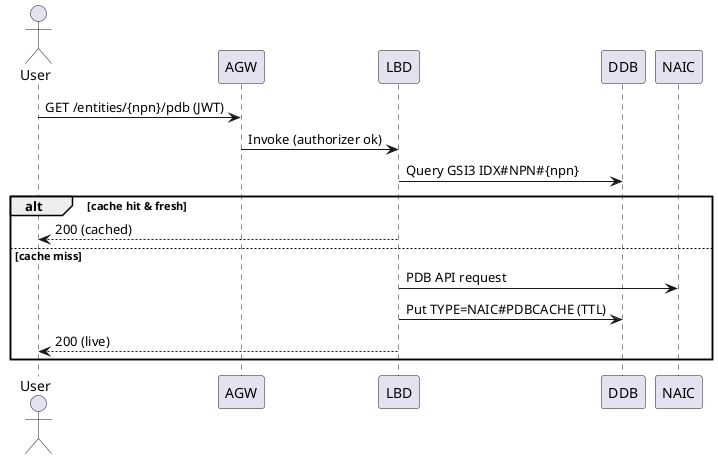
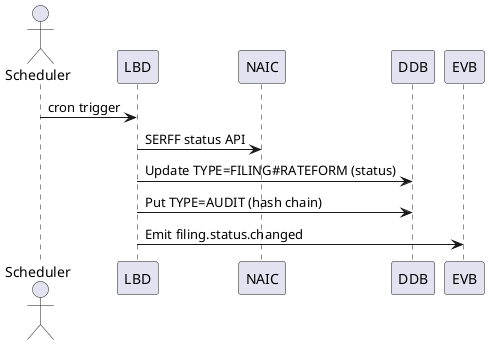
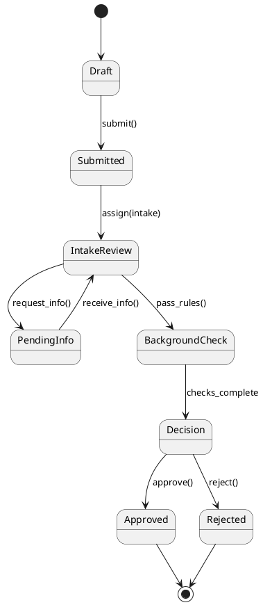

\$1

## Executive Summary

**Purpose & Scope.** GGP-LLC is a unified, modern platform for state insurance regulation. It consolidates licensing, filings, market & financial regulation, enforcement/fraud, captive management, public portals, reporting/analytics, and AI assistance. Initial focus is **Title 31A** with a configuration-driven **state package** model for future states.

**Tenant & UX Model.** One **distribution tenant** delivered via a **multi-tenant CloudFront** distribution. UI is a React SPA built on **@guidogerb/components** with WCAG 2.1 AA and task-centric workflows.

**Core Architecture.** Serverless-first on AWS:

- **Front end:** S3 + CloudFront; Stripe payments via **@guidogerb/component-payment** (Stripe Elements/Payment Element).
- **APIs:** API Gateway (HTTP) → AWS Lambda (Python 3.12), REST as system of record.
- **Analytics:** **AppSync GraphQL (read-only)** over curated DynamoDB views.
- **Data:** **DynamoDB-only** (single-table `ggp_main`) + S3 for documents; Streams for projections.
- **AI:** **Ollama on ECS Fargate** (private ALB). AI use cases: chat assist, summarization, and similarity search.
- **Identity & Security:** Cognito (OIDC/OAuth2), RBAC, KMS encryption, WAF, CloudWatch/X-Ray, audit hash-chaining, S3 **Object Lock (7-year)** for documents.

**DynamoDB Design.** Single-table with composite keys and GSIs:

- **GSIs** for type/time, status worklists, identifier lookups (NPN/FEIN/NAIC#/SERFF), relationships, and **LSH** buckets.
- Strong item patterns for Entities, Licenses, Filings, Complaints, Exams, Enforcement, Payments, Workflows, Audit, DocRefs, ReportViews, and State Package configs.

**AI Without a Vector DB.** Embeddings (Ollama) stored quantized (int8) in DynamoDB. Similarity via **random-projection LSH** (`b=12`, `r=8`) → GSI lookup → Lambda cosine re-rank (top‑k=50). Supports similar complaints/filings and context retrieval for summaries.

**NAIC Integrations (v1).** **PDB** real-time lookups + nightly sync. **SERFF** submission metadata ingest + status polling. Credentials in Secrets Manager; resilient polling via EventBridge; exact-once updates via idempotency keys.

**Payments (v1).** Stripe PaymentIntents with hosted Elements in the GUIDO component; webhooks update `TYPE=PAYMENT` items and unblock workflows. **Refunds deferred to v2.**

**Non-Functional Targets.** 99.9% availability; P95 API reads <300ms, writes <600ms; UI interactions <1s; audit trail tamper-evident; cost controls on AI and polling.

**Delivery Plan.** Milestones M0–M10 cover infra, core entities/admin, licensing, filings+SERFF, complaints/market reg, AI core, reporting/AppSync, Stripe payments, PDB sync, hardening, and go-live. CI/CD via GitHub Actions; CloudFormation IaC; blue/green and canary releases.

**Risks & Mitigations.**

- **Single-table modeling complexity** → reference patterns, contract tests, and data access helpers.
- **Eventual consistency** → conditional writes, ETags, and materialized ReportViews for analytics.
- **LSH quality/recall** → offline backtests, tunable `b/r`, human-in-the-loop feedback.
- **External dependency limits (SERFF/NAIC/Stripe)** → circuit breakers, retries with jitter, DLQs, and reconciliation jobs.
- **PII/Security** → envelope encryption for sensitive fields; webhook signature verification; redaction in logs.

**Ready for Handoff.** The SPEC includes deployable CFN sketches, repo structure, API routes, data keys/GSIs, workflow/rules patterns, NAIC/Stripe flows, and operational runbooks—sufficient for a contractor team to implement the MVP.

## Background

GGP-LLC is a modern regulatory platform intended to replace fragmented third‑party and custom tools currently used by a state insurance department. The system consolidates licensing, filings, market and financial regulation, enforcement/fraud, captive management, public portals, reporting/analytics, and AI‑assisted workflows under a single, extensible architecture.

**Why now**

- Existing processes span multiple systems with duplicated data, manual rekeying, and limited cross‑module visibility.
- Gaps exist in regulatory coverage (e.g., non‑health R/F workflows, comprehensive complaint & market conduct management, traditional company & PEO licensing).
- Modernization pressures: accessibility, security, auditability, and cloud‑scale performance.
- Growing expectation for real‑time integration with NAIC/NIPR/SERFF and secure public self‑service.
- Opportunity to apply AI (summarization, similarity search, copilot UX) to improve staff throughput and constituent experience.

**Strategic objectives**

- **Consolidation & compliance:** One platform capable of state‑specific rules starting with Title 31A, implemented via a package builder that layers state‑level configurations over common cores.
- **Modernization & scale:** Serverless-first AWS deployment (CloudFront/S3 + API Gateway/Lambda + managed data services) with CI/CD and IaC.
- **Efficiency:** Workflow automation, batch syncs with NAIC sources, and streamlined internal/external portals.
- **Extensibility:** Modular cores (Entity, Licensing, Filings, Market, Financial, Enforcement, Reporting, AI, Admin, Public, NAIC Integration) plus state packages that add rules, data, workflows, reports, and UI config.
- **AI integration:** Ollama-backed services for chat assistance, summarization, and vector-based retrieval over filings/complaints/exams.

**Initial scope**

- Targeting Utah Title 31A (GuidoGerb) as the first state package; architecture must generalize across additional states without code forks.
- Support OAuth/OIDC SSO (Cognito, Google, Microsoft), NAIC integrations (SERFF, PDB, I-SITE, RIRS), secure payments, and low-code reporting for staff.

**Key constraints & assumptions (initial)**

- Frontend: React + GuidoGerb design system; accessibility at WCAG 2.1 AA.
- Backend: Python Lambdas behind API Gateway; integrations via a dedicated layer; AI via Ollama on ECS/Fargate.
- Data: Unified core model with state extensions; vector similarity for text-heavy artifacts.
- Security: OAuth2/OIDC, RBAC, audit logging, encryption in transit/at rest, least-privilege networking.

## Requirements

**MoSCoW-prioritized. Tags map to goals in §1.2 (C=Consolidation, K=Compliance, M=Modernization, E=Efficiency, X=Extensibility, U=User Experience, A=AI Integration, D=Data Management).**

### Must Have (M)

- **R-M-1 Multi-tenant delivery:** Operate as **one distribution tenant** within a multi-tenant CloudFront distribution; enforce tenant isolation in UI routing, API auth claims, and data partitioning keys. \[C, X]
- **R-M-2 UI platform:** React SPA hosted on S3, fronted by CloudFront; strict use of **@guidogerb/components** and GuidoGerb design tokens; WCAG 2.1 AA. \[M, U]
- **R-M-3 AuthN/AuthZ:** OAuth 2.0 Authorization Code + PKCE via Cognito with IdPs (Cognito native, Google, Microsoft). JWTs validated per request; **RBAC** with fine‑grained permissions. \[M, Security]
- **R-M-4 API style:** Primary **REST** over API Gateway + Python Lambda; versioned (`/api/v1`). OpenAPI 3 docs. Idempotency & rate limits. \[M]
- **R-M-5 Data store exclusivity:** **AWS DynamoDB only** for operational data, including state extensions and AI artifacts; encryption at rest (KMS), PITR, Streams enabled where needed. \[D]
- **R-M-6 Data modeling:** All items carry `tenant_id`; access is tenant-scoped in every PK/GSI. Hot partitions avoided via composite keys and write‑sharding strategies. \[D, X]
- **R-M-7 Audit & compliance:** Immutable audit trail of key actions (write‑ahead audit items + hash‑chaining), full request logging (PII‑safe), configurable retention. \[K, Security]
- **R-M-8 Core domains:** Entity, Licensing, Filings, Market Reg (complaints, exams), Financial Reg, Enforcement/Fraud, Public Portal, Reporting, AI, Admin, NAIC Integration. \[C]
- **R-M-9 NAIC integrations (v1):** **PDB** real‑time lookups & scheduled sync; **SERFF** submission metadata ingest and status polling. Secrets via AWS Secrets Manager. \[E, K]
- **R-M-10 AI services:** Ollama behind ECS/Fargate with private ALB. Use cases: chat assist, summarization. **Similarity search implemented over DynamoDB** via LSH bucket strategy + GSIs (no external DB). \[A, D]
- **R-M-11 Low‑code reports:** Saved report definitions with role‑gated access; exports CSV/XLSX/PDF. Long‑running jobs queued (SQS) and processed by Lambdas. \[E, U]
- **R-M-12 Observability:** Structured logs (JSON), metrics, and traces in CloudWatch; alarms on SLO breaches; audit dashboards. \[M]
- **R-M-13 Security baseline:** TLS 1.2+, WAF on CloudFront, least‑privilege IAM, dependency scanning, secret rotation, vulnerability management. \[Security]
- **R-M-14 Performance & availability:** P95 UI interactions < 1.0s for cached views; API P95 < 300ms for standard reads; 99.9% monthly uptime. \[Performance]
- **R-M-15 Deployments:** GitHub Actions CI/CD; IaC via CloudFormation; blue/green or canary for UI and APIs. \[M]

### Should Have (S)

- **R-S-1 GraphQL for analytics:** Read‑only **GraphQL endpoint** for reporting/BI (e.g., AppSync or Lambda‑GraphQL) over curated views; REST remains system of record. \[E, X]
- **R-S-2 Workflow engine:** Declarative workflow configs per module and per state package; SLA timers and escalations. \[E]
- **R-S-3 Offline UX:** Service Worker for asset caching and optimistic updates for select forms. \[U]
- **R-S-4 Bulk operations:** CSV/XLSX intake for entity/license updates with validation and partial commits. \[E]
- **R-S-5 Internationalization:** i18n hooks in UI; English default. \[U]

### Could Have (C)

- **R-C-1 Public open‑data views** for non‑PII aggregates. \[U]
- **R-C-2 Mobile‑optimized installable PWA shell.** \[U]
- **R-C-3 Rule simulation sandbox** for state package authors. \[X]

### Won’t Have (W) in v1

- **R-W-1** Any relational or vector database other than DynamoDB. \[D]
- **R-W-2** EKS-managed microservices; prefer serverless (Lambda/ECS Fargate for Ollama). \[M]
- **R-W-3** Cross‑state consolidated reporting in production (beyond this tenant). \[C]

—
**Goal Tag Legend:** C=Consolidation, K=Compliance, M=Modernization, E=Efficiency, X=Extensibility, U=User Experience, A=AI Integration, D=Data Management, Security=Security, Performance=Non‑functional performance.

## Method

### 1) Architecture overview

High-level components and data flow (serverless-first, one distribution tenant):

```plantuml
@startuml GGP-LLC-Architecture
skinparam componentStyle rectangle

cloud "CloudFront (Multi-tenant)" as CF
node "S3 (Static UI)" as S3
rectangle "@guidogerb/components" as GG
rectangle "React SPA" as UI

CF --> UI
UI --> GG
UI --> AGW : HTTPS (JWT)

node "API Gateway" as AGW
rectangle "Lambda APIs (Python 3.12)
- Entity/Licensing/Filings
- Market/Financial/Enforcement
- Admin/Public/Reporting
- NAIC Integration" as LBD
AGW --> LBD

folder "DynamoDB (Single Table)" as DDB
LBD --> DDB

queue "SQS (reports, async)" as SQS
LBD --> SQS

rectangle "EventBridge (Schedulers)" as EVB
EVB --> LBD
LBD --> EVB : emit domain events

node "ECS Fargate (Ollama)" as OLL
LBD --> OLL : embeddings/chat (VPC)

storage "S3 (Docs/Artifacts)" as S3DOCS
UI --> S3DOCS : signed URLs
LBD --> S3DOCS

rectangle "Cognito (OIDC/OAuth2)" as COG
UI --> COG : Auth Code + PKCE
COG --> UI : ID/Access tokens
AGW --> COG : JWT authorizer

rectangle "AppSync (Read-only GraphQL)" as APPS
APPS --> DDB
UI --> APPS : Analytics queries

rectangle "WAF + Shield" as WAF
WAF -down- CF

rectangle "Secrets Manager" as SECRETS
LBD --> SECRETS

rectangle "NAIC Services
PDB, SERFF" as NAIC
LBD --> NAIC : REST/SOAP via NAT egress

@enduml
```

**Key choices**

- **UI**: React SPA on S3, distributed by CloudFront; component library **@guidogerb/components** only.
- **APIs**: REST over API Gateway → Lambda (Python); **AppSync GraphQL** is **read-only** for analytics/BI.
- **Data**: **DynamoDB only** (single-table). S3 for large documents. DynamoDB Streams for derived views and audit sinks.
- **AI**: Ollama on ECS Fargate behind private ALB; Lambdas call it over VPC.
- **Integration**: NAIC PDB (real-time + nightly sync) and SERFF (submission metadata + status polling) in v1.

---

### 2) DynamoDB single-table design

**Table:** `ggp_main`

**Item keys**

- `PK` (string): `TEN#<tenant>|<anchor>` (e.g., `TEN#ggp|ENT#<entityId>`, `TEN#ggp|CO#<companyId>`, `TEN#ggp|CASE#<caseId>`)
- `SK` (string): entity-scoped sort key, e.g., `PROFILE#<entityId>`, `LIC#<licenseId>`, `FILING#<filingId>#V#<rev>`, `COMPLAINT#<complaintId>`
- Every item includes `tenant_id: "ggp"` even though this deployment is a single distribution tenant, to preserve portability.

**Global Secondary Indexes (GSIs)**

- `GSI1` (by type): `GSI1PK=TYPE#<type>`, `GSI1SK=TEN#<tenant>|<created_at>` — scan by type with time ordering.
- `GSI2` (status queues): `GSI2PK=TEN#<tenant>|TYPE#<type>|STATUS#<status>`, `GSI2SK=<updated_at>|<id>` — worklists & dashboards.
- `GSI3` (identifiers): `GSI3PK=IDX#<idType>#<idValue>`, `GSI3SK=TYPE#<type>|<id>` — lookups by NPN, NAIC#, FEIN, License#, SERFF ID.
- `GSI4` (ownership/affiliation): `GSI4PK=OWNER#<entityId>`, `GSI4SK=TYPE#<relType>|<id>` — related items (appointments, affiliations).
- `GSI5` (LSH buckets for similarity): `GSI5PK=LSH#<band>#<bucket>`, `GSI5SK=TEN#<tenant>|TYPE#<type>|<ts>|<id>` — candidate retrieval.

**Representative item types**

- `TYPE=ENTITY#PERSON` (core person profile)
- `TYPE=ENTITY#ORG` (agency/company)
- `TYPE=LICENSE#<class>` (producer/agency/company/PEO etc.)
- `TYPE=FILING#RATEFORM` / `TYPE=FILING#FINANCIAL` / `TYPE=FILING#CAPTIVE`
- `TYPE=COMPLAINT` / `TYPE=EXAM#MARKET` / `TYPE=EXAM#FINANCIAL`
- `TYPE=ENFORCEMENT` / `TYPE=FRAUDCASE`
- `TYPE=PAYMENT` (tokenized refs to PSP)
- `TYPE=DOCREF` (S3 object refs, virus-scan state)
- `TYPE=AUDIT` (append-only audit entries; hash chained)
- `TYPE=WORKFLOW` (state + timers)
- `TYPE=REPORTVIEW` (denormalized aggregates for analytics)
- `TYPE=CFG#STATEPKG` (state package configs)

**Access patterns (subset)**

| Use case                                       | PK/SK or GSI                                          |                                           |                   |
| ---------------------------------------------- | ----------------------------------------------------- | ----------------------------------------- | ----------------- |
| Load person/org by identifier (NPN/FEIN/NAIC#) | `GSI3PK=IDX#NPN#123456789`                            |                                           |                   |
| List licenses for an entity                    | \`PK=TEN#ggp                                          | ENT#<entityId>`with`SK begins_with LIC#\` |                   |
| Active tasks for examiner                      | \`GSI2PK=TEN#ggp                                      | TYPE#EXAM#MARKET                          | STATUS#ASSIGNED\` |
| All filings submitted in a period              | `GSI1PK=TYPE#FILING#RATEFORM` time-window on `GSI1SK` |                                           |                   |
| Similar complaints to text X                   | compute LSH → query `GSI5` buckets → re-rank          |                                           |                   |
| Retrieve SERFF filing by SERFF ID              | `GSI3PK=IDX#SERFF#<id>`                               |                                           |                   |

**Audit hash chain**
Each `TYPE=AUDIT` item includes `audit_prev_hash` and `audit_hash = SHA256(prev_hash || actor || ts || action || payload_digest)`. The chain head is kept in the anchor item and updated via conditional write.

**Attachments**
`TYPE=DOCREF` stores `{s3_bucket, s3_key, sha256, mime, size, av_status}` and is linked from filing/complaint items.

---

### 3) AI similarity over DynamoDB (no external vector DB)

**Embedding & storage**

- On create/update of text fields (e.g., complaint narrative, filing justification), Lambda calls **Ollama** to generate embeddings.
- Embeddings are **quantized to int8** and stored as `vec_q` (Binary) along with `vec_norm` (float) to enable cosine re‑rank client‑side (Lambda).

**LSH indexing** (cosine similarity)

- Use **random projection LSH** with `b` bands of `r` hyperplanes each.
- For each item, compute `b` band signatures → `LSH#<band>#<bucket>` values; write **one small index item** per band with `GSI5PK` set to the bucket. Index items are \~100–200B each.
- **Query**: compute query embedding → derive its `b` buckets → union `GSI5` results (per bucket, time‑bounded) → fetch candidates → cosine re‑rank → top‑k.
- **Write cost**: O(b) per document; typical `b=12` bands, `r=8`.

**Consistency**
Index items carry `parent_id` and `parent_version`; on update, old buckets are removed via transactional write (up to 25 items) or async compaction using Streams.

---

### 4) Workflow & rules

**Workflow model**

- Each domain object optionally attaches a `TYPE=WORKFLOW` item: `{workflow_key, state, assignee, sla_at, history[], data{}}`.
- Transitions defined declaratively per **state package** as JSON (guards, effects, SLA timers). Timers fire via **EventBridge Scheduler** creating a message to a workflow Lambda.
- **Long-running, multi-step** paths (e.g., examinations) use **Step Functions**; state snapshots are mirrored into the `WORKFLOW` item for queryability.

**Rules engine**

- State package rules expressed as **JSON Logic or CEL** (portable, versioned). Guards are evaluated in Lambda against the item + context (role, date, NAIC data). Effects mutate items via conditional writes.

**Fee engine**

- Config tables `{fee_schedule_id, license_class, action, base_fee, surcharges[], late_rules[]}`. A small interpreter applies rules deterministically; results included on `PAYMENT` items and re-checked on webhook callbacks.

---

### 5) State Package Builder

**Artifacts**

- Stored in versioned S3: `packages/<state>/v<N>/` including: `rules.json`, `workflows/*.json`, `ui.json`, `reports/*.json`, `fees.json`.
- `TYPE=CFG#STATEPKG` items in DynamoDB store the active package version and rollout status.

**Activation**

1. Upload package to S3 (signed PUT).
2. Lambda `package-publish` validates schema, writes CFG item with `status=DRAFT`.
3. Admin approves → `status=ACTIVE` via conditional write; cache invalidations are sent (EventBridge) so Lambdas refresh in-memory configs.

**UI wiring**

- UI reads `ui.json` to toggle screens/fields/help; role-based visibility is enforced server-side regardless of UI config.

---

### 6) NAIC integrations (v1 focus)

**PDB**

- **On-demand** endpoint: `/entities/{npn}/pdb` → fetch license/appointment snapshot, cache as `TYPE=NAIC#PDBCACHE` with TTL.
- **Nightly sync**: EventBridge → Lambda pulls delta feed, upserts standardized items and identifier indexes (`GSI3`). Deduplicate via idempotency keys.

**SERFF**

- **Inbound metadata**: Poll SERFF submissions for this DOI; store `TYPE=FILING#RATEFORM` with `serff_id`, link `DOCREF` for artifacts.
- **Status polling**: EventBridge every N minutes → update filing status via conditional writes and append an `AUDIT` entry.

Sequence examples:





---

### 7) APIs (REST system-of-record)

**Versioning:** `/api/v1` prefix. Errors as RFC7807 problem+json.

**Illustrative endpoints**

- `POST /entities` (create person/org)
- `GET /entities/{id}`; `GET /entities:search?npn=...`
- `POST /licenses` / `PATCH /licenses/{id}`
- `POST /filings/rateform` / `GET /filings/{id}` / `POST /filings/{id}/actions/{submit|approve|reject}`
- `POST /complaints` / `GET /complaints/{id}`
- `POST /exams/market` / `PATCH /exams/{id}`
- `GET /similar?type=complaint&id=...` (AI assist)
- `GET /reports/{id}/run` (async → SQS job)

**Cross-cutting**

- JWT bearer; scopes/roles required per route.
- Idempotency key header for POST/PUT.
- ETags via `If-Match` on PATCH (optimistic concurrency).

---

### 8) AppSync GraphQL (read-only analytics)

**Data sources**: DynamoDB `REPORTVIEW` items and curated GSIs. Resolvers use **AppSync JS runtime** for mapping and authorization checks.

**Schema sketch**

```graphql
type Query {
  filingsByStatus(status: String!, limit: Int, nextToken: String): FilingConnection
  complaintsByLOB(lob: String!, from: AWSDate, to: AWSDate): [ComplaintAgg!]
  examBacklog(assignee: ID!): [Exam!]!
}
```

**Materialized views**

- Nightly/near-real-time Lambdas aggregate operational items into `TYPE=REPORTVIEW` with keys like `RV#FILING_STATUS#<status>#<ymd>` to keep GraphQL queries O(1) per partition.

---

### 9) Observability & reliability

- **Logging**: Structured JSON with correlation ids; PII-safe redaction. Lambda Powertools (tracing, logging, metrics).
- **Tracing**: X-Ray across AGW → Lambda → NAIC/Ollama.
- **Metrics/SLOs**: custom metrics for P95 latency, error rates, queue age; CloudWatch alarms + on-call rotation.
- **Resiliency patterns**: retries with jitter, circuit breakers to NAIC/Ollama, DLQs on async Lambdas, WAF rules for abuse.

---

### 10) Security model (enforcement points)

- **AuthZ checks in Lambda handlers** using role/permission tables cached in-memory with TTL.
- **Row/partition level security**: every GSI prefix includes `TEN#ggp` to prevent cross-tenant bleed.
- **Data protection**: SSE-KMS on DDB/S3, signed URLs for docs, AV scan on upload, field-level encryption for sensitive PII (envelope keys per entity).
- **Tamper evidence**: audit hash chain + periodic anchor snapshots to a separate S3 bucket with Object Lock.

---

### 11) Minimal schemas (examples)

**Person**

```json
{
  "PK": "TEN#ggp|ENT#per_123",
  "SK": "PROFILE#per_123",
  "TYPE": "ENTITY#PERSON",
  "npn": "123456789",
  "name": {"first": "Ann", "last": "Lee"},
  "addresses": [...],
  "created_at": "2025-05-01T12:00:00Z",
  "GSI1PK": "TYPE#ENTITY#PERSON",
  "GSI1SK": "TEN#ggp|2025-05-01T12:00:00Z",
  "GSI3PK": "IDX#NPN#123456789",
  "GSI3SK": "TYPE#ENTITY#PERSON|per_123"
}
```

**Complaint with AI index**

```json
{
  "PK": "TEN#ggp|CASE#cmp_987",
  "SK": "COMPLAINT#cmp_987",
  "TYPE": "COMPLAINT",
  "lob": "Auto",
  "status": "OPEN",
  "narrative": "...",
  "vec_q": "<int8 array>",
  "vec_norm": 12.34,
  "created_at": "2025-06-03T14:22:00Z",
  "GSI1PK": "TYPE#COMPLAINT",
  "GSI1SK": "TEN#ggp|2025-06-03T14:22:00Z",
  "GSI2PK": "TEN#ggp|TYPE#COMPLAINT|STATUS#OPEN",
  "GSI2SK": "2025-06-03T14:22:00Z|cmp_987"
}
```

**LSH index item (one per band)**

```json
{
  "PK": "TEN#ggp|CASE#cmp_987",
  "SK": "LSH#b03#bucket_aa91",
  "TYPE": "LSHIDX",
  "parent_id": "cmp_987",
  "parent_version": 3,
  "GSI5PK": "LSH#b03#bucket_aa91",
  "GSI5SK": "TEN#ggp|TYPE#COMPLAINT|2025-06-03T14:22:00Z|cmp_987"
}
```

---

### 12) Example state machine (Licensing)



Guards such as CE validation, fee payment confirmation, and PDB cross-checks are defined in the state package; transitions are executed via conditional writes.

## Implementation

### A. Environments & accounts

- **Single distribution tenant** in shared CloudFront; logical isolation via `tenant_id=ggp` in all data items and JWT claims.
- **Envs:** `dev`, `test`, `prod` with separate stacks; shared artifact/ECR accounts optional but recommended.

### B. IaC (CloudFormation) – core stacks

1. **network** (VPC for private services)
   - 2–3 AZs, private subnets for Lambdas & ECS; NAT Gateways (1–3 as budget allows).
   - Endpoints: **DynamoDB (Gateway)**, **S3 (Gateway)**, **Secrets Manager**, **CloudWatch Logs**, **ECR**, **KMS** (Interface).

2. **security**
   - **KMS CMKs** for DynamoDB/S3; key policies for CI/CD roles.
   - **IAM roles** for Lambdas, ECS tasks (least privilege), and GitHub OIDC deploy role.

3. **data**
   - **DynamoDB `ggp_main`** table with TTL, Streams (NEW_AND_OLD_IMAGES), GSIs (1–5 per Method section), PITR enabled.
   - **S3 buckets**: `ggp-ui` (static SPA), `ggp-docs` (Object Lock governance mode, **7-year default retention**), `ggp-packages` (state packages), `ggp-reports`.

4. **identity**
   - **Cognito User Pool** + Hosted UI, App Client (PKCE), Domain; IdPs: Google/Microsoft (OIDC) as configured.
   - **Cognito Resource Server** (custom scopes) mapped to RBAC.

5. **edge**
   - **CloudFront** distro → S3 UI (origin access control). **WAF** with managed rules + rate limit.

6. **compute**
   - **API Gateway (HTTP API)** + JWT authorizer (Cognito). Stage variables for env.
   - **Lambda functions** (Python 3.12) per domain; VPC‑enabled to reach private ECS ALB.
   - **SQS** queues (`reports`, `dlq_reports`).
   - **EventBridge** schedules (PDB nightly, SERFF polling, workflow timers) and rules for domain events.
   - **Step Functions** for long-running exam workflows.
   - **ECS Fargate (Ollama)**: private **ALB** (internal), 1–3 tasks (min=1), health checks; security group allowing Lambda subnets.

7. **analytics**
   - **AppSync GraphQL API** (API key disabled, Cognito auth) → DynamoDB `REPORTVIEW` items and GSIs; resolvers in JS runtime.

8. **observability**
   - CloudWatch dashboards/alarms (P95 latency, 5xx %, queue age, SERFF/PDB error rates), X‑Ray tracing, Powertools metrics.

### C. DynamoDB table (YAML sketch)

```yaml
type: AWS::DynamoDB::Table
Properties:
  TableName: ggp_main
  BillingMode: PAY_PER_REQUEST
  PointInTimeRecoverySpecification: { PointInTimeRecoveryEnabled: true }
  AttributeDefinitions:
    - { AttributeName: PK, AttributeType: S }
    - { AttributeName: SK, AttributeType: S }
    - { AttributeName: GSI1PK, AttributeType: S }
    - { AttributeName: GSI1SK, AttributeType: S }
    - { AttributeName: GSI2PK, AttributeType: S }
    - { AttributeName: GSI2SK, AttributeType: S }
    - { AttributeName: GSI3PK, AttributeType: S }
    - { AttributeName: GSI3SK, AttributeType: S }
    - { AttributeName: GSI4PK, AttributeType: S }
    - { AttributeName: GSI4SK, AttributeType: S }
    - { AttributeName: GSI5PK, AttributeType: S }
    - { AttributeName: GSI5SK, AttributeType: S }
  KeySchema:
    - { AttributeName: PK, KeyType: HASH }
    - { AttributeName: SK, KeyType: RANGE }
  GlobalSecondaryIndexes:
    - IndexName: GSI1
      KeySchema:
        - { AttributeName: GSI1PK, KeyType: HASH }
        - { AttributeName: GSI1SK, KeyType: RANGE }
      Projection: { ProjectionType: ALL }
    - IndexName: GSI2
      KeySchema:
        - { AttributeName: GSI2PK, KeyType: HASH }
        - { AttributeName: GSI2SK, KeyType: RANGE }
      Projection: { ProjectionType: ALL }
    - IndexName: GSI3
      KeySchema:
        - { AttributeName: GSI3PK, KeyType: HASH }
        - { AttributeName: GSI3SK, KeyType: RANGE }
      Projection: { ProjectionType: ALL }
    - IndexName: GSI4
      KeySchema:
        - { AttributeName: GSI4PK, KeyType: HASH }
        - { AttributeName: GSI4SK, KeyType: RANGE }
      Projection: { ProjectionType: ALL }
    - IndexName: GSI5
      KeySchema:
        - { AttributeName: GSI5PK, KeyType: HASH }
        - { AttributeName: GSI5SK, KeyType: RANGE }
      Projection: { ProjectionType: ALL }
  TimeToLiveSpecification:
    AttributeName: ttl
    Enabled: true
  SSESpecification:
    SSEEnabled: true
```

### D. ECS Fargate (Ollama) – task & service (YAML sketch)

```yaml
Resources:
  OllamaTaskDef:
    Type: AWS::ECS::TaskDefinition
    Properties:
      RequiresCompatibilities: [FARGATE]
      Cpu: 2048
      Memory: 4096
      NetworkMode: awsvpc
      ExecutionRoleArn: !GetAtt EcsExecutionRole.Arn
      TaskRoleArn: !GetAtt EcsTaskRole.Arn
      ContainerDefinitions:
        - Name: ollama
          Image: !Sub '${EcrRepoUri}:ollama-${GitSha}'
          PortMappings: [{ ContainerPort: 11434 }]
          Environment:
            - { Name: OLLAMA_MODELS, Value: 'llama3,nomic-embed-text' }
          HealthCheck:
            Command: ['CMD-SHELL', 'curl -s http://127.0.0.1:11434/api/tags || exit 1']
  OllamaService:
    Type: AWS::ECS::Service
    Properties:
      Cluster: !Ref EcsCluster
      DesiredCount: 1
      LaunchType: FARGATE
      NetworkConfiguration:
        AwsvpcConfiguration:
          AssignPublicIp: DISABLED
          SecurityGroups: [!Ref OllamaSG]
          Subnets: [!Ref PrivateSubnetA, !Ref PrivateSubnetB]
      LoadBalancers:
        - TargetGroupArn: !Ref OllamaTG
          ContainerName: ollama
          ContainerPort: 11434
      EnableExecuteCommand: true
```

### E. API Gateway & Auth (YAML sketch)

```yaml
Resources:
  Api:
    Type: AWS::ApiGatewayV2::Api
    Properties:
      {
        Name: ggp-api,
        ProtocolType: HTTP,
        CorsConfiguration:
          {
            AllowOrigins: ['*'],
            AllowMethods: ['GET', 'POST', 'PATCH', 'PUT', 'DELETE'],
            AllowHeaders: ['Authorization', 'Content-Type', 'Idempotency-Key'],
          },
      }
  Authorizer:
    Type: AWS::ApiGatewayV2::Authorizer
    Properties:
      ApiId: !Ref Api
      AuthorizerType: JWT
      IdentitySource: ['$request.header.Authorization']
      JwtConfiguration:
        Audience: [!Ref CognitoAppClientId]
        Issuer: !Sub 'https://cognito-idp.${AWS::Region}.amazonaws.com/${UserPoolId}'
  RouteEntitiesGet:
    Type: AWS::ApiGatewayV2::Route
    Properties:
      ApiId: !Ref Api
      RouteKey: 'GET /entities/{id}'
      AuthorizationType: JWT
      AuthorizerId: !Ref Authorizer
      Target: !Sub 'integrations/${EntitiesGetIntegration}'
```

### F. AppSync (read-only) – schema + resolver sketch

```graphql
# appsync/schema.graphql (extract)
type Filing {
  id: ID!
  status: String!
  submittedAt: AWSDateTime!
  lob: String
}

type Query {
  filingsByStatus(status: String!, limit: Int, nextToken: String): FilingConnection
}
```

Resolver (JS runtime) maps status → `REPORTVIEW` partition keys and paginates results.

### G. Lambda code organization (Python)

```
repo/
  infra/ (CloudFormation templates)
  services/
    entities/handler.py
    licensing/handler.py
    filings/handler.py
    complaints/handler.py
    exams/handler.py
    enforcement/handler.py
    admin/handler.py
    reporting/handler.py
    naic/serff_handler.py
    naic/pdb_handler.py
    ai/similarity_handler.py
  libs/
    ddb.py            # typed client wrappers, conditional write helpers
    auth.py           # role/permission checks, scope parsing
    audit.py          # hash chain helpers
    lsh.py            # LSH banding, int8 quantization, cosine rerank
    storage.py        # S3 signed URL, AV scanning integration
    fees.py           # fee engine interpreter
    workflow.py       # state transitions, timers
    powertools/       # logging/metrics/tracing setup
  tests/ (pytest)
  .github/workflows/
```

**Key libraries**: `boto3`, `aws-lambda-powertools`, `pydantic` (DTO validation), `httpx` (NAIC/SERFF calls), optional `orjson`.

### H. AI pipeline details

- **Models**: default chat=`llama3`, embeddings=`nomic-embed-text` (configurable).
- **Handlers**:
  - `POST /ai/summary`: calls chat model with prompt & context snippets.
  - `GET /ai/similar?type=complaint&id=...`: compute embedding → LSH buckets (`b=12`, `r=8`) → GSI5 → fetch → cosine re‑rank → return top‑k (default 50).

- **Cost control**: central rate limiter, per‑role quotas, circuit breaker on ECS ALB health.

### I. Document ingestion + AV scanning

- Client uploads to S3 via **pre‑signed PUT** to `ggp-docs`.
- S3 event triggers **scan lambda** (ClamAV signatures on EFS). On success, mark `DOCREF.av_status=clean`; on failure or virus, quarantine key and notify.

### J. NAIC integrations (v1)

- **Secrets** in Secrets Manager (`naic/pdb`, `naic/serff`).
- **PDB**: on-demand lookups with TTL cache (`TYPE=NAIC#PDBCACHE`); nightly sync job writes core identifiers (NPN, appointments) and links entities.
- **SERFF**: poll submissions, store metadata under `TYPE=FILING#RATEFORM` with `serff_id`, link documents; status polling via EventBridge.

### K. Reporting & AppSync views

- Staff creates/saves report definitions (`TYPE=REPORTDEF`). Runner Lambda dequeues jobs from `reports` SQS, executes queries over `REPORTVIEW`, writes CSV/XLSX to `ggp-reports`, emits completion event with pre‑signed download URL.

### L. Step Functions (exam workflow) – ASL sketch

```json
{
  "Comment": "Market Conduct Exam",
  "StartAt": "Plan",
  "States": {
    "Plan": {
      "Type": "Task",
      "Resource": "arn:aws:states:::lambda:invoke",
      "Parameters": { "FunctionName": "exam-plan" },
      "Next": "Fieldwork"
    },
    "Fieldwork": {
      "Type": "Task",
      "Resource": "arn:aws:states:::lambda:invoke",
      "Parameters": { "FunctionName": "exam-fieldwork" },
      "Next": "Findings"
    },
    "Findings": {
      "Type": "Task",
      "Resource": "arn:aws:states:::lambda:invoke",
      "Parameters": { "FunctionName": "exam-findings" },
      "Next": "Report"
    },
    "Report": {
      "Type": "Task",
      "Resource": "arn:aws:states:::lambda:invoke",
      "Parameters": { "FunctionName": "exam-report" },
      "End": true
    }
  }
}
```

### M. CI/CD (GitHub Actions) – high level

- **OIDC to AWS**: assume deploy role (`sts:AssumeRoleWithWebIdentity`).
- **Pipelines**
  - `infra-deploy.yml`: validate templates (`cfn-lint`), `aws cloudformation deploy` per stack; parameterize env.
  - `services-ci.yml`: run `pytest`, build Lambda artifacts (zip) and container images (ECS + optional Lambda container), push to ECR, update stacks.
  - `ui-deploy.yml`: build React/Vite, upload to S3, create CloudFront invalidation.

**Snippet (deploy role config)**

```yaml
permissions: { id-token: write, contents: read }
steps:
  - uses: actions/checkout@v4
  - uses: aws-actions/configure-aws-credentials@v4
    with:
      role-to-assume: arn:aws:iam::123456789012:role/gh-deploy
      aws-region: us-west-2
  - run: aws cloudformation deploy --template-file infra/main.yml --stack-name ggp-core --capabilities CAPABILITY_NAMED_IAM
```

### N. Security controls

- **WAF** managed rules + rate limits; custom IP sets for allow/deny.
- **JWT validation** at AGW; secondary checks in Lambda for scopes/roles.
- **Data**: SSE‑KMS on all buckets/tables; **S3 Object Lock** (governance) for `ggp-docs` with 7‑year retention (configurable).
- **PII**: field‑level encryption (envelope keys) for SSNs/DoB where required; redaction in logs.
- **Audit**: hash‑chained `AUDIT` items with periodic anchor digest exported to S3 (Object Lock) for tamper‑evident retention.

### O. Operational playbooks

- **Blue/green UI** via versioned S3 prefixes; switch origin path in CloudFront.
- **Canary APIs** using AGW stages + weighted routes; roll back by stage variable.
- **Backfills** via Step Functions + throttled batch Lambdas; monitor DDB write capacity with adaptive concurrency.
- **Runbooks** for NAIC/SERFF failures, Ollama health degradation, and AV quarantine triage.

### P. Payments (Stripe via @guidogerb/component-payment)

- **Frontend**: Use `@guidogerb/component-payment` (Stripe Elements wrapper) to render **Payment Element**. Component consumes `client_secret` and emits `payment_intent.id` + status events. No card data leaves Stripe.js.
- **Backend**: Secrets in **AWS Secrets Manager** (`stripe/secret_key`, `stripe/webhook_secret`).
  - `POST /payments/intents` → creates **PaymentIntent** with `automatic_payment_methods.enabled=true`. Amount is produced by the **fee engine** from license/filing context. Metadata includes `{tenant_id, user_id, entity_id, license_id/filing_id, report_id}`.
  - `POST /payments/webhook` → verifies signature; on `payment_intent.succeeded` / `payment_intent.payment_failed` / `charge.refunded`, upsert `TYPE=PAYMENT` and append `TYPE=AUDIT`. Webhook Lambda is public but locked down via signature verification; idempotent via `event.id` guard.
  - Refunds **deferred to v2**; no admin refund API in v1.

- **DynamoDB items** (`TYPE=PAYMENT`)
  - Keys: `PK=TEN#ggp|PAY#<payId>`, `SK=PAYMENT#<payId>`
  - Fields: `{status, amount, currency, purpose, stripe_payment_intent_id, last4, brand, receipt_url, created_at, updated_at}`
  - Indexing: `GSI2` worklists by `STATUS#{requires_action|requires_capture|succeeded|refunded}`; `GSI3` lookups by domain ref (e.g., `IDX#LICENSE#<id>`).

- **Flows**
  1. Client requests quote → server computes fees → server creates PaymentIntent → returns `client_secret`.
  2. UI mounts Payment Element (component) → confirm card → Stripe handles SCA/3DS.
  3. Webhook updates `PAYMENT` status; domain handler unblocks workflow transition (e.g., `submit()` license).

- **Compliance & security**: SAQ‑A profile (Elements). No PAN/CSC stored; store only non‑sensitive indicators (brand, last4). Webhook signature verified; logs redact sensitive fields.
- **Reconciliation**: Nightly Lambda calls Stripe Balance Transactions API to reconcile `TYPE=PAYMENT` vs Stripe; mismatches create tasks on `GSI2 STATUS#RECONCILE`.

## Milestones

**M0 – Foundation (2–3 weeks)**

- Infra stacks (VPC, DDB, S3, CF+WAF, Cognito, AGW, basic Lambdas). Ollama ECS baseline. AppSync skeleton.
- Exit: health checks green; Hello‑world API and UI deployed; CI/CD wired.

**M1 – Core Entity & Admin (2–3 weeks)**

- Entity CRUD, identifier indexes (NPN/FEIN/NAIC#), RBAC (roles/permissions), audit chain.
- Exit: create/search entities; audit visible; authZ enforced.

**M2 – Licensing v1 (3–4 weeks)**

- Licensing data model, fee engine minimal set, workflow JSON, Step Functions where needed.
- Exit: submit→review→approve path works; fees computed & persisted.

**M3 – Filings (Rate/Form) + SERFF v1 (3–4 weeks)**

- Filings intake, S3 doc refs, SERFF metadata ingest + status polling.
- Exit: import SERFF case → review workflow; status sync updates audit.

**M4 – Complaints & Market Reg (3–4 weeks)**

- Complaint intake, case management, worklists. SLA timers via EventBridge.
- Exit: triage queue, assignment, resolution with audit.

**M5 – AI Core v1 (2–3 weeks)**

- Embeddings service (Ollama), LSH indexing, similarity API, summarization endpoints.
- Exit: similar‑cases API returns top‑k; summaries available in UI.

**M6 – Reporting & AppSync (2 weeks)**

- `REPORTVIEW` materializations; GraphQL queries; async report runner + exports.
- Exit: at least 5 standard reports and 1 saved custom report.

**M7 – Payments (Stripe) (2 weeks)**

- PaymentIntent flow, webhook processing, fee integration into licensing/filings.
- Exit: test card succeeds; reconciliation report generated. (Refunds deferred to v2.)

**M8 – PDB v1 + Nightly Sync (2 weeks)**

- On‑demand lookups + cache; nightly batch sync into identifier indexes.
- Exit: entity matches by NPN; deltas applied consistently.

**M9 – Hardening, Security, Perf (2 weeks)**

- WAF rules, rate limits, penetration test fixes, canaries, load tests to target SLOs.
- Exit: 99.9% availability week burn‑in; P95 read <300ms; audit exports locked.

**M10 – Pilot & Go‑Live (2 weeks)**

- Pilot program, data migration scripts, runbooks; enable object lock policies.
- Exit: sign‑off from business + ops; cutover completed.

## Gathering Results

**Success metrics**

- **Cycle time**: median days from submission→decision (licensing, filings) ↓ 30% vs baseline.
- **Throughput**: cases/analyst/day ↑ 20%.
- **P95 latency**: API reads <300ms; writes <600ms; UI interaction <1s.
- **AI assist**: >60% of complaints/filings with accepted summary; similarity top‑10 hit rate >70% on historical backtest.
- **Payment success**: >95% authorized on first attempt; reconciliation mismatches <0.5%.

**Operational health**

- SLOs + error budgets tracked; alarms on 5xx%, queue age, SERFF/PDB error rates, Ollama health.
- Security posture: zero criticals in dependency scans; audit exports produced weekly to S3 Object Lock.

**Quality gates**

- UAT checklists per module; accessibility audits (axe + manual) to WCAG 2.1 AA.
- Data quality: identifier dedupe precision/recall on sampled set.

**Post‑go‑live review**

- 30/60/90‑day reviews; backlog grooming driven by metrics above; retire legacy systems where covered.
